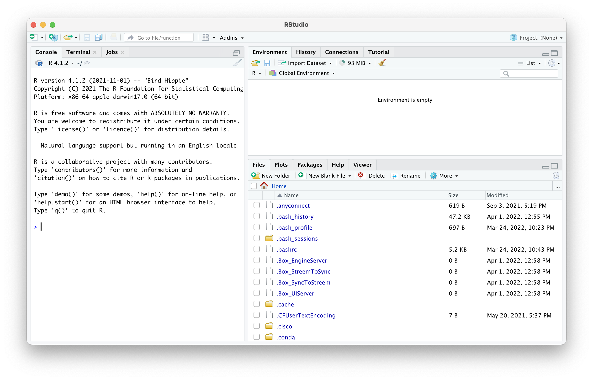

# Prerequisites
{width=100%}

```{r prerequisites, message = FALSE, warning = FALSE, echo = FALSE, eval = TRUE}
source("scripts/functions.R")
source("scripts/colors.R")
source("scripts/packages.R")
```

## Linux, macOS, and Windows

Most programs made to execute genetic epidemiology studies are developed for the Unix environment, for example Linux and macOS. So, they may not work as intended in a Windows environment. Windows does allow users to install a linux subsystem within Windows 10 and you can find the detail [guide](https://docs.microsoft.com/en-us/windows/wsl/about){target="_blank"} here.  

However, I highly recommend one of two options. One, install a linux subsystem on your Windows computer (for example [a virtual machine with Ubuntu could work](https://blog.storagecraft.com/the-dead-simple-guide-to-installing-a-linux-virtual-machine-on-windows/){target="_blank"}). Two, switch to macOS in combination with [homebrew](https://brew.sh){target="_blank"}. This will give you all the flexibility to use Unix-based programs for your genetic epidemiology work and at the same time you'll keep the advantage of a powerful computer with a user-friendly interface.

> For this practical every command is intended for Linux/macOS, in other words Unix-systems.


## Programs you need

You need few programs for this practical, or for your (future) genetic epidemiology work for that matter (Table \@ref(tab:programs)).

```{r load-programs, eval = TRUE, echo = FALSE}

programs <- openxlsx::read.xlsx("information.xlsx", sheet = "Programs")

```


```{r programs, tidy = FALSE, eval = TRUE, echo = FALSE}
knitr::kable(
  programs,
  caption = 'Programs needed for genetic epidemiology.',
  # align = ,
  booktabs = FALSE
)

# ft <- flextable(
#   programs,
#   # col_keys = names(data),
#   # cwidth = 0.75,
#   # cheight = 0.25,
#   # defaults = list(),
#   theme_fun = theme_booktabs
# )

# set_table_properties(ft, width = 1, layout = "autofit")

# fit_to_width(ft, max_width = 50)

# autofit(ft, add_w = 0, add_h = 0)

```

### RStudio

RStudio is a very user-friendly interface around R that makes your R-scripting-life a lot easier. You should get used to that. 
We have a clean installation of Ubuntu in our VirtualMachine with full administrator rights. Let's start by installing RStudio. On your VirtualMachine go to the website of [RStudio](https://www.rstudio.com/products/rstudio/download/#download){target="_blank"} and select the right installer (`Ubuntu 18+/Debian 10+`), it should be name something like `rstudio-2022.02.1-461-amd64.deb`. 

Double click the file after download (it's probably on the Desktop or the Download folder) and follow the instructions. 

RStudio comes with R so you don't have to worry about that.


### PLINK
Right, onto PLINK. 

All genetic analyses can be done in PLINK, even on your laptop, but with large datasets, for example [UK Biobank](https://www.ukbiobank.ac.uk){target="_blank"} size, it is better to switch to a [high-performance computing cluster](https://en.wikipedia.org/wiki/High-performance_computing){target="_blank"} like we have available at the [Utrecht Science Park](https://wiki.bioinformatics.umcutrecht.nl/bin/view/HPC/WebHome){target="_blank"}. The original PLINK v1.07 can be found [here](https://zzz.bwh.harvard.edu/plink/index.shtml){target="_blank"}, but nowadays we are using a newer, faster version: PLINK v1.9 which can be found [here](https://www.cog-genomics.org/plink2){target="_blank"}. It still says 'PLINK 1.90 beta' but you can consider this version stable and save to work with, but as you can see, some functions are not supported anymore.

You should be downloading the Linux 64-bits version indicated with the blue arrow in Figure \@ref(fig:plink)

```{r plink, fig.align='center', fig.cap='The PLINK v1.9 website.', fig.show = TRUE, echo=FALSE, eval=TRUE, warning=FALSE, message=FALSE}
knitr::include_graphics("img/plink.png")

```

You'll download a zip-file containing PLINK to the Downloads folder, or the Desktop. If all is fine, you should be able to double click the `.zip`-file and it will unpack there and then. 

### Alternatives to PLINK

Nowadays, a lot of people also use programs like [SNPTEST](snptest){target="_blank"}, [BOLT-LMM](https://data.broadinstitute.org/alkesgroup/BOLT-LMM/){target="_blank"},  [GCTA](http://cnsgenomics.com/software/gcta/#Overview){target="_blank"}, or [regenie](https://rgcgithub.github.io/regenie/){target="_blank"} as alternatives to execute GWAS and downstream analyses, for example heritability estimation, Fst-calculation, and so on.

### Other programs

Mendelian randomization can be done either with the [SMR](http://cnsgenomics.com/software/smr/#Overview){target="_blank"} or [GSMR](http://cnsgenomics.com/software/gsmr/){target="_blank"} function from GCTA, or with R-packages, like [`TwoSampleMR`](https://mrcieu.github.io/TwoSampleMR/){target="_blank"}.


## The Terminal

For all the above programs, except RStudio, you will need the `Terminal`. This comes with every major operating system; on Windows it is called 'PowerShell', but let's not go there. And regardless, you will (have to start to) make your own scripts. The benefit of using scripts is that each step in your workflow is clearly stipulated and annotated, and it allows for greater reproducibility, easier troubleshooting, and scaling up to high-performance computer clusters.

Open the terminal, it should be on the left in the toolbar as a little black computer-monitor-like icon. Mac users can type `command + space` and type `terminal`, a terminal screen should open.

> From now on we will use little code blocks like the example to indicate a code you should type/copy-paste and hit enter. If a code is followed by a comment, it is indicated by a # - you don't need to copy-paste and execute this.


```
CODE BLOCK

CODE BLOCK # some comment here

```

### The data you need

Now, pay attention. If you came here through the course **Genetic Epidemiology**, you don't have to do anything. All the data you need are already downloaded. 

However, when you are using this book as a standalone, you'll need to start by downloading the data you need for this practical to your Desktop. 

Here's the link to the data. 

[Link to Google Drive with data](https://drive.google.com/drive/folders/1iDLB1y534DfgEZNPCYBrIj5X7g_XlBba?usp=share_link)

Make sure you put the data in the `~/Desktop/practical/` folder.


Alternatively, you could download this through some Terminal commands. This will create a directory on your Desktop with the command `mkdir`. The `-v` flag indicates the program should be _verbose_, meaning it should tell you what it is doing. And it will automagically download the data to the right folder.

```
mkdir -v ~/Desktop/practical/

wget https://drive.google.com/drive/folders/1iDLB1y534DfgEZNPCYBrIj5X7g_XlBba?usp=share_link -P ~/Desktop/practical/
```

The data are pretty large (approx. 15Gb), so this will take a minute or two depending on your internet connection. Time to stretch your legs or grab a coffee (data scientists don't drink tea). 


### Navigating the Terminal

You can navigate around the computer through the terminal by typing `cd <path>`; `cd` stands for "change directory" and <path> means "some_file_directory_you_want_to_go_to".

**For Linux/macOS Users**

_will bring you to your home directory_

```
cd ~ 
```

_will bring you to the parent directory (up one level) _

```
cd ../ 
```

_will bring you to the XXX directory_

```
cd XXX 
```


Let's navigate to the folder you just downloaded.

```
cd ~/Desktop/practical
```


Let's check out what is inside the directory, by listing (`ls`) its contents.


```
ls -lh
```


**For Linux/macOS Users**

_shows files as list_

```
ls -l 
```

_shows files as list with human readable format _

```
ls -lh 
```

_shows the files as list sorted by time edited_

```
ls -lt 
```

_shows the files as list sorted by size_
```
ls -lS 
```

Adding the flags `-lh` will get you the contents of a directory in a list (`-l`) and make the size 'human-readable' (`-h`).


You can also count the number of files.

```
ls | wc -l
```

And if you want to know all the function of a program simply type the following.

```
man ls
```

This will take you to a manual of the program with an extensive description of each flag (Figure \@ref(fig:ls-manual)).

```{r ls-manual, fig.align='center', fig.cap='Partial output from the ls-manual.', fig.show = TRUE, echo=FALSE, eval=TRUE, warning=FALSE, message=FALSE}
knitr::include_graphics("img/ls_manual.png")

```

We also want to copy `plink` to that practical folder. 

```
cp -v ~/Downloads/plink/plink ~/Desktop/practical/plink 

```

## Installing some R packages

For the course we set up a CoCalc Server and everything should be fine; we installed everything you need. 


If you are using this as a standalone book, you'll need to install some things. For certain `r`-packages, we need to install some additional software on your operating system. Depending on your system, type the following and just follow the instructions in the Terminal:

**For Linux/macOS Users**


```
sudo apt-get install libcurl4 libcurl4-openssl-dev -y

sudo apt-get install libssl-dev
```

**For macOS Users**

Just follow the instructions in the Terminal.


Start by installing [`brew`](https://brew.sh).

```
/bin/bash -c "$(curl -fsSL https://raw.githubusercontent.com/Homebrew/install/HEAD/install.sh)"
```

```
brew install --cask rstudio
brew install r
```

Now close the terminal window - really make sure that the terminal-program has quit.

Open your fresh installation of RStudio by double clicking the icon. You should be seeing something like figure \@ref(fig:rstudio-screenshot)

```{r rstudio-screenshot, fig.align='center', fig.cap='RStudio screenshot.', fig.show = TRUE, echo=FALSE, eval=TRUE, warning=FALSE, message=FALSE}


```


In the top right, you see a little green-white plus-sign, click this and select 'R Notebook' (Figure \@ref(fig:rstudio-screenshot-create-notebook)). 

```{r rstudio-screenshot-create-notebook, fig.align='center', fig.cap='RStudio screenshot.', fig.show = TRUE, echo=FALSE, eval=TRUE, warning=FALSE, message=FALSE}
knitr::include_graphics("img/rstudio-screenshot-create-notebook.png")

```

You will create an untitled (`Untitled1`) `R` notebook: you can combine text descriptions, like you would in a lab-journal, with code-sections. Read what is in the notebook to get a grasp on that (Figure \@ref(fig:rstudio-screenshot-notebook)). 

```{r rstudio-screenshot-notebook, fig.align='center', fig.cap='RStudio screenshot.', fig.show = TRUE, echo=FALSE, eval=TRUE, warning=FALSE, message=FALSE}
knitr::include_graphics("img/rstudio-screenshot-notebook.png")

```

Right, you should be installing some packages. To do so, you can remove `plot(cars)` (or leave and create a new code-block as per instructions in the notebook), and copy paste the code below. 
```{r install-prereq, eval = FALSE, echo = TRUE}
install.packages(c("httr", "usethis", "data.table", "devtools", 
                   "qqman", "CMplot", "plotly", 
                   "dplyr", "tibble", "openxlsx"))
devtools::install_github("kassambara/ggpubr")
devtools::install_github("oliviasabik/RACER")
```

You should load these packages too. 

```{r library-prereq, eval = FALSE, echo = TRUE}
library("ggpubr")
library("httr")
library("usethis")
library("data.table")
library("devtools")
library("qqman")
library("CMplot")
library("tibble")
library("plotly")
library("dplyr")
library("openxlsx")
library("RACER")
```

All in all this may take some time, good moment to relax, review your notes, stretch your legs, or take a coffee.


## Are you ready?

Are you ready? Did you bring coffee and a good dose of energy? Let's start! 

Oh, one more thing: you can save your notebook, the one you just created, to keep all the `R` codes you are applying in the next chapters and add descriptions and notes. If you save this notebook you'll notice that a `html`-file is created. This file is a legible webbrowser-friendly version of your work and contains the codes and the output (code messages, tables, and figures). And the nice thing is, that you can easily share it with others over email. 

Ok. 'Nough said, let's move on to cover some basics in Chapter ref(gwas-basics).
