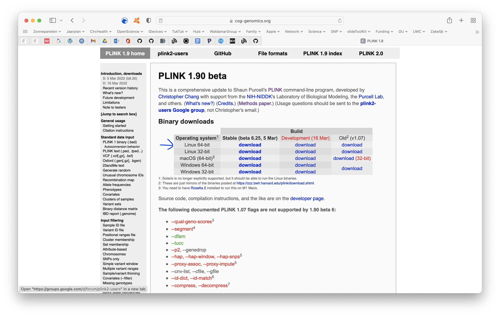

# Getting started - programs {#getting-started-programs}
<!-- {width=100%} -->
```{r load-functions-packages, message = FALSE, warning = FALSE, echo = FALSE, eval = TRUE, include = FALSE}
# source("scripts/functions.R")
# source("scripts/colors.R")
# source("scripts/packages.R")

library(rmarkdown)
library(bookdown)
library(flextable)
library(knitr)
library(kableExtra)
library(webshot)
library(webshot2)
library(formatR)
library(tinytex)
```

```{r include = FALSE}
if(!knitr:::is_html_output())
{
  options("width"=56)
  knitr::opts_chunk$set(tidy.opts=list(width.cutoff=56, indent = 2), tidy = TRUE)
  knitr::opts_chunk$set(fig.pos = 'H')
}
```

```{r getting_started, message = FALSE, warning = FALSE, echo = FALSE, eval = TRUE, include = FALSE}
# general setting to apply to all chunks - can be overrode per chunk.
opts_chunk$set(echo = FALSE, 
               warning = FALSE, 
               message = FALSE, 
               out.width = "85%", 
               fig.align = "center", 
               tidy = FALSE)
```

We'll use a few programs throughout this practical. You'll probably need these for your (future) genetic epidemiology work too (Table \@ref(tab:programs)).

```{r load-programs, eval = TRUE}
programs <- openxlsx::read.xlsx("information.xlsx", sheet = "Programs")
```


```{r, tab.id = "programs", tab.cap = "Programs needed for genetic epidemiology.", eval = TRUE}
# knitr::kable(
#   programs,
#   caption = 'Programs needed for genetic epidemiology.',
#   # align = ,
#   booktabs = FALSE
# )

ft <- flextable(
  programs,
  # col_keys = names(data),
  # cwidth = 0.75,
  # cheight = 0.25,
  # defaults = list(),
  theme_fun = theme_booktabs
)
# 
# # set_table_properties(ft, width = 1, layout = "autofit")
# 
# # fit_to_width(ft, max_width = 50)
# 
autofit(ft, add_w = 0, add_h = 0)
```

## RStudio
**RStudio** is a very user-friendly interface around `R` that makes your `R`-scripting-life a lot easier. You should get used to that. **RStudio** comes with `R` so you don't have to worry about that.

## PLINK
Right, onto `PLINK`. 

All genetic analyses can be done in PLINK, even on your laptop, but with large datasets, for example [UK Biobank](https://www.ukbiobank.ac.uk){target="_blank"} size, it is better to switch to a [high-performance computing cluster (HPC)](https://en.wikipedia.org/wiki/High-performance_computing){target="_blank"} like we have available at the [Utrecht Science Park](https://wiki.bioinformatics.umcutrecht.nl/bin/view/HPC/WebHome){target="_blank"}. The original PLINK v1.07 can be found [here](https://zzz.bwh.harvard.edu/plink/index.shtml){target="_blank"}, but nowadays we are using a newer, faster version: **PLINK v1.9** which can be found [here](https://www.cog-genomics.org/plink2){target="_blank"}. It still says 'PLINK 1.90 beta' (Figure \@ref(fig:plinkprogram)), but you can consider this version stable and save to work with, but as you can see, some functions are not supported anymore.

```{r 'plinkprogram', fig.align='center', fig.cap='The PLINK v1.9 website.', fig.show = TRUE, eval=TRUE}

```

### Alternatives to `PLINK`
Nowadays, a lot of people also use programs like [SNPTEST](snptest){target="_blank"}, [BOLT-LMM](https://data.broadinstitute.org/alkesgroup/BOLT-LMM/){target="_blank"},  [GCTA](http://cnsgenomics.com/software/gcta/#Overview){target="_blank"}, or [regenie](https://rgcgithub.github.io/regenie/){target="_blank"} as alternatives to execute GWAS. These programs were designed with specific use-cases in mind, for instance really large biobank data including hundreds of thousands individuals, better control for population stratification, the ability to estimate trait heritability or Fst, and so on.

## Other programs
Mendelian randomization can be done either with the [SMR](http://cnsgenomics.com/software/smr/#Overview){target="_blank"} or [GSMR](http://cnsgenomics.com/software/gsmr/){target="_blank"} function from GCTA, or with R-packages, like [`TwoSampleMR`](https://mrcieu.github.io/TwoSampleMR/){target="_blank"}.


The next thing we'll cover are the instructions to setup your macOS system in Chapter \@ref(getting-started-standalone).

```{js, echo = FALSE}
title=document.getElementById('header');
title.innerHTML = '' + title.innerHTML
```
