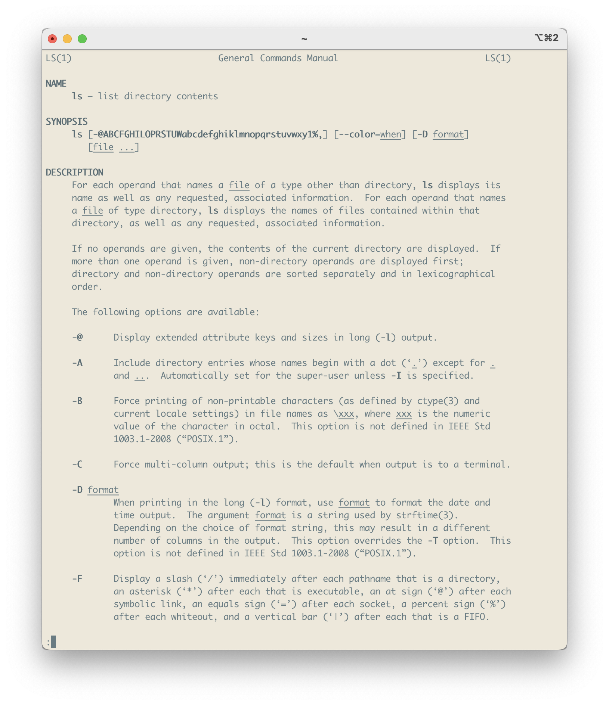

# Getting started - Standalone {#getting-started-standalone}
<!-- {width=100%} -->
```{r load-functions-packages, message = FALSE, warning = FALSE, echo = FALSE, eval = TRUE, include = FALSE}
# source("scripts/functions.R")
# source("scripts/colors.R")
# source("scripts/packages.R")

library(rmarkdown)
library(bookdown)
library(flextable)
library(knitr)
library(kableExtra)
library(webshot)
library(webshot2)
library(formatR)
library(tinytex)
```

```{r include = FALSE}
if(!knitr:::is_html_output())
{
  options("width"=56)
  knitr::opts_chunk$set(tidy.opts=list(width.cutoff=56, indent = 2), tidy = TRUE)
  knitr::opts_chunk$set(fig.pos = 'H')
}
```

```{r getting_started, message = FALSE, warning = FALSE, echo = FALSE, eval = TRUE, include = FALSE}
# general setting to apply to all chunks - can be overrode per chunk.
opts_chunk$set(echo = FALSE, 
               warning = FALSE, 
               message = FALSE, 
               out.width = "85%", 
               fig.align = "center", 
               tidy = FALSE)
```


- Two, switch to macOS in combination with [homebrew](https://brew.sh){target="_blank"} (this is also known as `brew`). This will give you all the flexibility to use Unix-based programs for your genetic epidemiology work and at the same time you'll keep the advantage of a powerful computer with a user-friendly interface.

I chose the latter. 


So, you plan to use this book as 'Standalone' on a macOS environment. This means you'll need to install a few things first.

## The data you need

You'll need to start by downloading the data you need for this practical to your Desktop. 

Here's the link to the data. 

[Link to Google Drive with data](https://drive.google.com/drive/folders/1iDLB1y534DfgEZNPCYBrIj5X7g_XlBba?usp=share_link){target="_blank"}

Make sure you put the data in the `~/Desktop/practical/` folder.

The data are pretty large (approx. 15Gb), so this will take a minute or two depending on your internet connection. Time to stretch your legs or grab a coffee (data scientists don't drink tea). 

> Note: the WTCCC1 data are not available for public download, as you need permission to use them. However, we do provide the instructions under the assumption your WTCCC1 data will be on genome build 37 and imputed against 1000G phase 3.

## Terminal 

For all the programs we use, except **RStudio**, you will need the **Terminal**. This comes with every major operating system; on Windows it is called 'PowerShell', but let's not go there. And regardless, you will (have to start to) make your own scripts. The benefit of using scripts is that each step in your workflow is clearly stipulated and annotated, and it allows for greater reproducibility, easier troubleshooting, and scaling up to high-performance computer clusters.

Open the **Terminal**, it should be on the left in the toolbar as a little black computer-monitor-like icon. Mac users can type `command + space` and type `terminal`, a **Terminal** screen should open.

> From now on we will use little code blocks like the example to indicate a code you should type/copy-paste and hit enter. If a code is followed by a comment, it is indicated by a # - you don't need to copy-paste and execute this.

```
CODE BLOCK

CODE BLOCK # some comment here
```

## Navigating the Terminal

You can navigate around the computer through the terminal by typing `cd <path>`; `cd` stands for "change directory" and `<path>` means "some_file_directory_you_want_to_go_to".


This command will bring you to your home directory.

```
cd ~ 
```

This will bring you to the parent directory (up one level).

```
cd ../ 
```

This will bring you to the XXX directory.

```
cd XXX 
```


Let's navigate to the folder you just downloaded.

```
cd ~/Desktop/practical
```


Let's check out what is inside the directory, by listing (`ls`) its contents.

This command shows files as list; the `-l` makes it a vertical list and adds more information, you can also remove it and simply type `ls` - go on, and try.

```
ls -l 
```


This command shows files as list with human readable format.

```
ls -lh 
```
Adding the flags `-lh` will get you the contents of a directory in a list (`-l`) and make the size 'human-readable' (`-h`).

Adding `-t` shows the files as list sorted by time edited.

```
ls -lt 
```

Adding `-S` shows the files as list sorted by size.

```
ls -lS 
```

You can also count the number of files. Just 'pipe' the result from `ls` to the next program `wc` ('wordcount') and list the number of lines, `-l`. In this case `-l` is a flag used by `wc` and it has a different meaning than it does for `ls`. 

```
ls | wc -l
```

And if you want to know all the function of a program simply type the following.

```
man ls
```

This will take you to a manual of the program with an extensive description of each flag (Figure \@ref(fig:lsmanual)).

```{r 'lsmanual', fig.align='center', fig.cap='Partial output from the ls manual.', fig.show = TRUE, eval=TRUE}

```

## Installing the software

### brew

Linux has a great package-manager that is lacking on macOS. You can install [`brew`](https://brew.sh){target="_blank"} to compensate for this. This adds the ability to install almost any Linux-based program through the **Terminal** such as `wget`, `llvm`, etc. 

Open **Terminal** and execute the following:

```
/bin/bash -c "$(curl -fsSL https://raw.githubusercontent.com/Homebrew/install/HEAD/install.sh)"
```

Check if everything is in order.

```
brew doctor
```

It shouldn't report any errors.

### PLINK

First, we'll get `PLINK`. Navigate to the **PLINK v1.9** website, which can be found [here](https://www.cog-genomics.org/plink2){target="_blank"}. Download the macOS (64-bit) version under 'Stable (beta x.x, day month year)'. 

> Note: Apple produced Intel-based computers for a few years back, and most programs, packages, libraries and whatnot are designed for that. So, I highly recommend using software designed for that and activating Rosetta2 in your Terminal. Don't know how to do that? Following [these instructions](https://support.apple.com/en-us/102527){target="_blank"}.

Unzip the folder and put `plink` in the practical folder. 

```
mv -v ~/Downloads/plink_mac_20231211/plink ~/Desktop/practical/plink 
```

### Installing R and RStudio

Let's go ahead and use `brew` to install the `R` and **RStudio** software.

In **Terminal** execute the following and just follow the instructions.

```
brew install rstudio
brew install --cask r
```

Now close the terminal window - really make sure that the terminal-program has quit.

Open your fresh installation of **RStudio** by double clicking the icon. You should be seeing something like figure \@ref(fig:rstudioscreenshot)

```{r 'rstudioscreenshot', fig.align='center', fig.cap='RStudio screenshot.', fig.show = TRUE, eval=TRUE}
knitr::include_graphics("img/rstudio-screenshot.png")
```


In the top right, you see a little green-white plus-sign, click this and select 'R Notebook' (Figure \@ref(fig:rstudioscreenshotcreatenotebook)). 

```{r 'rstudioscreenshotcreatenotebook', fig.align='center', fig.cap='RStudio screenshot.', fig.show = TRUE, eval=TRUE}
knitr::include_graphics("img/rstudio-screenshot-create-notebook.png")
```

You will create an untitled (`Untitled1`) `R` notebook: you can combine text descriptions, like you would in a lab-journal, with code-sections. Read what is in the notebook to get a grasp on that (Figure \@ref(fig:rstudioscreenshotnotebook)). 

```{r 'rstudioscreenshotnotebook', fig.align='center', fig.cap='RStudio screenshot.', fig.show = TRUE, eval=TRUE}
knitr::include_graphics("img/rstudio-screenshot-notebook.png")
```

Right, you should be installing some packages. To do so, you can remove `plot(cars)` (or leave and create a new code-block as per instructions in the notebook), and copy paste the code below. Make sure to put in a code block like the example in which `plot(cars)` is in.

```
remotes::install_github(c("rstudio/rmarkdown"))

install.packages(c("formatR", "remotes", 
                   "httr", "usethis", 
                   "data.table", "devtools", 
                   "dplyr", "tibble", "tidyverse", 
                   "openxlsx",
                   "ggplot2",
                   "ggsci", "ggthemes",
                   "qqman", "CMplot", "plotly", 
                   "openxlsx"))
devtools::install_github("kassambara/ggpubr")

devtools::install_github("oliviasabik/RACER")

remotes::install_github("MRCIEU/TwoSampleMR")
devtools::install_github("MRCIEU/MRInstruments")

if (!require("BiocManager", quietly = TRUE))
  install.packages("BiocManager")
BiocManager::install("geneplotter")
```

You should load these packages too. 

```
library(rmarkdown)
library(formatR)

library(openxlsx)

library(data.table)

library(tibble)
library(tidyverse)
library(dplyr)
library(plotly)

library(ggplot2)
library(devtools)
library(ggpubr)
library(ggsci)
library(ggthemes)

library(qqman)
library(CMplot)
library(RACER)

library(remotes)
library(TwoSampleMR)
library(MRInstruments)

library("geneplotter")
```

All in all this may take some time, good moment to relax, review your notes, stretch your legs, or take a coffee.


## Are you ready?

Are you ready? Did you bring coffee and a good dose of energy? Let's start! 

Oh, one more thing: you can save your notebook, the one you just created, to keep all the `R` codes you are applying in the next chapters and add descriptions and notes. If you save this notebook you'll notice that a `html`-file is created. This file is a legible webbrowser-friendly version of your work and contains the codes and the output (code messages, tables, and figures). And the nice thing is, that you can easily share it with others over email. 

Ok. 'Nough said, let's move on to cover some basics in Chapter \@ref(gwas-basics).

```{js, echo = FALSE}
title=document.getElementById('header');
title.innerHTML = '' + title.innerHTML
```
