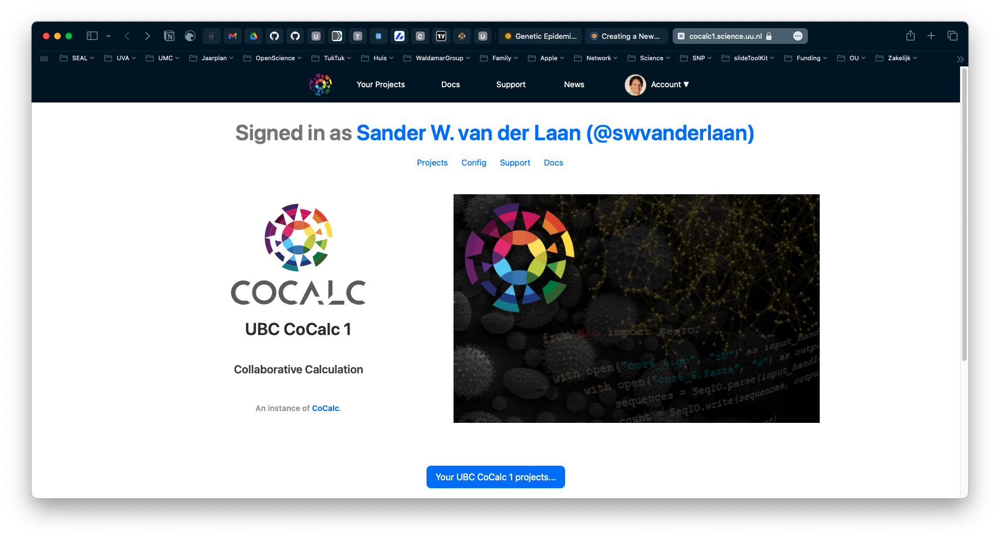
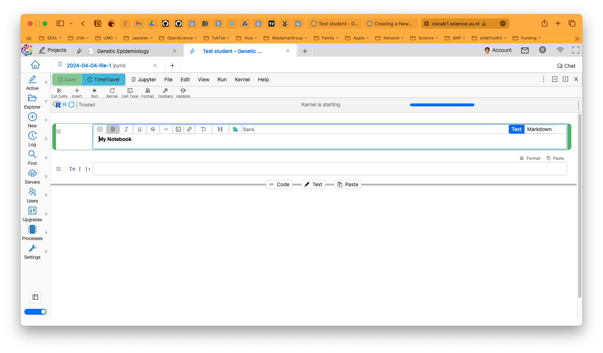

# Getting started - CoCalc {#getting-started-cocalc}
<!-- {width=100%} -->
```{r load-functions-packages, message = FALSE, warning = FALSE, echo = FALSE, eval = TRUE, include = FALSE}
# source("scripts/functions.R")
# source("scripts/colors.R")
# source("scripts/packages.R")

library(rmarkdown)
library(bookdown)
library(flextable)
library(knitr)
library(kableExtra)
library(webshot)
library(webshot2)
library(formatR)
library(tinytex)
```

```{r include = FALSE}
if(!knitr:::is_html_output())
{
  options("width"=56)
  knitr::opts_chunk$set(tidy.opts=list(width.cutoff=56, indent = 2), tidy = TRUE)
  knitr::opts_chunk$set(fig.pos = 'H')
}
```

```{r getting_started, message = FALSE, warning = FALSE, echo = FALSE, eval = TRUE, include = FALSE}
# general setting to apply to all chunks - can be overrode per chunk.
opts_chunk$set(echo = FALSE, 
               warning = FALSE, 
               message = FALSE, 
               out.width = "85%", 
               fig.align = "center", 
               tidy = FALSE)
```

Now, pay attention. If you came here through the course **Genetic Epidemiology**, you don't have to do anything. All the data you need are already downloaded and everything was set up for on the server, just follow the [link](https://cocalc1.science.uu.nl/){target="_blank"} as provided by the course-instructors. 

Here we provide a few short instructions to navigate **CoCalc**.


## Starting the course on CoCalc

Once logged in you should see a screen similar to the one below.

```{r 'cocalcstart', fig.align='center', fig.cap='CoCalc after logging in.', fig.show = TRUE, eval=TRUE}

```

Navigate to the Course by clicking on the blue _Your UBC CoCalc 1 projects..._-button and selecting the course **Genetic Epidemiology** you are following. 

```{r 'cocalcprojects', fig.align='center', fig.cap='CoCalc projects.', fig.show = TRUE, eval=TRUE}
knitr::include_graphics("img/_cocalc/cocalc_projects.png")
```

Once you are in the course, you will see a screen like this one below.

```{r 'cocalcstudentmain', fig.align='center', fig.cap='CoCalc student page.', fig.show = TRUE, eval=TRUE}

```

In the _Course Book_ you'll find the handouts you need. In the share _data_ folder you will find the data you'll need. 

## Beginning your own notebook

If you want to start your own notebook, you can do so by clicking on the _New_ button and selecting _Jupyter Notebook_.

```{r 'cocalc_notebook', fig.align='center', fig.cap='CoCalc new notebook.', fig.show = TRUE, eval=TRUE}
knitr::include_graphics("img/_cocalc/cocalc_notebook.png")
```

You will probably get a screen asking you to select a kernel. You can choose _R_.

```{r 'cocalcnotbookkernel', fig.align='center', fig.cap='CoCalc kernel selection.', fig.show = TRUE, eval=TRUE}
knitr::include_graphics("img/_cocalc/cocalc_notebook_kernel.png")
```

Now you are ready to start your own notebook - like below. You can create a new 'cell' with format 'code' or 'text' or 'markdown' and start typing. 

```{r 'cocalcnotebookrmarkdown', fig.align='center', fig.cap='CoCalc starting your notebook.', fig.show = TRUE, eval=TRUE}

```


## Are you ready?

Are you ready? Did you bring coffee and a good dose of energy? Let's start! 

Oh, one more thing: you can save your notebook, the one you just created, to keep all the `R` codes you are applying in the next chapters and add descriptions and notes. If you save this notebook you'll notice that a `html`-file is created. This file is a legible webbrowser-friendly version of your work and contains the codes and the output (code messages, tables, and figures). And the nice thing is, that you can easily share it with others over email. 

Ok. 'Nough said, let's move on to cover some basics in Chapter \@ref(gwas-basics).

<!-- ```{js, echo = FALSE} -->
<!-- title=document.getElementById('header'); -->
<!-- title.innerHTML = '' + title.innerHTML -->
<!-- ``` -->
