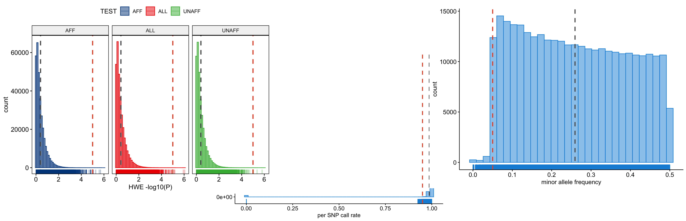

# Per-SNP QC {#gwas-basics-snp-qc-cocalc}
<!-- {width=70%} -->
```{r load-functions-packages, message = FALSE, warning = FALSE, echo = FALSE, eval = TRUE, include = FALSE}
source("scripts/functions.R")
source("scripts/colors.R")
source("scripts/packages.R")
```

```{r include = FALSE}
if(!knitr:::is_html_output())
{
  options("width"=56)
  knitr::opts_chunk$set(tidy.opts=list(width.cutoff=56, indent = 2), tidy = TRUE)
  knitr::opts_chunk$set(fig.pos = 'H')
}
```

```{r getting_started, message = FALSE, warning = FALSE, echo = FALSE, eval = TRUE, include = FALSE}
# general setting to apply to all chunks - can be overrode per chunk.
opts_chunk$set(echo = FALSE, 
               warning = FALSE, 
               message = FALSE, 
               out.width = "85%", 
               fig.align = "center", 
               tidy = FALSE)
```

Now that we removed samples, we can focus on low-quality variants.

## SNP call rates

We start by calculating the missing genotype rate for each SNP, in other words the per-SNP call rate.

```
plink --bfile dummy_project/clean_inds_data --missing --out dummy_project/clean_inds_data
```

Let's visualize the results to identify a threshold for extreme genotype failure rate. We chose a callrate threshold of 3%, but it's arbitrary and depending on the dataset, the data (visualization), and the number of samples (Figure \@ref(fig:showsnpcallrate)).

```{r load-snp-callrate, eval = FALSE}
library("data.table")
clean_LMISS <- data.table::fread("dummy_project/clean_inds_data.lmiss")

clean_LMISS$callrate <- 1 - clean_LMISS$F_MISS
```

```{r load-snp-callrate-book, eval = TRUE, echo = FALSE, include = FALSE}
library("data.table")
# to test the book locally
clean_LMISS <- data.table::fread("data/dummy_project/clean_inds_data.lmiss")

clean_LMISS$callrate <- 1 - clean_LMISS$F_MISS
```

```{r plot-snp-callrate, eval = FALSE, message = FALSE, warning = FALSE}
library("ggpubr")

clean_LMISS_plot <- ggpubr::gghistogram(clean_LMISS, x = "callrate",
                                        add = "mean", add.params = list(color = "#595A5C", linetype = "dashed", size = 1),
                                        rug = TRUE, bins = 50,
                                        color = "#1290D9", fill = "#1290D9",
                                        xlab = "per SNP call rate") +
  ggplot2::geom_vline(xintercept = 0.95, linetype = "dashed",
                      color = "#E55738", size = 1)

ggplot2::ggsave("dummy_project/gwas-qc-snp-call-rate.png", plot = clean_LMISS_plot)
clean_LMISS_plot
```

```{r showsnpcallrate, fig.align='center', fig.cap='Per SNP call rate.', fig.show = TRUE, eval=TRUE}
knitr::include_graphics("img/gwas_dummy/show-snp-callrate.png")
```

## Differential SNP call rates

There could also be differences in genotype call rates between cases and controls. It is very important to check for this because these differences could lead to spurious associations. We can test all markers for differences in call rate between cases and controls, or based on other criteria.

```
plink --bfile dummy_project/clean_inds_data --test-missing --out dummy_project/clean_inds_data
```

Let's collect all the SNPs with a significantly different (P < 0.00001) missing data rate between cases and controls.

```
cat dummy_project/clean_inds_data.missing | awk '$5 < 0.00001' | awk '{ print $2 }' > dummy_project/fail-diffmiss-qc.txt
```

## Allele frequencies

We should also get an idea on what the allele frequencies are in our dataset. Low frequent SNPs should probably be excluded, as these are uninformative when monomorphic (allele frequency = 0), or they may lead to spurious associations.

```
plink --bfile dummy_project/clean_inds_data --freq --out dummy_project/clean_inds_data
```

Let's also plot these data. You can view the result below, and try it yourself (Figure \@ref(fig:showfreq)).

```{r load-freq, eval = FALSE}
clean_FREQ <- data.table::fread("dummy_project/clean_inds_data.frq")
```

```{r load-freq-book, eval = TRUE, echo = FALSE, include = FALSE}
# to test the book locally
clean_FREQ <- data.table::fread("data/dummy_project/clean_inds_data.frq")
```

```{r plot-freq, eval = FALSE, message = FALSE, warning = FALSE}
clean_FREQ_plot <- ggpubr::gghistogram(clean_FREQ, x = "MAF",
                                       add = "mean", add.params = list(color = "#595A5C", linetype = "dashed", size = 1),
                                       rug = TRUE,
                                       color = "#1290D9", fill = "#1290D9",
                                       xlab = "minor allele frequency") +
  ggplot2::geom_vline(xintercept = 0.05, linetype = "dashed",
                      color = "#E55738", size = 1)

ggplot2::ggsave("dummy_project/gwas-qc-snp-freq.png", plot = clean_FREQ_plot)
clean_FREQ_plot
```

```{r showfreq, fig.align='center', fig.cap='Minor allele frequency.', fig.show = TRUE, eval=TRUE}

```

### A note on allele coding

Oh, one more thing about alleles. 

`PLINK` codes alleles as follows:

A1 = minor allele, the least frequent allele
A2 = major allele, the most frequent allele

And when you use `PLINK` the flag `--freq` or `--maf` is always relative to the A1-allele, as is the odds ratio (OR) or effect size (beta).

However, `SNPTEST` makes use of the so-called OXFORD-format, this codes alleles as follows:

A = the 'other' allele
B = the 'coded' allele

When you use `SNPTEST` it will report the allele frequency as `CAF`, in other words the _coded allele frequency_, and the effect size (beta) is always relative to the B-allele. This means, `CAF` _could_ be the `MAF`, or _minor allele frequency_, but this is **not** a given.

In other words, always make sure what the allele-coding of a given program, be it `PLINK`, `SNPTEST`, `GCTA`, _et cetera_, is! I cannot stress this enough. Ask yourself: 'what is the allele frequency referring to?', 'the effect size is relative to...?'.

Right, let's continue.

## Hardy-Weinberg Equilibrium

Because we are performing a case-control genome-wide association study, we probably expect some differences in Hardy-Weinberg Equilibrium (HWE), but extreme deviations are probably indicative of genotyping errors.

```
plink --bfile dummy_project/clean_inds_data --hardy --out dummy_project/clean_inds_data
```

Let's also plot these data. You can view the result below, and type over the code to do it yourself.

```{r load-hwe, eval = FALSE}
clean_HWE <- data.table::fread("dummy_project/clean_inds_data.hwe")
clean_HWE$logP <- -log10(clean_HWE$P)
```

```{r load-hwe-book, eval = FALSE, echo = FALSE, include = FALSE}
clean_HWE <- data.table::fread("data/dummy_project/clean_inds_data.hwe")
clean_HWE$logP <- -log10(clean_HWE$P)
```

```{r plot-hwe, eval = FALSE, message = FALSE, warning = FALSE}
clean_HWE_plot <- ggpubr::gghistogram(clean_HWE, x = "logP",
                                      add = "mean",
                                      add.params = list(color = "#595A5C", linetype = "dashed", size = 1),
                                      rug = TRUE,
                                      # color = "#1290D9", fill = "#1290D9",
                                      color = "TEST", fill = "TEST",
                                      palette = "lancet",
                                      facet.by = "TEST",
                                      bins = 50,
                                      xlab = "HWE -log10(P)") +
  ggplot2::geom_vline(xintercept = 5, linetype = "dashed",
                      color = "#E55738", size = 1)

ggplot2::ggsave("dummy_project/gwas-qc-snp-hwe.png", plot = clean_HWE_plot)
clean_HWE_plot
```

```{r showhwe, fig.align='center', fig.cap='Hardy-Weinberg Equilibrium p-values per stratum.', fig.show = TRUE, eval=TRUE}

```

## Final SNP QC

We are ready to perform the final QC. After inspecting the graphs we will filter on a MAF < 0.01, call rate < 0.05, and HWE < 0.00001 (Figure \@ref(fig:showhwe)), in addition those SNPs that failed the differential call rate test will be removed.

```
plink --bfile dummy_project/clean_inds_data --exclude dummy_project/fail-diffmiss-qc.txt --maf 0.01 --geno 0.05 --hwe 0.00001 --make-bed --out dummy_project/cleandata
```

## A Milestone

Congratulations. You reached a very important milestone. Now that you filtered samples and SNPs, we can finally start the association analyses in Chapter \@ref(gwas-testing-cocalc).

```{js, echo = FALSE}
title=document.getElementById('header');
title.innerHTML = '' + title.innerHTML
```
