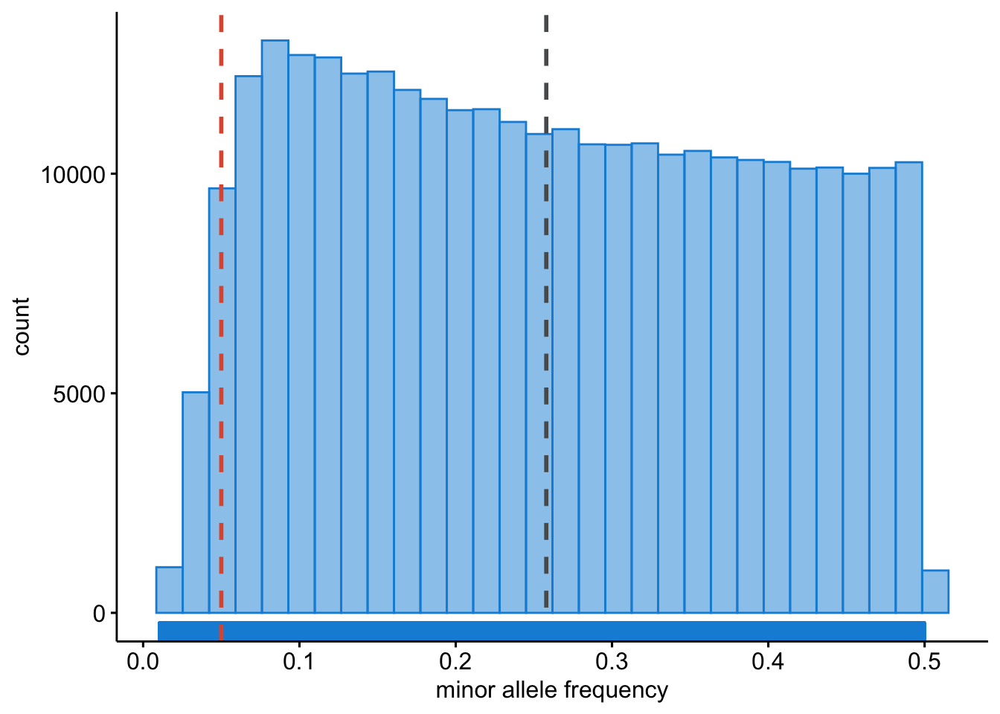

# Genome-Wide Association Study {#gwas-testing-cocalc}
<!-- {width=70%} -->
```{r load-functions-packages, message = FALSE, warning = FALSE, echo = FALSE, eval = TRUE, include = FALSE}
source("scripts/functions.R")
source("scripts/colors.R")
source("scripts/packages.R")
```

```{r include = FALSE}
if(!knitr:::is_html_output())
{
  options("width"=56)
  knitr::opts_chunk$set(tidy.opts=list(width.cutoff=56, indent = 2), tidy = TRUE)
  knitr::opts_chunk$set(fig.pos = 'H')
}
```

```{r getting_started, message = FALSE, warning = FALSE, echo = FALSE, eval = TRUE, include = FALSE}
# general setting to apply to all chunks - can be overrode per chunk.
opts_chunk$set(echo = FALSE, 
               warning = FALSE, 
               message = FALSE, 
               out.width = "85%", 
               fig.align = "center", 
               tidy = FALSE)
```

Now that you have learned how to perform QC, you can easily run a GWAS and execute some downstream visualization and analyses. Let's do this with a dummy dataset.

## Exploring the data

Even though someone says that the QC was done, it is still wise and good practice to run some of the commands above to get a 'feeling' about the data. So let's do this.

First, we'll clean up what we did before - we don't need it anyways.

```
clear
rm -v dummy_project/*
```

With the command `clear` you create a blank Terminal screen. With `rm -v` you remove all files in the `dummy_project` directory, where the `-v`-flag means that you get a verbose output of what is removed.

```
plink --bfile ~/data/shared/gwas/gwa --freq --out dummy_project/gwa
```

```
plink --bfile ~/data/shared/gwas/gwa --missing --out dummy_project/gwa
```

```
plink --bfile ~/data/shared/gwas/gwa --hardy --out dummy_project/gwa
```

Let's visualize the results. First we should load in all the results.

> Question: Load the data using R. [Hint: use and adapt the examples from the previous chapters.]

```{r load-data-gwas, eval = FALSE, echo = TRUE, include = FALSE}
library("data.table")
gwas_HWE <- data.table::fread("dummy_project/gwa.hwe")
gwas_FRQ <- data.table::fread("dummy_project/gwa.frq")
gwas_IMISS <- data.table::fread("dummy_project/gwa.imiss")
gwas_LMISS <- data.table::fread("dummy_project/gwa.lmiss")

# you'll need to calculate the -log10(P) for the HWE p-values
gwas_HWE$logP <- -log10(gwas_HWE$P)

# you'll need to calculate the sample call rate
gwas_IMISS$callrate <- 1 - gwas_IMISS$F_MISS

# you'll need to calculate the SNP call rate
gwas_LMISS$callrate <- 1 - gwas_LMISS$F_MISS
```

```{r load-data-gwas-book, eval = FALSE, echo = FALSE, include = FALSE}
library("data.table")
gwas_HWE <- data.table::fread("data/dummy_project/gwa.hwe")
gwas_FRQ <- data.table::fread("data/dummy_project/gwa.frq")
gwas_IMISS <- data.table::fread("data/dummy_project/gwa.imiss")
gwas_LMISS <- data.table::fread("data/dummy_project/gwa.lmiss")

gwas_HWE$logP <- -log10(gwas_HWE$P)

gwas_IMISS$callrate <- 1 - gwas_IMISS$F_MISS

gwas_LMISS$callrate <- 1 - gwas_LMISS$F_MISS
```

We can plot the per-stratum HWE p-values.

> Question: Plot the per-stratum HWE p-values using R. [Hint: use and adapt the examples from the previous chapters.]

```{r plot-hwe-gwas, eval = FALSE, message = FALSE, warning = FALSE}
library("ggpubr")
ggpubr::gghistogram(gwas_HWE, x = "logP",
                    add = "mean",
                    add.params = list(color = "#595A5C", linetype = "dashed", size = 1),
                    rug = TRUE,
                    # color = "#1290D9", fill = "#1290D9",
                    color = "TEST", fill = "TEST",
                    palette = "lancet",
                    facet.by = "TEST",
                    bins = 50,
                    xlab = "HWE -log10(P)") +
  ggplot2::geom_vline(xintercept = 5, linetype = "dashed",
                      color = "#E55738", size = 1)
ggplot2::ggsave("data/dummy_project/gwas-hwe.png",
       plot = last_plot())
```

```{r, fig.id='showhwegwas', fig.align='center', fig.cap='Per stratum HWE p-values.', fig.show = TRUE, eval=TRUE}
knitr::include_graphics("img/gwas_dummy/show-hwe-gwas.png")
```

We will want to see what the distribution of allele frequencies looks like. 

> Question: Plot the allele frequencies using R. [Hint: use and adapt the examples from the previous chapters.]

```{r plot-freq-gwas, eval = FALSE, message = FALSE, warning = FALSE}
ggpubr::gghistogram(gwas_FRQ, x = "MAF",
                    add = "mean", add.params = list(color = "#595A5C", linetype = "dashed", size = 1),
                    rug = TRUE,
                    color = "#1290D9", fill = "#1290D9",
                    xlab = "minor allele frequency") +
  ggplot2::geom_vline(xintercept = 0.05, linetype = "dashed",
                      color = "#E55738", size = 1)
ggplot2::ggsave("data/dummy_project/gwas-freq.png",
       plot = last_plot())
```

```{r, fig.id='showfreqgwas', fig.align='center', fig.cap='Minor allele frequencies.', fig.show = TRUE, eval=TRUE}

```

We will want to identify samples that have poor call rates.

> Question: Plot the per-sample call rates using R. [Hint: use and adapt the examples from the previous chapters.]

```{r plot-sample-callrate-gwas, eval = FALSE, message = FALSE, warning = FALSE}
ggpubr::gghistogram(gwas_IMISS, x = "callrate",
                    add = "mean", add.params = list(color = "#595A5C", linetype = "dashed", size = 1),
                    rug = TRUE, bins = 50,
                    color = "#1290D9", fill = "#1290D9",
                    xlab = "per sample call rate") +
  ggplot2::geom_vline(xintercept = 0.95, linetype = "dashed",
                      color = "#E55738", size = 1)
ggplot2::ggsave("data/dummy_project/gwas-sample-call-rate.png",
       plot = last_plot())
```

```{r, fig.id='showsamplecallrategwas', fig.align='center', fig.cap='Per sample call rates.', fig.show = TRUE, eval=TRUE}

```

We also need to know what the per SNP call rates are.

> Question: Plot the per-SNP call rates using R. [Hint: use and adapt the examples from the previous chapters.]

```{r plot-snp-callrate-gwas, eval = FALSE, message = FALSE, warning = FALSE}
ggpubr::gghistogram(gwas_LMISS, x = "callrate",
                    add = "mean", add.params = list(color = "#595A5C", linetype = "dashed", size = 1),
                    rug = TRUE, bins = 50,
                    color = "#1290D9", fill = "#1290D9",
                    xlab = "per SNP call rate") +
  ggplot2::geom_vline(xintercept = 0.95, linetype = "dashed",
                      color = "#E55738", size = 1)
ggplot2::ggsave("data/dummy_project/gwas-snp-call-rate.png",
       plot = last_plot())
```

```{r, fig.id='showsnpcallrategwas', fig.align='center', fig.cap='Per SNP call rates.', fig.show = TRUE, eval=TRUE}
knitr::include_graphics("img/gwas_dummy/show-snp-callrate-gwas.png")
```


## Genetic models
A simple chi-square test of association can be done.

```
plink --bfile ~/data/shared/gwas/gwa --model --out dummy_project/data
```

_Genotypic_, _dominant_ and _recessive_ tests will not be conducted if any one of the cells in the table of case-control by genotype counts contains less than five observations. This is because the chi-square approximation may not be reliable when cell counts are small. For SNPs with MAFs < 5%, a sample of more than 2,000 cases and controls would be required to meet this threshold and more than 50,000 would be required for SNPs with MAF < 1%.

You can change this default behaviour by adding the flag `--cell`, _e.g._, we could lower the threshold to 3.

```
plink --bfile ~/data/shared/gwas/gwa --model --cell 3 --out dummy_project/data
```

Let's review the contents of the results.

```{r load-gwas-model, eval = FALSE}
gwas_model <- data.table::fread("dummy_project/data.model")

dim(gwas_model)

N_SNPS = length(gwas_model$SNP)

gwas_model[1:10, 1:10]
```

```{r load-gwas-model-book, eval = FALSE, echo = FALSE, include = FALSE}
# to test the book locally
gwas_model <- data.table::fread("data/dummy_project/data.model")

dim(gwas_model)

N_SNPS = length(gwas_model$SNP)

gwas_model[1:10, 1:10]
```

It contains 1,530,510 rows, one for each SNP, and each type of test (_genotypic_, _trend_, _allelic_, _dominant_, and _recessive_) and the following columns:

- chromosome [`CHR`],
- the SNP identifier [`SNP`],
- the minor allele [`A1`] (remember, `PLINK` always codes the A1-allele as the minor allele!),
- the major allele [`A2`],
- the test performed [`TEST`]:
  - `GENO` (genotypic association);
  - `TREND` (Cochran-Armitage trend);
  - `ALLELIC` (allelic as- sociation);
  - `DOM` (dominant model); and
  - `REC` (recessive model)],
- the cell frequency counts for cases [`AFF`], 
- the cell frequency counts for controls [`UNAFF`],
- the chi-square test statistic [`CHISQ`],
- the degrees of freedom for the test [`DF`],
- and the asymptotic P value [`P`] of association.

> Question: Do you know which model, _i.e._ `TEST` is most commonly used and reported? And why is that, do think?

## Logistic regression
We can also perform a test of association using logistic regression. In this case we might want to correct for covariates/confounding factors, for example age, sex, ancestral background, i.e. principal components, and other study specific covariates (e.g. hospital of inclusion, genotyping centre etc.). In that case each of these P values is adjusted for the effect of the covariates.

When running a regression analysis, be it linear or logistic, PLINK assumes a multiplicative model. By default, when at least one male and one female is present, sex (male = 1, female = 0) is automatically added as a covariate on X chromosome SNPs, and nowhere else. The `sex` flag causes it to be added everywhere, while `no-x-sex` excludes it.

```
plink --bfile ~/data/shared/gwas/gwa --logistic sex --covar ~/data/shared/gwas/gwa.covar --out dummy_project/data
```

Let's examine the results.
```{r load-gwas-assoc, eval = FALSE}
gwas_assoc <- data.table::fread("dummy_project/data.assoc.logistic")
```

```{r load-gwas-assoc-book, eval = TRUE, echo = FALSE, include = FALSE}
# to test the book locally
gwas_assoc <- data.table::fread("data/dummy_project/data.assoc.logistic")
```

```{r load-gwas-assoc-dimensions, eval = TRUE}
dim(gwas_assoc)
```

```{r load-gwas-assoc-results, eval = TRUE}
gwas_assoc[1:9, 1:9]
```

> Question: How come there are more lines in this file than there are variants?

If no model option is specified, the first row for each SNP corresponds to results for a multiplicative test of association. The C >= 0 subsequent rows for each SNP correspond to separate tests of significance for each of the C covariates included in the regression model. We can remove the covariate-specific lines from the main report by adding the `hide-covar` flag.

The columns in the association results are:

- the chromosome [`CHR`],
- the SNP identifier [`SNP`],
- the base-pair location [`BP`],
- the minor allele [`A1`],
- the test performed [`TEST`]: ADD (multiplicative model or genotypic model testing additivity),
  - `GENO_2DF` (genotypic model),
  - `DOMDEV` (genotypic model testing deviation from additivity),
  - `DOM` (dominant model), or
  - `REC` (recessive model)],
- the number of missing individuals included [`NMISS`],
- the `OR` relative to the A1, _i.e._ minor allele,
- the coefficient z-statistic [`STAT`], and
- the asymptotic P-value [`P`] of association.

We need to calculate the standard error and confidence interval from the z-statistic. We can modify the effect size (`OR`) to output the _beta_ by adding the `beta` flag.

> Question: Can you write down the mathematical relation between _beta_ and _OR_?

## Let's get visual

Looking at numbers is important, but it won't give you a perfect overview. We should turn to visualizing our results in Chapter \@ref(gwas-visuals-cocalc).

```{js, echo = FALSE}
title=document.getElementById('header');
title.innerHTML = '' + title.innerHTML
```
