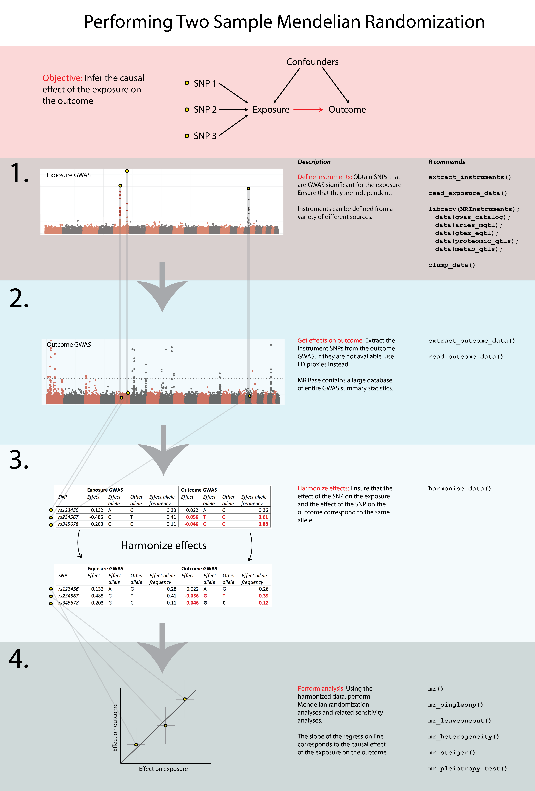

# Two Sample Mendelian Randomisation {#mr_twosamplemr}
<!-- {width=100%} -->
```{r load-functions-packages, message = FALSE, warning = FALSE, echo = FALSE, eval = TRUE, include = FALSE}
source("scripts/functions.R")
source("scripts/colors.R")
source("scripts/packages.R")
COURSE_loc = "~/Desktop/practical"
```

```{r include = FALSE}
if(!knitr:::is_html_output())
{
  options("width"=56)
  knitr::opts_chunk$set(tidy.opts=list(width.cutoff=56, indent = 2), tidy = TRUE)
  knitr::opts_chunk$set(fig.pos = 'H')
}
```

```{r getting_started, message = FALSE, warning = FALSE, echo = FALSE, eval = TRUE, include = FALSE}
# general setting to apply to all chunks - can be overrode per chunk.
opts_chunk$set(echo = FALSE, 
               warning = FALSE, 
               message = FALSE, 
               out.width = "85%", 
               fig.align = "center", 
               tidy = FALSE)
```
So you took the hard way. You want to get your hands dirty yourself. Your choice. 

As I wrote, we will use the `TwoSampleMR` package to assess the causal effect of type 2 diabetes on coronary artery disease and ischemic stroke.

Briefly, the workflow of a Two-Sample MR is as follows (see also diagram below):

1. Select instruments for the exposure (perform LD clumping if necessary)
2. Extract the instruments from the MR Base GWAS database for the outcomes of interest
3. Harmonise the effect sizes for the instruments on the exposures and the outcomes to be each for the same reference allele
4. Perform MR analysis, sensitivity analyses, create plots, compile reports



## Loading the package

`TwoSampleMR` is free use. It used to require server-authentication using a gmail-account, now it doesn't anymore. Should run into an issue, please refer to [this page](https://mrcieu.github.io/TwoSampleMR/articles/introduction.html){target="_blank"}.

First we load the package.
```{r load TwoSampleMR}
library("TwoSampleMR")
library("MRInstruments")
```

## Available outcome

We are ready to load in the available outcomes. 
```{r listGWAS}
ao_mr <- available_outcomes()

```

## Instruments

The `MRInstruments`-package, which comes with `TwoSampleMR`, includes several types of instruments:

- _gwas_catalog_, which includes data from GWAS collected by the GWAS Catalog
- _metab_qtls_, all known quantitative trait loci (meQTLs) associated to circulating metabolites
- _proteomic_qtls_, all known protein QTLs (pQTLs) associated to circulating protein levels
- _gtex_eqtl_, all known expression QTLs (eQTLs) associated to gene expression in 53 different tissues from GTEx Portal
- _aries_mqtl_, all known methylation QTLs (mQTLs) associated to DNA methylation in blood from ARIES


Let's select T2D associated instruments.

```{r MR_instruments_exposure}
data("gwas_catalog")
t2d_gwas <- subset(gwas_catalog, grepl("Mahajan", Author) & PubmedID == "24509480" & Phenotype == "Type 2 diabetes")
t2d_exp_dat <- format_data(t2d_gwas)

```

## Clumping

Like with identifying independent GWAS hits, it is important for TwoSampleMR to ensure that the instruments for the exposure are independent. We can use MR Base to perform clumping. The European samples from the 1000 genomes project are used to estimate LD between SNPs. You can provide a list of SNP IDs, the SNPs will be extracted from 1000 genomes data, LD calculated between them, and amongst those SNPs that have LD R-square above the specified threshold only the SNP with the lowest P-value will be retained. To do this, use the following command.

```{r MR_clump}
t2d_exp_dat <- clump_data(t2d_exp_dat)
```

## Outcomes

Right, so now we are ready to select the proper outcome, CAD. There are multiple datasets available in MRBase, the database used by `TwoSampleMR`. Let's review them all and select one with the largest overlap with our exposure SNPs.

```{r MR_outcomes}
ao_twosamplemr <- available_outcomes()

ao_twosamplemr[grepl("heart disease", ao_twosamplemr$trait), ]

chd_out_dat <- extract_outcome_data(
    snps = t2d_exp_dat$SNP,
    outcomes = "UKB-a:534"
)
```

### Harmonisation

It is important to make sure that the effect allele associated to T2D of any given SNP is the same as the effect allele associated CAD. In other words, we need to harmonise the data.

```{r MR_harmonise}
dat <- harmonise_data(
    exposure_dat = t2d_exp_dat,
    outcome_dat = chd_out_dat
)
```

<!-- ### Drop duplicate datasets -->
<!-- After data harmonisation, users may find that their dataset contains duplicate exposure-outcome summary sets. This can arise, for example, when a GWAS consortium has released multiple results from separate GWAS analyses for the same trait.  -->
<!-- The best thing to do, is to prune the datasets so that only the exposure-outcome combination with the highested expected power is retained.  -->
<!-- In our case we only have 1 dataset for the exposure and 1 for the outcome. But if you don't, you can use the command below. -->

<!-- ```{r MR_powerprune} -->

<!-- dat <- power_prune(dat,  -->
<!--                    method = 1, -->
<!--                    dist.outcome = "binary") -->

<!-- ``` -->

### Mendelian randomisation

Now that the data is harmonised, we are ready to perform a MR and test for a causal relation of T2D with CAD.
```{r MR_analysis}
res <- mr(dat)

DT::datatable(res, caption = "MR of type 2 diabetes and coronary artery disease", rownames = FALSE)
```

Several tests are applied. You can change the method(s) applied by using the `method_list` flag. Below a list of available methods.

```{r MR_methods}
knitr::kable(mr_method_list(), caption = "Available MR methods", row.names
 = FALSE)

```

### Heterogeneity & Pleiotropy

Many genetic variants are associated to multiple traits, thus _pleiotropy_ is common and widespread in the human genome. This poses as an issue to tease apart causal relations in Mendelian randomisation.
_Vertical pleiotropy_ arises because a SNP influences one trait, which in turn influences another. We can use MR to estimate the causal influence between the traits.
_Horizontal pleiotropy_ arises due to SNPs influencing two traits through independent pathways[@hemani2018].

Further, we should test for study heterogeneity.

```{r MR_sensitivity}
mr_heterogeneity(dat)

mr_pleiotropy_test(dat)
```

### Leave-one-out

It is also key to inspect the causal effects per SNP and perform a leave-one-out analysis.

```{r MR_SNP_LOO}
res_single <- mr_singlesnp(dat)
DT::datatable(res_single, caption = "Single SNP MR analysis", rownames = FALSE)

res_loo <- mr_leaveoneout(dat)
DT::datatable(res_loo, caption = "Leave-one-out MR analysis", rownames = FALSE)
```

### Visualisation

It is important to present the causal inference graphically.

**Scatter plot**

```{r MR_visualisation_Scatter}
res <- mr(dat)
p1 <- mr_scatter_plot(res, dat)
p1
```

**Single SNP plot**

```{r MR_visualisation_Single}
res_single <- mr_singlesnp(dat)
p2 <- mr_forest_plot(res_single)
p2
```

**Leave-One-Out plot**
```{r MR_visualisation_LOO}
res_loo <- mr_leaveoneout(dat)
p3 <- mr_leaveoneout_plot(res_loo)
p3
```

**Funnel plot**
```{r MR_visualisation_Funnel}
res_single <- mr_singlesnp(dat)
p4 <- mr_funnel_plot(res_single)
p4
```

<!-- ```{r MR_editing} -->
<!-- generate_odds_ratios(res) -->

<!-- res <- mr(dat) -->
<!-- het <- mr_heterogeneity(dat) -->
<!-- plt <- mr_pleiotropy_test(dat) -->
<!-- sin <- mr_singlesnp(dat) -->

<!-- all_res <- combine_all_mrresults(res, het, -->
<!--                                plt, sin, -->
<!--                                ao_slc = TRUE, -->
<!--                                Exp=TRUE, -->
<!--                                split.exposure = FALSE, -->
<!--                                split.outcome = TRUE) -->

<!-- head(all_res[,c("Method","outcome","exposure","nsnp","b","se","pval","intercept","intercept_se","intercept_pval","Q","Q_df","Q_pval","consortium","ncase","ncontrol","pmid","population")]) -->

<!-- DT::datatable(all_res) -->
<!-- ``` -->

## The end?

You are almost at the end. Time to return to the previous chapter on post-GWAS analyses \@ref(post_gwas).

<!-- ```{js, echo = FALSE} -->
<!-- title=document.getElementById('header'); -->
<!-- title.innerHTML = '' + title.innerHTML -->
<!-- ``` -->
