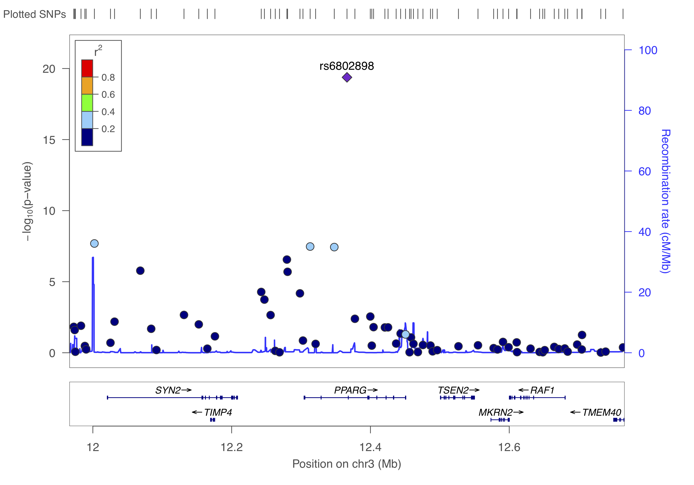

# Regional association plots {#regional_plot}
<!-- {width=100%} -->
```{r load-functions-packages, message = FALSE, warning = FALSE, echo = FALSE, eval = TRUE, include = FALSE}
source("scripts/functions.R")
source("scripts/colors.R")
source("scripts/packages.R")
COURSE_loc = "~/Desktop/practical"
```

```{r include = FALSE}
if(!knitr:::is_html_output())
{
  options("width"=56)
  knitr::opts_chunk$set(tidy.opts=list(width.cutoff=56, indent = 2), tidy = TRUE)
  knitr::opts_chunk$set(fig.pos = 'H')
}
```

```{r getting_started, message = FALSE, warning = FALSE, echo = FALSE, eval = TRUE, include = FALSE}
# general setting to apply to all chunks - can be overrode per chunk.
opts_chunk$set(echo = FALSE, 
               warning = FALSE, 
               message = FALSE, 
               out.width = "85%", 
               fig.align = "center", 
               tidy = FALSE)
```
First we need to find the independent hits by _clumping_ the results. We will just use the defaults, but please take a note of all the options here [https://www.cog-genomics.org/plink/1.9/postproc#clump](https://www.cog-genomics.org/plink/1.9/postproc#clump){target="_blank"}

```
plink --bfile gwas/gwa --clump dummy_project/data.assoc.logistic --clump-p1 5e-8 --clump-p2 0.05 --clump-kb 500 --clump-r2 0.05 --clump-verbose --out dummy_project/data.assoc.logistic
```
Now you will have a list of all the _independent_ SNPs, _i.e._ the genetic loci, that are associated to the trait.

```
cat dummy_project/data.assoc.logistic.clumped
```

```{bash CLUMPS}
ROOTDIR="/Users/slaan3/Desktop/practical" # change this to your root
cat $ROOTDIR/dummy_project/data.assoc.logistic.clumped
```

> Question: How many independent hits did you find?

In summary, clumping identifies three loci and now that you know them you can create regional association plots.

## LocusZoom
Now you are ready to visualize regions of interest using a package like [LocusZoom](http://locuszoom.org). Locuszoom is a great and easy tool, you'll soon discover. It's the fast and lazy way to get regional association plots.

First, let's get what we need (`SNP` and `P`) and gzip the results.

```
echo "SNP P" > dummy_project/data.assoc.logistic.locuszoom
cat dummy_project/data.assoc.logistic | awk '$5=="ADD"' | awk '{ print $2, $9 }' >> dummy_project/data.assoc.logistic.locuszoom
gzip -v dummy_project/data.assoc.logistic.locuszoom
```

You can to upload this `data.assoc.logistic.locuszoom.gz` Try to visualize each locus using the information above and by following the instructions. Choose HapMap 2, hg18, CEU as the LD-reference.

You should get something like below.

{width=50%}

{width=50%}

{width=50%}

## RACER

An alternative to create regional association plots for each of these loci is using [**RACER**](https://github.com/oliviasabik/RACER){target="_blank"}. This packages offers substantial flexibility, and quite frankly, code-wise is easier to edit - think colorscheme, background etc.  - as it is based on [`ggplot2`](https://ggplot2.tidyverse.org){target="_blank"}. The creator, Olivia Sabik, also wrote a nice [vignette](https://oliviasabik.github.io/RACERweb/index.html){target="_blank"} with excellent instructions.

Using **RACER** is also a step-up to **colocalization** about which you read a bit more in chapter \@ref(post_gwas).

Right, so from the above we identified three independent hits: rs6802898, rs7901695, rs8050136. Let's put them in a dataset with their chromosome and basepair position and create a list.

```{r create-variant-list}
rsID <- c("rs6802898", "rs7901695", "rs8050136")
CHR <- as.integer(c(3, 10, 16))
BP <- as.integer(c(12366207, 114744078, 52373776))
# BPend <- c(12366207 + 500000, 114744078 + 500000, 52373776 + 500000)

variant_list <- data.frame(rsID, CHR, BP)
```


```{r show-variant-list}
variant_list
```


```{r show-variants-of-interest}
variants_of_interest <- c(variant_list$rsID)

variants_of_interest
```

We can now take the filtered and prepared GWAS summary statistics, _i.e._ `gwas_assoc_compl` you created earlier in chapter \@ref(gwas_visuals), to draw three nice regional association plots around these variants. 

This file should contain the following:

```
tibble [306,102 × 14] (S3: tbl_df/tbl/data.frame)
 $ SNP     : chr [1:306102] "rs10000010" "rs10000023" "rs10000030" "rs1000007" ...
 $ CHR     : int [1:306102] 4 4 4 2 4 4 16 4 2 4 ...
 $ BP      : int [1:306102] 21227772 95952929 103593179 237416793 21504615 157793485 24325037 33810744 235355721 77575270 ...
 $ A1      : chr [1:306102] "C" "T" "A" "C" ...
 $ A2      : chr [1:306102] "T" "G" "G" "T" ...
 $ MAF     : num [1:306102] 0.426 0.484 0.162 0.312 0.343 ...
 $ callrate: num [1:306102] 0.999 0.989 0.998 1 0.991 ...
 $ NMISS   : int [1:306102] 3996 3957 3991 4000 3963 3919 3899 3931 3927 3941 ...
 $ NCHROBS : int [1:306102] 7992 7914 7982 8000 7926 7838 7798 7862 7854 7882 ...
 $ BETA    : num [1:306102] 0.04114 -0.00985 -0.02235 0.01784 -0.07904 ...
 $ SE      : num [1:306102] 0.0457 0.0456 0.0605 0.0489 0.0471 ...
 $ OR      : num [1:306102] 1.042 0.99 0.978 1.018 0.924 ...
 $ STAT    : num [1:306102] 0.901 -0.216 -0.37 0.365 -1.677 ...
 $ P       : num [1:306102] 0.3676 0.829 0.7117 0.7152 0.0935 ...
 - attr(*, ".internal.selfref")=<externalptr> 
 - attr(*, "sorted")= chr "SNP"
```

We could limit ourselves by limiting the region to plot by the clump-size (see above), but generally it's fine to just 'take the top variant ± 500kb'.

```{r plot-racer, eval = FALSE}
library(RACER)

RANGE=500000

for(VARIANT in variants_of_interest){
  cat(paste0("Getting data for ", VARIANT,".\n"))

  tempCHR <- subset(variant_list, rsID == VARIANT)[,2]
  tempSTART <- subset(variant_list, rsID == VARIANT)[,3] - RANGE
  tempEND <- subset(variant_list, rsID == VARIANT)[,3] + RANGE
  tempVARIANTnr <- subset(variant_list, rsID == VARIANT)[,1]

  cat("\nSubset required data.\n")
  temp <- subset(gwas_assoc_compl, 
                 CHR == tempCHR & (BP >= tempSTART & BP <= tempEND))

  cat("\nFormatting association data.\n")
  # make sure you have the right column numbers here!
  temp_f = RACER::formatRACER(assoc_data = temp, chr_col = 2, pos_col = 3, p_col = 14)

  cat("\nGetting LD data.\n")
  temp_f_ld = RACER::ldRACER(assoc_data = temp_f, rs_col = 1, pops = "EUR", lead_snp = VARIANT)
  
  cat(paste0("\nPlotting region surrounding ", VARIANT," on ",tempCHR,":",tempSTART,"-",tempEND,".\n"))
  # source(paste0(PROJECT_loc, "/scripts/functions.R"))
  p1 <- singlePlotRACER(assoc_data = temp_f_ld, 
                               chr = tempCHR, build = "hg19", 
                               plotby = "snp", snp_plot = VARIANT,
                               label_lead = TRUE)
  
  print(p1)
  cat(paste0("Saving image for ", VARIANT,".\n"))
  ggsave(filename = paste0(COURSE_loc, "/dummy_project/", tempVARIANTnr, ".",VARIANT,".regional_assoc.png"), plot = p1)
  # ggsave(filename = paste0(COURSE_loc, "/dummy_project/", tempVARIANTnr, ".",VARIANT,".regional_assoc.pdf"), plot = p1)
  # ggsave(filename = paste0(COURSE_loc, "/dummy_project/", tempVARIANTnr, ".",VARIANT,".regional_assoc.eps"), plot = p1)
  
  rm(temp, p1,
     temp_f, temp_f_ld,
     tempCHR, tempSTART, tempEND,
     VARIANT, tempVARIANTnr)
  
}


```

This should produce the figure similar to these below. 
```{r show-racer, fig.align='center', fig.cap='Regional association plots.', fig.show = TRUE, echo=FALSE, eval=TRUE, warning=FALSE, message=FALSE}
knitr::include_graphics(rep("img/_gwas_dummy/rs6802898.rs6802898.regional_assoc.png"))
knitr::include_graphics(rep("img/_gwas_dummy/rs7901695.rs7901695.regional_assoc.png"))
knitr::include_graphics(rep("img/_gwas_dummy/rs8050136.rs8050136.regional_assoc.png"))
```

> Please note that we are letting RACER plot the variants on genome build 37 (hg19), but we actually provide hg18-based chromosome and basepair positions. The proper thing to do is to [liftOver](https://genome.sph.umich.edu/wiki/LiftOver){target="_blank"} our coordinates to match those in hg19. Here we didn't, because I just wanted to show you the 'how it's done'. 

<!-- ```{js, echo = FALSE} -->
<!-- title=document.getElementById('header'); -->
<!-- title.innerHTML = '' + title.innerHTML -->
<!-- ``` -->
