# Answers to the questions {#answers}
<!-- {width=100%} -->
```{r load-functions-packages, message = FALSE, warning = FALSE, echo = FALSE, eval = TRUE, include = FALSE}
source("scripts/functions.R")
source("scripts/colors.R")
source("scripts/packages.R")
```

```{r include = FALSE}
if(!knitr:::is_html_output())
{
  options("width"=56)
  knitr::opts_chunk$set(tidy.opts=list(width.cutoff=56, indent = 2), tidy = TRUE)
  knitr::opts_chunk$set(fig.pos = 'H')
}
```

```{r getting_started, message = FALSE, warning = FALSE, echo = FALSE, eval = TRUE, include = FALSE}
# general setting to apply to all chunks - can be overrode per chunk.
opts_chunk$set(echo = TRUE, 
               warning = FALSE, 
               message = FALSE, 
               out.width = "85%", 
               fig.align = "center", 
               tidy = FALSE)
```
Throughout the book you encountered questions related to some steps and output that you generated. Here you can review the answers for each of these questions - of course, for some different answers are possible.

## Chapter 3.1: GWAS Basics

> Question: Can you think off what the '11,440 heterozygous haploid genotypes present' represent? 

These are the variants on the X-chromosome. Males only have 1 copy.

> Question: Can you think of other scenarios in which you may want to extend the check on differential missingness beyond a check between cases and controls?

For instance 'genotyping platform', or 'hospital of inclusion', if you think this might influence the genotyping experiment technically.

## Chapter 3.4: GWAS Basics - Association testing

> Question: Load the data using R. [Hint: use and adapt the examples from the previous chapters.]

```
library("data.table")
gwas_HWE <- data.table::fread("dummy_project/gwa.hwe")
gwas_FRQ <- data.table::fread("dummy_project/gwa.frq")
gwas_IMISS <- data.table::fread("dummy_project/gwa.imiss")
gwas_LMISS <- data.table::fread("dummy_project/gwa.lmiss")

# you'll need to calculate the -log10(P) for the HWE p-values
gwas_HWE$logP <- -log10(gwas_HWE$P)

# you'll need to calculate the sample call rate
gwas_IMISS$callrate <- 1 - gwas_IMISS$F_MISS

# you'll need to calculate the SNP call rate
gwas_LMISS$callrate <- 1 - gwas_LMISS$F_MISS
```

> Question: Plot the per-stratum HWE p-values using R. [Hint: use and adapt the examples from the previous chapters.]

```
library("ggpubr")
ggpubr::gghistogram(gwas_HWE, x = "logP",
                    add = "mean",
                    add.params = list(color = "#595A5C", linetype = "dashed", size = 1),
                    rug = TRUE,
                    # color = "#1290D9", fill = "#1290D9",
                    color = "TEST", fill = "TEST",
                    palette = "lancet",
                    facet.by = "TEST",
                    bins = 50,
                    xlab = "HWE -log10(P)") +
  ggplot2::geom_vline(xintercept = 5, linetype = "dashed",
                      color = "#E55738", size = 1)
ggplot2::ggsave("dummy_project/gwas-hwe.png",
       plot = last_plot())
```

> Question: Plot the allele frequencies using R. [Hint: use and adapt the examples from the previous chapters.]

```
ggpubr::gghistogram(gwas_FRQ, x = "MAF",
                    add = "mean", add.params = list(color = "#595A5C", linetype = "dashed", size = 1),
                    rug = TRUE,
                    color = "#1290D9", fill = "#1290D9",
                    xlab = "minor allele frequency") +
  ggplot2::geom_vline(xintercept = 0.05, linetype = "dashed",
                      color = "#E55738", size = 1)
ggplot2::ggsave("dummy_project/gwas-freq.png",
       plot = last_plot())
```


> Question: Plot the per-sample call rates using R. [Hint: use and adapt the examples from the previous chapters.]

```
ggpubr::gghistogram(gwas_IMISS, x = "callrate",
                    add = "mean", add.params = list(color = "#595A5C", linetype = "dashed", size = 1),
                    rug = TRUE, bins = 50,
                    color = "#1290D9", fill = "#1290D9",
                    xlab = "per sample call rate") +
  ggplot2::geom_vline(xintercept = 0.95, linetype = "dashed",
                      color = "#E55738", size = 1)
ggplot2::ggsave("data/dummy_project/gwas-sample-call-rate.png",
       plot = last_plot())
```

> Question: Plot the per-SNP call rates using R. [Hint: use and adapt the examples from the previous chapters.]

```
ggpubr::gghistogram(gwas_LMISS, x = "callrate",
                    add = "mean", add.params = list(color = "#595A5C", linetype = "dashed", size = 1),
                    rug = TRUE, bins = 50,
                    color = "#1290D9", fill = "#1290D9",
                    xlab = "per SNP call rate") +
  ggplot2::geom_vline(xintercept = 0.95, linetype = "dashed",
                      color = "#E55738", size = 1)
ggplot2::ggsave("data/dummy_project/gwas-snp-call-rate.png",
       plot = last_plot())
```

> Question: Do you know which model, _i.e._ `TEST` is most commonly used and reported? And why is that, do think?

The additive model. It is the most powerful and robust model. It is also the most commonly used model in GWAS, because most variants are 'behaving' according an additive effect.
<!-- in the future version add a reference to this -->

> Question: How come there are more lines in this file than there are variants?

Because the results for different models are reported, so there are 3x more lines than there are variants.
 
> Question: Can you write down the mathematical relation between _beta_ and _OR_?

The odds ratio is the exponentiated beta. So, `OR = exp(beta)`.

## Chapter 3.5: GWAS visualization

> Question: Try to figure out how to get the number of variants per chromosomes. Why do the number of variants per chrosome (approximately) correlate with the chromosome number?

```
df <- as.data.frame(table(gwas_assoc_compl$CHR))
names(df)[names(df) == "Var1"] <- "Chr"
View(df)
```

> Question: Where are the data for chromosome X, Y and MT?

The data for chromosome X, Y and MT are not present in the dataset. In this case it is a dummy dataset, so it wasn't even generated. In real-life, a lot of the older generation genotyping platforms didn't have chromosome Y or MT, and only few variants on chromosome X. Nowadays, with the newer platforms, chromosome X and Y are included, as well as MT. A downside still remains: the reference datasets for imputation do not include the Y and the MT chromosome.

> Question: What do the grey spots on the density plot indicate?

These are the chromosomal regions without any (or with very low) variant coverage, as they are notoriously hard to sequence. Therefore companies cannot design probes against these regions and they are not included in the genotyping arrays. But what are these regions: usually the ends of chromosomes and the centromeres.

## Chapter 3.6: Regional association plots

> Question: How many independent hits did you find?

Two. 

## Chapter 4.2: WTCCC1

> Question: What do you notice in the 'per sample call rate' graph? Can you think of a reason why this is? And how would you deal with this?

There are two bumps in the histogram. This could be due to the genotyping platform used, or due to the case/control status. The two bumps could represent two different genotyping platforms. If this is the case, you could split the data and analyze them separately or correct for this somehow. If it is due to the case/control status, you could remove the samples with a low call rate. It could also be that the cases and the controls were genotype separately, this causes a batch effect which is evident in a slightly different per sample call rate. 

> Question: Do you have any thoughts on that? Do you agree with the filters I set below? How would you do it differently and why?

These were my settings `--maf 0.01 --geno 0.05 --hwe 0.00001 `. 

You could have set the call rate filter to 0.97 or even 0.98; it's a bit arbitrary, but anything between 0.95 and 0.97 is a common threshold. 
The HWE filter is set to 0.00001, which is relatively strict. Some would set it to 0.0001 or even 0.000001. Again, it's a bit arbitrary, of course you don't want to kill any signals - if all is well there should be slight differences between cases and controls. So an alternative could also be to only filter the HWE in the cases. 
The MAF filter is set to 0.01, which is strict. You could have set it to 0.05. It's also dependent on the size of your GWAS. Suppose you have 1000 samples, then 1% of a 1000 is only 10 cases. This maybe to few cases for a GWAS, so you might want the threshold to be at 5%. If you are dealing with the UK Biobank dataset, which has 500,000 samples, then 1% is 5000 cases, which is a lot. So you could set the threshold to 1% or even go lower. 

## Chapter 4.3: WTCCC1 - Association testing

> Question: How many independent hits did you find?

There are two hits. But, the one on chromosome 22 is probably a false positive because `PLINK` couldn't find any correlated variants to the top hit (rs9617611).

## Chapter 5.4: FUMA

The results from this practical primer using the WTCCC1 data are published publicly under ID `471422` on the [FUMA](http://fuma.ctglab.nl){target="_blank"} website.

> Question: can you figure out the sample size of the WTCCC1 data you used?

According to the `PLINK` log there are 3,268 individuals.

```
PLINK v1.90b7.2 64-bit (11 Dec 2023)
Options in effect:
  --bfile wtccc1/wtccc1_clean
  --exclude wtccc1/fail-ancestry-QC.txt
  --make-bed
  --out wtccc1/wtccc1_qc

Start time: Mon Apr  8 17:35:51 2024

Random number seed: 1712612151
16384 MB RAM detected; reserving 8192 MB for main workspace.
379407 variants loaded from .bim file.
3268 people (2160 males, 1108 females) loaded from .fam.
3268 phenotype values loaded from .fam.
--exclude: 379407 variants remaining.
Using 1 thread (no multithreaded calculations invoked).
Before main variant filters, 3268 founders and 0 nonfounders present.
Calculating allele frequencies... done.
Total genotyping rate is 0.997173.
379407 variants and 3268 people pass filters and QC.
Among remaining phenotypes, 1871 are cases and 1397 are controls.
--make-bed to wtccc1/wtccc1_qc.bed + wtccc1/wtccc1_qc.bim +
wtccc1/wtccc1_qc.fam ... done.

End time: Mon Apr  8 17:35:52 2024
```

> Questions
> 1. How many lead SNPs did we find?

The same two we found through `PLINK`. 

You can find the Manhatton plot that `FUMA` generated under 'Genome-wide plots' on the `FUMA`-website (below). 

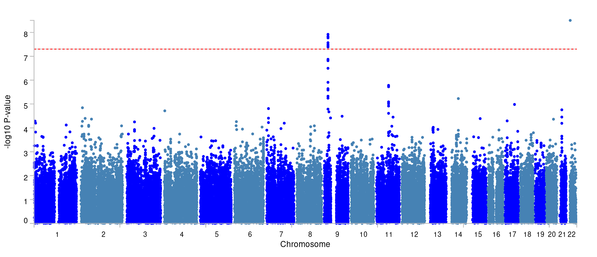

You can find more about the two loci under 'Summary of results. 

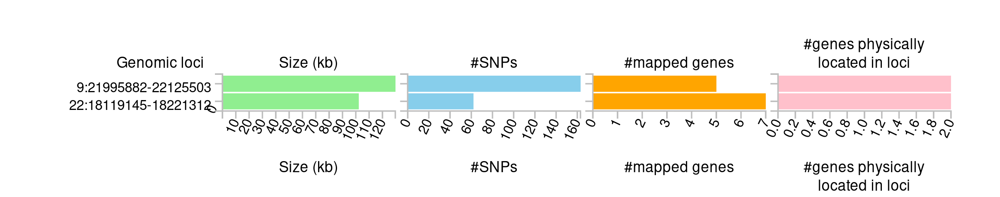

Under the 'Results' heading on the `FUMA` website you can find much more, such as the main 'Genomic risk loci', but also the 'lead SNPs' and the 'Ind. Sig. SNPs' (the independent significant SNPs. The 'lead SNPs' are the same as we found through _clumping_ with `PLINK`. The 'Ind. Sig. SNPs' are the SNPs that are independent (from the other) and significant. 

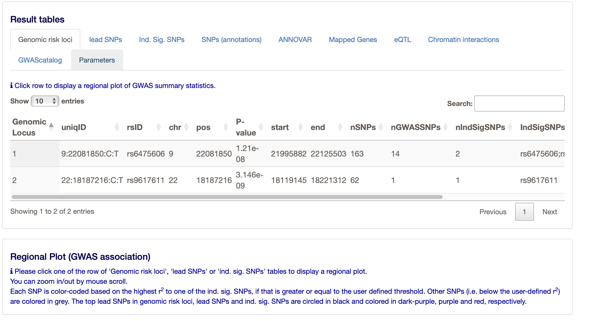

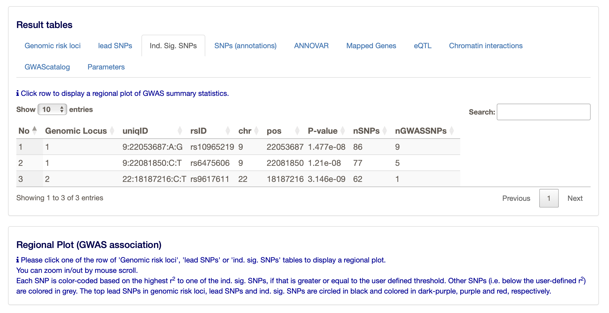

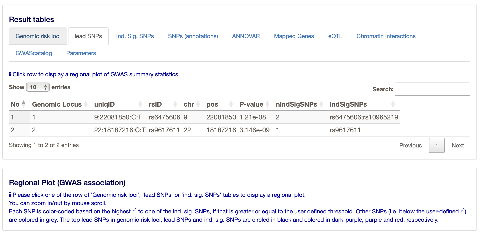

> 2. What do the results of MAGMA (the gene-based test) look like and how many genes pass the threshold of multiple testing correction?

You can find the results of the gene-based test under 'Genome-wide plots'.

The region at chromosome 9 is significant, and you can see that a few genes reach the significance threshold. The latter is determined by the Bonferroni correction based on the number of genes tested.

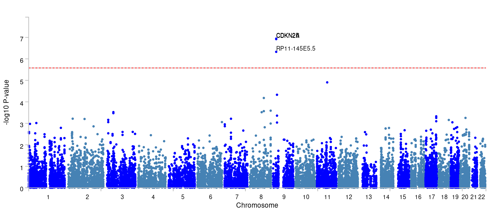

> 3. How many loci were mapped?

Two. 

> 4. How many genes were physically located and how many were mapped to these loci?

There are 12 genes mapped to the loci. 

> 5. Do you think all loci are 'correct', _i.e._ do you 'believe' all the signals looking at the mapping results? Why?

The results from chromosome may be a bit dubious, as there is only 1 variant reaching genome-wide significance. The results from chromosome 9 are more convincing, as there are multiple variants reaching genome-wide significance.
All the genes are in physical proximity and they are protein coding. Some have an expression quantitative trait locus (eQTL), but other than that there is no additional information.

> 6. For what tissues are the signals enriched?

There is no enrichment in any tissue. However, most enrichment is found in the ovaries - which is strange in the context of coronary artery disease; unless it is related to a specific process. For instance, the ovaries may be very well perfused and the genes may be involved in angiogenesis. The next 'best' tissue are the blood vessels, which is more plausible in the context of CAD.

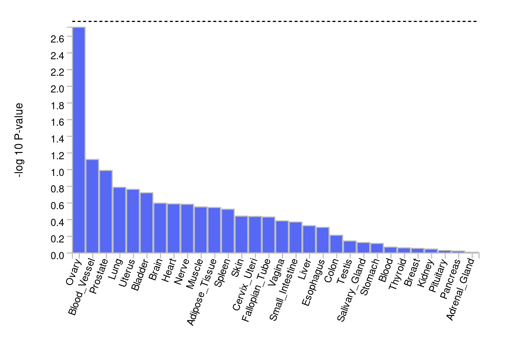

> 7. Are there any chromatin interactions discovered?

Yes, for both chromosome 9 and 22. The 'circos' plots only show genes mapped as eQTL and/or by chromatin interactions. If the gene is mapped only by chromatin interactions or only by eQTLs, it is colored orange or green, respectively. When the gene is mapped by both, it is colored red.

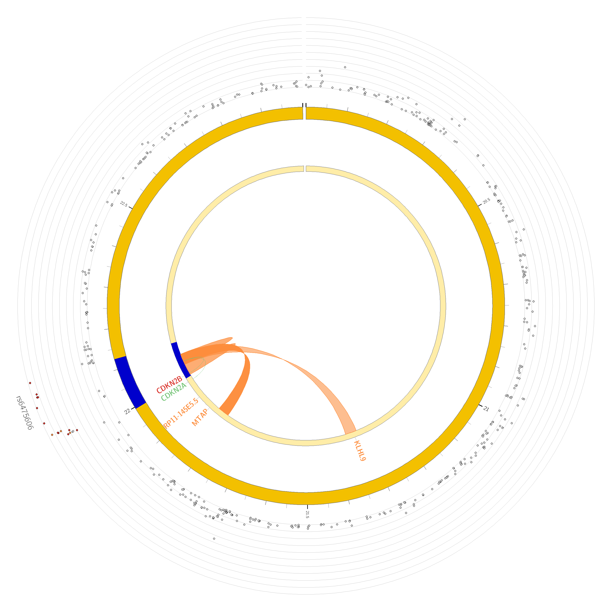

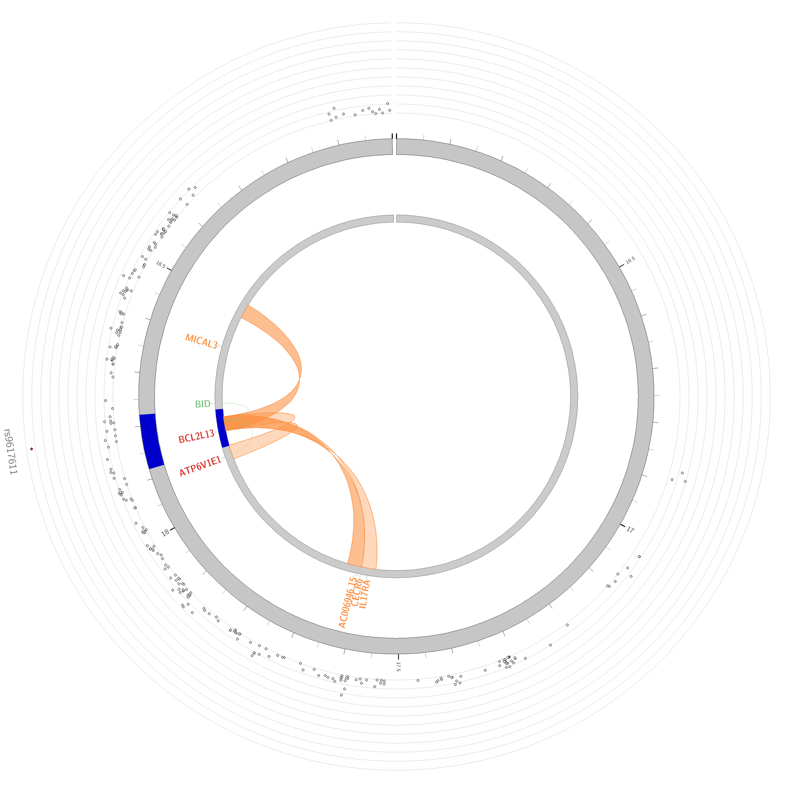


> Questions
> 
> 1. What genes show the lowest expression across tissues?
> 2. And what genes the highest?

You can answer these questions when you run `GENE2FUNCTION`. You can then review which of the mapped genes is expressed most in which tissue, and look at their role in relation to pathways. This may be informative for overall conclusions. 

_ATP6V1E1_ is most expressed across all included tissues. _CECR6_ is among the least expressed genes.

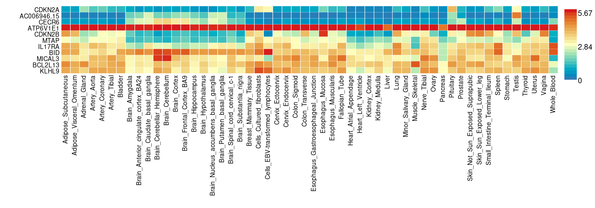

> 3. For what pathways are the signals enriched?

_CDKN2A_ and _CDKN2B_ are most enriched in the 'Cell cycle' pathway.

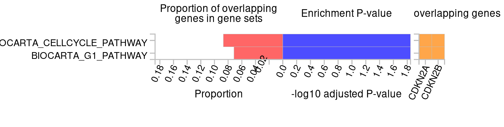

> 4. What molecular functions are mapped to the signals?

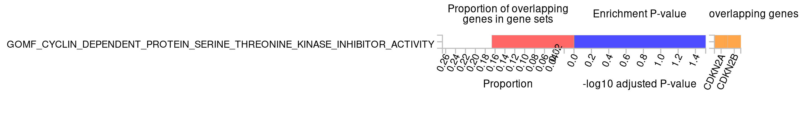

Again _CDKN2A_ and _CDKN2B_ are most enriched and involved in a cyclin dependent protein serine-threonine kinase inhibitor activity. 

## Chapter 5.5: PheWAS

> *Assignment*
> 
> 1. Perform a PheWAS with a few of the resources and your favorite SNP from this tutorial. 
> 2. Compare the different websites. What do you notice?

Some websites report different phenotypes, but most of them report the same. Some website use the subsets of the same datasets, or they use different datasets altogether. The results are similar across different websites and datasets. Usually these datasets are FinnGen, UKBiobank and likewise large biobanks..

> 3. How is a PheWAS informative?

It can tell you something about the pleiotropic effects of a variant or gene. It can also tell you something about the underlying biology of a variant. A variant associated to CAD could also be associated to T2D, which could be due to the fact that the variant is involved in glucose metabolism.

## Chapter 5.7: TwoSample MR

> Question: What is the causal effect of T2D on CAD? Can you describe this using the knowledge from the lecture and the results in the table.

> Question: What do the results of the heterogeneity and pleiotropy tests tell you?

> Question: What do the results of the single SNP and leave-one-out analyses tell you?

> Question: What do you see in the scatter plot? And what can you conclude from this?

> Question: What do you see in the forest plot? And what can you conclude from this?

> Question: What does a leave-one-out ploy tell you? And what can you conclude from this?

> Question: Why would yoy use a funnel plot? And what can it tell you?

> Question: What are your main conclusions from the MR analysis?


```{js, echo = FALSE}
title=document.getElementById('header');
title.innerHTML = '' + title.innerHTML
```
