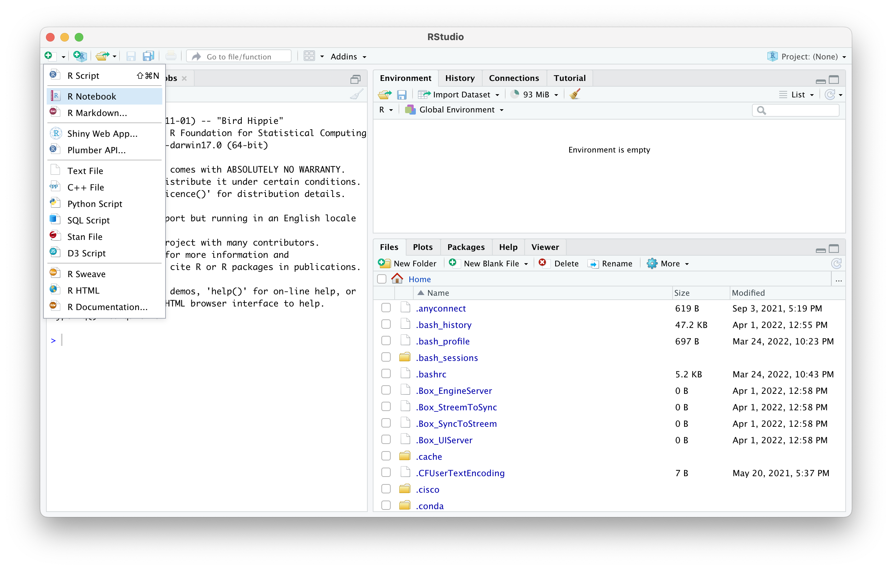
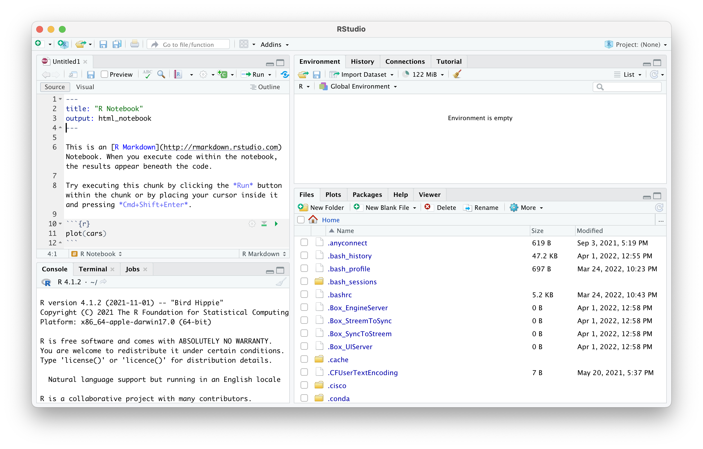

--- 
title: "A Practical Primer in Human Complex Genetics"
subtitle: "with a use-case in cardiovascular disease"
author: "[dr. Sander W. van der Laan](https://vanderlaanand.science) [{width=2.5%}](https://www.twitter.com/swvanderlaan) [{width=2.5%}](mailto:s.w.vanderlaan@gmail.com)"
date: "Version 2.0.0 | last update: `r Sys.Date()`"
description: This is a practical primer in human complex genetics with a use-case in cardiovascular disease. The output format for this primer is bookdown::gitbook.
documentclass: book
github-repo: swvanderlaan/A_Practical_Primer_in_Human_Complex_Genetics
link-citations: yes
bibliography:
- bibliography/book.bib
- bibliography/packages.bib
site: bookdown::bookdown_site
biblio-style: apalike
output:
  html_document: 
    number_sections: yes
    toc: yes
    theme: paper
    fig_caption: yes
  pdf_document:
    number_sections: true
always_allow_html: true
---

# About this primer


## Introduction

Welcome to the _A primer in Human Cardiovascular Genetics_. In contemporary health research, genetic association studies hold significant sway. Researchers delve into genome-wide association studies, aiming to unveil genetic variations linked to both ongoing traits and diseases. These findings serve as crucial keys to unravel the intricate mechanisms underlying diseases, shedding light on whether the correlations identified in observational studies between risk factors and diseases are truly causal.

This [GitBook](https://cjvanlissa.github.io/gitbook-demo/){target="_blank"} was written for the **Genetic Epidemiology** course organized by the [Master Epidemiology](https://epidemiology-education.nl){target="_blank"} of Utrecht University. This practical guide will teach you how to perform quality control (QC), execute a genome-wide association study (GWAS), annotate the GWAS results, and perform further downstream analyses. In the end, we will use data from the first release of the [*Welcome Trust Case-Control Consortium (WTCCC)*](https://www.wtccc.org.uk/ccc1/overview.html){target="_blank"} focusing on coronary artery disease (CAD). 

A major component of modern-day GWAS is [genetic imputation](https://www.nature.com/articles/nrg2796){target="_blank"}, for practical reasons it is not part of the course. However, I will provide some pointers as to how to do this with minimal coding/scripting experience. Likewise, the courses does not cover the aspects of meta-analyses of GWAS, but some excellent resources exist which I will cover. In future versions, these topics might be added. 

While genetic imputation, a major component of modern GWAS, is not explicitly covered in the course due to practical constraints, I will provide some pointers on navigating this process with minimal coding or scripting experience. Likewise, the various aspects of meta-analyses of GWAS are beyond the scope of the course, but fear not, I will direct you some towards excellent resources for further exploration. As this practical guide evolves, these and other topics may find their place within this book.

Though originally crafted as a companion for the course, this guide stands on its own as a comprehensive resource for diving into all facets of GWAS—save for experimental follow-up, of course 😉.


## Background reading

Large parts of this work are based on four awesome Nature Protocols from the [Zondervan group](https://www.well.ox.ac.uk/research/research-groups/zondervan-group){target="_blank"} at the Wellcome Center Human Genetics.

1. [Zondervan KT _et al._ *Designing candidate gene and genome-wide case-control association studies.* Nat Protoc 2007.](https://www.ncbi.nlm.nih.gov/pubmed/17947991){target="_blank"}
2. [Pettersson FH _et al._ *Marker selection for genetic case-control association studies.* Nat Protoc 2009.](https://www.ncbi.nlm.nih.gov/pubmed/19390530){target="_blank"}
3. [Anderson CA _et al._ *Data QC in genetic case-control association studies.* Nat Protoc 2010.](https://www.ncbi.nlm.nih.gov/pubmed/21085122){target="_blank"}
4. [Clarke GM _et al._ *Basic statistical analysis in genetic case-control studies.* Nat Protoc 2011.](https://www.ncbi.nlm.nih.gov/pubmed/21293453){target="_blank"}

An update on the community standards of QC for GWAS can be found here:

1. [Laurie CC _et al._ *Quality control and quality assurance in genotypic data for genome-wide association studies.* Genet Epidemiol 2010.](https://www.ncbi.nlm.nih.gov/pubmed/20718045){target="_blank"}

With respect to imputation and meta-analyses of GWAS you should also get familiar with the following two works:

1. [Marchini, J. and Howie, B. *Genotype imputation for genome-wide association studies.* Nat Rev Genet 2010](https://doi.org/10.1038/nrg2796){target="_blank"}
2. [de Bakker PIW _et al._ *Practical aspects of imputation-driven meta-analysis of genome-wide association studies.* Hum Mol Genet 2008.](https://www.ncbi.nlm.nih.gov/pubmed/18852200){target="_blank"}
3. [Winkler TW _et al._ *Quality control and conduct of genome-wide association meta-analyses.* Nat Protoc 2014.](https://www.ncbi.nlm.nih.gov/pubmed/24762786){target="_blank"}


## Final thoughts

I can imagine this seems overwhelming, but trust me, you'll be okay. Just follow this practical. You'll learn by doing and at the end of the day, you can execute a GWAS independently.

**Ready to start?**

Your first point of action is to prepare your system for this course in Chapter \@ref(prerequisites).


<!--chapter:end:index.Rmd-->

# Prerequisites

```{r prerequisites, message = FALSE, warning = FALSE, echo = FALSE, eval = TRUE}
source("scripts/functions.R")
source("scripts/colors.R")
source("scripts/packages.R")

```

## Linux, macOS, and Windows

Most programs made to execute genetic epidemiology studies are developed for the Unix environment, for example Linux and macOS. So, they may not work as intended in a Windows environment. Windows does allow users to install a linux subsystem within Windows 10 and you can find the detail [guide](https://docs.microsoft.com/en-us/windows/wsl/about){target="_blank"} here.  

However, I highly recommend one of two options. One, install a linux subsystem on your Windows computer (for example [a virtual machine with Ubuntu could work](https://blog.storagecraft.com/the-dead-simple-guide-to-installing-a-linux-virtual-machine-on-windows/){target="_blank"}). Two, switch to macOS in combination with [homebrew](https://brew.sh){target="_blank"}. This will give you all the flexibility to use Unix-based programs for your genetic epidemiology work and at the same time you'll keep the advantage of a powerful computer with a user-friendly interface.

> For this practical every command is intended for Linux/macOS, in other words Unix-systems.


## Programs you need

You need few programs for this practical, or for your (future) genetic epidemiology work for that matter (Table \@ref(tab:programs)).

```{r load-programs, eval = TRUE, echo = FALSE}

programs <- openxlsx::read.xlsx("information.xlsx", sheet = "Programs")

```


```{r programs, tidy = FALSE, eval = TRUE, echo = FALSE}
knitr::kable(
  programs,
  caption = 'Programs needed for genetic epidemiology.',
  # align = ,
  booktabs = FALSE
)

# ft <- flextable(
#   programs,
#   # col_keys = names(data),
#   # cwidth = 0.75,
#   # cheight = 0.25,
#   # defaults = list(),
#   theme_fun = theme_booktabs
# )

# set_table_properties(ft, width = 1, layout = "autofit")

# fit_to_width(ft, max_width = 50)

# autofit(ft, add_w = 0, add_h = 0)

```

### RStudio

RStudio is a very user-friendly interface around R that makes your R-scripting-life a lot easier. You should get used to that. 
We have a clean installation of Ubuntu in our VirtualMachine with full administrator rights. Let's start by installing RStudio. On your VirtualMachine go to the website of [RStudio](https://www.rstudio.com/products/rstudio/download/#download){target="_blank"} and select the right installer (`Ubuntu 18+/Debian 10+`), it should be name something like `rstudio-2022.02.1-461-amd64.deb`. 

Double click the file after download (it's probably on the Desktop or the Download folder) and follow the instructions. 

RStudio comes with R so you don't have to worry about that.


### PLINK
Right, onto PLINK. 

All genetic analyses can be done in PLINK, even on your laptop, but with large datasets, for example [UK Biobank](https://www.ukbiobank.ac.uk){target="_blank"} size, it is better to switch to a [high-performance computing cluster](https://en.wikipedia.org/wiki/High-performance_computing){target="_blank"} like we have available at the [Utrecht Science Park](https://wiki.bioinformatics.umcutrecht.nl/bin/view/HPC/WebHome){target="_blank"}. The original PLINK v1.07 can be found [here](https://zzz.bwh.harvard.edu/plink/index.shtml){target="_blank"}, but nowadays we are using a newer, faster version: PLINK v1.9 which can be found [here](https://www.cog-genomics.org/plink2){target="_blank"}.

You should be downloading the Linux 64-bits version indicated with the blue arrow in Figure \@ref(fig:plink)

```{r plink, fig.align='center', fig.cap='The PLINK v1.9 website.', fig.show = TRUE, echo=FALSE, eval=TRUE, warning=FALSE, message=FALSE}
knitr::include_graphics("img/plink.png")

```

You'll download a zip-file containing PLINK to the Downloads folder, or the Desktop. If all is fine, you should be able to double click the `.zip`-file and it will unpack there and then. 

### Alternatives to PLINK

Nowadays, a lot of people also use programs like [SNPTEST](snptest){target="_blank"}, [BOLT-LMM](https://data.broadinstitute.org/alkesgroup/BOLT-LMM/){target="_blank"},  [GCTA](http://cnsgenomics.com/software/gcta/#Overview){target="_blank"}, or [regenie](https://rgcgithub.github.io/regenie/){target="_blank"} as alternatives to execute GWAS and downstream analyses, for example heritability estimation, Fst-calculation, and so on.

### Other programs

Mendelian randomization can be done either with the [SMR](http://cnsgenomics.com/software/smr/#Overview){target="_blank"} or [GSMR](http://cnsgenomics.com/software/gsmr/){target="_blank"} function from GCTA, or with R-packages, like [`TwoSampleMR`](https://mrcieu.github.io/TwoSampleMR/){target="_blank"}.


## The Terminal

For all the above programs, except RStudio, you will need the `Terminal`. This comes with every major operating system; on Windows it is called 'PowerShell', but let's not go there. And regardless, you will (have to start to) make your own scripts. The benefit of using scripts is that each step in your workflow is clearly stipulated and annotated, and it allows for greater reproducibility, easier troubleshooting, and scaling up to high-performance computer clusters.

Open the terminal, it should be on the left in the toolbar as a little black computer-monitor-like icon. 
Mac users can type `command + space` and type `terminal`, a terminal screen should open.

> From now on we will use little code blocks like the example to indicate a code you should type/copy-paste and hit enter. If a code is followed by a comment, it is indicated by a # - you don't need to copy-paste and execute this.


```
CODE BLOCK

CODE BLOCK # some comment here

```

### Download the data

First, let's start by downloading the data you need for this course to your Desktop. 


Alternatively, you could do this through this command. This will create a directory on your Desktop with the command `mkdir`. The `-v` flag indicates the program should be _verbose_, meaning it should tell you what it is doing.

```
mkdir -v ~/Desktop/practical/
```

Now, pay attention. There are three downloads. You will need to _first_ for starters, but I leave all three downloads here for future reference. Don't worry, the links will come back in other chapters too. 

First, start with downloading the first dataset (approx. 610Mb), below:

https://www.dropbox.com/sh/kumfwm7drt2flhp/AAB5n0OcUvJixI9pNiymx6-La?dl=0

Make sure you put the data in the `~/Desktop/practical/` folder.

<!-- ``` -->
<!-- wget "https://www.dropbox.com/sh/kumfwm7drt2flhp/AAB5n0OcUvJixI9pNiymx6-La?dl=0" -P ~/Desktop/practical/ -->
<!-- ``` -->

You'll end the course with the second dataset (approx. 750Mb). Here's the link:

https://www.dropbox.com/sh/iu9rkvnoiwxnzdb/AACkd-7E1-MywkQalo0b4wAda?dl=0 

Make sure you put the data in the `~/Desktop/practical/` folder.

You _may_ need the third dataset _depending on the availability of a program_, which you can download through the link below (approx. 11Gb). **Don't download it now.** 

https://www.dropbox.com/sh/c6h5p7c63dkh11k/AAACPlG_tuNgSqnwq3EQGF2Ja?dl=0 

Make sure you put the data in the `~/Desktop/practical/ref_1kg_phase1_all/` folder.

This will take a minute or two depending on your internet connection. Time to stretch your legs or grab a coffee (data scientists don't drink tea). 
Oh, and the links are set to expire. 

### Navigating the Terminal

You can navigate around the computer through the terminal by typing `cd <path>`; `cd` stands for "change directory" and <path> means "some_file_directory_you_want_to_go_to".

**For Linux/macOS Users**

_will bring you to your home directory_

```
cd ~ 
```

_will bring you to the parent directory (up one level) _

```
cd ../ 
```

_will bring you to the XXX directory_

```
cd XXX 
```


Let's navigate to the folder you just downloaded.

```
cd ~/Desktop/practical
```


Let's check out what is inside the directory, by listing (`ls`) its contents.


```
ls -lh
```


**For Linux/macOS Users**

_shows files as list_

```
ls -l 
```

_shows files as list with human readable format _

```
ls -lh 
```

_shows the files as list sorted by time edited_

```
ls -lt 
```

_shows the files as list sorted by size_
```
ls -lS 
```

Adding the flags `-lh` will get you the contents of a directory in a list (`-l`) and make the size 'human-readable' (`-h`).


You can also count the number of files.

```
ls | wc -l
```

And if you want to know all the function of a program simply type the following.

```
man ls
```

This will take you to a manual of the program with an extensive description of each flag (Figure \@ref(fig:ls-manual)).

```{r ls-manual, fig.align='center', fig.cap='Partial output from the ls-manual.', fig.show = TRUE, echo=FALSE, eval=TRUE, warning=FALSE, message=FALSE}
knitr::include_graphics("img/ls_manual.png")

```

We also want to copy `plink` to that practical folder. 

```
cp -v ~/Downloads/plink/plink ~/Desktop/practical/plink 

```

## Installing some R packages

I tested this VirtualMachine and everything should be fine, except some libraries weren't there. We need to install them.


To be able to install certain `r`-packages, we need to install some Linux (Ubuntu) software. Type the following:

```
sudo apt-get install libcurl4 libcurl4-openssl-dev -y

sudo apt-get install libssl-dev
```

Now close the terminal window - really making sure that the terminal-program has quit.

Open your fresh installation of RStudio by double clicking the icon. You should be seeing something like figure \@ref(fig:rstudio-screenshot)

```{r rstudio-screenshot, fig.align='center', fig.cap='RStudio screenshot.', fig.show = TRUE, echo=FALSE, eval=TRUE, warning=FALSE, message=FALSE}
knitr::include_graphics("img/rstudio-screenshot.png")

```


In the top right, you see a little green-white plus-sign, click this and select 'R Notebook' (Figure \@ref(fig:rstudio-screenshot-create-notebook)). 

```{r rstudio-screenshot-create-notebook, fig.align='center', fig.cap='RStudio screenshot.', fig.show = TRUE, echo=FALSE, eval=TRUE, warning=FALSE, message=FALSE}


```

You will create an untitled (`Untitled1`) `R` notebook: you can combine text descriptions, like you would in a lab-journal, with code-sections. Read what is in the notebook to get a grasp on that (Figure \@ref(fig:rstudio-screenshot-notebook)). 

```{r rstudio-screenshot-notebook, fig.align='center', fig.cap='RStudio screenshot.', fig.show = TRUE, echo=FALSE, eval=TRUE, warning=FALSE, message=FALSE}


```

Right, you should be installing some packages. To do so, you can remove `plot(cars)` (or leave and create a new code-block as per instructions in the notebook), and copy paste the code below. 
```{r install-prereq, eval = FALSE, echo = TRUE}
install.packages(c("httr", "usethis", "data.table", "devtools", 
                   "qqman", "CMplot", "plotly", 
                   "dplyr", "tibble", "openxlsx"))
devtools::install_github("kassambara/ggpubr")
devtools::install_github("oliviasabik/RACER")
```

You should load these packages too. 

```{r library-prereq, eval = FALSE, echo = TRUE}
library("ggpubr")
library("httr")
library("usethis")
library("data.table")
library("devtools")
library("qqman")
library("CMplot")
library("tibble")
library("plotly")
library("dplyr")
library("openxlsx")
library("RACER")
```

All in all this may take some time, good moment to relax, review your notes, stretch your legs, or take a coffee.


## Are you ready?

Are you ready? Did you bring coffee and a good dose of energy? Let's start! 

Oh, one more thing: you can save your notebook, the one you just created, to keep all the `R` codes you are applying in the next chapters and add descriptions and notes. If you save this notebook you'll notice that a `html`-file is created. This file is a legible webbrowser-friendly version of your work and contains the codes and the output (code messages, tables, and figures). And the nice thing is, that you can easily share it with others over email. 

Ok. 'Nough said, let's move on to cover some basics in Chapter \@ref(gwas-basics).

<!--chapter:end:chapters/02_prerequisites.Rmd-->

# Licenses and disclaimers {#license}

<!-- In the spirit of Open Science, it is good to think about making your course materials Open Source. That means that other people can use them. In principle, if you publish materials online without license information, you hold the copyright to those materials. If you want them to be Open Source, you must include a license. It is not always obvious what license to choose. -->

<!-- The Creative Commons licenses are typically suitable for course materials. This GitBook, for example, is licensed under CC-BY 4.0. That means you can use and remix it as you like, but you must credit the original source. -->

<!-- If your project is more focused on software or source code, consider using the [GNU GPL v3 license](https://www.gnu.org/licenses/gpl-3.0.en.html) instead.  -->

<!-- You can find [more information about the Creative Commons Licenses here](https://creativecommons.org/share-your-work/licensing-examples). Specific licenses that might be useful are: -->

<!-- * [CC0 ("No Rights Reserved")](https://creativecommons.org/share-your-work/public-domain/cc0/), everybody can do what they want with your work. -->
<!-- * [CC-BY 4.0 ("Attribution")](https://creativecommons.org/licenses/by/4.0/), everybody can do what they want with your work, but they must credit you. Note that this license may not be suitable for software or source code! -->


<!-- For compatibility between CC and GNU licenses, see [this FAQ](https://creativecommons.org/faq/#Can_I_apply_a_Creative_Commons_license_to_software.3F). -->

## Copyright

This book and all its material ("content") is protected by copyright under Dutch Copyright laws and is the property of the author or the party credited as the provider of the content. You may not copy, reproduce, distribute, publish, display, perform, modify, create derivative works, transmit, or in any way exploit any such content, nor may you distribute any part of this content over any network, including a local area network, sell or offer it for sale, or use such content to construct any kind of database. You may not alter or remove any copyright or other notice from copies of the content on this website. Copying or storing any content except as provided above is expressly prohibited without prior written permission of the author or the copyright holder identified in the individual content’s copyright notice. For permission to use this content, please contact the author.

## Disclaimer

The content contained herein is provided only for educational and informational purposes or as required by Dutch law. The author attempted to ensure that content is accurate and obtained from reliable sources, but does not represent it to be error-free. The author may add, amend or repeal any text, procedure or regulation, and failure to timely post such changes to this book shall not be construed as a waiver of enforcement. The author does not warrant that any functions on this website or the contents and references herein will be uninterrupted, that defects will be corrected, or that this website or the contents and references will be free from viruses or other harmful components. Any links to third party information on the author’s website are provided as a courtesy and do not constitute an endorsement of those materials or the third party providing them.

<!--chapter:end:chapters/licenses.Rmd-->

`r if (knitr:::is_html_output()) '
# References {-}
'`

<!--chapter:end:chapters/references.Rmd-->

