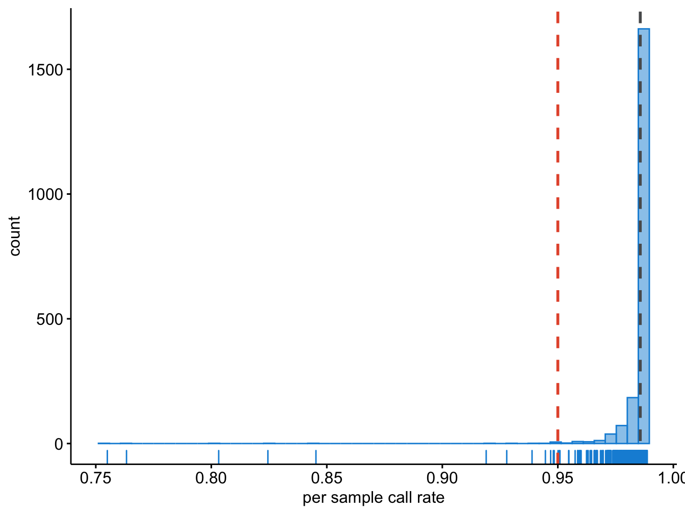
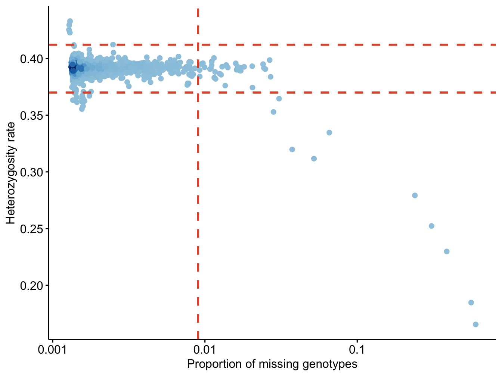
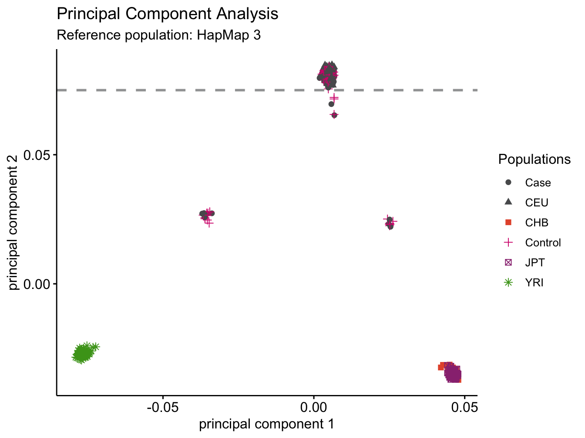
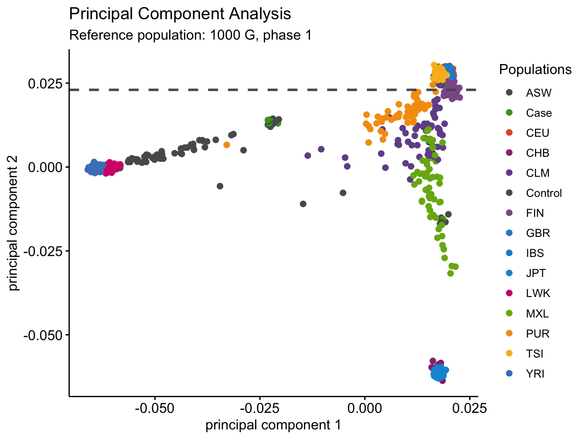
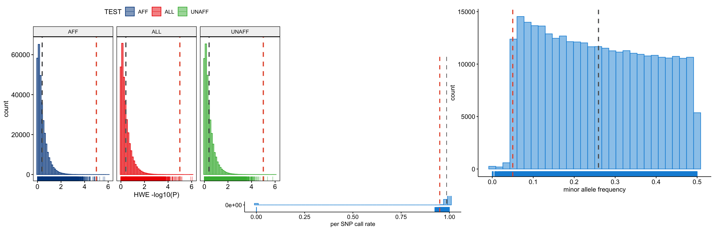

--- 
title: "A Practical Primer in Human Complex Genetics"
subtitle: "with a use-case in cardiovascular disease"
author: "[dr. Sander W. van der Laan](https://swvanderlaan.github.iio) [{width=2.5%}](https://www.twitter.com/swvanderlaan) [{width=2.5%}](mailto:s.w.vanderlaan@gmail.com)"
date: "Version 1.0.0beta | last update: `r Sys.Date()`"
description: This is a practical primer in human complex genetics with a use-case in cardiovascular disease. The output format for this primer is bookdown::gitbook.
documentclass: book
github-repo: swvanderlaan/A_Practical_Primer_in_Human_Complex_Genetics
link-citations: yes
bibliography:
- book.bib
- packages.bib
site: bookdown::bookdown_site
biblio-style: apalike
output:
  html_document: 
    number_sections: yes
    toc: yes
    theme: paper
    fig_caption: yes
  pdf_document:
    number_sections: true
always_allow_html: true
---

# About this primer


## Introduction

Welcome to the _A primer in Human Cardiovascular Genetics_ as part of the **Genetic Epidemiology** course. In the next few days we will use this [GitBook](https://cjvanlissa.github.io/gitbook-demo/) to perform quality control (QC), executing a genome-wide association study (GWAS), annotating the GWAS results, and performing further downstream analyses. We will use data from the first release of the [*Welcome Trust Case-Control Consortium (WTCCC)*](https://www.wtccc.org.uk/ccc1/overview.html){target="_blank"} and focus on coronary artery disease (CAD). 

Unfortunately, during this course there is no time to perform [imputation](https://www.nature.com/articles/nrg2796), but I will provide some pointers during the course as to how to do this with minimal coding/scripting experience. Likewise, this practical does not cover the aspects of meta-analyses of GWAS. But rest assured, I will add chapters on these subjects to a future version. 


## Background reading

Part of this is based on four great Nature Protocols from the [Zondervan group](https://www.well.ox.ac.uk/research/research-groups/zondervan-group){target="_blank"} at the Wellcome Center Human Genetics.

1. [Zondervan KT _et al._ *Designing candidate gene and genome-wide case-control association studies.* Nat Protoc 2007.](https://www.ncbi.nlm.nih.gov/pubmed/17947991){target="_blank"}
2. [Pettersson FH _et al._ *Marker selection for genetic case-control association studies.* Nat Protoc 2009.](https://www.ncbi.nlm.nih.gov/pubmed/19390530){target="_blank"}
3. [Anderson CA _et al._ *Data QC in genetic case-control association studies.* Nat Protoc 2010.](https://www.ncbi.nlm.nih.gov/pubmed/21085122){target="_blank"}
4. [Clarke GM _et al._ *Basic statistical analysis in genetic case-control studies.* Nat Protoc 2011.](https://www.ncbi.nlm.nih.gov/pubmed/21293453){target="_blank"}

An update on the community standards of QC for GWAS can be found here:

1. [Laurie CC _et al._ *Quality control and quality assurance in genotypic data for genome-wide association studies.* Genet Epidemiol 2010.](https://www.ncbi.nlm.nih.gov/pubmed/20718045){target="_blank"}

With respect to imputation you should also get familiar with the following two works:

1. [Marchini, J. and Howie, B. *Genotype imputation for genome-wide association studies.* Nat Rev Genet 2010](https://doi.org/10.1038/nrg2796){target="_blank"}
2. [de Bakker PIW _et al._ *Practical aspects of imputation-driven meta-analysis of genome-wide association studies.* Hum Mol Genet 2008.](https://www.ncbi.nlm.nih.gov/pubmed/18852200){target="_blank"}
3. [Winkler TW _et al._ *Quality control and conduct of genome-wide association meta-analyses.* Nat Protoc 2014.](https://www.ncbi.nlm.nih.gov/pubmed/24762786){target="_blank"}


## Meet the Team

We work with a team of enthusiastic lecturers with experience in bioinformatics, GWAS, genetic analyses, Mendelian randomization, and epidemiology. This year the team consists of:

| | |
|---|---|
| {width=15%}</br>Sander W. van der Laan</br>_Assistant professor_</br>Course coordinator</br><s.w.vanderlaan-2@umcutrecht.nl> \| [swvanderlaan](http://www.twitter.com/swvanderlaan){target="_blank"} |  |
| {width=15%}</br>N. Charlotte Onland-Moret</br>_Associate Professor_</br><N.C.Onland@umcutrecht.nl> \| [nconland](http://www.twitter.com/nconland){target="_blank"} | {width=15%}</br>Jessica van Setten</br>_Assistant professor_</br><j.vansetten@umcutrecht.nl> \| [j_vansetten](http://www.twitter.com/j_vansetten){target="_blank"} |
| {width=15%}</br>Marion van Vugt</br>_PhD student_</br><M.vanVugt-2@umcutrecht.nl> \| [MarionVugt](http://www.twitter.com/MarionVugt){target="_blank"} | {width=15%}</br>Kristel van Eijk</br>_Bioinformatician_</br><K.vanEijk-2@umcutrecht.nl> |
| {width=15%}</br>Sanne A.E. Peters</br>_Associate professor_</br><s.a.e.peters@umcutrecht.nl> \| [saepeters](http://www.twitter.com/saepeters){target="_blank"} | {width=15%}</br>Bas T. Heijmans</br>_Professor_</br><b.t.heijmans@lumc.nl> |

<!-- {width=15%}</br> -->
<!-- Sander W. van der Laan</br> -->
<!-- _Assistant professor_</br> -->
<!-- Course coordinator</br> -->
<!-- <s.w.vanderlaan-2@umcutrecht.nl> \| [swvanderlaan](http://www.twitter.com/swvanderlaan){target="_blank"} -->

<!-- {width=15%}</br> -->
<!-- Charlotte Onland-Moret</br> -->
<!-- _Associate Professor_</br> -->
<!-- <N.C.Onland@umcutrecht.nl> \| [nconland](http://www.twitter.com/nconland){target="_blank"} -->

<!-- {width=15%}</br> -->
<!-- Jessica van Setten</br> -->
<!-- _Assistant professor_</br> -->
<!-- <j.vansetten@umcutrecht.nl> \| [j_vansetten](http://www.twitter.com/j_vansetten){target="_blank"} -->

<!-- {width=15%}</br> -->
<!-- Marion van Vugt</br> -->
<!-- _PhD student_</br> -->
<!-- <M.vanVugt-2@umcutrecht.nl> \| [MarionVugt](http://www.twitter.com/MarionVugt){target="_blank"} -->

<!-- {width=15%}</br> -->
<!-- Kristel van Eijk</br> -->
<!-- _Bioinformatician_</br> -->
<!-- <K.vanEijk-2@umcutrecht.nl> -->


## Final thoughts

I can imagine this seems overwhelming, but trust me, you'll be okay. Just follow this practical, but also work on the questions asked during the lectures and in this practical. You'll learn by doing and at the end of the day, you can execute a GWAS independently.

**Ready to start?**

Your first point of action is to prepare your system for this course in Chapter \@ref(prerequisites).


<!--chapter:end:index.Rmd-->

# Prerequisites

```{r prerequisites, message = FALSE, warning = FALSE, echo = FALSE, eval = TRUE}
source("scripts/functions.R")
source("scripts/colors.R")
source("scripts/packages.R")

```
## Linux, macOS, and Windows

Most programs made to execute genetic epidemiology studies are developed for the Unix environment, for example Linux and macOS. So, they may not work as intended in a Windows environment. Windows does allow users to install a linux subsystem within Windows 10 and you can find the detail [guide](https://docs.microsoft.com/en-us/windows/wsl/about){target="_blank"} here.  

However, I highly recommend to 1) either install a linux subsystem on your Windows computer (for example [a virtual machine with Ubuntu could work](https://blog.storagecraft.com/the-dead-simple-guide-to-installing-a-linux-virtual-machine-on-windows/){target="_blank"}), or 2) switch to macOS in combination with [homebrew](https://brew.sh){target="_blank"}. This will give you all the flexibility to use Unix-based programs for your genetic epidemiology work and at the same time you'll keep the advantage of a powerful computer with a user-friendly interface (either Windows or macOS).

> For this practical we use a Windows laptop with Ubuntu on a VirtualMachine. Therefore every command is intended for Linux/macOS, in other words Unix-systems.


## Programs you need

You need few programs for this practical, or for your (future) genetic epidemiology work for that matter (Table \@ref(tab:programs)).

```{r load-programs, eval = TRUE, echo = FALSE}

programs <- openxlsx::read.xlsx("information.xlsx", sheet = "Programs")

```


```{r programs, tidy = FALSE, eval = TRUE, echo = FALSE}
knitr::kable(
  programs,
  caption = 'Programs needed for genetic epidemiology.',
  # align = ,
  booktabs = FALSE
)

# ft <- flextable(
#   programs,
#   # col_keys = names(data),
#   # cwidth = 0.75,
#   # cheight = 0.25,
#   # defaults = list(),
#   theme_fun = theme_booktabs
# )

# set_table_properties(ft, width = 1, layout = "autofit")

# fit_to_width(ft, max_width = 50)

# autofit(ft, add_w = 0, add_h = 0)

```

### RStudio

RStudio is a very user-friendly interface around R that makes your R-scripting-life a lot easier. You should get used to that. 
We have a clean installation of Ubuntu in our VirtualMachine with full administrator rights. Let's start by installing RStudio. On your VirtualMachine go to the website of [RStudio](https://www.rstudio.com/products/rstudio/download/#download){target="_blank"} and select the right installer (`Ubuntu 18+/Debian 10+`), it should be name something like `rstudio-2022.02.1-461-amd64.deb`. 

Double click the file after download (it's probably on the Desktop or the Download folder) and follow the instructions. 

RStudio comes with R so you don't have to worry about that.


### PLINK
Right, onto PLINK. 

All genetic analyses can be done in PLINK, even on your laptop, but with large datasets, for example [UK Biobank](https://www.ukbiobank.ac.uk){target="_blank"} size, it is better to switch to a [high-performance computing cluster](https://en.wikipedia.org/wiki/High-performance_computing){target="_blank"} like we have available at the [Utrecht Science Park](https://wiki.bioinformatics.umcutrecht.nl/bin/view/HPC/WebHome){target="_blank"}. The original PLINK v1.07 can be found [here](https://zzz.bwh.harvard.edu/plink/index.shtml){target="_blank"}, but nowadays we are using a newer, faster version: PLINK v1.9 which can be found [here](https://www.cog-genomics.org/plink2){target="_blank"}.

You should be downloading the Linux 64-bits version indicated with the blue arrow in Figure \@ref(fig:plink)

```{r plink, fig.align='center', fig.cap='The PLINK v1.9 website.', fig.show = TRUE, echo=FALSE, eval=TRUE, warning=FALSE, message=FALSE}
knitr::include_graphics("img/plink.png")

```

You'll download a zip-file containing PLINK to the Downloads folder, or the Desktop. If all is fine, you should be able to double click the `.zip`-file and it will unpack there and then. 

### Alternatives to PLINK

Nowadays, a lot of people also use programs like [SNPTEST](snptest){target="_blank"}, [BOLT-LMM](https://data.broadinstitute.org/alkesgroup/BOLT-LMM/){target="_blank"},  [GCTA](http://cnsgenomics.com/software/gcta/#Overview){target="_blank"}, or [regenie](https://rgcgithub.github.io/regenie/){target="_blank"} as alternatives to execute GWAS and downstream analyses, for example heritability estimation, Fst-calculation, and so on.

### Other programs

Mendelian randomization can be done either with the [SMR](http://cnsgenomics.com/software/smr/#Overview){target="_blank"} or [GSMR](http://cnsgenomics.com/software/gsmr/){target="_blank"} function from GCTA, or with R-packages, like [`TwoSampleMR`](https://mrcieu.github.io/TwoSampleMR/){target="_blank"}.


## The Terminal

For all the above programs, except RStudio, you will need the `Terminal`. This comes with every major operating system; on Windows it is called 'PowerShell', but let's not go there. And regardless, you will (have to start to) make your own scripts. The benefit of using scripts is that each step in your workflow is clearly stipulated and annotated, and it allows for greater reproducibility, easier troubleshooting, and scaling up to high-performance computer clusters.

Open the terminal, it should be on the left in the toolbar as a little black computer-monitor-like icon. 
Mac users can type `command + space` and type `terminal`, a terminal screen should open.

> From now on we will use little code blocks like the example to indicate a code you should type/copy-paste and hit enter. If a code is followed by a comment, it is indicated by a # - you don't need to copy-paste and execute this.


```
CODE BLOCK

CODE BLOCK # some comment here

```

### Download the data

First, let's start by downloading the data you need for this course to your Desktop. 


Alternatively, you could do this through this command. This will create a directory on your Desktop with the command `mkdir`. The `-v` flag indicates the program should be _verbose_, meaning it should tell you what it is doing.

```
mkdir -v ~/Desktop/practical/
```

Now, pay attention. There are three downloads. You will need to _first_ for starters, but I leave all three downloads here for future reference. Don't worry, the links will come back in other chapters too. 

First, start with downloading the first dataset, below:

https://www.dropbox.com/sh/kumfwm7drt2flhp/AAB5n0OcUvJixI9pNiymx6-La?dl=0

Make sure you put the data in the `~/Desktop/practical/` folder.

<!-- ``` -->
<!-- wget "https://www.dropbox.com/sh/kumfwm7drt2flhp/AAB5n0OcUvJixI9pNiymx6-La?dl=0" -P ~/Desktop/practical/ -->
<!-- ``` -->

You'll end the course with the second dataset. Here's the link:

https://www.dropbox.com/sh/kumfwm7drt2flhp/AAB5n0OcUvJixI9pNiymx6-La?dl=0

Make sure you put the data in the `~/Desktop/practical/` folder.

You _may_ need the third dataset _depending on the availability of a program_, which you can download through the link below. **Don't download it now.** 

https://www.dropbox.com/sh/c6h5p7c63dkh11k/AAACPlG_tuNgSqnwq3EQGF2Ja?dl=0

Make sure you put the data in the `~/Desktop/practical/ref_1kg_phase1_all/` folder.

This will take a minute or two depending on your internet connection. Time to stretch your legs or grab a coffee (data scientists don't drink tea). 
Oh, and the links are set to expire. 

### Navigating the Terminal

You can navigate around the computer through the terminal by typing `cd <path>`; `cd` stands for "change directory" and <path> means "some_file_directory_you_want_to_go_to".

**For Linux/macOS Users**

_will bring you to your home directory_

```
cd ~ 
```

_will bring you to the parent directory (up one level) _

```
cd ../ 
```

_will bring you to the XXX directory_

```
cd XXX 
```


Let's navigate to the folder you just downloaded.

```
cd ~/Desktop/practical
```


Let's check out what is inside the directory, by listing (`ls`) its contents.


```
ls -lh
```


**For Linux/macOS Users**

_shows files as list_

```
ls -l 
```

_shows files as list with human readable format _

```
ls -lh 
```

_shows the files as list sorted by time edited_

```
ls -lt 
```

_shows the files as list sorted by size_
```
ls -lS 
```

Adding the flags `-lh` will get you the contents of a directory in a list (`-l`) and make the size 'human-readable' (`-h`).


You can also count the number of files.

```
ls | wc -l
```

And if you want to know all the function of a program simply type the following.

```
man ls
```

This will take you to a manual of the program with an extensive description of each flag (Figure \@ref(fig:ls-manual)).

```{r ls-manual, fig.align='center', fig.cap='Partial output from the ls-manual.', fig.show = TRUE, echo=FALSE, eval=TRUE, warning=FALSE, message=FALSE}
knitr::include_graphics("img/ls_manual.png")

```

We also want to copy `plink` to that practical folder. 

```
cp -v ~/Downloads/plink/plink ~/Desktop/practical/plink 

```

## Installing some R packages

I tested this VirtualMachine and everything should be fine, except some libraries weren't there. We need to install them.


To be able to install certain `r`-packages, we need to install some Linux (Ubuntu) software. Type the following:

```
sudo apt-get install libcurl4 libcurl4-openssl-dev -y

sudo apt-get install libssl-dev
```

Now close the terminal window - really making sure that the terminal-program has quit.

Open your fresh installation of RStudio by double clicking the icon. You should be seeing something like figure \@ref(fig:rstudio-screenshot)

```{r rstudio-screenshot, fig.align='center', fig.cap='RStudio screenshot.', fig.show = TRUE, echo=FALSE, eval=TRUE, warning=FALSE, message=FALSE}
knitr::include_graphics("img/rstudio-screenshot.png")

```


In the top right, you see a little green-white plus-sign, click this and select 'R Notebook' (Figure \@ref(fig:rstudio-screenshot-create-notebook)). 

```{r rstudio-screenshot-create-notebook, fig.align='center', fig.cap='RStudio screenshot.', fig.show = TRUE, echo=FALSE, eval=TRUE, warning=FALSE, message=FALSE}
knitr::include_graphics("img/rstudio-screenshot-create-notebook.png")

```

You will create an untitled (`Untitled1`) `R` notebook: you can combine text descriptions, like you would in a lab-journal, with code-sections. Read what is in the notebook to get a grasp on that (Figure \@ref(fig:rstudio-screenshot-notebook)). 

```{r rstudio-screenshot-notebook, fig.align='center', fig.cap='RStudio screenshot.', fig.show = TRUE, echo=FALSE, eval=TRUE, warning=FALSE, message=FALSE}
knitr::include_graphics("img/rstudio-screenshot-notebook.png")

```

Right, you should be installing some packages. To do so, you can remove `plot(cars)` (or leave and create a new code-block as per instructions in the notebook), and copy paste the code below. 
```{r install-prereq, eval = FALSE, echo = TRUE}
install.packages(c("httr", "usethis", "data.table", "devtools", 
                   "qqman", "CMplot", "plotly", 
                   "dplyr", "tibble", "openxlsx"))
devtools::install_github("kassambara/ggpubr")
devtools::install_github("oliviasabik/RACER")
```

You should load these packages too. 

```{r library-prereq, eval = FALSE, echo = TRUE}
library("ggpubr")
library("httr")
library("usethis")
library("data.table")
library("devtools")
library("qqman")
library("CMplot")
library("tibble")
library("plotly")
library("dplyr")
library("openxlsx")
library("RACER")
```

All in all this may take some time, good moment to relax, review your notes, stretch your legs, or take a coffee.


## Are you ready?

Are you ready? Did you bring coffee and a good dose of energy? Let's start! 

Oh, one more thing: you can save your notebook, the one you just created, to keep all the `R` codes you are applying in the next chapters and add descriptions and notes. If you save this notebook you'll notice that a `html`-file is created. This file is a legible webbrowser-friendly version of your work and contains the codes and the output (code messages, tables, and figures). And the nice thing is, that you can easily share it with others over email. 

Ok. 'Nough said, let's move on to cover some basics in Chapter \@ref(gwas-basics).

<!--chapter:end:prerequisites.Rmd-->

# Steps in a Genome-Wide Association Study {#gwas-basics}

Now that you understand a bit of the navigation in Unix-systems, we will continue with the practical. We will make use of a dummy dataset containing cases and controls. We will explain and execute the following steps:

1. convert raw data to a more memory-efficient format
2. apply extensive quality control on samples and SNPs
3. assess the ancestral background of your study population
4. perform association testing
5. visualize association results


## Converting datasets

The format in which genotype data are returned to investigators varies among genome-wide SNP platforms and genotyping centers. Usually genotypes have been called by a genotyping center and returned in the standard `PED` and `MAP` file formats. 

A `PED` file is a white space (space or tab)-delimited file in which each line represents one individual and the first six columns are mandatory and in the following order:

- 'Family ID', 
- 'Individual ID', 
- 'Paternal ID', 
- 'Maternal ID', 
- 'Sex (1=male, 2=female, 0=missing)', and 
- 'Phenotype (1=unaffected, 2=affected, 0=missing)'. 

The subsequent columns denote genotypes that can be any character (e.g., 1, 2, 3, 4 or A, C, G, T). Zero denotes a missing genotype. Each SNP must have two alleles (i.e., both alleles are either present or absent). 
The order of SNPs in the PED file is given in the MAP file, in which each line denotes a single marker and the four white-space–separated columns are chromosome (1–22, X, Y or 0 for unplaced), marker name (typically an rs number), genetic distance in Morgans (this can be fixed to 0) and base-pair position (bp units).

Let's start by using `PLINK` to converting the datasets to a lighter, binary form (a `BED`-file). BED files save data in a more memory- and time-efficient manner (binary files) to facilitate the analysis of large-scale data sets [@purcell2007]. PLINK creates a `.log` file (named `raw-GWA-data.log`) that details (among other information) the implemented commands, the number of cases and controls in the input files, any excluded data and the genotyping rate in the remaining data. This file is very useful for checking whether the software is successfully completing commands.


Make sure you are in the right directory. Do you remember how to get there?


```
cd ~/Desktop/practical
```

*No worries for now: I've done this already for you!*

```
plink --file rawdata/raw-GWA-data --make-bed --out rawdata/rawdata
```

## Quality control

We are ready for some quality control and quality assurance, heavily inspired by Anderson _et al._ [@anderson2010] and Laurie _et al._ [@laurie2010]. In general, we should check out a couple of things regarding the data quality on two levels:

1) samples
2) variants

So, we will investigate the following:

- Are the *sexes* based on genetic data matching the ones given by the phenotype file?
- Identify individuals that are outliers in terms of missing data (_call rate_) or heterozygosity rates. This could indicate a genotyping error or sample swap.
- Identify duplicated or related individuals.
- Identify individuals with divergent ancestry.
- What are the allele frequencies?
- What is the per-SNP call rate?
- In the case of a case-control study (which is the case here), we need to check differential missingness between cases and controls. By the way: you could extent this to for instance 'genotyping platform', or 'hospital of inclusion', if you think this might influence the genotyping experiment technically.


## Let's get our hands dirty

All clear? Let's start the work. On to step 1 of the QC for GWAS: filter samples of poor quality in Chapter \@ref(gwas-basics-sample-qc).

<!--chapter:end:gwas_basics.Rmd-->

# Sample QC {#gwas-basics-sample-qc}
{width=70%}
Let's start with the per-sample quality control. 

## Sex
We need to identify of individuals with discordant sex information comparing phenotypic and genotypic data. Let's calculate the mean homozygosity rate across X-chromosome markers for each individual in the study.

```
plink --bfile rawdata/rawdata --check-sex --out rawdata/rawdata
```

This produces a file with the following columns:

- _FID_	Family ID
- _IID_	Within-family ID
- _PEDSEX_	Sex code in input file
- _SNPSEX_	Imputed sex code (1 = male, 2 = female, 0 = unknown)
- _STATUS_	'OK' if PEDSEX and SNPSEX match and are nonzero, 'PROBLEM' otherwise
- _F_	Inbreeding coefficient, considering only X chromosome. Not present with 'y-only'.
- _YCOUNT_	Number of nonmissing genotype calls on Y chromosome. Requires 'ycount'/'y-only'.


We need to get a list of individuals with discordant sex data.

```
cat rawdata/rawdata.sexcheck | awk '$5 =="STATUS" || $5 =="PROBLEM"'  > rawdata/rawdata.sexprobs.txt
```

Let's have a look at the results.

```
cat rawdata/rawdata.sexprobs.txt
```

```{r load-sex-issues}
library("data.table")

COURSE_loc = "~/Desktop/practical" # getwd()

sexissues <- data.table::fread(paste0(COURSE_loc,"/rawdata/rawdata.sexprobs.txt"))

```

```{r sex-issues-book, echo = FALSE, eval = TRUE}
sexissues <- data.table::fread("data/rawdata.sexprobs.txt")
```

```{r sex-issues, tidy = FALSE, echo = TRUE, eval = FALSE}
library("knitr")
knitr::kable(
  sexissues, caption = 'Sex issues',
  booktabs = TRUE
)
```


When the homozygosity rate (_F_) is more than 0.2, but less than 0.8, the genotype data are inconclusive regarding the sex of an individual and these are marked in column _SNPSEX_ with a 0, and the column _STATUS_ "PROBLEM".

Report the IDs of individuals with discordant sex information (Table \@ref(tab:sex-issues)) to those who conducted sex phenotyping. In situations in which discrepancy cannot be resolved, add the family ID (FID) and individual ID (IID) of the samples to a file named `fail-sexcheck-qc.txt` (one individual per line, tab delimited).

```
grep "PROBLEM" rawdata/rawdata.sexcheck | awk '{ print $1, $2}'  > rawdata/fail-sexcheck-qc.txt
```

## Sample call rates
Let's get an overview of the missing data per sample and per SNP.

```
plink --bfile rawdata/rawdata --missing --out rawdata/rawdata
```

This produces two files, `rawdata/rawdata.imiss` and `rawdata/rawdata.lmiss`. In the .imiss file the _N_MISS_ column denotes the number of missing SNPs, and the _F_MISS_ column denotes the proportion of missing SNPs per individual.


```{r load-sample-callrate, eval = FALSE}
raw_IMISS <- data.table::fread(paste0(COURSE_loc, "/rawdata/rawdata.imiss"))

raw_IMISS$callrate <- 1 - raw_IMISS$F_MISS
```

```{r sample-callrate, eval = FALSE}
library("ggpubr")

ggpubr::gghistogram(raw_IMISS, x = "callrate",
                    add = "mean", add.params = list(color = "#595A5C", linetype = "dashed", size = 1),
                    rug = TRUE, bins = 50,
                    color = "#1290D9", fill = "#1290D9",
                    xlab = "per sample call rate") +
  geom_vline(xintercept = 0.95, linetype = "dashed",
                color = "#E55738", size = 1)

```

The grey dashed line in Figure \@ref(fig:show-sample-callrate) indicates the mean call rate, while the red dashed line indicates the threshold we had determined above.

```{r show-sample-callrate, fig.align='center', fig.cap='Per sample call rate.', fig.show = TRUE, echo=FALSE, eval=TRUE, warning=FALSE, message=FALSE}


```

## Heterozygosity rate

To properly calculate heterozygosity rate and relatedness (identity-by-descent [IBD]) we need to do four things:

1) pre-clean the data to get a high-quality set,
2) of independent SNPs,
3) exclude long-range linkage disequilibrium (LD) blocks that bias with these calculations, and
4) exclude A/T and C/G SNPs as these may be ambivalent in interpretation when frequencies between cases and controls are close (MAF ± 0.45),
5) remove all non-autosomal SNPs.

We will use the following settings:

- remove A/T and C/G SNPs with the flag `--exclude rawdata/all.atcg.variants.txt`,
- call rate <1% with the flag `--geno 0.10`,
- Hardy-Weinberg Equilibrium (HWE) p-value > 1x10-3 with the flag `--hwe 1e-3`,
- and MAF>10% with the flag `--maf 0.10 `,
- prune the data to only select independent SNPs (with low LD r^2) of one pair each with `r^2 = 0.2` with the flags `--indep-pairwise 100 10 0.2` and `--extract rawdata/raw-GWA-data.prune.in`,
- SNPs in long-range LD regions (for example: MHC chr 6 25.8-36Mb, chr 8 inversion 6-16Mb, chr17 40-45Mb, and a few more) with the flag `--exclude range support/exclude_problematic_range.txt`,
- remove non-autosomal SNPs with the flag `--allow-no-sex --autosome`.

First, get a list of A/T and C/G SNPs.

```
cat rawdata/rawdata.bim | \
awk '($5 == "A" && $6 == "T") || ($5 == "T" && $6 == "A") || ($5 == "C" && $6 == "G") || ($5 == "G" && $6 == "C")' | awk '{ print $2, $1, $4, $3, $5, $6 }' \
> rawdata/all.atcg.variants.txt
```

Second, clean the data and get a list of independent SNPs.

<!-- *NEXT YEAR: further explain the exact commands  and how they relate with the above.* -->

```
plink --bfile rawdata/rawdata \
--allow-no-sex --autosome \
--maf 0.10 --geno 0.10 --hwe 1e-3 \
--indep-pairwise 100 10 0.2 \
--exclude range support/exclude_problematic_range.txt \
--make-bed --out rawdata/rawdata.clean.temp
```

> Please note, we have create a dataset without taking into account LD structure. Hence, the message 'Pruned 0 variants from chromosome 1, leaving 19420.' etc. In a dataset without any LD structure this flag `--indep-pairwise 100 10 0.2` doesn't actually work. However, with real-data you can use it to prune out unwanted SNPs in high LD.

Third, exclude the pruned SNPs. Note, how we include a file to exclude high-LD for the purpose of the practical.

```
plink --bfile rawdata/rawdata.clean.temp \
--extract rawdata/raw-GWA-data.prune.in \
--make-bed --out rawdata/rawdata.clean.ultraclean.temp
```

Fourth, remove the A/T and C/G SNPs.

```
plink --bfile rawdata/rawdata.clean.ultraclean.temp \
--exclude rawdata/all.atcg.variants.txt \
--make-bed --out rawdata/rawdata.clean.ultraclean
```

> Please note, this dataset doesn't actually include this type of SNP, hence `rawdata/all.atcg.variants.txt` is empty! Again, you can use this command in real-data to exclude A/T and C/G SNPs.

Lastly, remove the temporary files.

```
rm -v rawdata/*.temp*
```

Finally, we can calculate the heterozygosity rate.

```
plink --bfile rawdata/rawdata.clean.ultraclean --het --out rawdata/rawdata.clean.ultraclean
```

This creates the file `rawdata/rawdata.clean.ultraclean.het`, in which the third column denotes the observed number of homozygous genotypes, O(Hom), and the fifth column denotes the number of nonmissing genotypes, N(NM), per individual. We can now calculate the observed heterozygosity rate per individual using the formula (N(NM) - O(Hom))/N(NM).

Often there is a correlation between heterozygosity rate and missing data. Thus, we should plot the observed heterozygosity rate per individual on the x-axis and the proportion of missing SNP, that is the 'SNP call rate', per individuals on the y-axis (Figure \@ref(fig:show-heterozygosity)).

```{r load-heterozygosity, eval = FALSE}
raw_HET <- data.table::fread(paste0(COURSE_loc, "/rawdata/rawdata.clean.ultraclean.het"))

raw_IMISS$logF_MISS = log10(raw_IMISS$F_MISS)
prop_miss = -1.522879

raw_HET$meanHet = (raw_HET$`N(NM)` - raw_HET$`O(HOM)`)/raw_HET$`N(NM)`
lower_meanHet = mean(raw_HET$meanHet) - (2*sd(raw_HET$meanHet))
upper_meanHet = mean(raw_HET$meanHet) + (2*sd(raw_HET$meanHet))

raw_IMISSHET = merge(raw_IMISS, raw_HET, by = "IID")
raw_IMISSHET$FID.y <- NULL
colnames(raw_IMISSHET)[colnames(raw_IMISSHET)=="FID.x"] <- "FID"

colors  <- densCols(raw_IMISSHET$logF_MISS, raw_IMISSHET$meanHet)

```

```{r heterozygosity, eval = FALSE}
ggpubr::ggscatter(raw_IMISSHET, x = "logF_MISS", y = "meanHet",
                  color = colors,
                  xlab = "Proportion of missing genotypes", ylab = "Heterozygosity rate") +
  scale_x_continuous(labels=c("-3" = "0.001", "-2" = "0.01",
                              "-1" = "0.1", "0" = "1")) +
  geom_hline(yintercept = lower_meanHet, linetype = "dashed",
                color = "#E55738", size = 1) +
  geom_hline(yintercept = upper_meanHet, linetype = "dashed",
                color = "#E55738", size = 1) +
  geom_vline(xintercept = prop_miss, linetype = "dashed",
                color = "#E55738", size = 1)
```

```{r show-heterozygosity, fig.align='center', fig.cap='Heterozygosity as a function of SNP call rate.', fig.show = TRUE, echo=FALSE, eval=TRUE, warning=FALSE, message=FALSE}


knitr::include_graphics("img/show-heterozygosity.png")
```

Examine the plot (Figure \@ref(fig:show-heterozygosity)) to decide reasonable thresholds at which to exclude individuals based on elevated missing or extreme heterozygosity. We chose to exclude all individuals with a genotype failure rate >= 0.03 (vertical dashed line) and/or a heterozygosity rate ± 3 s.d. from the mean (horizontal dashed lines). Add the FID and IID of the samples failing this QC to the file named `fail-imisshet-qc.txt`.

> How would you create this file?


```{r create-fail-imisshet-qc, eval = FALSE}

raw_IMISSHETsub = subset(raw_IMISSHET, logF_MISS > prop_miss | (meanHet < lower_meanHet | meanHet > upper_meanHet),
                         select = c("FID", "IID"))
data.table::fwrite(raw_IMISSHETsub, paste0(COURSE_loc,"/rawdata/fail-raw_IMISSHETsub.txt"), sep =" ")

```

If all is right, you'd have something like Table \@ref(tab:failed-callrate-het).

```{r failed-callrate-het-book, echo = FALSE, eval = TRUE}
failraw_IMISSHETsub <- data.table::fread("data/fail-raw_IMISSHETsub.txt")
```

```{r failed-callrate-het, tidy = FALSE, echo = TRUE, eval = FALSE}
library("knitr")
knitr::kable(
  failraw_IMISSHETsub, caption = 'Failed samples due to sample call rates and heterozygosity rate',
  booktabs = TRUE
)
```


## Relatedness

We calculate Identity-by-Descent (IBS), to identify duplicated and related samples (Table \@ref(tab:show-relatedness)). IBS is measured by calculating pi-hat, which is in essence the proportion of the DNA that a pair of samples share. To calculate this, we needed this ultraclean dataset, without low-quality SNPs and without high-LD regions. Now we are ready to calculate the IBS.

```{r load-relatedness, eval = TRUE, echo = FALSE}
relatedness <- openxlsx::read.xlsx("information.xlsx", sheet = "Relatedness")
```


```{r show-relatedness, tidy = FALSE, eval = TRUE, echo = FALSE}
knitr::kable(
  relatedness, 
  caption = 'Familial relations and % DNA shared.',
  # align = ,
  booktabs = FALSE
)
```

```
plink --bfile rawdata/rawdata.clean.ultraclean --genome --out rawdata/rawdata.clean.ultraclean
```

We can now identify all pairs of individuals with an IBD > 0.185. The code looks at the individual call rates stored in rawdata.imiss and outputs the IDs of the individual with the lowest call rate to ‘fail-IBD-QC.txt’ for subsequent removal (Table \@ref(tab:show-ibdcallissues)).

```
cd rawdata
```

```
perl ../scripts/run-IBD-QC.pl rawdata rawdata.clean.ultraclean
```

```
cd ..
```

```{r load-ibdcallissues}
ibdcallissues <- data.table::fread(paste0(COURSE_loc,"/rawdata/fail-IBD-QC.txt"))
```

```{r ibdcallissues-book, echo = FALSE, eval = TRUE}
ibdcallissues <- data.table::fread("data/fail-IBD-QC.txt")
```

```{r show-ibdcallissues, tidy = FALSE, eval = FALSE, echo = TRUE}
knitr::kable(
  ibdcallissues, 
  caption = 'Failed IBD and callrate.',
  # align = ,
  booktabs = FALSE
)
```

## Ancestral background

Using a **Principal Component Analysis (PCA)** we can reduce the dimensions of the data, and project the "ancestral distances". In other words, the principal component 1 (the first dimension) and principal component 2 (the second dimension) which will capture most of the variation in the data and represent how much each sample is alike the next. And when compared to a reference, you can deduce the ancestral background of each sample in your dataset. Of course this is relative: we will only know that a given sample is very much a like samples from a given population that exists today. 

Nowadays we run such PCA against a large and diverse dataset containing many different populations. Old-school GWAS would compare a dataset against HapMap 3, nowadays we prefer at a minimum the 1000G populations. The thing is, the preferred software to run a PCA is tricky to install (see Chapter \@ref(eigensoft)). 
However, for you convenience I ran the PCA for mapping of this dummy dataset against HapMap 3 and 1000G already and shared the files in the `ref_pca`-folder. This means you can skip the [HapMap 3] and [1000G phase 1] sections and jump straight to [PCA plotting].


### HapMap 3
We will project our data to a reference, in this example HapMap Phase II (HapMap3), which includes individuals from four distinct global populations, but it could also be 1000G phase 1. Or any other reference depending on the dataset.

To this end we will merge our data with HapMap3. The alleles at each marker must be aligned to the same DNA strand to allow our data to merge correctly. Because not all SNPs are required for this analysis, A->T and C->G SNPs, which are more difficult to align, can be omitted.

#### Filter the HapMap 3 data

Let's start by creating a new BED file, excluding from the GWA data those SNPs that do not feature in the genotype data of the four original HapMap3 populations.

```
plink --bfile rawdata/rawdata --extract ref_hapmap3/hapmap3r2_CEU.CHB.JPT.YRI.no-at-cg-snps.txt --make-bed --out rawdata/rawdata.hm3
```

#### Merging datasets

Now, let's try to merge `rawdata/rawdata.hm3` with the HapMap data and extract the pruned SNP set from above.

```
plink --bfile rawdata/rawdata.hm3 --bmerge ref_hapmap3/hapmap3r2_CEU.CHB.JPT.YRI.founders.no-at-cg-snps --extract rawdata/raw-GWA-data.prune.in --make-bed --out rawdata/rawdata.hapmap3r2.pruned
```

You probably get an error like below:

```
Error: 59 variants with 3+ alleles present.
* If you believe this is due to strand inconsistency, try --flip with
  rawdata/rawdata.hapmap3r2.pruned-merge.missnp.
  (Warning: if this seems to work, strand errors involving SNPs with A/T or C/G
  alleles probably remain in your data.  If LD between nearby SNPs is high,
  --flip-scan should detect them.)
* If you are dealing with genuine multiallelic variants, we recommend exporting
  that subset of the data to VCF (via e.g. '--recode vcf'), merging with
  another tool/script, and then importing the result; PLINK is not yet suited
  to handling them.
```

Because all A->T and C->G SNPs have been removed before undertaking this analysis, all other SNPs that are discordant for DNA strands between the two data sets are listed in the `rawdata.hapmap3r2.pruned-merge.missnp` file. To align the strands across the data sets and successfully complete the merge, we can do the following:

```
plink --bfile rawdata/rawdata --extract ref_hapmap3/hapmap3r2_CEU.CHB.JPT.YRI.no-at-cg-snps.txt --flip rawdata/rawdata.hapmap3r2.pruned-merge.missnp --make-bed --out rawdata/rawdata.hm3
```

And repeat this:

```
plink --bfile rawdata/rawdata.hm3 --bmerge ref_hapmap3/hapmap3r2_CEU.CHB.JPT.YRI.founders.no-at-cg-snps --extract rawdata/raw-GWA-data.prune.in --make-bed --out rawdata/rawdata.hapmap3r2.pruned
```

Let's not be lazy and clean this dataset too.

```
plink --bfile rawdata/rawdata.hapmap3r2.pruned \
--allow-no-sex --autosome \
--maf 0.10 --geno 0.10 --hwe 1e-3 \
--indep-pairwise 100 10 0.2 \
--exclude range support/exclude_problematic_range.txt \
--make-bed --out rawdata/rawdata.hapmap3r2.pruned.clean
```

Now we have prepared our dataset to include high-quality SNPs with few missing data, high-frequent SNPs, excluding problematic ranges, and merged to the HapMap 3 reference dataset.

### 1000G phase 1

You could also merge your data and project it against the 1000G phase 1 populations. The 1000G phase 1 data is provided separately, as it is rather big to share if you're not planning on using it.


#### Download 1000G phase 1

We start by creating the necessary folder to save the data to.

```
mkdir -v ~/Desktop/practical/ref_1kg_phase1_all
```

Next, we'll download the reference. 

https://www.dropbox.com/sh/c6h5p7c63dkh11k/AAACPlG_tuNgSqnwq3EQGF2Ja?dl=0

Make sure you put the data in the `~/Desktop/practical/ref_1kg_phase1_all` folder.

<!-- ``` -->
<!-- wget "https://www.dropbox.com/sh/kumfwm7drt2flhp/AAB5n0OcUvJixI9pNiymx6-La?dl=0" -P ~/Desktop/practical/ref_1kg_phase1_all -->

<!-- ``` -->

#### Filter the 1000G data

First, we should get a list of relevant variants from our `rawdata`-dataset. We don't need the other variants present in the 1000G dataset, right?

```
cat rawdata/rawdata.bim | grep "rs" > rawdata/all.variants.txt
```

Extract those from the 1000G phase 1 data.

```
plink --bfile ref_1kg_phase1_all/1kg_phase1_all --extract rawdata/all.variants.txt --make-bed --out ref_1kg_phase1_all/1kg_phase1_raw
```

#### Filter A/T & C/G SNPs

As explained, the A/T and C/G SNPs are problematic, we want to exclude these too. So let's get a list of A/T and C/G variants from 1000G to exclude.

```
cat ref_1kg_phase1_all/1kg_phase1_raw.bim | \
awk '($5 == "A" && $6 == "T") || ($5 == "T" && $6 == "A") || ($5 == "C" && $6 == "G") || ($5 == "G" && $6 == "C")' | awk '{ print $2, $1, $4, $3, $5, $6 }' \
> ref_1kg_phase1_all/all.1kg.atcg.variants.txt
```

Exclude those A/T and C/G variants in both datasets.

```
plink --bfile ref_1kg_phase1_all/1kg_phase1_raw --exclude ref_1kg_phase1_all/all.1kg.atcg.variants.txt --make-bed --out ref_1kg_phase1_all/1kg_phase1_raw_no_atcg

plink --bfile rawdata/rawdata --exclude ref_1kg_phase1_all/all.1kg.atcg.variants.txt --make-bed --out rawdata/rawdata_1kg_phase1_raw_no_atcg
```

#### Merging datasets

Try and merge the data while extracting the pruned SNP-set.

```
plink --bfile rawdata/rawdata_1kg_phase1_raw_no_atcg --bmerge ref_1kg_phase1_all/1kg_phase1_raw_no_atcg --extract rawdata/raw-GWA-data.prune.in --make-bed --out rawdata/rawdata.1kg_phase1.pruned
```

There probably is an error ...

```
Error: 72 variants with 3+ alleles present.
* If you believe this is due to strand inconsistency, try --flip with
  rawdata/rawdata.1kg_phase1.pruned-merge.missnp.
  (Warning: if this seems to work, strand errors involving SNPs with A/T or C/G
  alleles probably remain in your data.  If LD between nearby SNPs is high,
  --flip-scan should detect them.)
* If you are dealing with genuine multiallelic variants, we recommend exporting
  that subset of the data to VCF (via e.g. '--recode vcf'), merging with
  another tool/script, and then importing the result; PLINK is not yet suited
  to handling them.
See https://www.cog-genomics.org/plink/1.9/data#merge3 for more discussion.
```

So let's flip some variants.

```
plink --bfile rawdata/rawdata --exclude ref_1kg_phase1_all/all.1kg.atcg.variants.txt --flip rawdata/rawdata.1kg_phase1.pruned-merge.missnp --make-bed --out rawdata/rawdata_1kg_phase1_raw_no_atcg
```

Let's try and merge the data while extracting the pruned SNP-set.

```
plink --bfile rawdata/rawdata_1kg_phase1_raw_no_atcg --bmerge ref_1kg_phase1_all/1kg_phase1_raw_no_atcg --extract rawdata/raw-GWA-data.prune.in --make-bed --out rawdata/rawdata.1kg_phase1.pruned
```

There still is an error -- there are multi-allelic variants present which PLINK can't handle. 

```
Error: 14 variants with 3+ alleles present.
* If you believe this is due to strand inconsistency, try --flip with
  rawdata/rawdata.1kg_phase1.pruned-merge.missnp.
  (Warning: if this seems to work, strand errors involving SNPs with A/T or C/G
  alleles probably remain in your data.  If LD between nearby SNPs is high,
  --flip-scan should detect them.)
* If you are dealing with genuine multiallelic variants, we recommend exporting
  that subset of the data to VCF (via e.g. '--recode vcf'), merging with
  another tool/script, and then importing the result; PLINK is not yet suited
  to handling them.
See https://www.cog-genomics.org/plink/1.9/data#merge3 for more discussion.
```

Let's just remove these multi-allelic variants.

```
plink --bfile rawdata/rawdata_1kg_phase1_raw_no_atcg --exclude rawdata/rawdata.1kg_phase1.pruned-merge.missnp --make-bed --out rawdata/rawdata_1kg_phase1_raw_no_atcg_bi
```

Now we should be able to merge the data...

```
plink --bfile rawdata/rawdata_1kg_phase1_raw_no_atcg_bi --bmerge ref_1kg_phase1_all/1kg_phase1_raw_no_atcg --extract rawdata/raw-GWA-data.prune.in --make-bed --out rawdata/rawdata.1kg_phase1.pruned
```

Now we have prepared our dataset to include high-quality SNPs with few missing data, high-frequent SNPs, excluding problematic ranges, and merged to the 1000G phase 1 reference dataset.


### Running PCA

Now you either prepared a dataset to project against HapMap 3 or 1000G phase 1. In the next two section I show you how to run `EIGENSOFT` to calculate principal components. It's a bit funny (and confusing perhaps), but to run `EIGENSOFT` you execute a `perl`-script:

```
perl ~/git/EIG/bin/smartpca.perl
```

Well now, that isn't named `EIGENSOFT` but rather `smartpca`. And that's right: this `perl`-script is actually 'calling' a program named `smartpca`. It needs a couple of 'flags' whhich are explained below.


| Command | Description |
|---|---|
| `-i example.geno` | genotype file in any format (see also ../CONVERTF/README) |
| `-a example.snp` | snp file in any format (see also ../CONVERTF/README) |
| `-b example.ind` | indiv file in any format (see also ../CONVERTF/README) |
| `-k k` | output file of principal components.  Individuals removed |
| `-o example.pca` | (Default is 10) number of principal components to output as outliers will have all values set to 0.0 in this file. |
| `-p example.plot` | prefix of output plot files of top 2 principal components (labeling individuals according to labels in indiv file). |
| `-e example.eval` | output file of all eigenvalues |
| `-l example.log` | output logfile |
| `-m maxiter` | (Default is 5) maximum number of outlier removal iterations. To turn off outlier removal, set -m 0. |
| `-t topk` | (Default is 10) number of principal components along which to remove outliers during each outlier removal |
| `-s sigma` | (Default is 6.0) number of standard deviations which an individual must exceed, along one of topk top principal components, in order to be removed as an outlier. |


OPTIONAL FLAGS

| Command | Description |
|---|---|
| `-w poplist` | compute eigenvectors using populations in poplist only, where poplist is an ASCII file with one population per line |
| `-y plotlist` | output plot will include populations in plotlist only, where plotlist is an ASCII file with one population per line |
| `-z badsnpname` | list of SNPs which should be excluded from the analysis |
| `-q YES/NO` | If set to YES, assume that there is a single population and the population field contains real-valued phenotypes. (Corresponds to qtmode parameter in smartpca program.) The default value for this parameter is NO. |


As I mentioned before, you might not have been able to make `EIGENSOFT` work, no worries. You can skip right ahead to [PCA Plotting].


#### HapMap 3 vs data

To run the PCA against HapMap 3, we first need to make a copy of the BIM and FAM-files.

```
cp -v rawdata/rawdata.hapmap3r2.pruned.bim rawdata/rawdata.hapmap3r2.pruned.pedsnp
cp -v rawdata/rawdata.hapmap3r2.pruned.fam rawdata/rawdata.hapmap3r2.pruned.pedind
```

Should you run this on your personal laptop, be aware it will take a few minutes to do so - perfect moment for a cup of coffee or to stretch your legs. 

```
perl ~/git/EIG/bin/smartpca.perl \
-i rawdata/rawdata.hapmap3r2.pruned.bed \
-a rawdata/rawdata.hapmap3r2.pruned.pedsnp \
-b rawdata/rawdata.hapmap3r2.pruned.pedind \
-k 10 \
-o rawdata/rawdata.hapmap3r2.pruned.pca \
-p rawdata/rawdata.hapmap3r2.pruned.plot \
-e rawdata/rawdata.hapmap3r2.pruned.eval \
-l rawdata/rawdata.hapmap3r2.pruned.log \
-m 5 \
-t 10 \
-s 6.0 \
-w ref_hapmap3/hapmap3r2_CEU.CHB.JPT.YRI-pca-populations.txt
```


#### 1000G phase 1 vs data

To run the PCA against 1000G phase 1, we first need to make a copy of the BIM and FAM-files. 

```
cp -v rawdata/rawdata.1kg_phase1.pruned.bim rawdata/rawdata.1kg_phase1.pruned.pedsnp
cp -v rawdata/rawdata.1kg_phase1.pruned.fam rawdata/rawdata.1kg_phase1.pruned.pedind
```


```
perl ~/git/EIG/bin/smartpca.perl \
-i rawdata/rawdata.1kg_phase1.pruned.bed \
-a rawdata/rawdata.1kg_phase1.pruned.pedsnp \
-b rawdata/rawdata.1kg_phase1.pruned.pedind \
-k 10 \
-o rawdata/rawdata.1kg_phase1.pruned.pca \
-p rawdata/rawdata.1kg_phase1.pruned.plot \
-e rawdata/rawdata.1kg_phase1.pruned.eval \
-l rawdata/rawdata.1kg_phase1.pruned.log \
-m 5 \
-t 10 \
-s 6.0 \
-w ref_1kg_phase1_all/1kg-pca-populations.txt
```


### PCA plotting

If all is peachy, you ran PCA against either HapMap 3 or 1000G phase 1. Using `smartpca` (you know, `EIGENSOFT`) we have calculated principal components (PCs) and we can now start plotting them. Let's create a scatter diagram of the first two principal components, including all individuals in the file `rawdata.hapmap3r2.pruned.pca.evec` (the first and second principal components are columns 2 and 3, respectively). Use the data in column 4 to color the points according to sample origin. 

A R script for creating this plot (`scripts/plot-pca-results.Rscript`) is also provided (although any standard graphing software can be used), but below you'll find some fancy codes too.

> Please note! You may have been able to make `EIGENSOFT` (Chapter \@ref(eigensoft)) to work. So you may have to change "/ref_pca/rawdata.hapmap3r2.pruned.pca.evec" to "/rawdata/rawdata.hapmap3r2.pruned.pca.evec" in the command below. 

#### HapMap 3 vs data

We could plot our data against HapMap 3. 

```{r load-pca-hm3, eval = FALSE}
PCA <- data.table::fread(paste0(COURSE_loc,"/ref_pca/rawdata.hapmap3r2.pruned.pca.evec"), header = FALSE, skip = 1)

```


```{r prep-pca-hm3, eval = FALSE}

# Case/Control -> black, pch = "+"
# CEU = 3 -> red, pch = 20
# CHB = 4 -> pink, pch = 20
# JPT = 5 -> purple, pch = 20
# YRI = 6 -> green, pch = 20
PCA$V12[PCA$V12 == "Case"] <- "Case" #595A5C
PCA$V12[PCA$V12 == "Control"] <- "Control" #595A5C
PCA$V12[PCA$V12 == "3"] <- "CEU" #E55738
PCA$V12[PCA$V12 == "4"] <- "CHB" #D5267B
PCA$V12[PCA$V12 == "5"] <- "JPT" #9A3480
PCA$V12[PCA$V12 == "6"] <- "YRI" #49A01D

```

```{r pca-hapmap3, eval = FALSE}

PCAplot <- ggpubr::ggscatter(PCA, x = "V2", y = "V3",
                             color = "V12",
                             palette = c("#595A5C", "#595A5C", "#E55738", "#D5267B", "#9A3480", "#49A01D"),
                             shape = "V12",
                             xlab = "principal component 1", ylab = "principal component 2") +
  geom_hline(yintercept = 0.075, linetype = "dashed",
                color = "#A2A3A4", size = 1)

  ggpubr::ggpar(PCAplot,
                title = "Principal Component Analysis",
                subtitle = "Reference population: HapMap 3",
                legend.title = "Populations", legend = "right")

```

```{r show-pca-hapmap3, fig.align='center', fig.cap='PCA - Your data vs. HapMap 3.', fig.show = TRUE, echo=FALSE, eval=TRUE, warning=FALSE, message=FALSE}

```

Derive PC1 and PC2 thresholds so that only individuals who match the given ancestral population are included. For populations of European descent, this will be either the CEU or TSI HapMap3 individuals (Figure \@ref(fig:show-pca-hapmap3)). Here, we chose to exclude all individuals with a second principal component score less than 0.075. 

Write the FID and IID of these individuals to a file called `fail-ancestry-QC.txt`.

```
cat rawdata/rawdata.hapmap3r2.pruned.pca.evec | tail -n +2 | \
awk '$3 < 0.075' | awk '{ print $1 }' | awk -F":" '{ print $1, $2 }' > rawdata/fail-ancestry-QC.txt
```

Choosing which thresholds to apply (and thus which individuals to remove) is not a straightforward process. The key is to remove those individuals with greatly divergent ancestry, as these samples introduce the most bias to the study. Identification of more fine-scale ancestry can be conducted by using less divergent reference samples (_e.g._, within Europe, stratification could be identified using the CEU, TSI (Italian), GBR (British), FIN (Finnish) and IBS (Iberian) samples from the 1,000 Genomes Project (http://www.1000genomes.org/)). Robust identification of fine-scale population structure often requires the construction of many (2–10) principal components.

#### 1000G phase 1 vs data

We could plot our data against 1000G phase 1. 

> Please note! You may have been able to make `EIGENSOFT` (Chapter \@ref(eigensoft)) to work. So you may have to change "/ref_pca/rawdata.1kg_phase1.pruned.pca.evec" to "/rawdata/rawdata.1kg_phase1.pruned.pca.evec" in the command below. 


```{r load-pca-1000g, eval = FALSE}
PCA_1kG <- data.table::fread(paste0(COURSE_loc,"/ref_pca/rawdata.1kg_phase1.pruned.pca.evec"), header = FALSE, skip = 1)
```


```{r prep-pca-1000g, eval = FALSE}
# Population	Description	Super population	Code	Counts
# ASW	African Ancestry in Southwest US	                          AFR	4	  #49A01D
# CEU	Utah residents with Northern and Western European ancestry	EUR	7	  #E55738
# CHB	Han Chinese in Bejing, China	                              EAS	8	  #9A3480
# CHS	Southern Han Chinese, China	                                EAS	9	  #705296
# CLM	Colombian in Medellin, Colombia	                            MR	10	#8D5B9A
# FIN	Finnish in Finland	                                        EUR	12	#2F8BC9
# GBR	British in England and Scotland	                            EUR	13	#1290D9
# IBS	Iberian populations in Spain	                              EUR	16	#1396D8
# JPT	Japanese in Tokyo, Japan	                                  EAS	18	#D5267B
# LWK	Luhya in Webuye, Kenya	                                    AFR	20	#78B113
# MXL	Mexican Ancestry in Los Angeles, California	                AMR	22	#F59D10
# PUR	Puerto Rican in Puerto Rico	                                AMR	25	#FBB820
# TSI	Toscani in Italy	                                          EUR	27	#4C81BF
# YRI	Yoruba in Ibadan, Nigeria	                                  AFR	28	#C5D220

PCA_1kG$V12[PCA_1kG$V12 == "Case"] <- "Case"
PCA_1kG$V12[PCA_1kG$V12 == "Control"] <- "Control"
PCA_1kG$V12[PCA_1kG$V12 == "4"] <- "ASW"
PCA_1kG$V12[PCA_1kG$V12 == "7"] <- "CEU"
PCA_1kG$V12[PCA_1kG$V12 == "8"] <- "CHB"
PCA_1kG$V12[PCA_1kG$V12 == "9"] <- "CHS"
PCA_1kG$V12[PCA_1kG$V12 == "10"] <- "CLM"
PCA_1kG$V12[PCA_1kG$V12 == "12"] <- "FIN"
PCA_1kG$V12[PCA_1kG$V12 == "13"] <- "GBR"
PCA_1kG$V12[PCA_1kG$V12 == "16"] <- "IBS"
PCA_1kG$V12[PCA_1kG$V12 == "18"] <- "JPT"
PCA_1kG$V12[PCA_1kG$V12 == "20"] <- "LWK"
PCA_1kG$V12[PCA_1kG$V12 == "22"] <- "MXL"
PCA_1kG$V12[PCA_1kG$V12 == "25"] <- "PUR"
PCA_1kG$V12[PCA_1kG$V12 == "27"] <- "TSI"
PCA_1kG$V12[PCA_1kG$V12 == "28"] <- "YRI"

```


```{r pca-1000g, eval = FALSE}
PCA_1kGplot <- ggpubr::ggscatter(PCA_1kG, x = "V2", y = "V3",
                                 color = "V12",
                                 palette = c("#595A5C", "#49A01D", "#E55738", "#9A3480", "#705296", 
                                             "#595A5C", "#8D5B9A", "#2F8BC9", "#1290D9", "#1396D8", 
                                             "#D5267B", "#78B113", "#F59D10", "#FBB820", "#4C81BF", "#C5D220"),
                                 xlab = "principal component 1", ylab = "principal component 2") +
  geom_hline(yintercept = 0.023, linetype = "dashed",
                color = "#595A5C", size = 1)

  ggpubr::ggpar(PCA_1kGplot,
                title = "Principal Component Analysis",
                subtitle = "Reference population: 1000 G, phase 1",
                legend.title = "Populations", legend = "right")

```

In a similar fashion as in the above with the HapMap3 reference, you could **remove the samples below the threshold** based on this PCA (Figure \@ref(fig:show-pca-1000g)).

```{r show-pca-1000g, fig.align='center', fig.cap='PCA - Your data vs. 1000g.', fig.show = TRUE, echo=FALSE, eval=TRUE, warning=FALSE, message=FALSE}

```


## Removing samples

Finally! We have a list of samples of poor quality or divergent ancestry, and duplicated or related samples. We should remove these. Let's collect all IDs from our `fail-*`-files into a single file.

```
cat rawdata/fail-* | sort -k1 | uniq > rawdata/fail-qc-inds.txt
```

This new file should now contain a list of unique individuals failing the previous QC steps which we want to remove.

```
plink --bfile rawdata/rawdata --remove rawdata/fail-qc-inds.txt --make-bed --out rawdata/clean_inds_data
```

## The next step

Now that you filtered samples, we should turn our attention to step 2 of the QC for GWAS: identify SNPs of poor quality in Chapter \@ref(gwas_basics_snp_qc).


<!--chapter:end:gwas_basics_sample_qc.Rmd-->

# Per-SNP QC {#gwas_basics_snp_qc}
{width=70%}

Now that we removed samples, we can focus on low-quality variants.


## SNP call rates

We start by calculating the missing genotype rate for each SNP, in other words the per-SNP call rate.

```
plink --bfile rawdata/clean_inds_data --missing --out rawdata/clean_inds_data
```

Let's visualize the results to identify a threshold for extreme genotype failure rate. We chose a callrate threshold of 3%, but it's arbitrary and depending on the dataset and the number of samples (Figure \@ref(fig:show-snp-callrate)).

```{r load-snp-callrate, eval = FALSE}
library("data.table")

COURSE_loc = "~/Desktop/practical" # getwd()

clean_LMISS <- data.table::fread(paste0(COURSE_loc, "/rawdata/clean_inds_data.lmiss"))

clean_LMISS$callrate <- 1 - clean_LMISS$F_MISS
```


```{r plot-snp-callrate, eval = FALSE}
library("ggpubr")

ggpubr::gghistogram(clean_LMISS, x = "callrate",
                    add = "mean", add.params = list(color = "#595A5C", linetype = "dashed", size = 1),
                    rug = TRUE, bins = 50,
                    color = "#1290D9", fill = "#1290D9",
                    xlab = "per SNP call rate") +
  geom_vline(xintercept = 0.95, linetype = "dashed",
                color = "#E55738", size = 1)
```

```{r show-snp-callrate, fig.align='center', fig.cap='Per SNP call rate.', fig.show = TRUE, echo=FALSE, eval=TRUE, warning=FALSE, message=FALSE}
knitr::include_graphics(rep("img/_gwas/show-snp-callrate.png"))
```

## Differential SNP call rates

There could also be differences in genotype call rates between cases and controls. It is very important to check for this because these differences could lead to spurious associations. We can test all markers for differences in call rate between cases and controls, or based on

```
plink --bfile rawdata/clean_inds_data --test-missing --out rawdata/clean_inds_data

```

Let's collect all the SNPs ith a significantly different (P < 0.00001) missing data rate between cases and controls.

```
cat rawdata/clean_inds_data.missing | awk '$5 < 0.00001' | awk '{ print $2 }' > rawdata/fail-diffmiss-qc.txt
```

## Allele frequencies

We should also get an idea on what the allele frequencies are in our dataset. Low frequent SNPs should probably be excluded, as these are uninformative when monomorphic (allele frequency = 0), or they may lead to spurious associations.


```
plink --bfile rawdata/clean_inds_data --freq --out rawdata/clean_inds_data
```

Let's also plot these data. You can view the result below, and try it yourself (Figure \@ref(fig:show-freq)).

```{r load-freq, eval = FALSE}
clean_FREQ <- data.table::fread(paste0(COURSE_loc, "/rawdata/clean_inds_data.frq"))
```

```{r plot-freq, eval = FALSE}
ggpubr::gghistogram(clean_FREQ, x = "MAF",
                    add = "mean", add.params = list(color = "#595A5C", linetype = "dashed", size = 1),
                    rug = TRUE,
                    color = "#1290D9", fill = "#1290D9",
                    xlab = "minor allele frequency") +
  geom_vline(xintercept = 0.05, linetype = "dashed",
                color = "#E55738", size = 1)
```

```{r show-freq, fig.align='center', fig.cap='Minor allele frequency.', fig.show = TRUE, echo=FALSE, eval=TRUE, warning=FALSE, message=FALSE}
knitr::include_graphics(rep("img/_gwas/show-freq.png"))
```


### A note on allele coding

Oh, one more thing about alleles. 

`PLINK` codes alleles as follows:

A1 = minor allele, the least frequent allele
A2 = major allele, the most frequent allele

And when you use `PLINK` the flag `--freq` or `--maf` is always relative to the A1-allele, as is the odds ratio (OR) or effect size (beta).

However, `SNPTEST` makes use of the so-called OXFORD-format, this codes alleles as follows:

A = the 'other' allele
B = the 'coded' allele

When you use `SNPTEST` it will report the allele frequency as `CAF`, in other words the _coded allele frequency_, and the effect size (beta) is always relative to the B-allele. This means, `CAF` _could_ be the `MAF`, or _minor allele frequency_, but this is **not** a given.

In other words, always make sure what the allele-coding of a given program, be it `PLINK`, `SNPTEST`, `GCTA`, et cetera, is! I cannot stress this enough. Ask yourself: 'what is the allele frequency referring to?', 'the effect size is relative to...?'.

Right, let's continue.

## Hardy-Weinberg Equilibrium

Because we are performing a case-control genome-wide association study, we probably expect some differences in Hardy-Weinberg Equilibrium (HWE), but extreme deviations are probably indicative of genotyping errors.

```
plink --bfile rawdata/clean_inds_data --hardy --out rawdata/clean_inds_data
```

Let's also plot these data. You can view the result below, and type over the code to do it yourself.

```{r load-hwe, eval = FALSE}
clean_HWE <- data.table::fread(paste0(COURSE_loc, "/rawdata/clean_inds_data.hwe"))
clean_HWE$logP <- -log10(clean_HWE$P)
```


```{r plot-hwe, eval = FALSE}
ggpubr::gghistogram(clean_HWE, x = "logP",
                    add = "mean",
                    add.params = list(color = "#595A5C", linetype = "dashed", size = 1),
                    rug = TRUE,
                    # color = "#1290D9", fill = "#1290D9",
                    color = "TEST", fill = "TEST",
                    palette = "lancet",
                    facet.by = "TEST",
                    bins = 50,
                    xlab = "HWE -log10(P)") +
  geom_vline(xintercept = 5, linetype = "dashed",
                color = "#E55738", size = 1)
```

```{r show-hwe, fig.align='center', fig.cap='Hardy-Weinberg Equilibrium p-values per stratum.', fig.show = TRUE, echo=FALSE, eval=TRUE, warning=FALSE, message=FALSE}
knitr::include_graphics(rep("img/_gwas/show-hwe.png"))
```

## Final SNP QC

We are ready to perform the final QC. After inspectig the graphs we will filter on a MAF < 0.01, call rate < 0.05, and HWE < 0.00001, in addition those SNPs that failed the differential call rate test will be removed.

```
plink --bfile rawdata/clean_inds_data --exclude rawdata/fail-diffmiss-qc.txt --maf 0.01 --geno 0.05 --hwe 0.00001 --make-bed --out rawdata/cleandata
```

## A Milestone

Congratulations. You reached a very important milestone. Now that you filtered samples and SNPs, we can finally start the association analyses in Chapter \@ref(gwas-testing).

Before we move on, you could clean up our mess a bit.

```
rm -v rawdata/rawdata.* rawdata/rawdata_1kg_phase1_raw_no_atcg*
```

<!--chapter:end:gwas_basics_snp_qc.Rmd-->

# Genome-Wide Association Study {#gwas-testing}

Now that you have learned how to perform QC, you can easily run a GWAS and execute some downstream visualization and analyses. Let's do this with a dummy dataset.

## Exploring the data

Even though someone says that the QC was done, it is still wise and good practice to run some of the commands above to get a 'feeling' about the data. So let's do this.

```
plink --bfile gwas/gwa --freq --out gwas/gwa
```

```
plink --bfile gwas/gwa --missing --out gwas/gwa
```

```
plink --bfile gwas/gwa --hardy --out gwas/gwa
```

Let's visualize the results. First we should load in all the results.

```{r load-data-gwas, eval = FALSE}
library("data.table")

COURSE_loc = "~/Desktop/practical" # getwd()

gwas_HWE <- data.table::fread(paste0(COURSE_loc, "/gwas/gwa.hwe"))
gwas_FRQ <- data.table::fread(paste0(COURSE_loc, "/gwas/gwa.frq"))
gwas_IMISS <- data.table::fread(paste0(COURSE_loc, "/gwas/gwa.imiss"))
gwas_LMISS <- data.table::fread(paste0(COURSE_loc, "/gwas/gwa.lmiss"))
```

We can plot the per-stratum HWE p-values.
```{r plot-hwe-gwas, eval = FALSE}
library("ggpubr")

gwas_HWE$logP <- -log10(gwas_HWE$P)

ggpubr::gghistogram(gwas_HWE, x = "logP",
                    add = "mean",
                    add.params = list(color = "#595A5C", linetype = "dashed", size = 1),
                    rug = TRUE,
                    # color = "#1290D9", fill = "#1290D9",
                    color = "TEST", fill = "TEST",
                    palette = "lancet",
                    facet.by = "TEST",
                    bins = 50,
                    xlab = "HWE -log10(P)") +
  geom_vline(xintercept = 5, linetype = "dashed",
                color = "#E55738", size = 1)
```

```{r show-hwe-gwas, fig.align='center', fig.cap='Per stratum HWE p-values.', fig.show = TRUE, echo=FALSE, eval=TRUE, warning=FALSE, message=FALSE}
knitr::include_graphics(rep("img/_gwas/show-hwe-gwas.png"))
```

We will want to see what the distribution of allele frequencies looks like. 
```{r plot-freq-gwas, eval = FALSE}
ggpubr::gghistogram(gwas_FRQ, x = "MAF",
                    add = "mean", add.params = list(color = "#595A5C", linetype = "dashed", size = 1),
                    rug = TRUE,
                    color = "#1290D9", fill = "#1290D9",
                    xlab = "minor allele frequency") +
  geom_vline(xintercept = 0.05, linetype = "dashed",
                color = "#E55738", size = 1)
```

```{r show-freq-gwas, fig.align='center', fig.cap='Minor allele frequencies.', fig.show = TRUE, echo=FALSE, eval=TRUE, warning=FALSE, message=FALSE}
knitr::include_graphics(rep("img/_gwas/show-freq-gwas.png"))
```

We will want to identify samples that have poor call rates.
```{r plot-sample-callrate-gwas, eval = FALSE}
gwas_IMISS$callrate <- 1 - gwas_IMISS$F_MISS

ggpubr::gghistogram(gwas_IMISS, x = "callrate",
                    add = "mean", add.params = list(color = "#595A5C", linetype = "dashed", size = 1),
                    rug = TRUE, bins = 50,
                    color = "#1290D9", fill = "#1290D9",
                    xlab = "per sample call rate") +
  geom_vline(xintercept = 0.95, linetype = "dashed",
                color = "#E55738", size = 1)
```

```{r show-sample-callrate-gwas, fig.align='center', fig.cap='Per sample call rates.', fig.show = TRUE, echo=FALSE, eval=TRUE, warning=FALSE, message=FALSE}
knitr::include_graphics(rep("img/_gwas/show-sample-callrate-gwas.png"))
```

We also need to know what the per SNP call rates are.
```{r plot-snp-callrate-gwas, eval = FALSE}
gwas_LMISS$callrate <- 1 - gwas_LMISS$F_MISS

ggpubr::gghistogram(gwas_LMISS, x = "callrate",
                    add = "mean", add.params = list(color = "#595A5C", linetype = "dashed", size = 1),
                    rug = TRUE, bins = 50,
                    color = "#1290D9", fill = "#1290D9",
                    xlab = "per SNP call rate") +
  geom_vline(xintercept = 0.95, linetype = "dashed",
                color = "#E55738", size = 1)
```

```{r show-snp-callrate-gwas, fig.align='center', fig.cap='Per SNP call rates.', fig.show = TRUE, echo=FALSE, eval=TRUE, warning=FALSE, message=FALSE}
knitr::include_graphics(rep("img/_gwas/show-snp-callrate-gwas.png"))
```


## Genetic models
A simple chi-square test of association can be done.

```
plink --bfile gwas/gwa --model --out gwas/data
```

_Genotypic_, _dominant_ and _recessive_ tests will not be conducted if any one of the cells in the table of case-control by genotype counts contains less than five observations. This is because the chi-square approximation may not be reliable when cell counts are small. For SNPs with MAFs < 5%, a sample of more than 2,000 cases and controls would be required to meet this threshold and more than 50,000 would be required for SNPs with MAF < 1%.

You can change this default behaviour by adding the flag `--cell`, _e.g._, we could lower the threshold to 3.

```
plink --bfile gwas/gwa --model --cell 3 --out gwas/data
```

Let's review the contents of the results.

```{r load-gwas-model, eval = FALSE}
gwas_model <- data.table::fread(paste0(COURSE_loc, "/gwas/data.model"))

dim(gwas_model)

N_SNPS = length(gwas_model$SNP)

gwas_model[1:10, 1:10]
```

It contains 1,530,510 rows, one for each SNP, and each type of test (_genotypic_, _trend_, _allelic_, _dominant_, and _recessive_) and the following columns:

- chromosome [CHR],
- the SNP identifier [SNP],
- the minor allele [A1] (PLINK always codes the A1-allele as the minor allele!),
- the major allele [A2],
- the test performed [TEST]:
  - GENO (genotypic association);
  - TREND (Cochran-Armitage trend);
  - ALLELIC (allelic as- sociation);
  - DOM (dominant model); and
  - REC (recessive model)],
- the cell frequency counts for cases [AFF], and
- the cell frequency counts for controls [UNAFF],
- the chi-square test statistic [CHISQ],
- the degrees of freedom for the test [DF],
- and the asymptotic P value [P] of association.

## Logistic regression
We can also perform a test of association using logistic regression. In this case we might want to correct for covariates/confounding factors, for example age, sex, ancestral background, i.e. principal components, and other study specific covariates (e.g. hospital of inclusion, genotyping centre etc.). In that case each of these P values is adjusted for the effect of the covariates.

When running a regression analysis, be it linear or logistic, PLINK assumes a multiplicative model. By default, when at least one male and one female is present, sex (male = 1, female = 0) is automatically added as a covariate on X chromosome SNPs, and nowhere else. The `sex` flag causes it to be added everywhere, while `no-x-sex` excludes it.

```
plink --bfile gwas/gwa --logistic sex --covar gwas/gwa.covar --out gwas/data
```

Let's examine the results
```{r load-gwas-assoc, eval = FALSE}
gwas_assoc <- data.table::fread(paste0(COURSE_loc, "/gwas/data.assoc.logistic"))

dim(gwas_assoc)

gwas_assoc[1:9, 1:9]
```

If no model option is specified, the first row for each SNP corresponds to results for a multiplicative test of association. The C >= 0 subsequent rows for each SNP correspond to separate tests of significance for each of the C covariates included in the regression model. We can remove the covariate-specific lines from the main report by adding the `hide-covar` flag.

The columns in the association results are:
- the chromosome [CHR],
- the SNP identifier [SNP],
- the base-pair location [BP],
- the minor allele [A1],
- the test performed [TEST]: ADD (multiplicative model or genotypic model testing additivity),
  - GENO_2DF (genotypic model),
  - DOMDEV (genotypic model testing deviation from additivity),
  - DOM (dominant model), or
  - REC (recessive model)],
- the number of missing individuals included [NMISS],
- the OR relative to the A1, _i.e._ minor allele,
- the coefficient z-statistic [STAT], and
- the asymptotic P-value [P] of association.

We need to calculate the standard error and confidence interval from the z-statistic. We can modify the effect size (OR) to output the beta by adding the `beta` flag.


## Let's get visual

Looking at numbers is important, but it won't give you a perfect overview. We should turn to visualizing our results in Chapter \@ref(gwas-visuals).

<!--chapter:end:gwas_basics_association_testing.Rmd-->

# GWAS visualisation {#gwas-visuals}

Data visualization is key, not only for presentation but also to inspect the results.

### QQ plots
We should create _quantile-quantile (QQ) plots_ to compare the observed association test statistics with their expected values under the null hypothesis of no association and so assess the number, magnitude and quality of true associations.

First, we will add the standard error, call rate, A2, and allele frequencies.

```{r prep-qq, eval = FALSE}
library("data.table")

COURSE_loc = "~/Desktop/practical" # getwd()

gwas_assoc_sub <- subset(gwas_assoc, TEST == "ADD")
gwas_assoc_sub$TEST <- NULL

temp <- subset(gwas_FRQ, select = c("SNP", "A2", "MAF", "NCHROBS"))

gwas_assoc_subfrq <- merge(gwas_assoc_sub, temp, by = "SNP")

temp <- subset(gwas_LMISS, select = c("SNP", "callrate"))

gwas_assoc_subfrqlmiss <- merge(gwas_assoc_subfrq, temp, by = "SNP")
head(gwas_assoc_subfrqlmiss)
# Remember:
# - that z = beta/se
# - beta = log(OR), because log is the natural log in r

gwas_assoc_subfrqlmiss$BETA = log(gwas_assoc_subfrqlmiss$OR)
gwas_assoc_subfrqlmiss$SE = gwas_assoc_subfrqlmiss$BETA/gwas_assoc_subfrqlmiss$STAT


gwas_assoc_subfrqlmiss_tib <- dplyr::as_tibble(gwas_assoc_subfrqlmiss)

col_order <- c("SNP", "CHR", "BP",
               "A1", "A2", "MAF", "callrate", "NMISS", "NCHROBS",
               "BETA", "SE", "OR", "STAT", "P")
gwas_assoc_compl <- gwas_assoc_subfrqlmiss_tib[, col_order]

dim(gwas_assoc_compl)

head(gwas_assoc_compl)

```

Let's list the number of SNPs per chromosome. This gives a pretty good idea about the per-chromosome coverage. And it's a sanity check: did the whole analysis run properly (we expect 22 chromosomes)?

```{r list-chr-qq, eval = FALSE}
library("knitr")

# Number of SNPs per chromosome
knitr::kable(table(gwas_assoc_compl$CHR))
```

Let's plot the QQ plot to diagnose our GWAS. 
```{r plot-qq, eval = FALSE}
library("qqman")

gwas_threshold = -log10(5e-8)

qq(gwas_assoc_compl$P, main = "QQ plot of GWAS",
   xlim = c(0, 7),
   ylim = c(0, 12),
   pch = 20, col = uithof_color[16], cex = 1.5, las = 1, bty = "n")
abline(h = gwas_threshold,
       col = uithof_color[25], lty = "dashed")
```

```{r show-qq, fig.align='center', fig.cap='A QQ plot.', fig.show = TRUE, echo=FALSE, eval=TRUE, warning=FALSE, message=FALSE}
knitr::include_graphics(rep("img/_gwas/show-qq.png"))
```

## Manhattan plots

We also need to create a _Manhattan plot_ to display the association test P-values as a function of chromosomal location and thus provide a visual summary of association test results that draw immediate attention to any regions of significance (Figure \@ref(fig:show-manhattan)).

```{r plot-manhattan, eval = FALSE}
manhattan(gwas_assoc_compl, main = "Manhattan Plot",
          ylim = c(0, 12),
          cex = 0.6, cex.axis = 0.9,
          col = c("#1290D9", "#49A01D"))

```

```{r show-manhattan, fig.align='center', fig.cap='A manhattan plot.', fig.show = TRUE, echo=FALSE, eval=TRUE, warning=FALSE, message=FALSE}
knitr::include_graphics(rep("img/_gwas/show-manhattan.png"))
```

## Other plots

It is also informative to plot the density per chromosome. We can use the `CMplot` for that which you can find [here](https://github.com/YinLiLin/R-CMplot){target="_blank"}. For now we just make these graphs 'quick-n-dirty', you can further prettify them, but you easily loose track of time, so maybe carry on.

```{r prep-cmplot, eval = FALSE}
gwas_assoc_complsub <- subset(gwas_assoc_compl, select = c("SNP", "CHR", "BP", "P"))
```


```{r plot-cmplot-all, eval = FALSE}
library("CMplot")

CMplot(gwas_assoc_complsub,
       plot.type = "b", LOG10 = TRUE, ylim = NULL,
       threshold = c(1e-6,1e-4), threshold.lty = c(1,2), threshold.lwd = c(1,1), threshold.col = c("black", "grey"),
       amplify = TRUE,
       bin.size = 1e6, chr.den.col = c("darkgreen", "yellow", "red"),
       signal.col = c("red", "green"), signal.cex = c(1,1), signal.pch = c(19,19),
       file = "jpg", memo = "", dpi = 300, file.output = FALSE, verbose = TRUE)
```

> What do the grey spots on the density plot indicate?

This would lead to the following graphs. 
```{r show-cmplot-all-density, fig.align='center', fig.cap='SNP density of the association results.', fig.show = TRUE, echo=FALSE, eval=TRUE, warning=FALSE, message=FALSE}
knitr::include_graphics(rep("img/_gwas/show-cmplot-all-density.png"))
```

```{r show-cmplot-all-qq, fig.align='center', fig.cap='A QQ plot including a 95% confidence interval (blue area) and genome-wide significant hits (red).', fig.show = TRUE, echo=FALSE, eval=TRUE, warning=FALSE, message=FALSE}
knitr::include_graphics(rep("img/_gwas/show-cmplot-all-qq.png"))
```

```{r show-cmplot-all-manhattan, fig.align='center', fig.cap='A regular manhattan plot. Colored by chromosome, suggestive hits are green, genome-wide hits are red. The bottom graph shows the per-chromosome SNP density.', fig.show = TRUE, echo=FALSE, eval=TRUE, warning=FALSE, message=FALSE}
knitr::include_graphics(rep("img/_gwas/show-cmplot-all-manhattan.png"))
```

```{r show-cmplot-all-circular, fig.align='center', fig.cap='A circular manhattan.', fig.show = TRUE, echo=FALSE, eval=TRUE, warning=FALSE, message=FALSE}
knitr::include_graphics(rep("img/_gwas/show-cmplot-all-circular.png"))
```

## Interactive plots

You can also make an [interactive version](https://r-graph-gallery.com/101_Manhattan_plot.html){target="_blank"} of the Manhattan - just because you can. The code below shows you how.


```
library(plotly)
library(dplyr)

# Prepare the dataset (as an example we use the data (gwasResults) from the `qqman`-package)
don <- gwasResults %>%

  # Compute chromosome size
  group_by(CHR) %>%
  summarise(chr_len=max(BP)) %>%

  # Calculate cumulative position of each chromosome
  mutate(tot=cumsum(chr_len)-chr_len) %>%
  select(-chr_len) %>%

  # Add this info to the initial dataset
  left_join(gwasResults, ., by=c("CHR"="CHR")) %>%

  # Add a cumulative position of each SNP
  arrange(CHR, BP) %>%
  mutate( BPcum=BP+tot) %>%

  # Add highlight and annotation information
  mutate( is_highlight=ifelse(SNP %in% snpsOfInterest, "yes", "no")) %>%

  # Filter SNP to make the plot lighter
  filter(-log10(P)>0.5)

# Prepare X axis
axisdf <- don %>% group_by(CHR) %>% summarize(center=( max(BPcum) + min(BPcum) ) / 2 )

# Prepare text description for each SNP:
don$text <- paste("SNP: ", don$SNP, "\nPosition: ", don$BP, "\nChromosome: ", don$CHR, "\nLOD score:", -log10(don$P) %>% round(2), "\nWhat else do you wanna know", sep="")

# Make the plot
p <- ggplot(don, aes(x=BPcum, y=-log10(P), text=text)) +

    # Show all points
    geom_point( aes(color=as.factor(CHR)), alpha=0.8, size=1.3) +
    scale_color_manual(values = rep(c("grey", "skyblue"), 22 )) +

    # custom X axis:
    scale_x_continuous( label = axisdf$CHR, breaks= axisdf$center ) +
    scale_y_continuous(expand = c(0, 0), ylim = c(0,9) ) +     # remove space between plot area and x axis

    # Add highlighted points
    geom_point(data=subset(don, is_highlight=="yes"), color="orange", size=2) +

    # Custom the theme:
    theme_bw() +
    theme(
      legend.position="none",
      panel.border = element_blank(),
      panel.grid.major.x = element_blank(),
      panel.grid.minor.x = element_blank()
    )
ggplotly(p, tooltip="text")
```


It will produce something like this.


Again, this is an example with dummy data - you can try to do it for our GWAS, but careful with the time. You can also choose to carry on.


You will encounter the above types of visualizations in any high-quality GWAS paper, because each is so critically informative. Usually, analysts of large-scale meta-analyses of GWAS will also stratify the QQ-plots based on the imputation quality (if your GWAS was imputed), call rate, and allele frequency (although that is rarely shared in publications, not even in supplemental material).


## Stop playing around

Alright. It's time to stop playing around and do a quick recap of what you've learned.

1. You learned how to convert datasets.
2. You learned how to execute sample QC and create diagnostic graphics
3. You learned how to do the same for SNP QC
4. You learned how to execute an association study given a dataset, covariates, and different assumptions regarding the genetic model.
5. You learned how to visualize results and played around with different visuals. 

You should be ready for the real stuff. And if not, the next chapter will help you get ready: Chapter \@ref(wtccc1-intro).

<!--chapter:end:gwas_basics_results_visualization.Rmd-->

# The Welcome Trust Case-Control Consortium {#wtccc1-intro}

Now that you know your way around `PLINK`, `bash` and `r` and have done some basic quality control and association testing, you are ready for the real thing. We have prepared a real dataset: the first release of the [*Welcome Trust Case-Control Consortium (WTCCC)*](https://www.wtccc.org.uk/ccc1/overview.html){target="_blank"} on coronary artery disease (CAD) and a control dataset used for that project. 

## Genotyping

The WTCCC1 data were genotyped using a chip from [Affymetrix](https://www.thermofisher.com/us/en/home/life-science/microarray-analysis/affymetrix.html?category=34000&categoryIdClicked=34000&rootCategoryId=34000&navMode=34000&aId=productsNav){target="_blank"}, nowadays  part of ThermoFisher. As a brand Affymetrix still exists, but the chips aren't made anymore. However, you can still find more information about the 500K chip that was used for [WTCCC1](http://www.affymetrix.com/support/technical/datasheets/500k_datasheet.pdf){target="_blank"}. It's good practice to read up a bit on what chip was used, and what [support materials are available](http://www.affymetrix.com/support/technical/byproduct.affx?product=500k){target="_blank"}. 

## The data

Before quality control the original data included: 

- CAD cohort, n ± 2,000
- Healthy controls, from the UK 1958 birth control cohort, n ± 1,500 (we won't use this)
- Healthy controls, from the UK National Blood Service, n ± 1,500.

## Assignment

Your assignment is to do the following:

1. Explore the individual datasets by calculating some statistics and visualising these.
2. Merge the datasets in the folder `wtccc1`.
3. Calculate PCs using smartPCA.
4. Perform an association test using available covariates. 
5. Visualize the results.
6. Identify independent SNPs.
7. Make regional association plots.

#### Download WTCCC1

Before we start we need to create a proper folder and download the data.

Next, we'll download the WTCCC1 data 

https://www.dropbox.com/sh/kumfwm7drt2flhp/AAB5n0OcUvJixI9pNiymx6-La?dl=0

Make sure you put the data in the `~/Desktop/practical/` folder.

<!-- ``` -->
<!-- wget "https://www.dropbox.com/sh/kumfwm7drt2flhp/AAB5n0OcUvJixI9pNiymx6-La?dl=0" -P ~/Desktop/practical/ -->
<!-- ``` -->


## There you go

As I wrote, you are ready for the real stuff in Chapter \@ref(wtccc1). 

<!--chapter:end:wtccc1_intro.Rmd-->

# WTCCC1: a GWAS on coronary artery disease (CAD) {#wtccc1}

As usual, we start by exploring the data in hand.

```
plink --bfile wtccc1/CADn1871_500Kb37fwd --bmerge wtccc1/UKBSn1397_500Kb37fwd --make-bed --out wtccc1/wtccc1 && \
plink --bfile wtccc1/wtccc1 --freq --out wtccc1/wtccc1 && \
plink --bfile wtccc1/wtccc1 --hardy --out wtccc1/wtccc1 && \
plink --bfile wtccc1/wtccc1 --missing --out wtccc1/wtccc1 && \
plink --bfile wtccc1/wtccc1 --test-missing --out wtccc1/wtccc1

cat wtccc1/wtccc1.missing | awk '$5 < 0.00001' | awk '{ print $2 }' > wtccc1/wtccc1-fail-diffmiss-qc.txt
```

```{r WTCCC1raw, eval = FALSE}
library("data.table")

COURSE_loc = "~/Desktop/practical" # getwd()

wtccc1_HWE <- data.table::fread(paste0(COURSE_loc, "/wtccc1/wtccc1.hwe"))
wtccc1_FRQ <- data.table::fread(paste0(COURSE_loc, "/wtccc1/wtccc1.frq"))
wtccc1_IMISS <- data.table::fread(paste0(COURSE_loc, "/wtccc1/wtccc1.imiss"))
wtccc1_LMISS <- data.table::fread(paste0(COURSE_loc, "/wtccc1/wtccc1.lmiss"))

wtccc1_HWE$logP <- -log10(wtccc1_HWE$P)
```

Let's investigate the HWE p-value in the whole cohort, and per stratum (cases and controls) with the code below.
```{r WTCCC1 HWE, eval = FALSE}
library("ggpubr")

ggpubr::gghistogram(wtccc1_HWE, x = "logP",
                    add = "mean",
                    add.params = list(color = "#595A5C", linetype = "dashed", size = 1),
                    rug = TRUE,
                    # color = "#1290D9", fill = "#1290D9",
                    color = "TEST", fill = "TEST",
                    palette = "lancet",
                    facet.by = "TEST",
                    bins = 50,
                    xlab = "HWE -log10(P)") +
  geom_vline(xintercept = 5, linetype = "dashed",
                color = "#E55738", size = 1)
```

This will result in Figure \@ref(fig:show-wtccc1-hwe).

```{r show-wtccc1-hwe, fig.align='center', fig.cap='Stratified HWE p-values.', fig.show = TRUE, echo=FALSE, eval=TRUE, warning=FALSE, message=FALSE}
knitr::include_graphics("img/_gwas/WTCCC1 HWE.png")
```

We should also inspect the allele frequencies. Note that _by default_ PLINK (whether v0.7, v1.9, or v2.0) stores the alleles as minor (A1) and major (A2), and therefore `--maf` _always_ calculates the frequency of the minor allele (A1).
```{r WTCCC1 FREQ, eval = FALSE}
ggpubr::gghistogram(wtccc1_FRQ, x = "MAF",
                    add = "mean", add.params = list(color = "#595A5C", linetype = "dashed", size = 1),
                    rug = TRUE,
                    color = "#1290D9", fill = "#1290D9",
                    xlab = "minor allele frequency") +
  geom_vline(xintercept = 0.05, linetype = "dashed",
                color = "#E55738", size = 1)
```

This will result in Figure \@ref(fig:show-wtccc1-freq).

```{r show-wtccc1-freq, fig.align='center', fig.cap='Minor allele frequencies.', fig.show = TRUE, echo=FALSE, eval=TRUE, warning=FALSE, message=FALSE}
knitr::include_graphics(rep("img/_gwas/WTCCC1 FREQ.png"))
```

There could be sample with very poor overall call rate, where for many SNPs there is no data. We will want to identify these samples and exclude them. 
```{r WTCCC1 callrate samples, eval = FALSE}
wtccc1_IMISS$callrate <- 1 - wtccc1_IMISS$F_MISS

ggpubr::gghistogram(wtccc1_IMISS, x = "callrate",
                    add = "mean", add.params = list(color = "#595A5C", linetype = "dashed", size = 1),
                    rug = TRUE, bins = 50,
                    color = "#1290D9", fill = "#1290D9",
                    xlab = "per sample call rate") +
  geom_vline(xintercept = 0.95, linetype = "dashed",
                color = "#E55738", size = 1)
```

This will result in Figure \@ref(fig:show-wtccc1-callratesample).

```{r show-wtccc1-callratesample, fig.align='center', fig.cap='Per sample call rate.', fig.show = TRUE, echo=FALSE, eval=TRUE, warning=FALSE, message=FALSE}
knitr::include_graphics(rep("img/_gwas/WTCCC1 callrate samples.png"))
```

Lastly, we must inspect the per SNP call rate; we need to know if there are SNPs that have no data for many samples. We will want to identify such SNPs and exclude these.

```{r WTCCC1 callrate SNPs, eval = FALSE}
wtccc1_LMISS$callrate <- 1 - wtccc1_LMISS$F_MISS

ggpubr::gghistogram(wtccc1_LMISS, x = "callrate",
                    add = "mean", add.params = list(color = "#595A5C", linetype = "dashed", size = 1),
                    rug = TRUE, bins = 50,
                    color = "#1290D9", fill = "#1290D9",
                    xlab = "per SNP call rate") +
  geom_vline(xintercept = 0.95, linetype = "dashed",
                color = "#E55738", size = 1)

```

This will result in Figure \@ref(fig:show-wtccc1-callratesnp).

```{r show-wtccc1-callratesnp, fig.align='center', fig.cap='Per SNP call rate.', fig.show = TRUE, echo=FALSE, eval=TRUE, warning=FALSE, message=FALSE}
knitr::include_graphics(rep("img/_gwas/WTCCC1 callrate SNPs.png"))
```

## Quality control

Now that we have handle on the data, we can filter it. 

> Do you have any thoughts on that? Do you agree with the filters I set below? How would you do it differently and why?

```
plink --bfile wtccc1/wtccc1 --exclude wtccc1/wtccc1-fail-diffmiss-qc.txt --maf 0.01 --geno 0.05 --hwe 0.00001 --make-bed --out wtccc1/wtccc1_clean
```

## Ancestral background

If these individuals are all from the United Kingdom, we are certain there will be admixture from other populations given UK's history. Let's project the WTCCC1 data on 1000G phase 1 populations.

We will face the same issue as before with our dummy dataset with respect to `EIGENSOFT`. So I created the data for you to skip to the [Plotting PCA] section immediately. Regardless, in the [Preparing PCA] and [Running PCA] sections I show you how to get there.


### Preparing PCA

**Filtering WTCCC1**

For PCA we need to perform extreme clean.

```
plink --bfile wtccc1/wtccc1_clean --maf 0.1 --geno 0.1 --indep-pairwise 100 50 0.2 --exclude support/exclude_problematic_range.txt --make-bed --out wtccc1/wtccc1_temp

plink --bfile wtccc1/wtccc1_temp --exclude wtccc1/wtccc1_temp.prune.out --make-bed --out wtccc1/wtccc1_extrclean

rm -v wtccc1/wtccc1_temp*

cat wtccc1/wtccc1_extrclean.bim | awk '{ print $2 }' > wtccc1/wtccc1_extrclean.variants.txt

cat wtccc1/wtccc1.bim | grep "rs" > wtccc1/all.variants.txt
```

**Download 1000G phase 1**

Next, we are going to have to download the 1000G phase 1 data. If you haven't done that already, here's the how.


We start by creating the necessary folder to save the data to.

```
mkdir -v ~/Desktop/practical/ref_1kg_phase1_all
```

Next, we'll download the reference. 

```
wget "https://www.dropbox.com/sh/kumfwm7drt2flhp/AAB5n0OcUvJixI9pNiymx6-La?dl=0" -P ~/Desktop/practical/ref_1kg_phase1_all

```

**Merging WTCCC1 with 1000G phase 1**

Now we are ready to extract the WTCCC1 variants from the 1000G phase 1 reference

```
plink --bfile ref_1kg_phase1_all/1kg_phase1_all --extract wtccc1/all.variants.txt --make-bed --out ref_1kg_phase1_all/1kg_phase1_wtccc1
```

Extracting the A/T and C/G SNPs as well. 

```
cat ref_1kg_phase1_all/1kg_phase1_wtccc1.bim | \
awk '($5 == "A" && $6 == "T") || ($5 == "T" && $6 == "A") || ($5 == "C" && $6 == "G") || ($5 == "G" && $6 == "C")' | awk '{ print $2, $1, $4, $3, $5, $6 }' \
> ref_1kg_phase1_all/all.1kg_wtccc1.atcg.variants.txt
```

```
plink --bfile ref_1kg_phase1_all/1kg_phase1_wtccc1 --exclude ref_1kg_phase1_all/all.1kg_wtccc1.atcg.variants.txt --make-bed --out ref_1kg_phase1_all/1kg_phase1_wtccc1_no_atcg

plink --bfile ref_1kg_phase1_all/1kg_phase1_wtccc1_no_atcg --extract wtccc1/wtccc1_extrclean.variants.txt --make-bed --out ref_1kg_phase1_all/1kg_phase1_raw_no_atcg_wtccc1
```

Finally we will merge the datasets. 

```
plink --bfile wtccc1/wtccc1_extrclean --bmerge ref_1kg_phase1_all/1kg_phase1_raw_no_atcg_wtccc1 --maf 0.1 --geno 0.1 --exclude support/exclude_problematic_range.txt --make-bed --out wtccc1/wtccc1_extrclean_1kg
```

### Running PCA

```
cp -v wtccc1/wtccc1_extrclean_1kg.bim wtccc1/wtccc1_extrclean_1kg.pedsnp
cp -v wtccc1/wtccc1_extrclean_1kg.fam wtccc1/wtccc1_extrclean_1kg.pedind
```

Now that the cleaning is done, we can execute the actual PCA. 

```
perl ~/git/EIG/bin/smartpca.perl \
-i wtccc1/wtccc1_extrclean_1kg.bed \
-a wtccc1/wtccc1_extrclean_1kg.pedsnp \
-b wtccc1/wtccc1_extrclean_1kg.pedind \
-k 10 \
-o wtccc1/wtccc1_extrclean_1kg.pca \
-p wtccc1/wtccc1_extrclean_1kg.plot \
-e wtccc1/wtccc1_extrclean_1kg.eval \
-l wtccc1/wtccc1_extrclean_1kg.log \
-m 5 \
-t 10 \
-s 6.0 \
-w ref_1kg_phase1_all/1kg-pca-populations.txt
```

### Plotting PCA

If all is peachy, you were able to run the PCA for the WTCCC1 data against 1000G phase 1. Using `smartpca` (you know, `EIGENSOFT`) we have calculated principal components (PCs) and we can now start plotting them. Let's create a scatter diagram of the first two principal components, including all individuals in the file `wtccc1_extrclean_1kg.pca.evec` (the first and second principal components are columns 2 and 3, respectively). Use the data in column 4 to color the points according to sample origin. 

> Please note! You may have been able to make `EIGENSOFT` to work. So you may have to change "/ref_pca_wtccc1/wtccc1_extrclean_1kg.pca.evec" to "/wtccc1/wtccc1_extrclean_1kg.pca.evec" in the command below. 

And we should visualize the PCA results: are these individuals really all from European (UK) ancestry? 

```{r Load-PCA_WTCCC1_1kG, eval = FALSE}
PCA_WTCCC1_1kG <- data.table::fread(paste0(COURSE_loc,"/ref_pca_wtccc1/wtccc1_extrclean_1kg.pca.evec"), header = FALSE, skip = 1)
```


```{r Prep-PCA_WTCCC1_1kG, eval = FALSE}
# Population	Description	Super population	Code	Counts
# ASW	African Ancestry in Southwest US	                          AFR	4	  #49A01D
# CEU	Utah residents with Northern and Western European ancestry	EUR	7	  #E55738
# CHB	Han Chinese in Bejing, China	                              EAS	8	  #9A3480
# CHS	Southern Han Chinese, China	                                EAS	9	  #705296
# CLM	Colombian in Medellin, Colombia	                            MR	10	  #8D5B9A
# FIN	Finnish in Finland	                                        EUR	12	#2F8BC9
# GBR	British in England and Scotland	                            EUR	13	#1290D9
# IBS	Iberian populations in Spain	                              EUR	16	#1396D8
# JPT	Japanese in Tokyo, Japan	                                  EAS	18	#D5267B
# LWK	Luhya in Webuye, Kenya	                                    AFR	20	#78B113
# MXL	Mexican Ancestry in Los Angeles, California	                AMR	22	#F59D10
# PUR	Puerto Rican in Puerto Rico	                                AMR	25	#FBB820
# TSI	Toscani in Italy	                                          EUR	27	#4C81BF
# YRI	Yoruba in Ibadan, Nigeria	                                  AFR	28	#C5D220

PCA_WTCCC1_1kG$V12[PCA_WTCCC1_1kG$V12 == "2"] <- "CAD"
PCA_WTCCC1_1kG$V12[PCA_WTCCC1_1kG$V12 == "1"] <- "UKBS"
PCA_WTCCC1_1kG$V12[PCA_WTCCC1_1kG$V12 == "4"] <- "ASW"
PCA_WTCCC1_1kG$V12[PCA_WTCCC1_1kG$V12 == "7"] <- "CEU"
PCA_WTCCC1_1kG$V12[PCA_WTCCC1_1kG$V12 == "8"] <- "CHB"
PCA_WTCCC1_1kG$V12[PCA_WTCCC1_1kG$V12 == "9"] <- "CHS"
PCA_WTCCC1_1kG$V12[PCA_WTCCC1_1kG$V12 == "10"] <- "CLM"
PCA_WTCCC1_1kG$V12[PCA_WTCCC1_1kG$V12 == "12"] <- "FIN"
PCA_WTCCC1_1kG$V12[PCA_WTCCC1_1kG$V12 == "13"] <- "GBR"
PCA_WTCCC1_1kG$V12[PCA_WTCCC1_1kG$V12 == "16"] <- "IBS"
PCA_WTCCC1_1kG$V12[PCA_WTCCC1_1kG$V12 == "18"] <- "JPT"
PCA_WTCCC1_1kG$V12[PCA_WTCCC1_1kG$V12 == "20"] <- "LWK"
PCA_WTCCC1_1kG$V12[PCA_WTCCC1_1kG$V12 == "22"] <- "MXL"
PCA_WTCCC1_1kG$V12[PCA_WTCCC1_1kG$V12 == "25"] <- "PUR"
PCA_WTCCC1_1kG$V12[PCA_WTCCC1_1kG$V12 == "27"] <- "TSI"
PCA_WTCCC1_1kG$V12[PCA_WTCCC1_1kG$V12 == "28"] <- "YRI"
```


```{r WTCCC1-pca-1000g, eval = FALSE}
PCA_WTCCC1_1kGplot <- ggpubr::ggscatter(PCA_WTCCC1_1kG, x = "V2", y = "V3",
                                        color = "V12",
                                        palette = c("#49A01D", "#595A5C", "#E55738", "#9A3480", "#705296", 
                                                    "#8D5B9A", "#2F8BC9", "#1290D9", "#1396D8", "#D5267B", 
                                                    "#78B113", "#F59D10", "#FBB820", "#4C81BF", "#595A5C", "#C5D220"),
                                        xlab = "principal component 1", ylab = "principal component 2") +
  geom_hline(yintercept = 0.023, linetype = "dashed",
                color = "#595A5C", size = 1)

  ggpubr::ggpar(PCA_WTCCC1_1kGplot,
            title = "Principal Component Analysis",
            subtitle = "Reference population: 1000 G, phase 1",
            legend.title = "Populations", legend = "right")

```

We expect most individuals from the WTCCC to be 100% British, but a substantial group will have a different ancestral background as shown in the Figure \@ref(fig:show-wtccc1-pca) you just made.

```{r show-wtccc1-pca, fig.align='center', fig.cap='PCA - WTCCC1 vs. 1000G', fig.show = TRUE, echo=FALSE, eval=TRUE, warning=FALSE, message=FALSE}
knitr::include_graphics(rep("img/_gwas/WTCCC1-pca-1000g.png"))
```

### Removing samples

In a similar fashion as in the example _gwas_ and _rawdata_ datasets, you should consider to **remove the samples below the threshold** based on this PCA (Figure \@ref(fig:pca-1000g-wtccc)). 

> Go ahead, try that. 

You're code would be something like below:

```
cat wtccc1/wtccc1_extrclean_1kg.pca.evec | tail -n +2 | \
awk '$3 < 0.023' | awk '{ print $1 }' | awk -F":" '{ print $1, $2 }' > wtccc1/fail-ancestry-QC.txt
```

Next we filter these samples and get a final fully QC'd dataset.

```
plink --bfile wtccc1/wtccc1_clean --exclude wtccc1/fail-ancestry-QC.txt --make-bed --out wtccc1/wtccc1_qc
```


## Association testing

Now that we have explored the data, we are ready for some simple association testing. However, it would be great to have some PCs to correct for. We can use PLINK for that too.

```
plink --bfile wtccc1/wtccc1_extrclean --exclude wtccc1/fail-ancestry-QC.txt --pca --out wtccc1/wtccc1_extrclean
```

Let's add those PCs to the covariates-file.
```
echo "IID PC1 PC2 PC3 PC4 PC5 PC6 PC7 PC8 PC9 PC10 PC11 PC12 PC13 PC14 PC15 PC16 PC17 PC18 PC19 PC20" > wtccc1/wtccc1_qc.pca

cat wtccc1/wtccc1_extrclean.eigenvec | awk '{ print $2,$3,$4,$5,$6,$7,$8,$9,$10,$11,$12,$13,$14,$15,$16,$17,$18,$19,$20,$21,$22}' >> wtccc1/wtccc1_qc.pca

perl scripts/mergeTables.pl --file1 wtccc1/wtccc1_qc.pca --file2 wtccc1/wtccc1.covar --index IID --format NORM > wtccc1/wtccc1_qc.covar_pca
```

Exciting, now we are ready to perform a GWAS on CAD in WTCCC1.

```
plink --bfile wtccc1/wtccc1_qc --logistic sex --covar wtccc1/wtccc1_qc.covar_pca --out wtccc1/wtccc1_qc_log_covar_pca
```

After you ran the association analysis, you're ready to process the data and take a first look at the results. First, we prepare the raw output. 

```{r WTCCC1ResultsPrep, eval = FALSE}
wtccc1_assoc <- data.table::fread(paste0(COURSE_loc, "/wtccc1/wtccc1_qc_log_covar_pca.assoc.logistic"))

dim(wtccc1_assoc)

wtccc1_assoc[1:9, 1:9]
wtccc1_assoc_sub <- subset(wtccc1_assoc, TEST == "ADD")
wtccc1_assoc_sub$TEST <- NULL

temp <- subset(wtccc1_FRQ, select = c("SNP", "A2", "MAF", "NCHROBS"))

wtccc1_assoc_subfrq <- merge(wtccc1_assoc_sub, temp, by = "SNP")

temp <- subset(wtccc1_LMISS, select = c("SNP", "callrate"))

wtccc1_assoc_subfrqlmiss <- merge(wtccc1_assoc_subfrq, temp, by = "SNP")
head(wtccc1_assoc_subfrqlmiss)
# Remember:
# - that z = beta/se
# - beta = log(OR), because log is the natural log in r

wtccc1_assoc_subfrqlmiss$BETA = log(wtccc1_assoc_subfrqlmiss$OR)
wtccc1_assoc_subfrqlmiss$SE = wtccc1_assoc_subfrqlmiss$BETA/wtccc1_assoc_subfrqlmiss$STAT


wtccc1_assoc_subfrqlmiss_tib <- dplyr::as_tibble(wtccc1_assoc_subfrqlmiss)

col_order <- c("SNP", "CHR", "BP",
               "A1", "A2", "MAF", "callrate", "NMISS", "NCHROBS",
               "BETA", "SE", "OR", "STAT", "P")
wtccc1_assoc_compl <- wtccc1_assoc_subfrqlmiss_tib[, col_order]

dim(wtccc1_assoc_compl)

head(wtccc1_assoc_compl)

wtccc1_assoc_complsub <- subset(wtccc1_assoc_compl, select = c("SNP", "CHR", "BP", "P"))
```

You could visualize these results with the code below. 

```{r WTCCC1ResultsManhattan, eval = FALSE}
library("CMplot")

CMplot(wtccc1_assoc_complsub,
       plot.type = "b", LOG10 = TRUE, ylim = NULL,
       threshold = c(1e-6,1e-4), threshold.lty = c(1,2), threshold.lwd = c(1,1), threshold.col = c("black", "grey"),
       amplify = TRUE,
       bin.size = 1e6, chr.den.col = c("darkgreen", "yellow", "red"),
       signal.col = c("red", "green"), signal.cex = c(1,1), signal.pch = c(19,19),
       file = "jpg", memo = "", dpi = 300, file.output = FALSE, verbose = TRUE)
```

This would lead to the following graphs. 
```{r show-wtccc1-graphs-density, fig.align='center', fig.cap='SNP density of the association results.', fig.show = TRUE, echo=FALSE, eval=TRUE, warning=FALSE, message=FALSE}
knitr::include_graphics(rep("img/_gwas/WTCCC1ResultsManhattan-density.png"))
```

```{r show-wtccc1-graphs-qq, fig.align='center', fig.cap='A QQ plot including a 95% confidence interval (blue area) and genome-wide significant hits (red).', fig.show = TRUE, echo=FALSE, eval=TRUE, warning=FALSE, message=FALSE}
knitr::include_graphics(rep("img/_gwas/WTCCC1ResultsManhattan-qq.png"))
```

```{r show-wtccc1-graphs-manhattan, fig.align='center', fig.cap='A regular manhattan plot. Colored by chromosome, suggestive hits are green, genome-wide hits are red. The bottom graph shows the per-chromosome SNP density.', fig.show = TRUE, echo=FALSE, eval=TRUE, warning=FALSE, message=FALSE}
knitr::include_graphics(rep("img/_gwas/WTCCC1ResultsManhattan-manhattan.png"))
```

```{r show-wtccc1-graphs-circular, fig.align='center', fig.cap='A circular manhattan.', fig.show = TRUE, echo=FALSE, eval=TRUE, warning=FALSE, message=FALSE}
knitr::include_graphics(rep("img/_gwas/WTCCC1ResultsManhattan-circular.png"))
```

## Replication! 

You reached an important milestone. 

**You recreated the work by the whole WTCCC1-team that took them years in just one afternoon.** 

Wow. Take a pause. And realize what you've done. 

Back then there wasn't much on analyses _after_ a GWAS, nowadays there are many post-GWAS analyses methods. We will cover them in the next Chapter \@ref(post-gwas).

<!--chapter:end:wtccc1.Rmd-->

# Post-GWAS Analyses {#post-gwas}

A critical step in post-GWAS analysis is probably 'mapping SNPs to genes'. It is critical, but it is also the most challenging. _How do you even map SNPs to genes?_ What criteria to use? Should we take into account physical position? Or is it of interest that certain SNPs might influence downstream or upstream gene expression? And what of the fact that most loci discovered in GWAS are _inter_genic? What is the heritability of our trait? Are there any pleiotropic effects?

In the next few sections I deal with a couple of the downstream, post-GWAS analyses. We don't have time to go practically into a few of these steps, but I do believe it is important to provide you with some pointers where to start. 


## Clumping

The Manhattan plot immediately draws your attention to the peaks above the genome-wide significance threshold. **Clumping** is the procedure in which we identify the _independent hits_, those top variants and the variants in linkage disequilibrium (their 'LD buddies') in the same genomic region (_locus_). The basic steps are as follows. First define threshold above which to identify the top variant, usually this is the genome-wide significance threshold. Next, define the maximum p-value of association a variant may have with the trait of interest. Define the strength of the correlation that is allowed between the top variant and its LD buddies. And lastly define the size of region around the top variant to assess. 

**Clumping** can easily be done in PLINK. And you can too with the dummy GWAS dataset in this additional chapter \@ref(add_chapter_regional_plot). You don't have to now, it's just for fun. 

## Conditional analyses

The visualization of a GWAS is very appealing and draws attention to single peaks, and the most significant variant. And with **clumping** you can identify the independent signals, _i.e._ the top variants and their LD buddies in the locus. We implicitly assume that the top variant captures all the variation in the region by its linkage disequilibrium with an unknown causal variant, in other words it is 'tagging' the (un)measured potential causal variant in the region. Intuitively it is unlikely that a single causal variant is accounting for all the LD between the unknown causal variant and the measured (genotyped or imputed) variants at the locus. So, a naive focus on only the top variant ignores the fact that multiple causal variants exist and thus the variation captured by that single top variant underestimates the total variation that could be explained by that single region (locus).

**Conditional analysis** is a tool to identify the secondary variants associated with the trait of interest. This involves conditioning the association model (`trait ~ Variant X + covariates`) on the primary variant associated in that locus. A more comprehensive and general approach would be to condition on each variant in the whole genome starting with the top variants and stepwise selecting additional variants according to their conditional p-values. This strategy could potentially result in multiple top variants in the same locus. In other words, it could uncover different haplotypes that are causing the same association with the trait of interest. 

This would be straightforward with super computers and full-access to individual level data. Unfortunately we often have neither. 

Don't despair, a method exists that fills this gap. With the program [GCTA](http://cnsgenomics.com/software/gcta/#Overview){target="_blank"} you can execute conditional analyses on GWAS summary statistics - the kind you just produced with the dummy data and with the WTCCC1 dataset - and a proper reference. You can read more on this in [the paper](https://www.nature.com/articles/ng.2213){target="_blank"}.

For now, we will skip this part. I will add a whole chapter on this at some later stage. 

## Statistical finemapping

**Statistical finemapping** is closely related to **conditional analysis**. Where **conditional analysis** identifies secondary signals in a region associated to the trait of interest, **statistical finemapping** answers the question 'which variants are likely causal to the trait?'. In more formal words, through **statistical finemapping** we identify the _95% credible set of causal variants_. 
There are multiple methods and tools developed to get to this answer. I list a few and I encourage you to read up on these. 


**FINEMAP**

This tool is very fast and versatile, and was developed by Christian Benner. It will identify the _credible sets_ for each locus and calculates the _posterior probabilities_ for each set. This is the more hands-on version of getting to _credible sets_.

**LocusZoom**

You could upload - privately or publicly - your data to [my.locuszoom.org](https://my.locuszoom.org){target="_blank"} and obtain a list of causal variants with posterior probabilities. It uses a [simple procedure](https://statgen.github.io/gwas-credible-sets/method/locuszoom-credible-sets.pdf){target="_blank"} to obtain the _credible sets_ using [these scripts](https://github.com/statgen/gwas-credible-sets/){target="_blank"}. This is the more lazy version of getting a list of likely causal variants.

**SuSIE**

An laternate approach to _credible set_ identification is through [SuSIE](https://stephenslab.github.io/susieR/index.html){target="_blank"}. Through SuSIE you can identify _credible sets_ under the assumption of multiple causal variants, whereas **FINEMAP** assumes a single causal variant.

For now, we will skip this part. I will add a whole chapter on this at some later stage. 


## FUMA: FUnctional Mapping and Annotation of GWAS

Researchers from the VUMC in Amsterdam have created an online tool that aids in mapping genes and function to GWAS: *"Functional Mapping and Annotation of Genome-Wide Association Studies"* a.k.a. [FUMA](https://fuma.ctglab.nl){target="_blank"}. This online tool uses a variety of datasets and programs to prioritize genes and map these to associated loci. 

We have covered some aspects of post-GWAS analyses, and a lot are covered by FUMA. Let's try and annotate our WTCCC1 results. The assignment in this chapter \@ref(fuma) will be a bit more _Do It Yourself_.


## PheWAS

A **phenome-wide association study**, or **PheWAS**, deals with assessing the association of top variants identified in GWAS with other traits. Through a **PheWAS** you'll to get a notion whether on any of the top variants, the independent hits in your GWAS, have pleiotropic effects. In other words, whether your independent hits have effects on other traits too. This will paint a picture as it were about the role the genetic locus you identified plays in life: is it unique to your trait or does it affect other traits as well? What does it mean when your top variant near the gene _FTO_ associates not only to BMI, but also to type 2 diabetes and coronary artery disease? **PheWAS** will not answer that question, but they do help in inventory all the other traits to which your hits are associated.

Again, we'll get a bit hands-on and more _Do It Yourself_ in the chapter that deals with this. Let's jump over to Chapter \@ref(phewas). 

## Colocalization

From all of the above follows another intuitive question. Suppose a signal in your trait also shows association - to some extent - with other traits. Do these two signals than significantly overlap, more so than you would think based on chance? **Colocalization** deals with exactly this question. 

We are not going to deal with **colocalization**, but a nice starting point is [RACER](https://github.com/oliviasabik/RACER){target="_blank"} about which you can read more in chapter \@ref(add_chapter_regional_plot). I will add a whole chapter on this at some later stage.  

## Genetic correlation

Because of the underlying biology or because of the way they are measured or calculated, traits can be highly correlated - phenotypically. That is to say, when the levels of HDL are high, LDL is probably low, and so when you draw a correlation plot from some data obtained in a general population you'll see a nice pattern. Biology may also cause traits to be genetically correlated: the same genetic variants influence multiple traits. In other words, if a variant is associated with higher levels of LDL-cholesterol, it may alternatively be associated with lower HDL-cholesterol, etc. Genetic correlation will aid in further understanding the relations between traits biologically: if there is a strong **genetic correlation**, it is may be due to the same biological pathways and so the traits are 'linked' through the same processes (maybe counter-acting processes). 

> Puzzle: what other phenomenom could cause a high but spurious **genetic correlation**?

We are not going to deal with **genetic correlation**. I will add a whole chapter on this at some later stage.  

## Causal inference: Mendelian Randomization

In observational studies we may find a strong association between a certain risk factor or biomarker and a disease. For instance, epidemiological studies show that high circulating cystatin C is associated with risk of cardiovascular disease (CVD), independent of creatinine-based renal function measurements[@vanderlaan2016]. However, residual confounding and reverse causality remain alternative explanations for the strong correlation between cystatin C and CVD, both of which are difficult to tease apart from traditional observational (epidemiological) studies.

**Mendelian Randomization (MR)** harnesses the properties of the genome to enable causal inference of a biomarker. Specifically, the invariant nature of the genome and the random distribution of alleles from parents to offspring at conception mean that genetic information is not influenced by disease status (reverse causality) and should be free from confounding by traditional risk factors[@vanderlaan2016]. So, genetic variation that modulates serum concentrations of cystatin C could serve as an instrumental variable to assess the effect of lifelong elevated concentrations of cystatin C on disease risk, independent of potential confounders[@vanderlaan2016].

Finding the causal genes for complex disease is a primary objective of many researchers, because these genes are putative therapeutic targets. In this course we intend to find out whether Type 2 Diabetes (T2D) causes coronary artery disease and ischemic stroke.

There is an easy, quick-and-dirty way and a harder way. 


**MRBase**

The quick-and-dirty way uses [MRBase](http://www.mrbase.org/){target="blank"}. It is based on the `TwoSampleMR` package and uses the `MRInstruments` package to load in all the genetic instruments. The creators of MRBase have curated hundreds of GWAS and molecular QTL studies, and prepared the data for easy use on the website and in the R packages.


**TwoSampleMR**

The hard way means getting your hands dirty and using the `TwoSampleMR` package yourself in `R`. You'll learn all the steps you need to take into account to get to the answer of this question. You'll create the diagnostic graphs and calculate the statistics. 

### Your choice

Your choice. In both cases you'll learn how to do execute a MR, what to look out for in the statistics and diagnostic graphs, and how interpret the results. Your choice: Chapter \@ref(mr_mrbase) or Chapter \@ref(mr_twosamplemr).

In a future version I will aim to include a partial replication of the Cystatin C paper[@vanderlaan2016]

## Polygenic scores

Under the assumption of polygenicity, many variants with small effects contribute to the phenotypic variation in a trait or the risk to disease. Sample size and accurate phenotyping have a major impact on the power of a GWAS. It is estimated that 70% of variants that reach 10<sup>-6</sup> in an initial discovery GWAS will reach genome-wide significance with increasing sample sizes. The individual variants that do reach genome-wide significance the first or second time around do not explain _all_ the phenotypic variation or residual disease risk.

To capture the polygenicity of a trait beyond individual genome-wide significant hits, we can calculate a polygenic score (PGS). There are several methods to calculate PGS, but essentially it comes down to multiplying the effect size at a given variant with the number of effect alleles a given individual carries. 
Depending on the method you can use the 'hard-coded' genotyped data, or the imputed data. In case of the latter the effect sizes are multiplied by the genotype probabilities or dosages, this ensures that the PGS takes into account the uncertainty intrinsic to imputed data. 

Let's consider the most intuitive PGS-method which is based on p-value thresholding, which was nicely applied in this classic [paper](https://doi.org/10.1038/nature08185){target="_blank"}. This method selects variants based on their p-value and than calculates the PGS. This can be done using increasingly liberal significance thresholds (p<sub>T</sub>), for instance starting with all variants with p < 10<sup>-8</sup>, next p < 10<sup>-7</sup>, p < 10<sup>-6</sup>, p < 10<sup>-5</sup>, p < 10<sup>-4</sup>, p < 10<sup>-3</sup>, p < 0.05, p < 0.1, p < 0.2, p < 0.3, p < 0.4, p < 0.5. Under the assumption of polygenicity we expect an increasingly stronger correlation (r<sup>2</sup>) of the PGS at a certain p<sub>T</sub> with the trait of interest. Another application of this method is provided by Van Setten[@vansetten2015].

Lastly, there is a great explanatory [website](http://polygenicscores.org/explained/){target="_blank"} on how to calculate PGS, and it also shows one application of PGS (although much debate ensues about this particular application!).


## What comes next

You come to the end of this practical primer. What is left are a summary (not written yet) of what you've learned and should take home. And some musings in the Epilogue (\@ref(epilogue) on this book and what the future holds.


<!--chapter:end:post_gwas.Rmd-->

# Functional Mapping and Annotation of GWAS {#fuma}

## Assignment

### Tutorial

Go to the [FUMA website](https://fuma.ctglab.nl){target="_blank"}, get an account, and study the [online-tutorial](https://fuma.ctglab.nl/tutorial){target="_blank"}.


### Create the input

You will need to use the `fwrite` function in `r` to write the concatenated results of the WTCCC1 study (remember: `wtccc1_assoc_compl`).  

<!-- fwrite(na.omit(wtccc1_assoc_compl), paste0(COURSE_loc,"/wtccc1/wtccc1_assoc_compl.txt"), sep = " ", showProgress = TRUE, verbose = TRUE, na = "NA", row.names = FALSE, quote = FALSE) -->

*Question: can you figure out the sample size of the WTCCC1 data you used?*

Make sure you know what the column-names are in the file, you'll need that for FUMA. You can use `cat your_file | head` to get the first 10 lines of the file.

You will need to compress the resulting output, this will make uploading to FUMA go faster. You can use the `bash`-program `gzip` for that. If you want to know what the options are for that program, you can use `gzip -h`.

### Run FUMA - SNP to gene

Upload via the form on the FUMA-website. Since you've done the tutorial you are familiar with its options. 

Select _everything_ in the tabs `Gene Mapping (positional mapping)`, `Gene Mapping (eQTL mapping)` but *not* `GTEx v6` and `GTEx v7`, and `Gene Mapping (3D Chromatin Interaction mapping)` and leave the settings at `Gene types` and `MHC region` as-is. At `MAGMA analysis` set the _MAGMA gene expression analysis_ to include all tissues, *but* `GTEx v6` and `GTEx v7`. 

Don't forget to give your analysis a name. 

This will take some time and so it's a good moment to carry on with the rest of the practical or take a break, or study for the exam.

*Questions*

1. How many lead SNPs did we find?
2. What do the results of MAGMA (the gene-based test) look like and how many genes pass the threshold of multiple testing correction?
3. How many loci were mapped?
4. How many genes were physically located and how many were mapped to these loci?
5. Do you think all loci are 'correct', _i.e._ do you 'believe' all the signals looking at the mapping results? Why?
6. For what tissues are the signals enriched?
7. Are there any chromatin interactions discovered?

### Run FUMA - Gene to function

Now that you mapped SNPs to genes, it's time to go back to 'My Jobs'. Select your job and perform `GENE2FUNC`.

*Questions*

1. What genes show the lowest expression across tissues?
2. And what genes the highest?
3. For what pathways are the signals enriched?
4. What molecular functions are mapped to the signals?


## Some closing thoughts

FUMA is a great tool, but it comes with a caveat. It includes a couple of references of which it is not readily clear which variants are included - the authors do provide the codes used on Git, but still, you don't know which variants precisely are filtered. That is key: perhaps the top variant you discovered is filtered in the reference. This means FUMA will not use it to map SNPs to genes, rather next best variant. This should be in high-LD - but, again, assumptions... And of course, the references used might not match your data well enough. 
So, my advice: use FUMA (why not be lazy rather than work hard?), but aware of such caveats as I described. All in all, I do think FUMA is very complete, intuitive, and it makes your work publication-ready because it creates just the right file-formats for you too (`.png`, `.svg`, `.pdf`, `.jpeg`).

That said, time to move on to inspect other phenotypes in relation to your findings in the next Chapter \@ref(phewas) or to return to the previous chapter on post-GWAS analyses \@ref(post-gwas).

<!--chapter:end:fuma.Rmd-->

# Phenome-Wide Association Study (PheWAS) {#phewas}

Given the large biobanks available nowadays that have also genotyped the participants and collected a vast-array of information on them, it is possible to perform a phenome-wide association study, a PheWAS.

There are several options in (Table \@ref(tab:tab-phewas)).

```{r load-phewas, eval = TRUE, echo = FALSE}
library("openxlsx")
phewas <- openxlsx::read.xlsx("information.xlsx", sheet = "PheWAS")
```


```{r tab-phewas, tidy = FALSE, eval = TRUE, echo = FALSE}
library("knitr")
knitr::kable(
  phewas, 
  caption = 'PheWAS Resources.',
  # align = ,
  booktabs = FALSE
)
```


*Assignment*

1. Perform a PheWAS with a few of the resources and your favorite SNP from this tutorial. 
2. Compare the different websites. What do you notice?
3. How is a PheWAS informative?


## What's next?

You now know to what other traits, risk factors and diseases our trait of interest (coronary artery disease) is correlated. An obvious next question would be: is this a causal correlation? We will cover this aspect in the next Chapter \@ref(mendelian_randomization) or to return to the previous chapter on post-GWAS analyses \@ref(post-gwas).

<!--chapter:end:phewas.Rmd-->

# MRBase {#mr_mrbase}

You took the easy way out. No shame in that. Your choice. Right, so as I wrote, *[MRBase](http://www.mrbase.org/){target="blank"}* is very easy to handle. It is based on the `TwoSampleMR` package and uses the `MRInstruments` package to load in all the genetic instruments. The creators of MRBase have curated hundreds of GWAS and molecular QTL studies, and prepared the data for easy use on the website and in the R packages.

Using **[MRBase](http://www.mrbase.org/){target="blank"}** we intend to find out whether Type 2 Diabetes (T2D) causes coronary artery disease and ischemic stroke.

## The end?

You are almost at the end. Time to return to the previous chapter on post-GWAS analyses \@ref(post-gwas).


<!--chapter:end:mendelian_randomization_mr_base.Rmd-->

# Epilogue {#epilogue}

What started as a simple 'let's write a practical on how to do a GWAS', escalated to this GitBook. My second book. My fifth child (as far as I know). I hope you found it to be useful and learned a bit. 

That said, much can be improved and so don't hesitate to contact me. 

As with any proper epilogue I should not forget a heartfelt and honest thank you to the readers and users of this work. Gratitude also goes to my dear colleague Charlotte Onland and former colleague Sara Pulit who asked me back in 2017 to join the course as a lecturer. It has been a pleasure to work with and learn from you, and it has been a fun (and sometimes stressfull) experience to teach this course. 

<!-- lecturers througout the years -->

<!-- Ever since tag team -->

<!-- family -->


<!--chapter:end:epilogue.Rmd-->

# Additional: regional association plots {#add_chapter_regional_plot}

First we need to find the independent hits by _clumping_ the results. We will just use the defaults, but please take a note of all the options here [https://www.cog-genomics.org/plink/1.9/postproc#clump](https://www.cog-genomics.org/plink/1.9/postproc#clump){target="_blank"}

```
plink --bfile gwas/gwa --clump gwas/data.assoc.logistic --clump-p1 5e-8 --clump-p2 0.05 --clump-kb 500 --clump-r2 0.05 --clump-verbose --out gwas/data.assoc.logistic
```
Now you will have a list of all the _independent_ SNPs, _i.e._ the genetic loci, that are associated to the trait.

```
cat gwas/data.assoc.logistic.clumped
```

```{bash CLUMPS}
ROOTDIR="/Users/swvanderlaan/Desktop/practical" # change this to your root
cat $ROOTDIR/gwas/data.assoc.logistic.clumped
```

In summary, clumping identifies three loci and now that you know them.

## LocusZoom
Now you are ready to visualize regions of interest using a package like [LocusZoom](http://locuszoom.org). Locuszoom is a great and easy tool, you'll soon discover. It's the fast and lazy way to get regional association plots.

First, let's get what we need (`SNP` and `P`) and gzip the results.

```
echo "SNP P" > gwas/data.assoc.logistic.locuszoom
cat gwas/data.assoc.logistic | awk '$5=="ADD"' | awk '{ print $2, $9 }' >> gwas/data.assoc.logistic.locuszoom
gzip -v gwas/data.assoc.logistic.locuszoom
```

You can to upload this `data.assoc.logistic.locuszoom.gz` Try to visualize each locus using the information above and by following the instructions. Choose HapMap 2, hg18, CEU as the LD-reference.

You should get something like below.

{width=50%}

{width=50%}

{width=50%}

## RACER

An alternative to create regional association plots for each of these loci is using [**RACER**](https://github.com/oliviasabik/RACER){target="_blank"}. This packages offers substantial flexibility, and quite frankly, code-wise is easier to edit - think colorscheme, background etc.  - as it is based on [`ggplot2`](https://ggplot2.tidyverse.org){target="_blank"}. The creator, Olivia Sabik, also wrote a nice [vignette](https://oliviasabik.github.io/RACERweb/index.html){target="_blank"} with excellent instructions.

Using **RACER** is also a step-up to **colocalization** about which you read a bit more in chapter \@ref(post-gwas).

Right, so from the above we identified three independent hits: rs6802898, rs7901695, rs8050136. Let's put them in a dataset with their chromosome and basepair position and create a list.

```{r create-variant-list}
rsID <- c("rs6802898", "rs7901695", "rs8050136")
CHR <- as.integer(c(3, 10, 16))
BP <- as.integer(c(12366207, 114744078, 52373776))
# BPend <- c(12366207 + 500000, 114744078 + 500000, 52373776 + 500000)

variant_list <- data.frame(rsID, CHR, BP)
```


```{r show-variant-list}
variant_list
```


```{r show-variants-of-interest}
variants_of_interest <- c(variant_list$rsID)

variants_of_interest
```

We can now take the filtered and prepared GWAS summary statistics, _i.e._ `gwas_assoc_compl` you created earlier in chapter \@ref(gwas-visuals), to draw three nice regional association plots around these variants. 

This file should contain the following:

```
tibble [306,102 × 14] (S3: tbl_df/tbl/data.frame)
 $ SNP     : chr [1:306102] "rs10000010" "rs10000023" "rs10000030" "rs1000007" ...
 $ CHR     : int [1:306102] 4 4 4 2 4 4 16 4 2 4 ...
 $ BP      : int [1:306102] 21227772 95952929 103593179 237416793 21504615 157793485 24325037 33810744 235355721 77575270 ...
 $ A1      : chr [1:306102] "C" "T" "A" "C" ...
 $ A2      : chr [1:306102] "T" "G" "G" "T" ...
 $ MAF     : num [1:306102] 0.426 0.484 0.162 0.312 0.343 ...
 $ callrate: num [1:306102] 0.999 0.989 0.998 1 0.991 ...
 $ NMISS   : int [1:306102] 3996 3957 3991 4000 3963 3919 3899 3931 3927 3941 ...
 $ NCHROBS : int [1:306102] 7992 7914 7982 8000 7926 7838 7798 7862 7854 7882 ...
 $ BETA    : num [1:306102] 0.04114 -0.00985 -0.02235 0.01784 -0.07904 ...
 $ SE      : num [1:306102] 0.0457 0.0456 0.0605 0.0489 0.0471 ...
 $ OR      : num [1:306102] 1.042 0.99 0.978 1.018 0.924 ...
 $ STAT    : num [1:306102] 0.901 -0.216 -0.37 0.365 -1.677 ...
 $ P       : num [1:306102] 0.3676 0.829 0.7117 0.7152 0.0935 ...
 - attr(*, ".internal.selfref")=<externalptr> 
 - attr(*, "sorted")= chr "SNP"
```

We could limit ourselves by limiting the region to plot by the clump-size (see above), but generally it's fine to just 'take the top variant ± 500kb'.

```{r plot-racer, eval = FALSE}
library(RACER)

RANGE=500000

for(VARIANT in variants_of_interest){
  cat(paste0("Getting data for ", VARIANT,".\n"))

  tempCHR <- subset(variant_list, rsID == VARIANT)[,2]
  tempSTART <- subset(variant_list, rsID == VARIANT)[,3] - RANGE
  tempEND <- subset(variant_list, rsID == VARIANT)[,3] + RANGE
  tempVARIANTnr <- subset(variant_list, rsID == VARIANT)[,1]

  cat("\nSubset required data.\n")
  temp <- subset(gwas_assoc_compl, 
                 CHR == tempCHR & (BP >= tempSTART & BP <= tempEND))

  cat("\nFormatting association data.\n")
  # make sure you have the right column numbers here!
  temp_f = RACER::formatRACER(assoc_data = temp, chr_col = 2, pos_col = 3, p_col = 14)

  cat("\nGetting LD data.\n")
  temp_f_ld = RACER::ldRACER(assoc_data = temp_f, rs_col = 1, pops = "EUR", lead_snp = VARIANT)
  
  cat(paste0("\nPlotting region surrounding ", VARIANT," on ",tempCHR,":",tempSTART,"-",tempEND,".\n"))
  # source(paste0(PROJECT_loc, "/scripts/functions.R"))
  p1 <- singlePlotRACER(assoc_data = temp_f_ld, 
                               chr = tempCHR, build = "hg19", 
                               plotby = "snp", snp_plot = VARIANT,
                               label_lead = TRUE)
  
  print(p1)
  cat(paste0("Saving image for ", VARIANT,".\n"))
  ggsave(filename = paste0(COURSE_loc, "/gwas/", tempVARIANTnr, ".",VARIANT,".regional_assoc.png"), plot = p1)
  # ggsave(filename = paste0(COURSE_loc, "/gwas/", tempVARIANTnr, ".",VARIANT,".regional_assoc.pdf"), plot = p1)
  # ggsave(filename = paste0(COURSE_loc, "/gwas/", tempVARIANTnr, ".",VARIANT,".regional_assoc.eps"), plot = p1)
  
  rm(temp, p1,
     temp_f, temp_f_ld,
     tempCHR, tempSTART, tempEND,
     VARIANT, tempVARIANTnr)
  
}


```

This should produce the figure similar to these below. 
```{r show-racer, fig.align='center', fig.cap='Regional association plots.', fig.show = TRUE, echo=FALSE, eval=TRUE, warning=FALSE, message=FALSE}
knitr::include_graphics(rep("img/_gwas/rs6802898.rs6802898.regional_assoc.png"))
knitr::include_graphics(rep("img/_gwas/rs7901695.rs7901695.regional_assoc.png"))
knitr::include_graphics(rep("img/_gwas/rs8050136.rs8050136.regional_assoc.png"))


```

> Please note that we are letting RACER plot the variants on genome build 37 (hg19), but we actually provide hg18-based chromosome and basepair positions. The proper thing to do is to [liftOver](https://genome.sph.umich.edu/wiki/LiftOver){target="_blank"} our coordinates to match those in hg19. Here we didn't, because I just wanted to show you the 'how it's done'. In a future edition I will make sure we will liftOver first. 


<!--chapter:end:add_chapter_regional_plot.Rmd-->

# Additional: EIGENSOFT {#eigensoft}

Unfortunately, the preferred software **[`EIGENSOFT`](https://github.com/DReichLab/EIG){targe="_blank"}** for Principal Component Analysis (PCA) is challenging to make it work to say the least. You need to install some programs for **`EIGENSOFT`** to work, and this is not always straightforward.

So, here's the deal.

I will share the how-to for a macOS environment below in [EIGENSOFT] - this should work in a Linux environment too as macOS is UNIX-based. You can choose to try and make it work in the VirtualMachine you're working on now, or on your personal laptop (be it UNIX or macOS based) at home (or in the office).

However, for you convenience I ran the PCA for mapping of this dummy dataset against two references already and shared the files in the `ref_pca`-folder. This means you can skip this section and jump straight to [Are you ready?].

## Install homebrew

You need the missing package-manager and accompanying packages that Apple didn't provide.

```
/bin/bash -c "$(curl -fsSL https://raw.githubusercontent.com/Homebrew/install/HEAD/install.sh)"
```

Next, check that everything is in order.

```
brew doctor
```

## Install missing packages

Right, now that you've done that, you're ready to install `gsl` and `openblas`.

```
brew install gsl
brew install openblas
```

You may require `llvm` if `EIGENSOFT` isn't working.

```
brew install llvm
```


## Installing EIGENSOFT

I am still sharing the code you'll need - you could try this on your personal MacBook for instance.

```
mkdir -v $HOME/git
cd $HOME/git
git clone https://github.com/DReichLab/EIG.git
cd EIG/src
make
make install
```

<!--chapter:end:add_chapter_eigensoft.Rmd-->

# Things to do {#todo}

I provide a list of things to do, to improve, to alter, to edit or to add. Crazy ideas. Useful tips, tricks, or links. 

Obviously this list is not exhaustive nor intended for practical use for anyone else but me.

## MoSCoW

List of to-do's according to MoSCoW: _must have_, _should have_, _could have_, _would have_.

### Contents

- [x] `M` add in full installation instructions for UBUNTU
- [] `M` add in full installation instructions for macOS
- [] `M` conditional analysis
- [] `M` statistical finemapping
- [x] `M` regional association plotting
- [] `M` colocalization with formal testing
- [] `S` meta-analysis with dummy data
    - `S` including stratified QQ plots
    - `M` HPC version with MetaGWASToolKit
    - `S` stand-alone version with METAL
- [] `C` GWASToolKit
- [] `C` PlaqView lookups

## Book fixes

- [x] `M` overall rendering too slow, paste in images as figure instead of on the fly generating
- [x] `M` PDF is too large
- [] `S` PDF is not formatted properly (text runs over)
- [] `C` Different font type in PDF
- [] `S` EPUB is not formatted properly (text runs over)
- [] `S` different setup for the chapter Additional chapters (this as a Apendix)
- [x] `S` fix the way the team is displayed

## Useful links

https://bookdown.org/yihui/rmarkdown-cookbook/unnumbered-sections.html

https://bookdown.org/yihui/bookdown/cross-references.html

https://pandoc.org/MANUAL.html#extension-header_attributes

<!--chapter:end:todo.Rmd-->

# Licenses and disclaimers {#license}

<!-- In the spirit of Open Science, it is good to think about making your course materials Open Source. That means that other people can use them. In principle, if you publish materials online without license information, you hold the copyright to those materials. If you want them to be Open Source, you must include a license. It is not always obvious what license to choose. -->

<!-- The Creative Commons licenses are typically suitable for course materials. This GitBook, for example, is licensed under CC-BY 4.0. That means you can use and remix it as you like, but you must credit the original source. -->

<!-- If your project is more focused on software or source code, consider using the [GNU GPL v3 license](https://www.gnu.org/licenses/gpl-3.0.en.html) instead.  -->

<!-- You can find [more information about the Creative Commons Licenses here](https://creativecommons.org/share-your-work/licensing-examples). Specific licenses that might be useful are: -->

<!-- * [CC0 ("No Rights Reserved")](https://creativecommons.org/share-your-work/public-domain/cc0/), everybody can do what they want with your work. -->
<!-- * [CC-BY 4.0 ("Attribution")](https://creativecommons.org/licenses/by/4.0/), everybody can do what they want with your work, but they must credit you. Note that this license may not be suitable for software or source code! -->


<!-- For compatibility between CC and GNU licenses, see [this FAQ](https://creativecommons.org/faq/#Can_I_apply_a_Creative_Commons_license_to_software.3F). -->

## Copyright

This book and all its material ("content") is protected by copyright under Dutch Copyright laws and is the property of the author or the party credited as the provider of the content. You may not copy, reproduce, distribute, publish, display, perform, modify, create derivative works, transmit, or in any way exploit any such content, nor may you distribute any part of this content over any network, including a local area network, sell or offer it for sale, or use such content to construct any kind of database. You may not alter or remove any copyright or other notice from copies of the content on this website. Copying or storing any content except as provided above is expressly prohibited without prior written permission of the author or the copyright holder identified in the individual content’s copyright notice. For permission to use this content, please contact the author.

## Disclaimer

The content contained herein is provided only for educational and informational purposes or as required by Dutch law. The author attempted to ensure that content is accurate and obtained from reliable sources, but does not represent it to be error-free. The author may add, amend or repeal any text, procedure or regulation, and failure to timely post such changes to this book shall not be construed as a waiver of enforcement. The author does not warrant that any functions on this website or the contents and references herein will be uninterrupted, that defects will be corrected, or that this website or the contents and references will be free from viruses or other harmful components. Any links to third party information on the author’s website are provided as a courtesy and do not constitute an endorsement of those materials or the third party providing them.

<!--chapter:end:licenses.Rmd-->

`r if (knitr:::is_html_output()) '
# References {-}
'`

<!--chapter:end:references.Rmd-->

