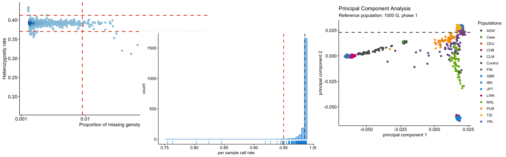
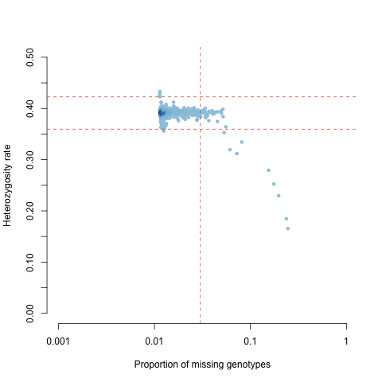
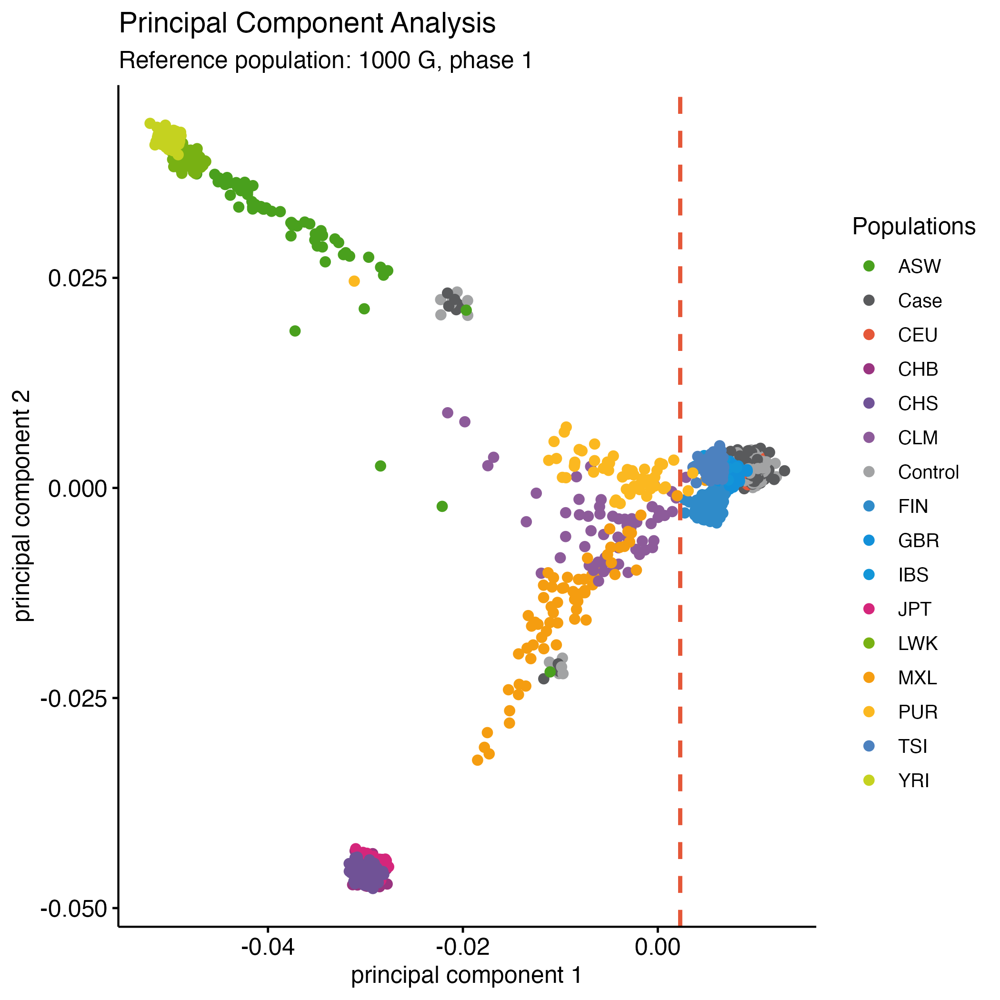
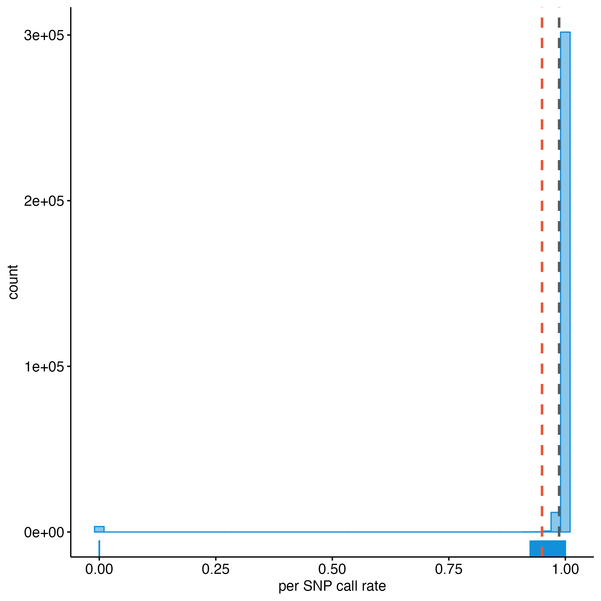
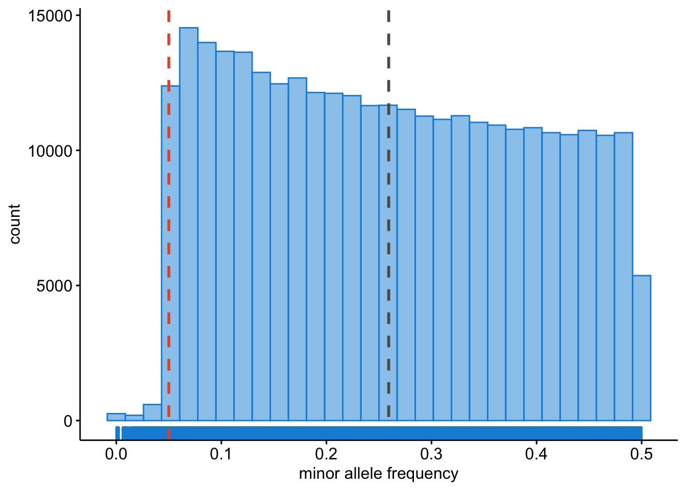

--- 
title: "A Practical Primer in Human Complex Genetics"
subtitle: "with a use-case in cardiovascular disease"
author: "[dr. Sander W. van der Laan](https://vanderlaanand.science) [{width=2%}](https://www.twitter.com/swvanderlaan) [{width=2%}](mailto:s.w.vanderlaan@gmail.com)"
date: "Version 2.0.0 (2024-03-26)"
description: This is a practical primer in human complex genetics with a use-case in cardiovascular disease. The output format for this primer is bookdown::gitbook.
documentclass: book
github-repo: swvanderlaan/A_Practical_Primer_in_Human_Complex_Genetics
link-citations: yes
bibliography:
- bibliography/book.bib
- bibliography/packages.bib
site: bookdown::bookdown_site
biblio-style: apalike
always_allow_html: true
---


# About this primer
{width=100%}

Ever since the first genome-wide association study (GWAS) on [age-related macular degeneration](https://doi.org/10.1126/science.1109557){target="_blank"}, and the promise of personalized medicine in the wake of the Human Genome Project, large-scale genetic association studies hold significant sway in contemporary health research and [drive drug-development pipelines](http://dx.doi.org/10.1038/nrd.2017.262){target="_blank"}. In the past 2 decades, researchers delved into GWAS, aiming to unveil genetic variations linked to both human traits, such as the color of your eyes, and rare and common complex diseases. These findings serve as crucial keys to unravel the intricate mechanisms underlying diseases, shedding light on whether the correlations identified in observational studies between risk factors and diseases are truly causal. 

These studies have ushered in an exciting era where many researchers thrive on developing new methods and bioinformatic tools to parse ever-growing large datasets collected large population-based biobanks. However, the analyses of these data are challenging and it can be daunting to see the forest for tree among the many tools and their various functions. Enter _A Practical Primer in Human Complex Genetics_. This [GitBook](https://cjvanlissa.github.io/gitbook-demo/){target="_blank"} was originally written back in 2022 for the **Genetic Epidemiology** course organized by the [Master Epidemiology](https://epidemiology-education.nl){target="_blank"} of Utrecht University. This practical guide will teach you how to design a GWAS, perform quality control (QC), execute the actual analyses, annotate the GWAS results, and perform further downstream post-GWAS analyses. Throughout the book you'll work with 'dummy', that is fake, data, but in the end, we will use real-world data from the first release of the [*Welcome Trust Case-Control Consortium (WTCCC)*](https://www.wtccc.org.uk/ccc1/overview.html){target="_blank"} focusing on coronary artery disease (CAD). 

A major component of modern-day GWAS is [genetic imputation](https://www.nature.com/articles/nrg2796){target="_blank"}, but for practical reasons it is not part of this book. However, I will provide some pointers as to how to go about do this with minimal coding or scripting experience. Likewise, the courses does not cover the aspects of meta-analyses of GWAS, but some excellent resources exist to which I will direct. As this practical primer evolves, these and other topics may find their place in this book. 
I should also point out that emphasis of this book is on it being a _practical primer_. It is intended to provide some practical guidance to doing GWAS, and while theory is important, I will not cover this. Again, some very useful and excellent work exists to which I will point you, but I really want you to learn - and understand the theory - by _doing_. 

So, although originally crafted as a companion for the course, this practical guide stands on its own as a comprehensive resource for diving into all facets of doing a GWAS — save for experimental follow-up, of course 😉.

I can imagine this seems overwhelming, but trust me, you'll be okay. Just follow this practical. You'll learn by doing and at the end of the day, you can execute a GWAS independently.

**Ready to start?**

Your first point of action is to prepare your system for this course in Chapter \@ref(somebackgroundreading).


<!--chapter:end:index.Rmd-->

# Some background reading  {#somebackgroundreading}
{width=100%}


Standing on the shoulders of giants, that's what this book and I do. I want to acknowledge some great work that has helped me tremendously and, really, this book wouldn't exist without this awesome work. So, I do want to give you some background reading. Is it a prerequisite? No, not really. For starters, the course covers most and you'll learn as you go. And if you didn't come here through the course, you'll be fine just the same. That said, it's a always good idea to get familiar with these works as you move forward on your path towards your first GWAS - in fact, I had these printed out with markings and writings all over them as I executed my first GWAS, and they've been great as a reference many times after. 

Large parts of this work are based on four awesome Nature Protocols from the [Zondervan group](https://www.well.ox.ac.uk/research/research-groups/zondervan-group){target="_blank"} at the Wellcome Center Human Genetics.

1. [Zondervan KT _et al._ *Designing candidate gene and genome-wide case-control association studies.* Nat Protoc 2007.](https://www.ncbi.nlm.nih.gov/pubmed/17947991){target="_blank"}
2. [Pettersson FH _et al._ *Marker selection for genetic case-control association studies.* Nat Protoc 2009.](https://www.ncbi.nlm.nih.gov/pubmed/19390530){target="_blank"}
3. [Anderson CA _et al._ *Data QC in genetic case-control association studies.* Nat Protoc 2010.](https://www.ncbi.nlm.nih.gov/pubmed/21085122){target="_blank"}
4. [Clarke GM _et al._ *Basic statistical analysis in genetic case-control studies.* Nat Protoc 2011.](https://www.ncbi.nlm.nih.gov/pubmed/21293453){target="_blank"}

An update on the community standards of QC for GWAS can be found here:

1. [Laurie CC _et al._ *Quality control and quality assurance in genotypic data for genome-wide association studies.* Genet Epidemiol 2010.](https://www.ncbi.nlm.nih.gov/pubmed/20718045){target="_blank"}

With respect to imputation and meta-analyses of GWAS you should also get familiar with the following two works:

1. [Marchini, J. and Howie, B. *Genotype imputation for genome-wide association studies.* Nat Rev Genet 2010](https://doi.org/10.1038/nrg2796){target="_blank"}
2. [de Bakker PIW _et al._ *Practical aspects of imputation-driven meta-analysis of genome-wide association studies.* Hum Mol Genet 2008.](https://www.ncbi.nlm.nih.gov/pubmed/18852200){target="_blank"}
3. [Winkler TW _et al._ *Quality control and conduct of genome-wide association meta-analyses.* Nat Protoc 2014.](https://www.ncbi.nlm.nih.gov/pubmed/24762786){target="_blank"}


**Are you ready?**

Are you ready? Did you bring coffee and a good dose of energy? Let's start! Your first point of action is to prepare your system for this course in Chapter \@ref(getting-started).

<!--chapter:end:02_1_somebackgroundreading.Rmd-->

# Getting started {#getting-started}
{width=100%}


```
## 
## Packages to install for this book and its contents to automagically work.
## 
## * Bookdown and rmarkdown packages...
## 
## * General packages...
## 
## * GGplotting packages - for publication ready plotting...
## 
## * Genomic packages...
```

> [THIS CHAPTER NEEDS WORK]
> - introduction
> - briefly touch on operating system
> - split CoCalc vs standalone
>   - CoCalc: everything is installed
>   - standalone: 
>     - focus on macOS
>     - what to install
>     - show how to navigate on macOS Terminal
> [Some introductory text]

Before getting started, we need to discuss your computer. Most programs made to execute genetic epidemiology studies are developed for the Unix environment, for example Linux and macOS. So, they may not work as intended in a Windows environment. Windows does allow users to install a linux subsystem within Windows 10+ and you can find the detail [guide](https://docs.microsoft.com/en-us/windows/wsl/about){target="_blank"} here.  

However, I highly recommend one of two options. 

- One, install a linux subsystem on your Windows computer (for example [a virtual machine with Ubuntu could work](https://blog.storagecraft.com/the-dead-simple-guide-to-installing-a-linux-virtual-machine-on-windows/){target="_blank"}). 
- Two, switch to macOS in combination with [homebrew](https://brew.sh){target="_blank"}. This will give you all the flexibility to use Unix-based programs for your genetic epidemiology work and at the same time you'll keep the advantage of a powerful computer with a user-friendly interface.

I chose the latter. 

> For this practical every command is intended for Linux/macOS, in other words Unix-systems.

**CoCalc vs. Standalone**
For the purpose of this practical primer there are one of two steps you need to take to get started. When you are following the course, you will want to read the section **CoCalc**. When you want to use this book as a standalone, you should check out the instructions in section **Standalone** - this is probably also the section you want to follow for real-world cases. 

But first, I'll briefly provide some background on the variaous programs that are commonly used.

## The programs we use

We'll use a few programs throughout this practical. You'll probably need these for your (future) genetic epidemiology work too (Table \@ref(tab:programs)).


Table: (\#tab:programs)Programs needed for genetic epidemiology.

|Program  |Link                                 |Description                                                                                                                                                                                                     |
|:--------|:------------------------------------|:---------------------------------------------------------------------------------------------------------------------------------------------------------------------------------------------------------------|
|PLINK    |https://www.cog-genomics.org/plink2/ |PLINK is a free, open-source genetic analysis tool set, designed to perform a range of basic data parsing and quality control, as well as basic and large-scale analyses in a computationally efficient manner. |
|R        |https://cran.r-project.org/          |A program to perform statistical analysis and visualizations.                                                                                                                                                   |
|RStudio  |https://www.rstudio.com              |A user-friendly R-wrap-around for code editing, debugging, analyses, and visualization.                                                                                                                         |
|Homebrew |https://brew.sh                      |A great extension for Mac-users to install really useful programs that Apple didn't.                                                                                                                            |

**RStudio**

**RStudio** is a very user-friendly interface around `R` that makes your `R`-scripting-life a lot easier. You should get used to that. **RStudio** comes with `R` so you don't have to worry about that.

**PLINK**
Right, onto `PLINK`. 

All genetic analyses can be done in PLINK, even on your laptop, but with large datasets, for example [UK Biobank](https://www.ukbiobank.ac.uk){target="_blank"} size, it is better to switch to a [high-performance computing cluster (HPC)](https://en.wikipedia.org/wiki/High-performance_computing){target="_blank"} like we have available at the [Utrecht Science Park](https://wiki.bioinformatics.umcutrecht.nl/bin/view/HPC/WebHome){target="_blank"}. The original PLINK v1.07 can be found [here](https://zzz.bwh.harvard.edu/plink/index.shtml){target="_blank"}, but nowadays we are using a newer, faster version: **PLINK v1.9** which can be found [here](https://www.cog-genomics.org/plink2){target="_blank"}. It still says 'PLINK 1.90 beta' (Figure \@ref(fig:plink)), but you can consider this version stable and save to work with, but as you can see, some functions are not supported anymore.

<div class="figure" style="text-align: center">

<p class="caption">(\#fig:plink)The PLINK v1.9 website.</p>
</div>


**Alternatives to `PLINK`**

Nowadays, a lot of people also use programs like [SNPTEST](snptest){target="_blank"}, [BOLT-LMM](https://data.broadinstitute.org/alkesgroup/BOLT-LMM/){target="_blank"},  [GCTA](http://cnsgenomics.com/software/gcta/#Overview){target="_blank"}, or [regenie](https://rgcgithub.github.io/regenie/){target="_blank"} as alternatives to execute GWAS. These programs were designed with specific use-cases in mind, for instance really large biobank data including hundreds of thousands individuals, better control for population stratification, the ability to estimate trait heritability or Fst, and so on.

**Other programs**

Mendelian randomization can be done either with the [SMR](http://cnsgenomics.com/software/smr/#Overview){target="_blank"} or [GSMR](http://cnsgenomics.com/software/gsmr/){target="_blank"} function from GCTA, or with R-packages, like [`TwoSampleMR`](https://mrcieu.github.io/TwoSampleMR/){target="_blank"}.


## CoCalc

> [ TEXT NEEDS UPDATING]

Now, pay attention. If you came here through the course **Genetic Epidemiology**, you don't have to do anything. All the data you need are already downloaded. 

However, when you are using this book as a standalone, you'll need to start by downloading the data you need for this practical to your Desktop. 

For the course we set up a CoCalc Server and everything should be fine; we installed everything you need. 

## Standalone

So, you plan to use this book as 'Standalone' on a macOS environment. This means you'll need to install a few things first.

### Terminal 

For all the programs we use, except **RStudio**, you will need the **Terminal**. This comes with every major operating system; on Windows it is called 'PowerShell', but let's not go there. And regardless, you will (have to start to) make your own scripts. The benefit of using scripts is that each step in your workflow is clearly stipulated and annotated, and it allows for greater reproducibility, easier troubleshooting, and scaling up to high-performance computer clusters.

Open the **Terminal**, it should be on the left in the toolbar as a little black computer-monitor-like icon. Mac users can type `command + space` and type `terminal`, a **Terminal** screen should open.

> From now on we will use little code blocks like the example to indicate a code you should type/copy-paste and hit enter. If a code is followed by a comment, it is indicated by a # - you don't need to copy-paste and execute this.

```
CODE BLOCK

CODE BLOCK # some comment here
```

### The data you need

You'll need to start by downloading the data you need for this practical to your Desktop. 

Here's the link to the data. 

[Link to Google Drive with data](https://drive.google.com/drive/folders/1iDLB1y534DfgEZNPCYBrIj5X7g_XlBba?usp=share_link)

Make sure you put the data in the `~/Desktop/practical/` folder.

The data are pretty large (approx. 15Gb), so this will take a minute or two depending on your internet connection. Time to stretch your legs or grab a coffee (data scientists don't drink tea). 

### Navigating the Terminal

You can navigate around the computer through the terminal by typing `cd <path>`; `cd` stands for "change directory" and `<path>` means "some_file_directory_you_want_to_go_to".

**For Linux/macOS Users**

_will bring you to your home directory_

```
cd ~ 
```

_will bring you to the parent directory (up one level) _

```
cd ../ 
```

_will bring you to the XXX directory_

```
cd XXX 
```


Let's navigate to the folder you just downloaded.

```
cd ~/Desktop/practical
```


Let's check out what is inside the directory, by listing (`ls`) its contents.

_shows files as list_

```
ls -l 
```

_shows files as list with human readable format _

```
ls -lh 
```
Adding the flags `-lh` will get you the contents of a directory in a list (`-l`) and make the size 'human-readable' (`-h`).

_shows the files as list sorted by time edited_

```
ls -lt 
```

_shows the files as list sorted by size_

```
ls -lS 
```

You can also count the number of files.

```
ls | wc -l
```

And if you want to know all the function of a program simply type the following.

```
man ls
```

This will take you to a manual of the program with an extensive description of each flag (Figure \@ref(fig:ls-manual)).

<div class="figure" style="text-align: center">

<p class="caption">(\#fig:ls-manual)Partial output from the ls-manual.</p>
</div>

### Installing the software

#### brew

Linux has a great package-manager that is lacking on macOS. You can install [`brew`](https://brew.sh){target="_blank"} to compensate for this. This adds the ability to install almost any Linux-based program through the **Terminal** such as `wget`, `llvm`, etc. 

Open **Terminal** and execute the following:

```
/bin/bash -c "$(curl -fsSL https://raw.githubusercontent.com/Homebrew/install/HEAD/install.sh)"
```

Check if everything is in order.

```
brew doctor
```

It shouldn't report any errors.

#### PLINK

First, we'll get `PLINK`. Navigate to the **PLINK v1.9** website, which can be found [here](https://www.cog-genomics.org/plink2){target="_blank"}. Download the macOS (64-bit) version under 'Stable (beta x.x, day month year)'. 

> Note: Apple produced Intel-based computers for a few years back, and most programs, packages, libraries and whatnot are designed for that. So, I highly recommend using software designed for that and activating Rosetta2 in your Terminal. Don't know how to do that? Following [these instructions](https://support.apple.com/en-us/102527){target="_blank"}.

Unzip the folder and put `plink` in the practical folder. 

```
mv -v ~/Downloads/plink_mac_20231211/plink ~/Desktop/practical/plink 
```

## Installing R and RStudio

Let's go ahead and use `brew` to install the `R` and **RStudio** software.

In **Terminal** execute the following and just follow the instructions.

```
brew install rstudio
brew install --cask r
```

Now close the terminal window - really make sure that the terminal-program has quit.

Open your fresh installation of **RStudio** by double clicking the icon. You should be seeing something like figure \@ref(fig:rstudio-screenshot)

<div class="figure" style="text-align: center">

<p class="caption">(\#fig:rstudio-screenshot)RStudio screenshot.</p>
</div>


In the top right, you see a little green-white plus-sign, click this and select 'R Notebook' (Figure \@ref(fig:rstudio-screenshot-create-notebook)). 

<div class="figure" style="text-align: center">

<p class="caption">(\#fig:rstudio-screenshot-create-notebook)RStudio screenshot.</p>
</div>

You will create an untitled (`Untitled1`) `R` notebook: you can combine text descriptions, like you would in a lab-journal, with code-sections. Read what is in the notebook to get a grasp on that (Figure \@ref(fig:rstudio-screenshot-notebook)). 

<div class="figure" style="text-align: center">

<p class="caption">(\#fig:rstudio-screenshot-notebook)RStudio screenshot.</p>
</div>

Right, you should be installing some packages. To do so, you can remove `plot(cars)` (or leave and create a new code-block as per instructions in the notebook), and copy paste the code below. Make sure to put in a code block like the example in which `plot(cars)` is in.


```r
remotes::install_github(c("rstudio/rmarkdown"))

install.packages(c("formatR", "remotes", 
                   "httr", "usethis", 
                   "data.table", "devtools", 
                   "dplyr", "tibble", "tidyverse", 
                   "openxlsx",
                   "ggplot2",
                   "ggsci", "ggthemes",
                   "qqman", "CMplot", "plotly", 
                   "openxlsx"))
devtools::install_github("kassambara/ggpubr")

devtools::install_github("oliviasabik/RACER")

remotes::install_github("MRCIEU/TwoSampleMR")

if (!require("BiocManager", quietly = TRUE))
  install.packages("BiocManager")
BiocManager::install("geneplotter")
```

You should load these packages too. 


```r
library(rmarkdown)
library(formatR)

library(openxlsx)

library(data.table)

library(tibble)
library(tidyverse)
library(dplyr)
library(plotly)

library(ggplot2)
library(devtools)
library(ggpubr)
library(ggsci)
library(ggthemes)

library(qqman)
library(CMplot)
library(RACER)

library(remotes)
library(TwoSampleMR)

library("geneplotter")
```

All in all this may take some time, good moment to relax, review your notes, stretch your legs, or take a coffee.


## Are you ready?

Are you ready? Did you bring coffee and a good dose of energy? Let's start! 

Oh, one more thing: you can save your notebook, the one you just created, to keep all the `R` codes you are applying in the next chapters and add descriptions and notes. If you save this notebook you'll notice that a `html`-file is created. This file is a legible webbrowser-friendly version of your work and contains the codes and the output (code messages, tables, and figures). And the nice thing is, that you can easily share it with others over email. 

Ok. 'Nough said, let's move on to cover some basics in Chapter \@ref(gwas-basics).

<!--chapter:end:02_2_gettingstarted.Rmd-->

# Steps in a Genome-Wide Association Study {#gwas-basics}
{width=100%}


Now that you understand a bit of the navigation in Unix-systems, you're ready to start this practical primer. We will make use of a dummy dataset containing cases and controls. We will explain and execute the following steps:

1. convert raw data to a more memory-efficient format
2. apply extensive quality control on samples and SNPs
3. assess the ancestral background of your study population
4. perform association testing
5. visualize association results


## Converting datasets

The format in which genotype data are returned to investigators varies among genome-wide SNP platforms and genotyping centers. Usually genotypes have been called by a genotyping center and returned in the standard `PED` and `MAP` file formats designed for `PLINK`.

A `PED` file is a white space (space or tab)-delimited file in which each line represents one individual and the first six columns are mandatory and in the following order:

- 'Family ID', 
- 'Individual ID', 
- 'Paternal ID', 
- 'Maternal ID', 
- 'Sex (1=male, 2=female, 0=missing)', and 
- 'Phenotype (1=unaffected, 2=affected, 0=missing)'. 

The subsequent columns denote genotypes that can be any character (e.g., 1, 2, 3, 4 or A, C, G, T). Zero denotes a missing genotype. Each SNP must have two alleles (i.e., both alleles are either present or absent). 
The order of SNPs in the PED file is given in the MAP file, in which each line denotes a single marker and the four white-space–separated columns are chromosome (1–22, X, Y or 0 for unplaced), marker name (typically an rs number), genetic distance in Morgans (this can be fixed to 0) and base-pair position (bp units).

Let's start by using `PLINK` to converting the datasets to a lighter, binary form (a `.bed`-file). This file saves data in a more memory- and time-efficient manner (in a 'binary'-format) to facilitate the analysis of large-scale data sets [@purcell2007]. The marker-information is stored in the `.bim`-file and the family information in the `.fam`-file. `PLINK` creates a `.log` file (named `raw-GWA-data.log`) that details (among other information) the implemented commands, the number of cases and controls in the input files, any excluded data and the genotyping rate in the remaining data. This file is very useful for checking whether the software is successfully completing commands.

Make sure you are in the right directory. Do you remember how to get there?

```
cd ~/Desktop/practical
```

Next, we'll make a project directory.

```
mkdir -v ~/Desktop/practical/dummy_project
```

Now, we'll convert the `.ped`/`.map` files to the binary-format.

```
plink --file rawdata/raw-GWA-data --make-bed --out dummy_project/rawdata
```

Let's review the `.log`-file for a bit. It should look something like this:

```
PLINK v1.90b7.2 64-bit (11 Dec 2023)           www.cog-genomics.org/plink/1.9/
(C) 2005-2023 Shaun Purcell, Christopher Chang   GNU General Public License v3
Logging to dummy_project/rawdata.log.
Options in effect:
  --file rawdata/raw-GWA-data
  --make-bed
  --out dummy_project/rawdata

16384 MB RAM detected; reserving 8192 MB for main workspace.
.ped scan complete (for binary autoconversion).
Performing single-pass .bed write (317503 variants, 2000 people).
--file: dummy_project/rawdata-temporary.bed +
dummy_project/rawdata-temporary.bim + dummy_project/rawdata-temporary.fam
written.
317503 variants loaded from .bim file.
2000 people (997 males, 1003 females) loaded from .fam.
2000 phenotype values loaded from .fam.
Using 1 thread (no multithreaded calculations invoked).
Before main variant filters, 2000 founders and 0 nonfounders present.
Calculating allele frequencies... done.
Warning: 11440 het. haploid genotypes present (see dummy_project/rawdata.hh );
many commands treat these as missing.
Total genotyping rate is 0.985682.
317503 variants and 2000 people pass filters and QC.
Among remaining phenotypes, 1023 are cases and 977 are controls.
--make-bed to dummy_project/rawdata.bed + dummy_project/rawdata.bim +
dummy_project/rawdata.fam ... done.
```

So, there are 317,503 variants included for 2,000 people, 997 males and 1,003 females. All of these individuals are ['founders'](https://www.cog-genomics.org/plink/1.9/filter#nonfounders){target="_blank"}. There are 1,023 cases and 977 controls. The genotyping rate is about 98.6% which is pretty good. Lastly, there are 11,440 heterozygous haploid genotypes present.

> Question: Can you think off what the '11,440 heterozygous haploid genotypes present' represent? 


## Quality control

We are ready for some quality control and quality assurance, heavily inspired by Anderson _et al._ [@anderson2010] and Laurie _et al._ [@laurie2010]. In general, we should check out a couple of things regarding the data quality on two levels:

1) samples
2) variants

So, we will investigate the following:

- Are the *sexes* based on genetic data matching the ones given by the phenotype file?
- Identify individuals that are outliers in terms of missing data (_call rate_) or heterozygosity rates. This could indicate a genotyping error or sample swap.
- Identify duplicated or related individuals.
- Identify individuals with divergent ancestry.
- What are the allele frequencies?
- What is the per-SNP call rate?
- In the case of a case-control study (which is the case here), we need to check differential missingness between cases and controls. 

> By the way: you could extend the check on differential missingness to for instance 'genotyping platform', or 'hospital of inclusion', if you think this might influence the genotyping experiment technically.


## Let's get our hands dirty

All clear? Let's start the work. On to step 1 of the QC for GWAS: filter samples of poor quality in Chapter \@ref(gwas-basics-sample-qc).

<!--chapter:end:03_1_gwas_basics.Rmd-->

# Sample QC {#gwas-basics-sample-qc}
{width=70%}


Let's start with the per-sample quality control. 

## Sex
We need to identify of individuals with discordant sex information comparing phenotypic and genotypic data. Let's calculate the mean homozygosity rate across X-chromosome markers for each individual in the study.

```
plink --bfile dummy_project/rawdata --check-sex --out dummy_project/rawdata
```

This produces a file with the following columns:

- _FID_	Family ID
- _IID_	Within-family ID
- _PEDSEX_	Sex code in input file
- _SNPSEX_	Imputed sex code (1 = male, 2 = female, 0 = unknown)
- _STATUS_	'OK' if PEDSEX and SNPSEX match and are nonzero, 'PROBLEM' otherwise
- _F_	Inbreeding coefficient, considering only X chromosome. Not present with 'y-only'.
- _YCOUNT_	Number of nonmissing genotype calls on Y chromosome. Requires 'ycount'/'y-only'.


We need to get a list of individuals with discordant sex data.

```
cat dummy_project/rawdata.sexcheck | awk '$5 =="STATUS" || $5 =="PROBLEM"'  > dummy_project/rawdata.sexprobs.txt
```

Let's have a look at the results.

```
cat dummy_project/rawdata.sexprobs.txt
```


```r
library("data.table")

COURSE_loc = "~/Desktop/practical" # getwd()

sexissues <- data.table::fread(paste0(COURSE_loc,"/dummy_project/rawdata.sexprobs.txt"))
```


```r
library("knitr")
knitr::kable(
  sexissues, caption = 'Sex issues',
  booktabs = TRUE
)
```


When the homozygosity rate (_F_) is more than 0.2, but less than 0.8, the genotype data are inconclusive regarding the sex of an individual and these are marked in column _SNPSEX_ with a 0, and the column _STATUS_ "PROBLEM".

Report the IDs of individuals with discordant sex information (Table \@ref(tab:sex-issues)) to those who conducted sex phenotyping. In situations in which discrepancy cannot be resolved, add the family ID (FID) and individual ID (IID) of the samples to a file named `fail-sexcheck-qc.txt` (one individual per line, tab delimited).

```
grep "PROBLEM" dummy_project/rawdata.sexcheck | awk '{ print $1, $2}'  > dummy_project/fail-sexcheck-qc.txt
```

## Sample call rates
Let's get an overview of the missing data per sample and per SNP.

```
plink --bfile dummy_project/rawdata --missing --out dummy_project/rawdata
```

This produces two files, `rawdata/rawdata.imiss` and `rawdata/rawdata.lmiss`. In the .imiss file the _N_MISS_ column denotes the number of missing SNPs, and the _F_MISS_ column denotes the proportion of missing SNPs per individual.


```r
raw_IMISS <- data.table::fread(paste0(COURSE_loc, "/dummy_project/rawdata.imiss"))

raw_IMISS$callrate <- 1 - raw_IMISS$F_MISS
```


```r
library("ggpubr")

ggpubr::gghistogram(raw_IMISS, x = "callrate",
                    add = "mean", add.params = list(color = "#595A5C", linetype = "dashed", size = 1),
                    rug = TRUE, bins = 50,
                    color = "#1290D9", fill = "#1290D9",
                    xlab = "per sample call rate") +
  ggplot2::geom_vline(xintercept = 0.95, linetype = "dashed",
                color = "#E55738", size = 1)
ggplot2::ggsave(paste0(COURSE_loc, "/dummy_project/gwas-qc-sample-call-rate.png"),
       plot = last_plot())
```

The grey dashed line in Figure \@ref(fig:show-sample-callrate) indicates the mean call rate, while the red dashed line indicates the threshold we had determined above.

<div class="figure" style="text-align: center">

<p class="caption">(\#fig:show-sample-callrate)Per sample call rate.</p>
</div>


## Heterozygosity rate

To properly calculate heterozygosity rate and relatedness (identity-by-descent [IBD]) we need to do four things:

1) pre-clean the data to get a high-quality set,
2) of independent SNPs,
3) exclude long-range linkage disequilibrium (LD) blocks that bias with these calculations, and
4) exclude A/T and C/G SNPs as these may be ambivalent in interpretation when frequencies between cases and controls are close (MAF ± 0.45),
5) remove all non-autosomal SNPs.

You can find an up-to-date list of LD blocks you should exclude in these types of analyses [here](https://genome.sph.umich.edu/wiki/Regions_of_high_linkage_disequilibrium_(LD)){target="_blank"} for the different genome builds. In this case we are using build 37. For the purpose of this book we included a file with these regions in the `support`-directory.

We will use the following settings:

- remove A/T and C/G SNPs with the flag `--exclude dummy_project/all.atcg.variants.txt`,
- call rate <1% with the flag `--geno 0.10`,
- Hardy-Weinberg Equilibrium (HWE) p-value > 1x10-3 with the flag `--hwe 1e-3`,
- and MAF>10% with the flag `--maf 0.10 `,
- prune the data to only select independent SNPs (with low LD r^2) of one pair each with `r^2 = 0.2` with the flags `--indep-pairwise 100 10 0.2` and `--extract rawdata/raw-GWA-data.prune.in`,
- SNPs in long-range LD regions (for example: MHC chr 6 25.8-36Mb, chr 8 inversion 6-16Mb, chr17 40-45Mb, and a few more) with the flag `--exclude range support/exclude_problematic_range.txt`,
- remove non-autosomal SNPs with the flag `--autosome`.

First, get a list of A/T and C/G SNPs. Remember, the list of markers for this GWAS is noted in the `.bim` file. We can simply grep all the lines where the two alleles either have an A/T or C/G combination.

```
cat dummy_project/rawdata.bim | \
awk '($5 == "A" && $6 == "T") || ($5 == "T" && $6 == "A") || ($5 == "C" && $6 == "G") || ($5 == "G" && $6 == "C")' | awk '{ print $2, $1, $4, $3, $5, $6 }' \
> dummy_project/all.atcg.variants.txt
```

Second, clean the data and get a list of independent SNPs.

<!-- *NEXT YEAR: further explain the exact commands  and how they relate with the above. Is this needed? * -->

```
plink --bfile dummy_project/rawdata \
--autosome \
--maf 0.10 --geno 0.10 --hwe 1e-3 \
--indep-pairwise 100 10 0.2 \
--exclude range support/exclude_problematic_range.txt \
--make-bed --out dummy_project/rawdata.clean.temp
```

> Please note, we have create a dataset without taking into account LD structure. Hence, the message 'Pruned 0 variants from chromosome 1, leaving 19420.' etc. In a dataset without any LD structure this flag `--indep-pairwise 100 10 0.2` doesn't actually work. However, with real-data you can use it to prune out unwanted SNPs in high LD.

Third, exclude the pruned SNPs. Note, how we include a file to exclude high-LD for the purpose of the practical.

```
plink --bfile dummy_project/rawdata.clean.temp \
--extract rawdata/raw-GWA-data.prune.in \
--make-bed --out dummy_project/rawdata.clean.ultraclean.temp
```

Fourth, remove the A/T and C/G SNPs.

```
plink --bfile dummy_project/rawdata.clean.ultraclean.temp \
--exclude dummy_project/all.atcg.variants.txt \
--make-bed --out dummy_project/rawdata.clean.ultraclean
```

> Please note, this dataset doesn't actually include this type of SNP, hence `rawdata/all.atcg.variants.txt` is empty! Again, you can use this command in real-data to exclude A/T and C/G SNPs.

Lastly, remove the temporary files.

```
rm -fv dummy_project/*.temp*
```

Finally, we can calculate the heterozygosity rate.

```
plink --bfile dummy_project/rawdata.clean.ultraclean --het --out dummy_project/rawdata.clean.ultraclean
```

This creates the file `dummy_project/rawdata.clean.ultraclean.het`, in which the third column denotes the observed number of homozygous genotypes, O(Hom), and the fifth column denotes the number of nonmissing genotypes, N(NM), per individual. We can now calculate the observed heterozygosity rate per individual using the formula (N(NM) - O(Hom))/N(NM).

Often there is a correlation between heterozygosity rate and missing data. Thus, we should plot the observed heterozygosity rate per individual on the x-axis and the proportion of missing SNP, that is the 'SNP call rate', per individuals on the y-axis (Figure \@ref(fig:show-heterozygosity)).


```r
raw_HET <- data.table::fread(paste0(COURSE_loc, "/dummy_project/rawdata.clean.ultraclean.het"))

raw_IMISS$logF_MISS = log10(raw_IMISS$F_MISS)
prop_miss = -1.522879

raw_HET$meanHet = (raw_HET$`N(NM)` - raw_HET$`O(HOM)`)/raw_HET$`N(NM)`
lower_meanHet = mean(raw_HET$meanHet) - (3*sd(raw_HET$meanHet))
upper_meanHet = mean(raw_HET$meanHet) + (3*sd(raw_HET$meanHet))

raw_IMISSHET = merge(raw_IMISS, raw_HET, by = "IID")
raw_IMISSHET$FID.y <- NULL
colnames(raw_IMISSHET)[colnames(raw_IMISSHET)=="FID.x"] <- "FID"

colors  <- densCols(raw_IMISSHET$logF_MISS, raw_IMISSHET$meanHet)
```


```r
library("geneplotter")
png(paste0(COURSE_loc, "/dummy_project/gwas-qc-imiss-vs-het.png"))
plot(raw_IMISSHET$logF_MISS,
     raw_IMISSHET$meanHet, 
     col = colors, 
     xlim = c(-3,0), ylim = c(0,0.5),
     pch = 20, 
     xlab = "Proportion of missing genotypes", ylab = "Heterozygosity rate", axes = FALSE)
axis(2, at = c(0,0.05,0.10,0.15,0.2,0.25,0.3,0.35,0.4,0.45,0.5), tick = TRUE)
axis(1, at = c(-3,-2,-1,0), 
     labels = c(0.001,0.01,0.1,1))
abline(h = lower_meanHet, col = "#E55738", lty = 2)
abline(h = upper_meanHet, col = "#E55738", lty = 2)
abline(v = prop_miss, col = "#E55738", lty = 2)
```

<!-- I prefer to use ggpubr, but I don't understand why this code doesn't work anymore...?!?! -->
<!-- ```{r heterozygosity, eval = FALSE} -->
<!-- ggpubr::ggscatter(raw_IMISSHET, x = "logF_MISS", y = "meanHet", -->
<!--                   colors = colors, -->
<!--                   xlab = "Proportion of missing genotypes", ylab = "Heterozygosity rate") + -->
<!--   scale_x_continuous(labels=c("-3" = "0.001", "-2" = "0.01", -->
<!--                               "-1" = "0.1", "0" = "1")) + -->
<!--   geom_hline(yintercept = lower_meanHet, linetype = "dashed", -->
<!--                 color = "#E55738", size = 1) + -->
<!--   geom_hline(yintercept = upper_meanHet, linetype = "dashed", -->
<!--                 color = "#E55738", size = 1) + -->
<!--   geom_vline(xintercept = prop_miss, linetype = "dashed", -->
<!--                 color = "#E55738", size = 1) -->
<!-- ``` -->

<div class="figure" style="text-align: center">

<p class="caption">(\#fig:show-heterozygosity)Heterozygosity as a function of SNP call rate.</p>
</div>

Examine the plot (Figure \@ref(fig:show-heterozygosity)) to decide reasonable thresholds at which to exclude individuals based on elevated missing or extreme heterozygosity. We chose to exclude all individuals with a genotype failure rate >= 0.03 (vertical dashed line) and/or a heterozygosity rate ± 3 s.d. from the mean (horizontal dashed lines). Add the FID and IID of the samples failing this QC to the file named `fail-imisshet-qc.txt`.

> How would you create this file?


```r
raw_IMISSHETsub = subset(raw_IMISSHET, logF_MISS > prop_miss | (meanHet < lower_meanHet | meanHet > upper_meanHet),
                         select = c("FID", "IID"))
data.table::fwrite(raw_IMISSHETsub, paste0(COURSE_loc,"/dummy_project/fail-raw_IMISSHETsub.txt"), sep =" ")
```

If all is right, you'd have something like Table \@ref(tab:failed-callrate-het).


```r
library("knitr")
knitr::kable(
  raw_IMISSHETsub, caption = 'Failed samples due to sample call rates and heterozygosity rate',
  booktabs = TRUE
)
```


## Relatedness
<!-- https://rpubs.com/EAVWing/symbols -->
We calculate Identity-by-Descent (IBS) to identify duplicated and related samples. In Table \@ref(tab:show-relatedness) we show how much DNA is shared between individuals depending on their relation[@staples2014]. IBS is measured by calculating pi-hat ($\widehat{\pi}$), which is in essence the proportion of the DNA that a pair of samples share. To calculate this, we needed this ultraclean dataset, without low-quality SNPs and without high-LD regions. 


Table: (\#tab:show-relatedness)Familial relations and % DNA shared.

|Relatedness                                                |%.DNA.sharing |IBD0    |IBD1     | IBD2|
|:----------------------------------------------------------|:-------------|:-------|:--------|----:|
|Monozygotic twins                                          |±100%         |0       |1        | 0.00|
|Parents/child                                              |±50%          |0.25    |0.5      | 0.25|
|Sibling                                                    |±50%          |0.25    |0.5      | 0.25|
|Fraternal twins                                            |±50%          |0.25    |0.5      | 0.25|
|Grandparent/grandchild                                     |±25%          |0.5     |0.5      | 0.00|
|Aunt/Uncle/Niece/Nephew                                    |±25%          |0.5     |0.5      | 0.00|
|Half-sibling                                               |±25%          |0.5     |0.5      | 0.00|
|First-cousin                                               |±12.5%        |0.75    |0.25     | 0.00|
|Half first-cousin                                          |±6.25%        |0.875   |0.125    | 0.00|
|First-cousin once removed                                  |±6.25%        |0.875   |0.125    | 0.00|
|Second-cousin                                              |±3.13%        |0.9375  |6.25E-2  | 0.00|
|Second-cousin once removed                                 |±1.56%        |0.96875 |3.125E-2 | 0.00|
|Distantly related                                          |<1.56%        |varies  |varies   | 0.00|
|Unrelated (includes relationships beyond the third degree) |<1.56%        |1       |0        | 0.00|

`PLINK` calculates the inter-individual relatedness using the `--genome` function.

```
plink --bfile dummy_project/rawdata.clean.ultraclean --genome --out dummy_project/rawdata.clean.ultraclean
```

We can now identify all pairs of individuals with an IBD > 0.185. The code looks at the individual call rates stored in rawdata.imiss and outputs the IDs of the individual with the lowest call rate to ‘fail-IBD-QC.txt’ for subsequent removal (Table \@ref(tab:show-ibdcallissues)).

First, move to the `dummy_project` directory.

```
cd dummy_project
```

Now, execute this script - it should work just fine out-of-the-box.

```
perl ../scripts/run-IBD-QC.pl rawdata rawdata.clean.ultraclean
```

Go back one directory.

```
cd ..
```


```r
ibdcallissues <- data.table::fread(paste0(COURSE_loc,"/dummy_project/fail-IBD-QC.txt"))
```


```r
knitr::kable(
  ibdcallissues, 
  caption = 'Failed IBD and callrate.',
  # align = ,
  booktabs = FALSE
)
```

## Ancestral background

Using a **Principal Component Analysis (PCA)** we can reduce the dimensions of the data, and project the "ancestral distances". In other words, the principal component 1 (the first dimension) and principal component 2 (the second dimension) which will capture most of the variation in the data and represent how much each sample is alike the next. And when compared to a reference, you can deduce the ancestral background of each sample in your dataset. Of course this is relative: we will only know that a given sample is very much a like samples from a given population that _exists today_. 

Nowadays we run such PCA against a large and diverse dataset containing many different populations. Old-school GWAS (pre-2009) would compare a dataset against [HapMap 3](https://www.broadinstitute.org/medical-and-population-genetics/hapmap-3){target="_blank"}, nowadays we prefer at a minimum the [1000G phase 3 populations](https://www.internationalgenome.org){target="_blank"}. And in those ancient times the preferred software to run a PCA was _Eigensoft_ which is a bit tricky to install (see Chapter \@ref(eigensoft)), but nowadays `PLINK` provides the `--pca`-flag. 

For the purpose of this practical primer we will run PCA against an earlier version of 1000G, phase 1, which is slightly smaller and just as good to use. 

### 1000G phase 1

We will project our data to the reference, in this example 1000G phase 1 (1000G), which includes individuals from 14 distinct global populations across 4 'super'-populations (Europeans [`EUR`], Africans [`AFR`], East-Asians [`EAS`], and Latin Americans [`AMR`]). In the real-world, using phase 1 may be just fine, but if you think your population evolved through extensive migration it's probably best to use phase 3 data. In other words, the choice of reference is really depending on the dataset.

First, we will merge our data with 1000G. The alleles at each marker must be aligned to the same DNA strand to allow our data to merge correctly. Because not all SNPs are required for this analysis the A->T and C->G SNPs, which are more difficult to align, can be omitted.

#### Filter the 1000G data

First, we should get a list of relevant variants from our `rawdata`-dataset. We don't need the other variants present in the 1000G dataset, right?

```
cat dummy_project/rawdata.bim | grep "rs" > dummy_project/all.variants.txt
```

Extract those from the 1000G phase 1 data.

```
plink --bfile ref_1kg_phase1_all/1kg_phase1_all --extract dummy_project/all.variants.txt --make-bed --out ref_1kg_phase1_all/1kg_phase1_raw
```

#### Filter A/T & C/G SNPs

As explained, the A/T and C/G SNPs are problematic, we want to exclude these too. So let's get a list of A/T and C/G variants from 1000G to exclude - this may take a while.

```
cat ref_1kg_phase1_all/1kg_phase1_raw.bim | \
awk '($5 == "A" && $6 == "T") || ($5 == "T" && $6 == "A") || ($5 == "C" && $6 == "G") || ($5 == "G" && $6 == "C")' | awk '{ print $2, $1, $4, $3, $5, $6 }' \
> ref_1kg_phase1_all/all.1kg.atcg.variants.txt
```

Exclude those A/T and C/G variants in both datasets and at the same time filter to only retain high-quality data and exclude non-autosomal variants. 

```
plink --bfile ref_1kg_phase1_all/1kg_phase1_raw --exclude ref_1kg_phase1_all/all.1kg.atcg.variants.txt -make-bed --out ref_1kg_phase1_all/1kg_phase1_raw_no_atcg

plink --bfile dummy_project/rawdata --exclude ref_1kg_phase1_all/all.1kg.atcg.variants.txt --make-bed --out dummy_project/rawdata_1kg_phase1_raw_no_atcg
```

#### Merging datasets

Try and merge the data.

```
plink --bfile dummy_project/rawdata_1kg_phase1_raw_no_atcg --bmerge ref_1kg_phase1_all/1kg_phase1_raw_no_atcg --make-bed --out dummy_project/rawdata.1kg_phase1
```

There probably is an error ...

```
Error: 72 variants with 3+ alleles present.
* If you believe this is due to strand inconsistency, try --flip with
  dummy_project/rawdata.1kg_phase1-merge.missnp.
  (Warning: if the subsequent merge seems to work, strand errors involving SNPs
  with A/T or C/G alleles probably remain in your data.  If LD between nearby
  SNPs is high, --flip-scan should detect them.)
* If you are dealing with genuine multiallelic variants, we recommend exporting
  that subset of the data to VCF (via e.g. '--recode vcf'), merging with
  another tool/script, and then importing the result; PLINK is not yet suited
  to handling them.
See https://www.cog-genomics.org/plink/1.9/data#merge3 for more discussion.
```

So let's flip some variants.

```
plink --bfile dummy_project/rawdata --exclude ref_1kg_phase1_all/all.1kg.atcg.variants.txt --flip dummy_project/rawdata.1kg_phase1-merge.missnp --make-bed --out dummy_project/rawdata_1kg_phase1_raw_no_atcg
```

Let's try again and merge the data.

```
plink --bfile dummy_project/rawdata_1kg_phase1_raw_no_atcg --bmerge ref_1kg_phase1_all/1kg_phase1_raw_no_atcg --make-bed --out dummy_project/rawdata.1kg_phase1
```

There still is an error -- there are a few multi-allelic variants present which `PLINK` can't handle. 

```
Error: 14 variants with 3+ alleles present.
* If you believe this is due to strand inconsistency, try --flip with
  dummy_project/rawdata.1kg_phase1-merge.missnp.
  (Warning: if the subsequent merge seems to work, strand errors involving SNPs
  with A/T or C/G alleles probably remain in your data.  If LD between nearby
  SNPs is high, --flip-scan should detect them.)
* If you are dealing with genuine multiallelic variants, we recommend exporting
  that subset of the data to VCF (via e.g. '--recode vcf'), merging with
  another tool/script, and then importing the result; PLINK is not yet suited
  to handling them.
See https://www.cog-genomics.org/plink/1.9/data#merge3 for more discussion.
```

Let's just remove these multi-allelic variants.

```
plink --bfile dummy_project/rawdata_1kg_phase1_raw_no_atcg --exclude dummy_project/rawdata.1kg_phase1-merge.missnp --make-bed --out dummy_project/rawdata_1kg_phase1_raw_no_atcg_bi
```

After removing those pesky multi-allelic variants, we should be able to merge the data. We should take of the following:

- extract the pruned SNP-set (remember?), `--extract rawdata/raw-GWA-data.prune.i`, 
- exclude non-autosomal variants, `--autosome`, 
- and only keeping high-quality data, `--maf 0.10 --geno 0.10 --hwe 1e-3`, 
<!-- - remove non-founders from the 1000G data, `--keep-founders`, -->
<!-- - remove any duplicate variants based on SNPID, `--rm-dup force-first` -->
<!-- - and list any duplicate variants based on chromosomal base pair position, `--list-duplicate-vars` -->

```
plink --bfile dummy_project/rawdata_1kg_phase1_raw_no_atcg_bi \
--bmerge ref_1kg_phase1_all/1kg_phase1_raw_no_atcg \
--autosome \
--maf 0.10 --geno 0.10 --hwe 1e-3 \
--extract rawdata/raw-GWA-data.prune.in \
--make-bed --out dummy_project/rawdata.1kg_phase1.clean
```

<!-- ``` -->
<!-- plink --bfile dummy_project/rawdata_1kg_phase1_raw_no_atcg_bi \ -->
<!-- --bmerge ref_1kg_phase1_all/1kg_phase1_raw_no_atcg \ -->
<!-- --autosome \ -->
<!-- --maf 0.10 --geno 0.10 --hwe 1e-3 \ -->
<!-- --extract rawdata/raw-GWA-data.prune.in \ -->
<!-- --list-duplicate-vars \ -->
<!-- --make-bed --out dummy_project/rawdata.1kg_phase1.pruned -->
<!-- ``` -->

<!-- ``` -->
<!-- plink --bfile dummy_project/rawdata.1kg_phase1.pruned \ -->
<!-- --exclude dummy_project/rawdata.1kg_phase1.pruned.dupvar \ -->
<!-- --rm-dup force-first \ -->
<!-- --make-bed --out dummy_project/rawdata.1kg_phase1.clean -->
<!-- ``` -->

Before we continue it's best to clean up a bit of the mess. 

```
rm -fv dummy_project/rawdata_1kg_phase1_raw_no_atcg_bi* ref_1kg_phase1_all/1kg_phase1_raw_no_atcg* dummy_project/rawdata.1kg_phase1.pruned* dummy_project/rawdata_1kg_phase1_raw_no_atcg* dummy_project/rawdata.1kg_phase1-merge* dummy_project/rawdata.1kg_phase1.bed dummy_project/rawdata.1kg_phase1.bim dummy_project/rawdata.1kg_phase1.fam dummy_project/rawdata.1kg_phase1.hh dummy_project/rawdata.1kg_phase1.log ref_1kg_phase1_all/1kg_phase1_raw.*
```

Now we have prepared our dataset with only high-quality SNPs that have few missing data, that are high-frequent, exclude problematic genomic ranges, and merged to the 1000G phase 1 reference dataset. Your output should look something like this:

```
PLINK v1.90b7.2 64-bit (11 Dec 2023)           www.cog-genomics.org/plink/1.9/
(C) 2005-2023 Shaun Purcell, Christopher Chang   GNU General Public License v3
Logging to dummy_project/rawdata.1kg_phase1.clean.log.
Options in effect:
  --autosome
  --bfile dummy_project/rawdata_1kg_phase1_raw_no_atcg_bi
  --bmerge ref_1kg_phase1_all/1kg_phase1_raw_no_atcg
  --extract rawdata/raw-GWA-data.prune.in
  --geno 0.10
  --hwe 1e-3
  --maf 0.10
  --make-bed
  --out dummy_project/rawdata.1kg_phase1.clean

16384 MB RAM detected; reserving 8192 MB for main workspace.
2000 people loaded from dummy_project/rawdata_1kg_phase1_raw_no_atcg_bi.fam.
1092 people to be merged from ref_1kg_phase1_all/1kg_phase1_raw_no_atcg.fam.
Of these, 1092 are new, while 0 are present in the base dataset.
Warning: Multiple positions seen for variant 'rs3934834'.
Warning: Multiple positions seen for variant 'rs3737728'.
Warning: Multiple positions seen for variant 'rs6687776'.
Warning: Multiple chromosomes seen for variant 'rs1050301'.
Warning: Multiple chromosomes seen for variant 'rs4850'.
317476 markers loaded from dummy_project/rawdata_1kg_phase1_raw_no_atcg_bi.bim.
312239 markers to be merged from ref_1kg_phase1_all/1kg_phase1_raw_no_atcg.bim.
Of these, 14 are new, while 312225 are present in the base dataset.
312190 more multiple-position warnings: see log file.
Performing single-pass merge (3092 people, 308317 variants).
Merged fileset written to dummy_project/rawdata.1kg_phase1.clean-merge.bed +
dummy_project/rawdata.1kg_phase1.clean-merge.bim +
dummy_project/rawdata.1kg_phase1.clean-merge.fam .
308317 variants loaded from .bim file.
3092 people (1522 males, 1570 females) loaded from .fam.
3092 phenotype values loaded from .fam.
--extract: 49856 variants remaining.
Using 1 thread (no multithreaded calculations invoked).
Before main variant filters, 3078 founders and 14 nonfounders present.
Calculating allele frequencies... done.
Total genotyping rate is 0.994867.
299 variants removed due to missing genotype data (--geno).
--hwe: 13825 variants removed due to Hardy-Weinberg exact test.
2617 variants removed due to minor allele threshold(s)
(--maf/--max-maf/--mac/--max-mac).
33115 variants and 3092 people pass filters and QC.
Phenotype data is quantitative.
--make-bed to dummy_project/rawdata.1kg_phase1.clean.bed +
dummy_project/rawdata.1kg_phase1.clean.bim +
dummy_project/rawdata.1kg_phase1.clean.fam ... done.
```

So in total there are 3,092 individuals, 1,522 males and 1,570 females, and 3,078 founders and 14 non-founders. The total genotyping rate is 99.5% and 33,115 variants are present.


### Principal component analysis

Great, we've prepared our dummy project data and merged this with 1000G phase 1. Let's execute the PCA using `--pca` in `PLINK`.

```
plink --bfile dummy_project/rawdata.1kg_phase1.clean --pca --out dummy_project/rawdata.1kg_phase1.clean
```

### Plotting the PCA results

If all is peachy, you just succesfully ran PCA against 1000G phase 1. Using `--pca` we have calculated principal components (PCs), 20 in total by default, and we can now start plotting them. Let's create a scatter diagram of the first two principal components, including all individuals in the file `rawdata.1kg_phase1.clean.eigenvec` (the first and second principal components are columns 3 and 4, respectively). We need to collect some per-sample information to color the points according to sample origin. 

> Note: A R script for creating this plot (`scripts/plot-pca-results.Rscript`) is also provided (although any standard graphing software can be used), but below you'll find some fancy codes too.

First we collect the results from the `--pca`, the dummy data phenotype information, and the reference population information.


```r
PCA_eigenval <- data.table::fread(paste0(COURSE_loc,"/dummy_project/rawdata.1kg_phase1.clean.eigenval"))
PCA_eigenvec <- data.table::fread(paste0(COURSE_loc,"/dummy_project/rawdata.1kg_phase1.clean.eigenvec"))
ref_pop_raw <- data.table::fread(paste0(COURSE_loc,"/ref_1kg_phase1_all/1kg_phase1_all.pheno"))
dummy_pop <- data.table::fread(paste0(COURSE_loc,"/dummy_project/rawdata.fam"))

# Rename some 
names(PCA_eigenval)[names(PCA_eigenval) == "V1"] <- "Eigenvalue"

names(PCA_eigenvec)[names(PCA_eigenvec) == "V1"] <- "FID"
names(PCA_eigenvec)[names(PCA_eigenvec) == "V2"] <- "IID"
names(PCA_eigenvec)[names(PCA_eigenvec) == "V3"] <- "PC1"
names(PCA_eigenvec)[names(PCA_eigenvec) == "V4"] <- "PC2"
names(PCA_eigenvec)[names(PCA_eigenvec) == "V5"] <- "PC3"
names(PCA_eigenvec)[names(PCA_eigenvec) == "V6"] <- "PC4"
names(PCA_eigenvec)[names(PCA_eigenvec) == "V7"] <- "PC5"
names(PCA_eigenvec)[names(PCA_eigenvec) == "V8"] <- "PC6"
names(PCA_eigenvec)[names(PCA_eigenvec) == "V9"] <- "PC7"
names(PCA_eigenvec)[names(PCA_eigenvec) == "V10"] <- "PC8"
names(PCA_eigenvec)[names(PCA_eigenvec) == "V11"] <- "PC9"
names(PCA_eigenvec)[names(PCA_eigenvec) == "V12"] <- "PC10"
names(PCA_eigenvec)[names(PCA_eigenvec) == "V13"] <- "PC11"
names(PCA_eigenvec)[names(PCA_eigenvec) == "V14"] <- "PC12"
names(PCA_eigenvec)[names(PCA_eigenvec) == "V15"] <- "PC13"
names(PCA_eigenvec)[names(PCA_eigenvec) == "V16"] <- "PC14"
names(PCA_eigenvec)[names(PCA_eigenvec) == "V17"] <- "PC15"
names(PCA_eigenvec)[names(PCA_eigenvec) == "V18"] <- "PC16"
names(PCA_eigenvec)[names(PCA_eigenvec) == "V19"] <- "PC17"
names(PCA_eigenvec)[names(PCA_eigenvec) == "V20"] <- "PC18"
names(PCA_eigenvec)[names(PCA_eigenvec) == "V21"] <- "PC19"
names(PCA_eigenvec)[names(PCA_eigenvec) == "V22"] <- "PC20"

names(dummy_pop)[names(dummy_pop) == "V1"] <- "Family_ID"
names(dummy_pop)[names(dummy_pop) == "V2"] <- "Individual_ID"
names(dummy_pop)[names(dummy_pop) == "V5"] <- "Gender"
names(dummy_pop)[names(dummy_pop) == "V6"] <- "Phenotype"
dummy_pop$V3<- NULL
dummy_pop$V4<- NULL

dummy_pop$Population <- dummy_pop$Phenotype
dummy_pop$Population[dummy_pop$Population == 2] <- "Case"
dummy_pop$Population[dummy_pop$Population == 1] <- "Control"
```


```r
# we subset the data we need
ref_pop <- subset(ref_pop_raw, select = c("Family_ID", "Individual_ID", "Gender", "Phenotype", "Population"))
rm(ref_pop_raw)

# we combine the reference and dummy information
ref_dummy_pop <- rbind(dummy_pop, ref_pop)
```


```r
PCA_1kG <- merge(PCA_eigenvec,
                 ref_dummy_pop,
                 by.x = "IID",
                 by.y = "Individual_ID",
                 sort = FALSE,
                 all.x = TRUE)
```


```r
# Population	Description	Super population	Code	Counts
# ASW	African Ancestry in Southwest US	                          AFR	4	  #49A01D
# CEU	Utah residents with Northern and Western European ancestry	EUR	7	  #E55738
# CHB	Han Chinese in Bejing, China	                              EAS	8	  #9A3480
# CHS	Southern Han Chinese, China	                                EAS	9	  #705296
# CLM	Colombian in Medellin, Colombia	                            MR	10	#8D5B9A
# FIN	Finnish in Finland	                                        EUR	12	#2F8BC9
# GBR	British in England and Scotland	                            EUR	13	#1290D9
# IBS	Iberian populations in Spain	                              EUR	16	#1396D8
# JPT	Japanese in Tokyo, Japan	                                  EAS	18	#D5267B
# LWK	Luhya in Webuye, Kenya	                                    AFR	20	#78B113
# MXL	Mexican Ancestry in Los Angeles, California	                AMR	22	#F59D10
# PUR	Puerto Rican in Puerto Rico	                                AMR	25	#FBB820
# TSI	Toscani in Italy	                                          EUR	27	#4C81BF
# YRI	Yoruba in Ibadan, Nigeria	                                  AFR	28	#C5D220

PCA_1kGplot <- ggpubr::ggscatter(PCA_1kG, 
                                 x = "PC1", 
                                 y = "PC2",
                                 color = "Population", 
                                 palette = c("#49A01D", # ASW 
                                             "#595A5C", # Case 
                                             "#E55738", # CEU 
                                             "#9A3480", # CHB 
                                             "#705296", # CHS 
                                             "#8D5B9A", # CLM 
                                             "#A2A3A4", # Control 
                                             "#2F8BC9", # FIN 
                                             "#1290D9", # GBR 
                                             "#1396D8", # IBS 
                                             "#D5267B", # JPT 
                                             "#78B113", # LWK 
                                             "#F59D10", # MXL 
                                             "#FBB820", # PUR 
                                             "#4C81BF", # TSI 
                                             "#C5D220"), # YRI
                                 xlab = "principal component 1", ylab = "principal component 2") +
  ggplot2::geom_vline(xintercept = 0.0023, linetype = "dashed",
                      color = "#E55738", size = 1)

p2 <-  ggpubr::ggpar(PCA_1kGplot,
                     title = "Principal Component Analysis",
                     subtitle = "Reference population: 1000 G, phase 1",
                     legend.title = "Populations", legend = "right")
ggplot2::ggsave(paste0(COURSE_loc, "/dummy_project/gwas-qc-pca-1000g.png"), plot = p2)
p2
rm(p2)
```


Derive PC1 and PC2 thresholds so that only individuals who match the given ancestral population are included. For populations of European descent, this will be either the CEU or TSI 1000G individuals (Figure \@ref(fig:show-pca-1kg)). Here, we chose to exclude all individuals with a first principal component score less than `0.0023`. 

Write the FID and IID of these individuals to a file called `fail-ancestry-QC.txt`.

```
cat dummy_project/rawdata.1kg_phase1.clean.eigenvec | \
awk '$3 < 0.0023' | awk '{ print $1, $2 }' > dummy_project/fail-ancestry-QC.txt
```

Choosing which thresholds to apply (and thus which individuals to remove) is not a straightforward process. The key is to remove those individuals with greatly divergent ancestry, as these samples introduce the most bias to the study. Identification of more fine-scale ancestry can be conducted by using less divergent reference samples (_e.g._, within Europe, stratification could be identified using the CEU, TSI (Italian), GBR (British), FIN (Finnish) and IBS (Iberian) samples from the 1,000 Genomes Project (http://www.1000genomes.org/)). Robust identification of fine-scale population structure often requires the construction of many (2–10) principal components.

<div class="figure" style="text-align: center">

<p class="caption">(\#fig:show-pca-1000g)PCA - Your data vs. 1000g.</p>
</div>


## Removing samples

Finally! We have a list of samples of poor quality or divergent ancestry, and duplicated or related samples. We should remove these. Let's collect all IDs from our `fail-*`-files into a single file.

```
cat dummy_project/fail-* | sort -k1 | uniq > dummy_project/fail-qc-inds.txt
```

This new file should now contain a list of unique individuals failing the previous QC steps which we want to remove.

```
plink --bfile dummy_project/rawdata --remove dummy_project/fail-qc-inds.txt --make-bed --out dummy_project/clean_inds_data
```

> How many variants and samples are left? How many cases and how many controls did you loose? 

## The next step

Now that you filtered samples, we should turn our attention to step 2 of the QC for GWAS: identify SNPs of poor quality in Chapter \@ref(gwas_basics_snp_qc).


<!--chapter:end:03_2_gwas_basics_sample_qc.Rmd-->

# Per-SNP QC {#gwas_basics_snp_qc}
{width=70%}


Now that we removed samples, we can focus on low-quality variants.

## SNP call rates

We start by calculating the missing genotype rate for each SNP, in other words the per-SNP call rate.

```
plink --bfile dummy_project/clean_inds_data --missing --out dummy_project/clean_inds_data
```

Let's visualize the results to identify a threshold for extreme genotype failure rate. We chose a callrate threshold of 3%, but it's arbitrary and depending on the dataset and the number of samples (Figure \@ref(fig:show-snp-callrate)).


```r
library("data.table")

COURSE_loc = "~/Desktop/practical" # getwd()

clean_LMISS <- data.table::fread(paste0(COURSE_loc, "/dummy_project/clean_inds_data.lmiss"))

clean_LMISS$callrate <- 1 - clean_LMISS$F_MISS
```


```r
library("ggpubr")

clean_LMISS_plot <- ggpubr::gghistogram(clean_LMISS, x = "callrate",
                                        add = "mean", add.params = list(color = "#595A5C", linetype = "dashed", size = 1),
                                        rug = TRUE, bins = 50,
                                        color = "#1290D9", fill = "#1290D9",
                                        xlab = "per SNP call rate") +
  ggplot2::geom_vline(xintercept = 0.95, linetype = "dashed",
                      color = "#E55738", size = 1)

ggplot2::ggsave(paste0(COURSE_loc, "/dummy_project/gwas-qc-snp-call-rate.png"), plot = clean_LMISS_plot)
clean_LMISS_plot
```

<div class="figure" style="text-align: center">

<p class="caption">(\#fig:show-snp-callrate)Per SNP call rate.</p>
</div>

## Differential SNP call rates

There could also be differences in genotype call rates between cases and controls. It is very important to check for this because these differences could lead to spurious associations. We can test all markers for differences in call rate between cases and controls, or based on

```
plink --bfile dummy_project/clean_inds_data --test-missing --out dummy_project/clean_inds_data
```

Let's collect all the SNPs with a significantly different (P < 0.00001) missing data rate between cases and controls.

```
cat dummy_project/clean_inds_data.missing | awk '$5 < 0.00001' | awk '{ print $2 }' > dummy_project/fail-diffmiss-qc.txt
```

## Allele frequencies

We should also get an idea on what the allele frequencies are in our dataset. Low frequent SNPs should probably be excluded, as these are uninformative when monomorphic (allele frequency = 0), or they may lead to spurious associations.


```
plink --bfile dummy_project/clean_inds_data --freq --out dummy_project/clean_inds_data
```

Let's also plot these data. You can view the result below, and try it yourself (Figure \@ref(fig:show-freq)).


```r
clean_FREQ <- data.table::fread(paste0(COURSE_loc, "/dummy_project/clean_inds_data.frq"))
```


```r
clean_FREQ_plot <- ggpubr::gghistogram(clean_FREQ, x = "MAF",
                                       add = "mean", add.params = list(color = "#595A5C", linetype = "dashed", size = 1),
                                       rug = TRUE,
                                       color = "#1290D9", fill = "#1290D9",
                                       xlab = "minor allele frequency") +
  ggplot2::geom_vline(xintercept = 0.05, linetype = "dashed",
                      color = "#E55738", size = 1)

ggplot2::ggsave(paste0(COURSE_loc, "/dummy_project/gwas-qc-snp-freq.png"), plot = clean_FREQ_plot)
clean_FREQ_plot
```

<div class="figure" style="text-align: center">

<p class="caption">(\#fig:show-freq)Minor allele frequency.</p>
</div>


### A note on allele coding

Oh, one more thing about alleles. 

`PLINK` codes alleles as follows:

A1 = minor allele, the least frequent allele
A2 = major allele, the most frequent allele

And when you use `PLINK` the flag `--freq` or `--maf` is always relative to the A1-allele, as is the odds ratio (OR) or effect size (beta).

However, `SNPTEST` makes use of the so-called OXFORD-format, this codes alleles as follows:

A = the 'other' allele
B = the 'coded' allele

When you use `SNPTEST` it will report the allele frequency as `CAF`, in other words the _coded allele frequency_, and the effect size (beta) is always relative to the B-allele. This means, `CAF` _could_ be the `MAF`, or _minor allele frequency_, but this is **not** a given.

In other words, always make sure what the allele-coding of a given program, be it `PLINK`, `SNPTEST`, `GCTA`, _et cetera_, is! I cannot stress this enough. Ask yourself: 'what is the allele frequency referring to?', 'the effect size is relative to...?'.

Right, let's continue.

## Hardy-Weinberg Equilibrium

Because we are performing a case-control genome-wide association study, we probably expect some differences in Hardy-Weinberg Equilibrium (HWE), but extreme deviations are probably indicative of genotyping errors.

```
plink --bfile dummy_project/clean_inds_data --hardy --out dummy_project/clean_inds_data
```

Let's also plot these data. You can view the result below, and type over the code to do it yourself.


```r
clean_HWE <- data.table::fread(paste0(COURSE_loc, "/dummy_project/clean_inds_data.hwe"))
clean_HWE$logP <- -log10(clean_HWE$P)
```


```r
clean_HWE_plot <- ggpubr::gghistogram(clean_HWE, x = "logP",
                                      add = "mean",
                                      add.params = list(color = "#595A5C", linetype = "dashed", size = 1),
                                      rug = TRUE,
                                      # color = "#1290D9", fill = "#1290D9",
                                      color = "TEST", fill = "TEST",
                                      palette = "lancet",
                                      facet.by = "TEST",
                                      bins = 50,
                                      xlab = "HWE -log10(P)") +
  ggplot2::geom_vline(xintercept = 5, linetype = "dashed",
                      color = "#E55738", size = 1)

ggplot2::ggsave(paste0(COURSE_loc, "/dummy_project/gwas-qc-snp-hwe.png"), plot = clean_HWE_plot)
clean_HWE_plot
```

<div class="figure" style="text-align: center">

<p class="caption">(\#fig:show-hwe)Hardy-Weinberg Equilibrium p-values per stratum.</p>
</div>

## Final SNP QC

We are ready to perform the final QC. After inspectig the graphs we will filter on a MAF < 0.01, call rate < 0.05, and HWE < 0.00001, in addition those SNPs that failed the differential call rate test will be removed.

```
plink --bfile dummy_project/clean_inds_data --exclude dummy_project/fail-diffmiss-qc.txt --maf 0.01 --geno 0.05 --hwe 0.00001 --make-bed --out dummy_project/cleandata
```

## A Milestone

Congratulations. You reached a very important milestone. Now that you filtered samples and SNPs, we can finally start the association analyses in Chapter \@ref(gwas-testing).


<!--chapter:end:03_3_gwas_basics_snp_qc.Rmd-->

# Epilogue {#epilogue}

What started as a simple 'let's write a practical on how to do a GWAS', escalated into this GitBook. My second book. My fifth child (as far as I know). I hope you found it to be useful and learned a bit. 

That said, much can be improved and so don't hesitate to contact me. 

As with any proper epilogue I should not forget a heartfelt and honest thank you to the readers and users of this work. Gratitude also goes to my dear colleagues Charlotte Onland, Jessica van Setten, and Kristel van Eijk, and former colleague Sara Pulit who asked me back in 2017 to join the course as a lecturer. It has been a pleasure to work with and learn from you, and it has been a fun (and sometimes stressful) experience to teach this course. 

<!-- lecturers througout the years -->

<!-- Ever since tag team -->

<!-- family -->


<!--chapter:end:07_epilogue.Rmd-->

# Additional: EIGENSOFT {#eigensoft}

There used to be a time that the preferred software **[`EIGENSOFT`](https://github.com/DReichLab/EIG){targe="_blank"}** for Principal Component Analysis (PCA) was **`EIGENSOFT`** For many, it still is. However, **`EIGENSOFT`** is a bit challenging to make it work to say the least. You need to install some programs, and this is not always straightforward.

So, here's the deal.

I will share the how-to for a macOS environment below in [EIGENSOFT] - this should work in a Linux environment too as macOS is UNIX-based. You can choose to try and make it work on your system (be it UNIX or macOS based) at home (or in the office).

However, I recommend that you use the `--pca` function which is present in `PLINK` v1.9 and up. This means you should probably simply skip this section and jump straight to Chapter \@ref(gwas-basics-sample-qc).

## Install homebrew

You need to install `brew`, the missing package-manager and accompanying packages that Apple didn't provide.

```
/bin/bash -c "$(curl -fsSL https://raw.githubusercontent.com/Homebrew/install/HEAD/install.sh)"
```

Next, check that everything is in order.

```
brew doctor
```

## Install missing packages

Right, now that you've done that, you're ready to install `gsl` and `openblas`.

```
brew install gsl
brew install openblas
```

You may also require `llvm` for **`EIGENSOFT`** to work.

```
brew install llvm
```


## Installing EIGENSOFT

I am still sharing the code you'll need - you could try this on your system.

```
mkdir -v $HOME/git
cd $HOME/git
git clone https://github.com/DReichLab/EIG.git
cd EIG/src
make
make install
```

<!--chapter:end:08_2_add_chapter_eigensoft.Rmd-->

# Things to do {#todo}

I provide a list of things to do, to improve, to alter, to edit or to add. Crazy ideas. Useful tips, tricks, or links. 

Obviously this list is not exhaustive nor intended for practical use for anyone else but me.

## MoSCoW

List of to-do's according to MoSCoW: _must have_, _should have_, _could have_, _would have_.

### Contents

- [x] `M` add in full installation instructions for UBUNTU
- [] `M` add in full installation instructions for macOS
- [] `M` conditional analysis
- [] `M` statistical finemapping
- [x] `M` regional association plotting
- [] `M` colocalization with formal testing
- [] `S` meta-analysis with dummy data
    - `S` including stratified QQ plots
    - `M` HPC version with MetaGWASToolKit
    - `S` stand-alone version with METAL
- [] `C` GWASToolKit
- [] `C` PlaqView lookups

## Book fixes

- [x] `M` overall rendering too slow, paste in images as figure instead of on the fly generating
- [x] `M` PDF is too large
- [] `S` PDF is not formatted properly (text runs over)
- [] `C` Different font type in PDF
- [] `S` EPUB is not formatted properly (text runs over)
- [] `S` different setup for the chapter Additional chapters (this as a Apendix)
- [x] `S` fix the way the team is displayed
- [] `S` fix images per header in EPUB
- [] `S` fix book cover
  - https://www.designhill.com/design-blog/the-perfect-ebook-cover-size-guide-and-publishing-tips/
  - https://snappa.com/blog/ebook-cover-size/
  - https://kdp.amazon.com/en_US/help/topic/G200645690.

## Useful links (for me mostly)

https://bookdown.org/yihui/rmarkdown-cookbook/unnumbered-sections.html

https://bookdown.org/yihui/bookdown/cross-references.html

https://pandoc.org/MANUAL.html#extension-header_attributes

Add an image above the title:

- https://stackoverflow.com/questions/62074546/add-image-before-bookdown-title

But it causes an issue, described [here](https://www.mobileread.com/forums/showthread.php?t=206086). So you better remove this chunk of code:


```
\```{js, echo = FALSE}
title=document.getElementById('header');
title.innerHTML = '' + title.innerHTML
\```
```


<!--chapter:end:10_todo.Rmd-->

# Licenses and disclaimers {#license}
{width=100%}

## Copyright

This book and all its material ("content") is protected by copyright under Dutch Copyright laws and is the property of the author or the party credited as the provider of the content. You may not copy, reproduce, distribute, publish, display, perform, modify, create derivative works, transmit, or in any way exploit any such content, nor may you distribute any part of this content over any network, including a local area network, sell or offer it for sale, or use such content to construct any kind of database. You may not alter or remove any copyright or other notice from copies of the content on this website. Copying or storing any content except as provided above is expressly prohibited without prior written permission of the author or the copyright holder identified in the individual content's copyright notice. For permission to use this content, please contact the author.

## Disclaimer

The content contained herein is provided only for educational and informational purposes or as required by Dutch law. The author attempted to ensure that content is accurate and obtained from reliable sources, but does not represent it to be error-free. The author may add, amend or repeal any text, procedure or regulation, and failure to timely post such changes to this book shall not be construed as a waiver of enforcement. The author does not warrant that any functions on this website or the contents and references herein will be uninterrupted, that defects will be corrected, or that this website or the contents and references will be free from viruses or other harmful components. Any links to third party information on the author’s website are provided as a courtesy and do not constitute an endorsement of those materials or the third party providing them.


## Images used

I used images from [Unsplash](https://unsplash.com/s/photos/legal) to brighten up the book. These are listed here in no particular order.

- papers_on_wall - https://unsplash.com/photos/open-book-lot-Oaqk7qqNh_c
- women_behind_macbook - https://unsplash.com/photos/woman-using-macbook-pro-with-person-in-white-top-bPVM4nOy0Rg
- woman_working_on_code - https://unsplash.com/photos/woman-wearing-black-t-shirt-holding-white-computer-keyboard-YK0HPwWDJ1I
- licenses - https://unsplash.com/photos/book-lot-on-black-wooden-shelf-zeH-ljawHtg


<!--chapter:end:11_licenses.Rmd-->

# Colofon

<!-- In the spirit of Open Science, it is good to think about making your course materials Open Source. That means that other people can use them. In principle, if you publish materials online without license information, you hold the copyright to those materials. If you want them to be Open Source, you must include a license. It is not always obvious what license to choose. -->

<!-- The Creative Commons licenses are typically suitable for course materials. This GitBook, for example, is licensed under CC-BY 4.0. That means you can use and remix it as you like, but you must credit the original source. -->

<!-- If your project is more focused on software or source code, consider using the [GNU GPL v3 license](https://www.gnu.org/licenses/gpl-3.0.en.html) instead.  -->

<!-- You can find [more information about the Creative Commons Licenses here](https://creativecommons.org/share-your-work/licensing-examples). Specific licenses that might be useful are: -->

<!-- * [CC0 ("No Rights Reserved")](https://creativecommons.org/share-your-work/public-domain/cc0/), everybody can do what they want with your work. -->
<!-- * [CC-BY 4.0 ("Attribution")](https://creativecommons.org/licenses/by/4.0/), everybody can do what they want with your work, but they must credit you. Note that this license may not be suitable for software or source code! -->


<!-- For compatibility between CC and GNU licenses, see [this FAQ](https://creativecommons.org/faq/#Can_I_apply_a_Creative_Commons_license_to_software.3F). -->


[Add in text on colofon]

<!--chapter:end:12_colofon.Rmd-->


# References {-}


<!--chapter:end:13_references.Rmd-->

