# Getting started - CoCalc {#getting-started-cocalc}
<!-- {width=100%} -->


Now, pay attention. If you came here through the course **Genetic Epidemiology**, you don't have to do anything. All the data you need are already downloaded and everything was set up for on the server, just follow the [link](https://cocalc1.science.uu.nl/){target="_blank"} as provided by the course-instructors. 

Here we provide a few short instructions to navigate **CoCalc**.


## Starting the course on CoCalc

Once logged in you should see a screen similar to the one below.

<div class="figure" style="text-align: center">

<p class="caption">(\#fig:cocalcstart)CoCalc after logging in.</p>
</div>

Navigate to the Course by clicking on the blue _Your UBC CoCalc 1 projects..._-button and selecting the course **Genetic Epidemiology** you are following. 

<div class="figure" style="text-align: center">

<p class="caption">(\#fig:cocalcprojects)CoCalc projects.</p>
</div>

Once you are in the course, you will see a screen like this one below.

<div class="figure" style="text-align: center">
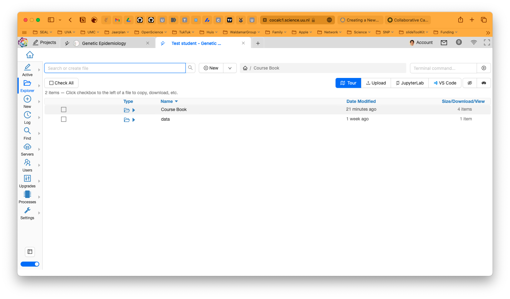
<p class="caption">(\#fig:cocalcstudentmain)CoCalc student page.</p>
</div>

In the _Course Book_ you'll find the handouts you need. In the share _data_ folder you will find the data you'll need. 

## But wait, what is CoCalc anyway?

[**CoCalc**](https://cocalc.com){target="_blank"} is an online platform that allows you to work with [**Jupyter Notebook**](https://jupyter.org/){target="_blank"}, `LaTeX`, and other tools. It is a great tool for working with data and code, and it is especially useful for collaborative work. 

## Okay, and what's a Jupyter Notebook?

Jupyter Notebook is an interactive environment for writing and running code, and at the same time, it allows you to add text, images, and other content to your document. This makes it a great tool for creating reports, tutorials, and presentations. Jupyter Notebook has support for over 40 programming languages, including those popular in Bioinformatics such as `Python` and `R`. 

## How does a Jupyter Notebook work?

A Jupyter Notebook is made up of cells. Some contain instructions, others contain lines of code, while others combine both (like this one). You can run each cell by selecting it and pressing `Shift+Enter`. The code in the cell will be executed, and the output will be displayed below the cell. A cell can be a 'code' cell, a `markdown` cell, or a raw 'text' cell.

- 'code' is for code from a given programming code, for instance `R` or `Python`;
- 'text' is for plain text;
- `markdown` is for `markdown` text; you can learn more about markdown [here](https://www.markdownguide.org/cheat-sheet/){target="_blank"}.

## And what is the Force behind a Jupyter Notebook?

Each notebook is associated with a single operating system called a _kernel_. A kernel is a program that runs and interprets the code you write in a notebook. It is responsible for executing the code and returning the results. Each kernel has its own environment and programming language, as well as its own set of libraries and packages. Luckily, for the purpose of this practical everything you need is installed. 

## How to use a Jupyter Notebook

Working with a Jupyter Notebook is easy. Here are a few tips to get you started:

- Some commands take a few seconds to run (indicated by a green dot left of the command), please wait for it as the next command usually won't run when the previous has not been executed.
- To restart from a fresh notebook, select **Restart and Clear Output** of the **Kernel**menu.
- To execute the current chunck of code, **click on the arrow (play button)** in the top bar or use **Shift+ENTER** (**CTRL+ENTER** also works).
- To add text (an answer to question for example), double-click or hit the return/enter key.
- To add a new cell, select **Insert Cell Below** from the **Insert** menu.
- To delete a cell, select **Delete Cell** from the **Edit** menu.
- To save your work, select **Save and Checkpoint** from the **File** menu.
- To download your work, select **Download as** from the **File** menu.

## Trouble shooting Juptyer Notebook

Sometimes somethings go awry for not apparent reason. Here are a few tips to get you back on track:

- When the command seems to freeze, you can interrupt the command by in the **Toolbar** going to **Kernel > Interrupt kernel**.
- If that doesn't help or CoCalc seems to crash, you can restart the kernel by selecting **Restart Kernel** from the **Kernel**-menu.

The great thing is, that after a freeze and restart, you can continue from where you were. But _always first_ go to the right directory again since the kernel doesn't remember your previously executed commands.

## CoCalc and this Practical Primer

In the course we use CoCalc as we can precisely control what is installed and what is not. And you don't have to worry about installing software or libraries. Another advantage is that you can work on the practical from anywhere, as long as you have an internet connection. And lastly, all the data you need is already there, so you don't have to worry about downloading it and we save a lot of space since you will all be working from the same source data.

This practical is associated with both the `R` and `bash` programming language. We use `plink`, which is a Linux-program in the Terminal (see \@ref(getting-started-programs)) and uses `bash`, so `plink` needs a `Bash` kernel. The data from the `plink` analyses are parsed and plotted using `R` code, and so we also need a `R` kernel. 

CoCalc has both kernels installed, so you could run both `bash` and `R` code in the same notebook. But the command to make this work is a bit complicated, so we decided to split the `bash` and `R` code into a virtual Terminal for the `bash` codes and a Jupyter Notebook with a `R` kernel for the `R` code. 

> This means you have to create a new notebook for the `R` code. And a new Terminal for the `bash` code. In the next section we explain how you can do this.

## Beginning your own Jupyter Notebook with a `R` kernel

For the course we need to create a Jupyter Notebook with a `R` kernel to create all the plots. To start your own notebook, you can do so by clicking on the _New_ button and selecting _Jupyter Notebook_.

<div class="figure" style="text-align: center">
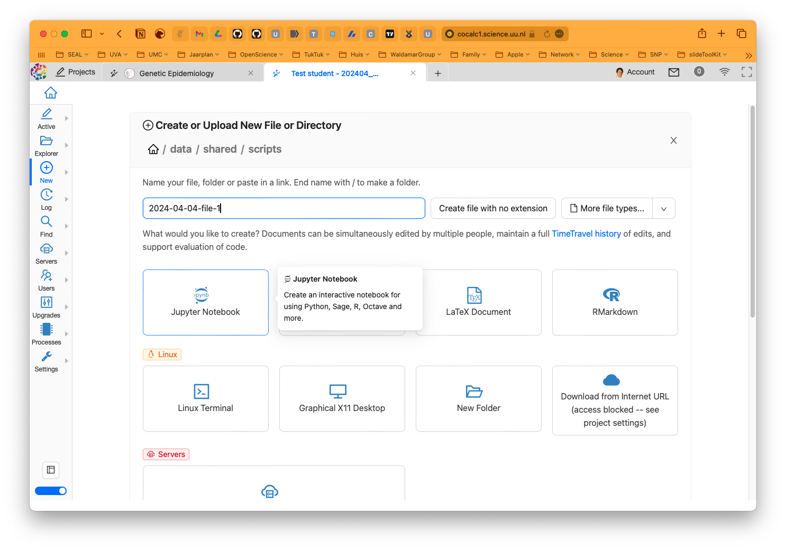
<p class="caption">(\#fig:cocalc_notebook)CoCalc new notebook.</p>
</div>

You will probably get a screen asking you to select a kernel. You should choose _R_.

<div class="figure" style="text-align: center">

<p class="caption">(\#fig:cocalcnotbookkernel)CoCalc kernel selection.</p>
</div>

Now you are ready to start your own `R` Notebook - like below. You can create a new 'cell' with format 'code' or 'text' or 'markdown' and start typing. 

<div class="figure" style="text-align: center">

<p class="caption">(\#fig:cocalcnotebookrmarkdown)CoCalc starting your notebook.</p>
</div>

You could get your working directory by typing `getwd()` in a cell and pressing `Shift+Enter`. 

<div class="figure" style="text-align: center">

<p class="caption">(\#fig:cocalcnotebookgetwd)CoCalc get working directory.</p>
</div>

Or you could list the contents of the working directory by typing `list.files()` or `dir()` in a cell and pressing `Shift+Enter`.

<div class="figure" style="text-align: center">
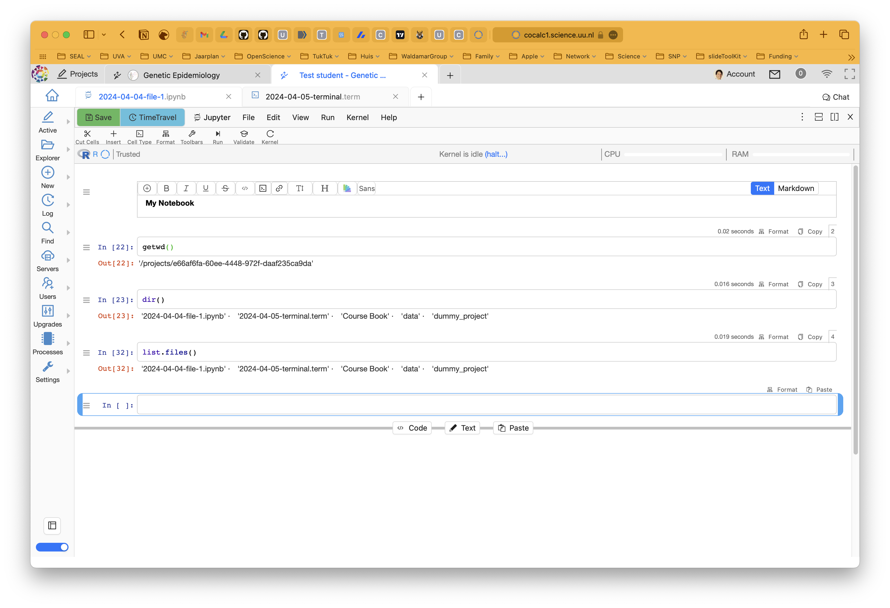
<p class="caption">(\#fig:cocalcnotebooklistfiles)CoCalc list files.</p>
</div>


You could also create a dummy plot with `R` in this notebook. 


<div class="figure" style="text-align: center">
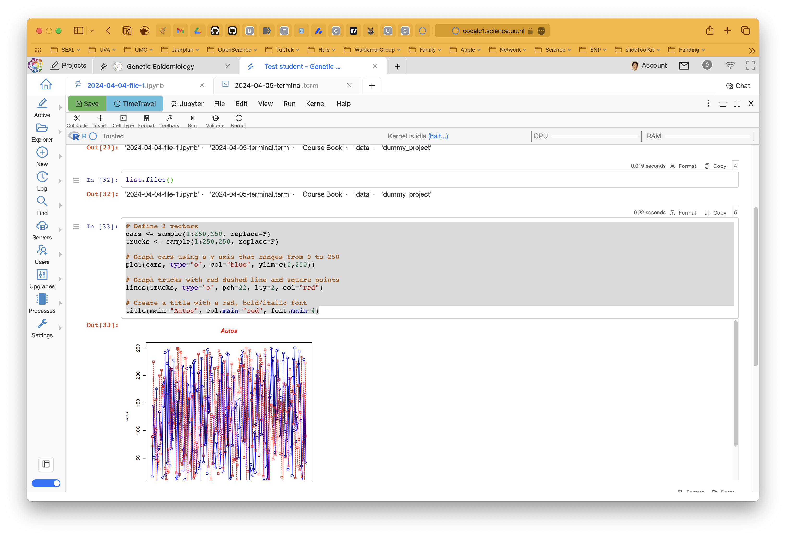
<p class="caption">(\#fig:cocalcnotebookplot)CoCalc plot.</p>
</div>

## Beginning your own Terminal for `bash` code

For the course we need to create a Terminal to run `bash` code. To start your own Terminal, you can do so by clicking on the _New_ button and selecting _Terminal_.

<div class="figure" style="text-align: center">
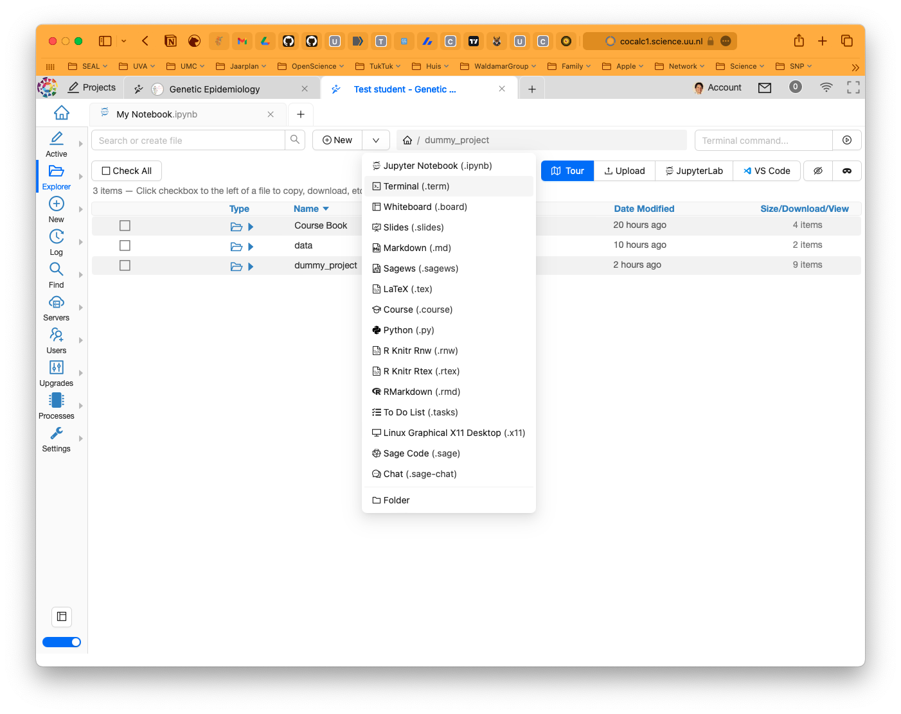
<p class="caption">(\#fig:cocalcterminalselect)CoCalc new terminal.</p>
</div>

Type in 'My Terminal' and hit the _Create_ button.

<div class="figure" style="text-align: center">
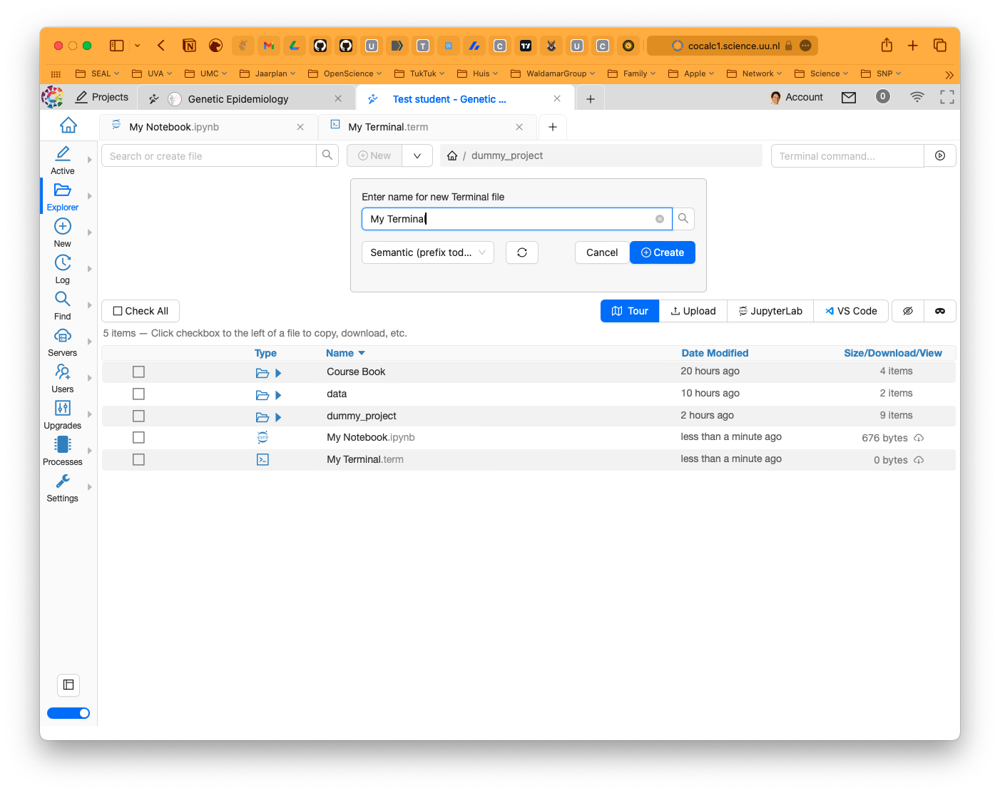
<p class="caption">(\#fig:cocalcterminalcreate)CoCalc new terminal creation.</p>
</div>

A new tab will open with a Terminal. 

<div class="figure" style="text-align: center">
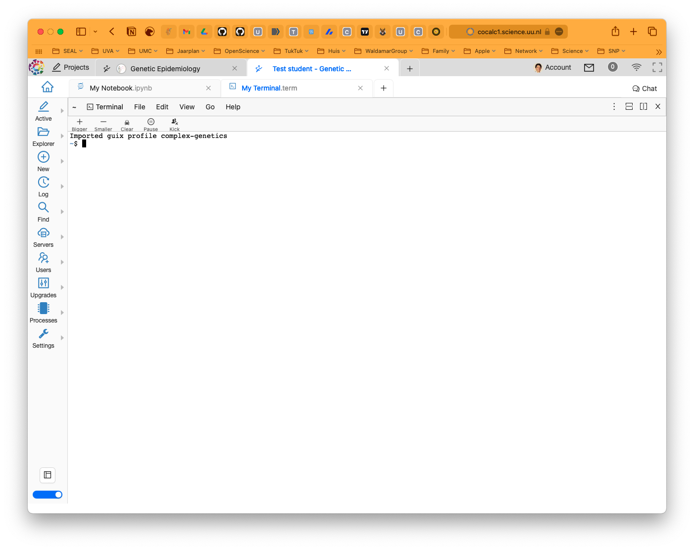
<p class="caption">(\#fig:cocalcterminalkernel)CoCalc terminal window.</p>
</div>

Now you can start typing your `bash` commands. Let's see what we have in the directory you're at by typing `ls`. Check  Chapter \@ref(getting-started-standalone) for more background on some common Terminal commands.

<div class="figure" style="text-align: center">
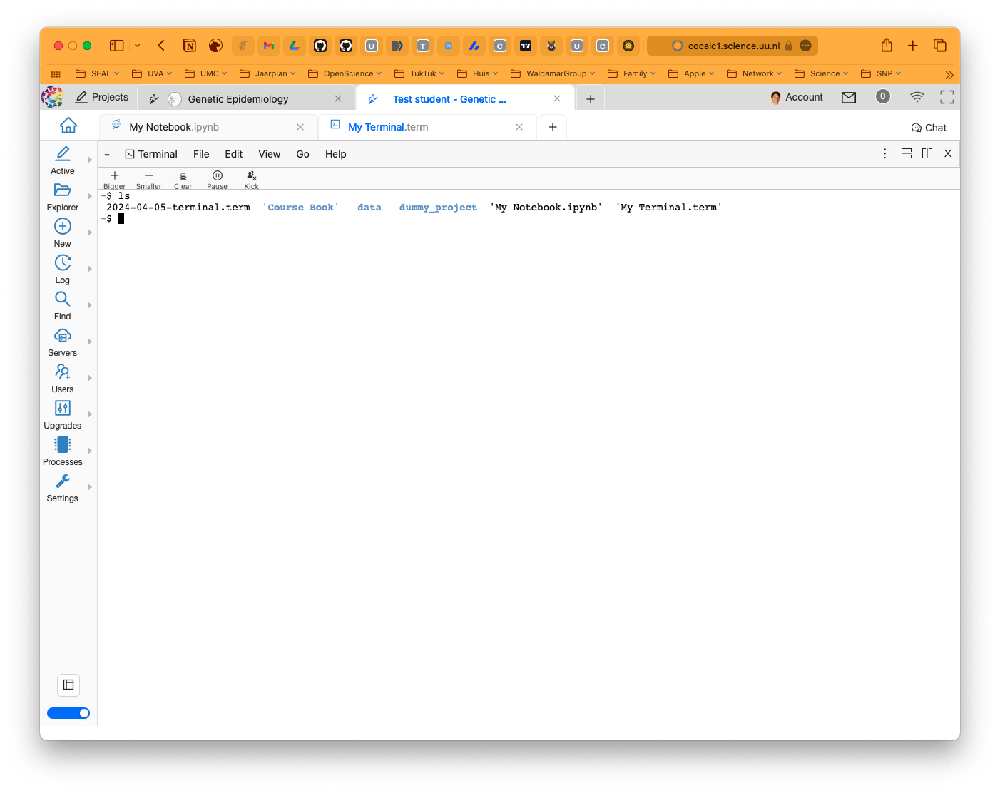
<p class="caption">(\#fig:cocalcterminalwindowls)CoCalc listing the contents of the directory.</p>
</div>
Let's review what we see here. First of all there are two colors, blue and black The blue ones are directories, the black ones are files. The directories are:

- `Course Book`, contains the handouts;
- `data`, contains the data you need for the course;
- `dummy_project`, contains the data for the dummy project.

The files are:

- `My Notebook.ipynb`, the Jupyter Notebook with a `R` kernel you just created;
- `My Terminal`, the terminal you just created which can handle the `bash` language and where you can run `plink`.

We can also list the contents of the data directory by typing `ls data/shared/` in the Terminal.

<div class="figure" style="text-align: center">
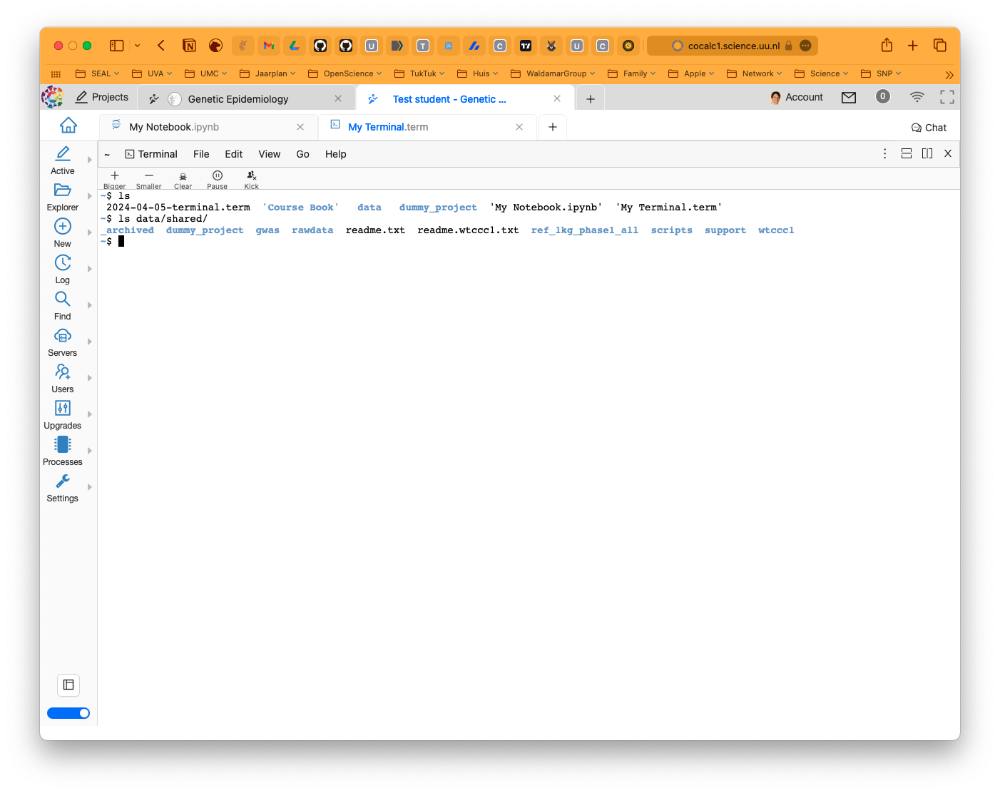
<p class="caption">(\#fig:cocalcterminalwindowdata)CoCalc terminal window.</p>
</div>

Let's check out the contents of the `readme.txt` file. 

<div class="figure" style="text-align: center">
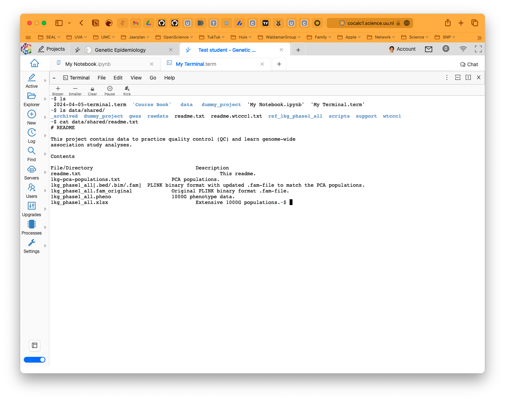
<p class="caption">(\#fig:cocalcterminalwindowreadme)CoCalc readme file.</p>
</div>

As I wrote, we installed `plink` for you, but just to be sure, let's check if it is installed. Type `plink` in the Terminal and press **ENTER**.

<div class="figure" style="text-align: center">
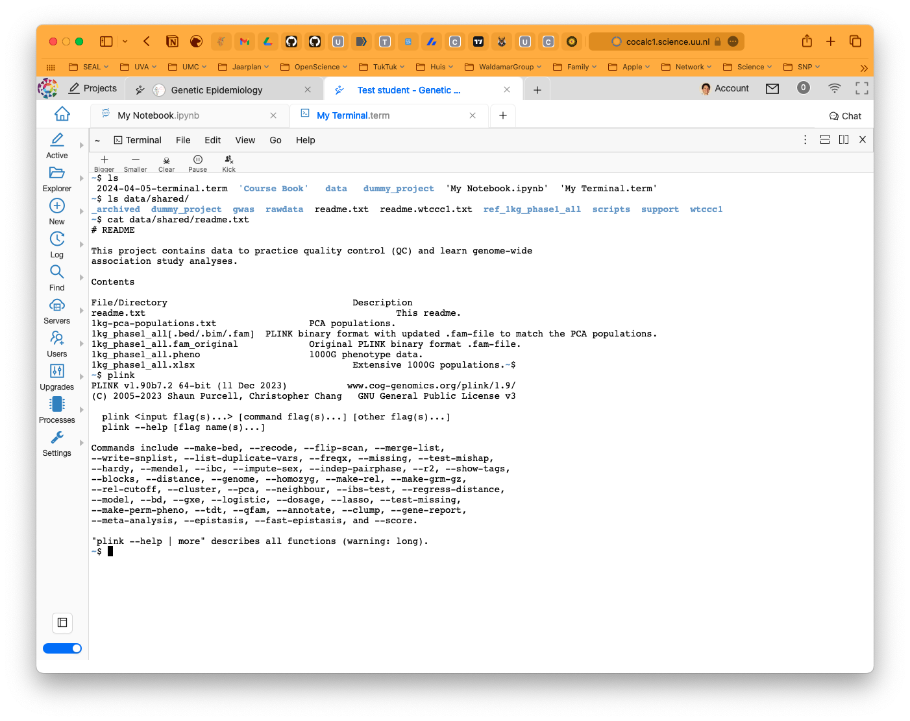
<p class="caption">(\#fig:cocalcterminalwindowplink)CoCalc plink.</p>
</div>

## This book and CoCalc

This book is designed to be used in conjunction with `bash` and `R` and it was tested on macOS and Linux. That said, the reference to some paths - that is the location of a file or directory - in the book might not be the same as in CoCalc. That's why I just showed you how to list the directories in your CoCalc Terminal. With the command `pwd` you can get the exact path where you are, and `./` represents 'the current directory'.

> You need to be aware of the paths in the book and the paths in CoCalc. 

For instance, in the book we refer to the path `~/Desktop/practical` as the location of the course data. In CoCalc this is `data/shared/`. So, for instance, in the book you would read `~/Desktop/practical/dummy_project`, but in CoCalc this is `data/shared/dummy_project`. 

And so, the `R` code below:

```
COURSE_loc = "~/Desktop/practical" # getwd()

sexissues <- data.table::fread(paste0(COURSE_loc,"/dummy_project/rawdata.sexprobs.txt"))
```

Becomes this in CoCalc:

```
COURSE_loc = "data/shared/" # getwd()

sexissues <- data.table::fread(paste0(COURSE_loc,"/dummy_project/rawdata.sexprobs.txt"))
```

> You need to be aware of this and adapt when necessary the paths before executing the `R` codes in your Jupyter Notebook.

Throughout the book you will find `plink` commands that you can run in the Terminal. You can copy these commands and paste them in the Terminal you just created. 

> But again, be aware of the paths and edit them accordingly. And remember, the `plink` commands are for the Terminal, not for the Jupyter Notebook.

## Are you ready?

Are you ready? Did you bring coffee and a good dose of energy? Let's start! 

Oh, one more thing: you don't worry about saving your notebook or the Terminal, the ones you just created, CoCalc will automatically save these. 

Ok. 'Nough said, let's move on to cover some basics in Chapter \@ref(gwas-basics).

<!-- ```{js, echo = FALSE} -->
<!-- title=document.getElementById('header'); -->
<!-- title.innerHTML = '' + title.innerHTML -->
<!-- ``` -->
