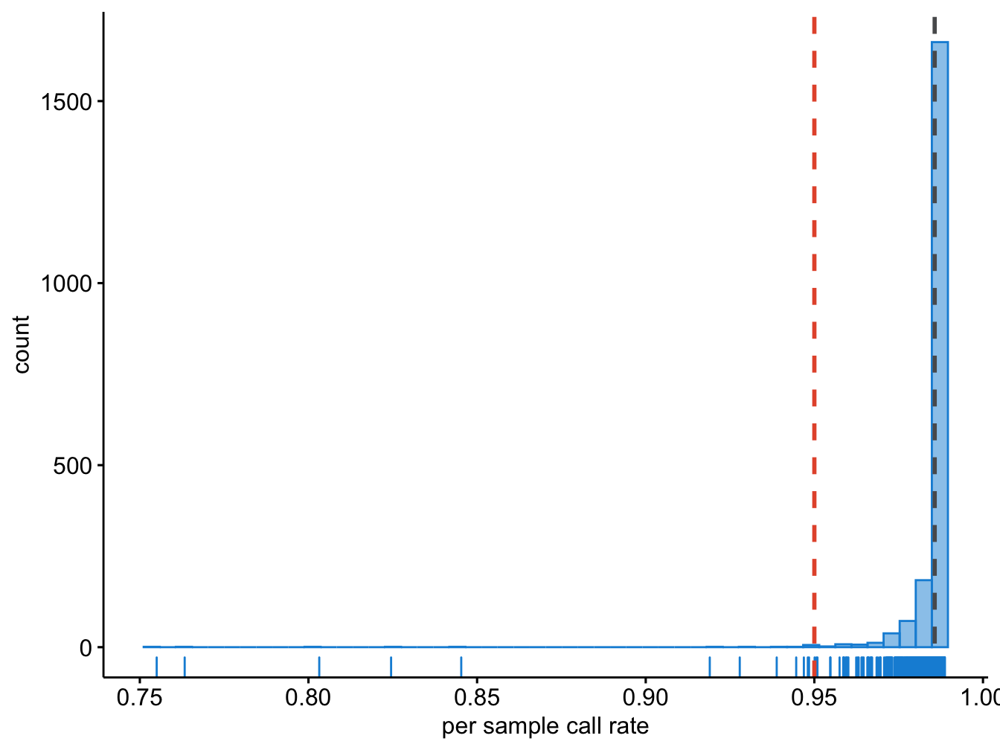

# Sample QC {#gwas-basics-sample-qc}
<!-- {width=70%} -->


Let's start with the per-sample quality control. The goal here is to identify all the samples that for some reason (mentioned in the previous section) should be excluded. 

## Sex
We need to identify of individuals with discordant sex information comparing phenotypic and genotypic data. Let's calculate the mean homozygosity rate across X-chromosome markers for each individual in the study.

```
plink --bfile dummy_project/rawdata --check-sex --out dummy_project/rawdata
```

This produces a file with the following columns:

- _FID_	Family ID
- _IID_	Within-family ID
- _PEDSEX_	Sex code in input file
- _SNPSEX_	Imputed sex code (1 = male, 2 = female, 0 = unknown)
- _STATUS_	'OK' if PEDSEX and SNPSEX match and are nonzero, 'PROBLEM' otherwise
- _F_	Inbreeding coefficient, considering only X chromosome. Not present with 'y-only'.
- _YCOUNT_	Number of nonmissing genotype calls on Y chromosome. Requires 'ycount'/'y-only'.


We need to get a list of individuals with discordant sex data.

```
cat dummy_project/rawdata.sexcheck | awk '$5 =="STATUS" || $5 =="PROBLEM"'  > dummy_project/rawdata.sexprobs.txt
```

Let's have a look at the results.

```
cat dummy_project/rawdata.sexprobs.txt
```


```{=html}
<div class="tabwid"><style>.cl-33a80f50{}.cl-33a231fc{font-family:'Helvetica';font-size:11pt;font-weight:normal;font-style:normal;text-decoration:none;color:rgba(0, 0, 0, 1.00);background-color:transparent;}.cl-33a45400{margin:0;text-align:right;border-bottom: 0 solid rgba(0, 0, 0, 1.00);border-top: 0 solid rgba(0, 0, 0, 1.00);border-left: 0 solid rgba(0, 0, 0, 1.00);border-right: 0 solid rgba(0, 0, 0, 1.00);padding-bottom:5pt;padding-top:5pt;padding-left:5pt;padding-right:5pt;line-height: 1;background-color:transparent;}.cl-33a4540a{margin:0;text-align:left;border-bottom: 0 solid rgba(0, 0, 0, 1.00);border-top: 0 solid rgba(0, 0, 0, 1.00);border-left: 0 solid rgba(0, 0, 0, 1.00);border-right: 0 solid rgba(0, 0, 0, 1.00);padding-bottom:5pt;padding-top:5pt;padding-left:5pt;padding-right:5pt;line-height: 1;background-color:transparent;}.cl-33a46562{width:0.568in;background-color:transparent;vertical-align: middle;border-bottom: 1.5pt solid rgba(102, 102, 102, 1.00);border-top: 1.5pt solid rgba(102, 102, 102, 1.00);border-left: 0 solid rgba(0, 0, 0, 1.00);border-right: 0 solid rgba(0, 0, 0, 1.00);margin-bottom:0;margin-top:0;margin-left:0;margin-right:0;}.cl-33a46563{width:0.805in;background-color:transparent;vertical-align: middle;border-bottom: 1.5pt solid rgba(102, 102, 102, 1.00);border-top: 1.5pt solid rgba(102, 102, 102, 1.00);border-left: 0 solid rgba(0, 0, 0, 1.00);border-right: 0 solid rgba(0, 0, 0, 1.00);margin-bottom:0;margin-top:0;margin-left:0;margin-right:0;}.cl-33a46580{width:0.932in;background-color:transparent;vertical-align: middle;border-bottom: 1.5pt solid rgba(102, 102, 102, 1.00);border-top: 1.5pt solid rgba(102, 102, 102, 1.00);border-left: 0 solid rgba(0, 0, 0, 1.00);border-right: 0 solid rgba(0, 0, 0, 1.00);margin-bottom:0;margin-top:0;margin-left:0;margin-right:0;}.cl-33a4658a{width:0.652in;background-color:transparent;vertical-align: middle;border-bottom: 1.5pt solid rgba(102, 102, 102, 1.00);border-top: 1.5pt solid rgba(102, 102, 102, 1.00);border-left: 0 solid rgba(0, 0, 0, 1.00);border-right: 0 solid rgba(0, 0, 0, 1.00);margin-bottom:0;margin-top:0;margin-left:0;margin-right:0;}.cl-33a4658b{width:0.568in;background-color:transparent;vertical-align: middle;border-bottom: 0 solid rgba(0, 0, 0, 1.00);border-top: 0 solid rgba(0, 0, 0, 1.00);border-left: 0 solid rgba(0, 0, 0, 1.00);border-right: 0 solid rgba(0, 0, 0, 1.00);margin-bottom:0;margin-top:0;margin-left:0;margin-right:0;}.cl-33a46594{width:0.805in;background-color:transparent;vertical-align: middle;border-bottom: 0 solid rgba(0, 0, 0, 1.00);border-top: 0 solid rgba(0, 0, 0, 1.00);border-left: 0 solid rgba(0, 0, 0, 1.00);border-right: 0 solid rgba(0, 0, 0, 1.00);margin-bottom:0;margin-top:0;margin-left:0;margin-right:0;}.cl-33a46595{width:0.932in;background-color:transparent;vertical-align: middle;border-bottom: 0 solid rgba(0, 0, 0, 1.00);border-top: 0 solid rgba(0, 0, 0, 1.00);border-left: 0 solid rgba(0, 0, 0, 1.00);border-right: 0 solid rgba(0, 0, 0, 1.00);margin-bottom:0;margin-top:0;margin-left:0;margin-right:0;}.cl-33a46596{width:0.652in;background-color:transparent;vertical-align: middle;border-bottom: 0 solid rgba(0, 0, 0, 1.00);border-top: 0 solid rgba(0, 0, 0, 1.00);border-left: 0 solid rgba(0, 0, 0, 1.00);border-right: 0 solid rgba(0, 0, 0, 1.00);margin-bottom:0;margin-top:0;margin-left:0;margin-right:0;}.cl-33a4659e{width:0.568in;background-color:transparent;vertical-align: middle;border-bottom: 1.5pt solid rgba(102, 102, 102, 1.00);border-top: 0 solid rgba(0, 0, 0, 1.00);border-left: 0 solid rgba(0, 0, 0, 1.00);border-right: 0 solid rgba(0, 0, 0, 1.00);margin-bottom:0;margin-top:0;margin-left:0;margin-right:0;}.cl-33a465a8{width:0.805in;background-color:transparent;vertical-align: middle;border-bottom: 1.5pt solid rgba(102, 102, 102, 1.00);border-top: 0 solid rgba(0, 0, 0, 1.00);border-left: 0 solid rgba(0, 0, 0, 1.00);border-right: 0 solid rgba(0, 0, 0, 1.00);margin-bottom:0;margin-top:0;margin-left:0;margin-right:0;}.cl-33a465a9{width:0.932in;background-color:transparent;vertical-align: middle;border-bottom: 1.5pt solid rgba(102, 102, 102, 1.00);border-top: 0 solid rgba(0, 0, 0, 1.00);border-left: 0 solid rgba(0, 0, 0, 1.00);border-right: 0 solid rgba(0, 0, 0, 1.00);margin-bottom:0;margin-top:0;margin-left:0;margin-right:0;}.cl-33a465aa{width:0.652in;background-color:transparent;vertical-align: middle;border-bottom: 1.5pt solid rgba(102, 102, 102, 1.00);border-top: 0 solid rgba(0, 0, 0, 1.00);border-left: 0 solid rgba(0, 0, 0, 1.00);border-right: 0 solid rgba(0, 0, 0, 1.00);margin-bottom:0;margin-top:0;margin-left:0;margin-right:0;}</style><table data-quarto-disable-processing='true' class='cl-33a80f50'>

```

<caption style="display:table-caption;">(\#tab:sexissues)<span>Sex issues.</span></caption>

```{=html}

<thead><tr style="overflow-wrap:break-word;"><th class="cl-33a46562"><p class="cl-33a45400"><span class="cl-33a231fc">FID</span></p></th><th class="cl-33a46562"><p class="cl-33a45400"><span class="cl-33a231fc">IID</span></p></th><th class="cl-33a46563"><p class="cl-33a45400"><span class="cl-33a231fc">PEDSEX</span></p></th><th class="cl-33a46563"><p class="cl-33a45400"><span class="cl-33a231fc">SNPSEX</span></p></th><th class="cl-33a46580"><p class="cl-33a4540a"><span class="cl-33a231fc">STATUS</span></p></th><th class="cl-33a4658a"><p class="cl-33a45400"><span class="cl-33a231fc">F</span></p></th></tr></thead><tbody><tr style="overflow-wrap:break-word;"><td class="cl-33a4658b"><p class="cl-33a45400"><span class="cl-33a231fc">772</span></p></td><td class="cl-33a4658b"><p class="cl-33a45400"><span class="cl-33a231fc">772</span></p></td><td class="cl-33a46594"><p class="cl-33a45400"><span class="cl-33a231fc">2</span></p></td><td class="cl-33a46594"><p class="cl-33a45400"><span class="cl-33a231fc">0</span></p></td><td class="cl-33a46595"><p class="cl-33a4540a"><span class="cl-33a231fc">PROBLEM</span></p></td><td class="cl-33a46596"><p class="cl-33a45400"><span class="cl-33a231fc">0.3084</span></p></td></tr><tr style="overflow-wrap:break-word;"><td class="cl-33a4658b"><p class="cl-33a45400"><span class="cl-33a231fc">853</span></p></td><td class="cl-33a4658b"><p class="cl-33a45400"><span class="cl-33a231fc">853</span></p></td><td class="cl-33a46594"><p class="cl-33a45400"><span class="cl-33a231fc">2</span></p></td><td class="cl-33a46594"><p class="cl-33a45400"><span class="cl-33a231fc">0</span></p></td><td class="cl-33a46595"><p class="cl-33a4540a"><span class="cl-33a231fc">PROBLEM</span></p></td><td class="cl-33a46596"><p class="cl-33a45400"><span class="cl-33a231fc">0.3666</span></p></td></tr><tr style="overflow-wrap:break-word;"><td class="cl-33a4659e"><p class="cl-33a45400"><span class="cl-33a231fc">1,920</span></p></td><td class="cl-33a4659e"><p class="cl-33a45400"><span class="cl-33a231fc">1,920</span></p></td><td class="cl-33a465a8"><p class="cl-33a45400"><span class="cl-33a231fc">2</span></p></td><td class="cl-33a465a8"><p class="cl-33a45400"><span class="cl-33a231fc">0</span></p></td><td class="cl-33a465a9"><p class="cl-33a4540a"><span class="cl-33a231fc">PROBLEM</span></p></td><td class="cl-33a465aa"><p class="cl-33a45400"><span class="cl-33a231fc">0.4066</span></p></td></tr></tbody></table></div>
```


When the homozygosity rate (_F_) is more than 0.2, but less than 0.8, the genotype data are inconclusive regarding the sex of an individual and these are marked in column _SNPSEX_ with a 0, and the column _STATUS_ "PROBLEM".

Report the IDs of individuals with discordant sex information (Table \@ref(tab:sexissues)) to those who conducted sex phenotyping. In situations in which discrepancy cannot be resolved, add the family ID (FID) and individual ID (IID) of the samples to a file named `fail-sexcheck-qc.txt` (one individual per line, tab delimited).

```
grep "PROBLEM" dummy_project/rawdata.sexcheck | awk '{ print $1, $2}'  > dummy_project/fail-sexcheck-qc.txt
```

## Sample call rates
Let's get an overview of the missing data per sample and per SNP.

```
plink --bfile dummy_project/rawdata --missing --out dummy_project/rawdata
```

This produces two files, `rawdata/rawdata.imiss` and `rawdata/rawdata.lmiss`. In the `.imiss`-file the _N_MISS_ column denotes the number of missing SNPs, and the _F_MISS_ column denotes the proportion of missing SNPs per individual.


The grey dashed line in Figure \@ref(fig:showsamplecallrate) indicates the mean call rate, while the red dashed line indicates the threshold we had determined above.

<div class="figure" style="text-align: center">

<p class="caption">(\#fig:showsamplecallrate)Per sample call rate.</p>
</div>


## Heterozygosity rate

To properly calculate heterozygosity rate and relatedness (identity-by-descent [IBD]) we need to do four things:

1) pre-clean the data to get a high-quality set,
2) of independent SNPs,
3) exclude long-range linkage disequilibrium (LD) blocks that bias with these calculations, and
4) exclude A/T and C/G SNPs as these may be ambivalent in interpretation when frequencies between cases and controls are close (MAF ± 0.45),
5) remove all non-autosomal SNPs.

You can find an up-to-date list of LD blocks you should exclude in these types of analyses [here](https://genome.sph.umich.edu/wiki/Regions_of_high_linkage_disequilibrium_(LD)){target="_blank"} for the different genome builds. In this case we are using build 37. For the purpose of this book we included a file with these regions in the `support`-directory.

We will use the following settings:

- remove A/T and C/G SNPs with the flag `--exclude dummy_project/all.atcg.variants.txt`,
- call rate <1% with the flag `--geno 0.10`,
- Hardy-Weinberg Equilibrium (HWE) p-value > 1x10-3 with the flag `--hwe 1e-3`,
- and MAF>10% with the flag `--maf 0.10 `,
- prune the data to only select independent SNPs (with low LD r^2) of one pair each with `r^2 = 0.2` with the flags `--indep-pairwise 100 10 0.2` and `--extract rawdata/raw-GWA-data.prune.in`,
- SNPs in long-range LD regions (for example: MHC chr 6 25.8-36Mb, chr 8 inversion 6-16Mb, chr17 40-45Mb, and a few more) with the flag `--exclude range support/exclude_problematic_range.txt`,
- remove non-autosomal SNPs with the flag `--autosome`.

First, get a list of A/T and C/G SNPs. Remember, the list of markers for this GWAS is noted in the `.bim` file. We can simply grep all the lines where the two alleles either have an A/T or C/G combination.

```
cat dummy_project/rawdata.bim | \
awk '($5 == "A" && $6 == "T") || ($5 == "T" && $6 == "A") || ($5 == "C" && $6 == "G") || ($5 == "G" && $6 == "C")' | awk '{ print $2, $1, $4, $3, $5, $6 }' \
> dummy_project/all.atcg.variants.txt
```

Second, clean the data and get a list of independent SNPs.

<!-- *NEXT YEAR: further explain the exact commands  and how they relate with the above. Is this needed? * -->

```
plink --bfile dummy_project/rawdata \
--autosome \
--maf 0.10 --geno 0.10 --hwe 1e-3 \
--indep-pairwise 100 10 0.2 \
--exclude range support/exclude_problematic_range.txt \
--make-bed --out dummy_project/rawdata.clean.temp
```

> Please note, we have create a dataset without taking into account LD structure. Hence, the message 'Pruned 0 variants from chromosome 1, leaving 19420.' etc. In a dataset without any LD structure this flag `--indep-pairwise 100 10 0.2` doesn't actually work. However, with real-data you can use it to prune out unwanted SNPs in high LD.

Third, exclude the pruned SNPs. Note, how we include a file to exclude high-LD for the purpose of the practical.

```
plink --bfile dummy_project/rawdata.clean.temp \
--extract rawdata/raw-GWA-data.prune.in \
--make-bed --out dummy_project/rawdata.clean.ultraclean.temp
```

Fourth, remove the A/T and C/G SNPs.

```
plink --bfile dummy_project/rawdata.clean.ultraclean.temp \
--exclude dummy_project/all.atcg.variants.txt \
--make-bed --out dummy_project/rawdata.clean.ultraclean
```

> Please note, this dataset doesn't actually include this type of SNP, hence `rawdata/all.atcg.variants.txt` is empty! Again, you can use this command in real-data to exclude A/T and C/G SNPs.

Lastly, remove the temporary files.

```
rm -fv dummy_project/*.temp*
```

Finally, we can calculate the heterozygosity rate.

```
plink --bfile dummy_project/rawdata.clean.ultraclean --het --out dummy_project/rawdata.clean.ultraclean
```

This creates the file `dummy_project/rawdata.clean.ultraclean.het`, in which the third column denotes the observed number of homozygous genotypes, O(Hom), and the fifth column denotes the number of nonmissing genotypes, N(NM), per individual. We can now calculate the observed heterozygosity rate per individual using the formula (N(NM) - O(Hom))/N(NM).

Often there is a correlation between heterozygosity rate and missing data. Thus, we should plot the observed heterozygosity rate per individual on the x-axis and the proportion of missing SNP, that is the 'SNP call rate', per individuals on the y-axis (Figure \@ref(fig:showheterozygosity)).


<!-- I prefer to use ggpubr, but I don't understand why this code doesn't work anymore...?!?! -->
<!-- ```{r heterozygosity, eval = FALSE} -->
<!-- ggpubr::ggscatter(raw_IMISSHET, x = "logF_MISS", y = "meanHet", -->
<!--                   colors = colors, -->
<!--                   xlab = "Proportion of missing genotypes", ylab = "Heterozygosity rate") + -->
<!--   scale_x_continuous(labels=c("-3" = "0.001", "-2" = "0.01", -->
<!--                               "-1" = "0.1", "0" = "1")) + -->
<!--   geom_hline(yintercept = lower_meanHet, linetype = "dashed", -->
<!--                 color = "#E55738", size = 1) + -->
<!--   geom_hline(yintercept = upper_meanHet, linetype = "dashed", -->
<!--                 color = "#E55738", size = 1) + -->
<!--   geom_vline(xintercept = prop_miss, linetype = "dashed", -->
<!--                 color = "#E55738", size = 1) -->
<!-- ``` -->

<div class="figure" style="text-align: center">

<p class="caption">(\#fig:showheterozygosity)Heterozygosity as a function of SNP call rate.</p>
</div>

Examine the plot (Figure \@ref(fig:showheterozygosity)) to decide reasonable thresholds at which to exclude individuals based on elevated missing or extreme heterozygosity. We chose to exclude all individuals with a genotype failure rate >= 0.03 (vertical dashed line) and/or a heterozygosity rate ± 3 s.d. from the mean (horizontal dashed lines). Add the FID and IID of the samples failing this QC to the file named `fail-imisshet-qc.txt`.

> How would you create this file?


If all is right, you'd have something like Table \@ref(tab:failedcallratehet).


```{=html}
<div class="tabwid"><style>.cl-33c62a58{}.cl-33be4c34{font-family:'Helvetica';font-size:11pt;font-weight:normal;font-style:normal;text-decoration:none;color:rgba(0, 0, 0, 1.00);background-color:transparent;}.cl-33c04b06{margin:0;text-align:right;border-bottom: 0 solid rgba(0, 0, 0, 1.00);border-top: 0 solid rgba(0, 0, 0, 1.00);border-left: 0 solid rgba(0, 0, 0, 1.00);border-right: 0 solid rgba(0, 0, 0, 1.00);padding-bottom:5pt;padding-top:5pt;padding-left:5pt;padding-right:5pt;line-height: 1;background-color:transparent;}.cl-33c059de{width:0.568in;background-color:transparent;vertical-align: middle;border-bottom: 1.5pt solid rgba(102, 102, 102, 1.00);border-top: 1.5pt solid rgba(102, 102, 102, 1.00);border-left: 0 solid rgba(0, 0, 0, 1.00);border-right: 0 solid rgba(0, 0, 0, 1.00);margin-bottom:0;margin-top:0;margin-left:0;margin-right:0;}.cl-33c059e8{width:0.568in;background-color:transparent;vertical-align: middle;border-bottom: 0 solid rgba(0, 0, 0, 1.00);border-top: 0 solid rgba(0, 0, 0, 1.00);border-left: 0 solid rgba(0, 0, 0, 1.00);border-right: 0 solid rgba(0, 0, 0, 1.00);margin-bottom:0;margin-top:0;margin-left:0;margin-right:0;}.cl-33c059e9{width:0.568in;background-color:transparent;vertical-align: middle;border-bottom: 0 solid rgba(0, 0, 0, 1.00);border-top: 0 solid rgba(0, 0, 0, 1.00);border-left: 0 solid rgba(0, 0, 0, 1.00);border-right: 0 solid rgba(0, 0, 0, 1.00);margin-bottom:0;margin-top:0;margin-left:0;margin-right:0;}.cl-33c059ea{width:0.568in;background-color:transparent;vertical-align: middle;border-bottom: 0 solid rgba(0, 0, 0, 1.00);border-top: 0 solid rgba(0, 0, 0, 1.00);border-left: 0 solid rgba(0, 0, 0, 1.00);border-right: 0 solid rgba(0, 0, 0, 1.00);margin-bottom:0;margin-top:0;margin-left:0;margin-right:0;}.cl-33c059f2{width:0.568in;background-color:transparent;vertical-align: middle;border-bottom: 0 solid rgba(0, 0, 0, 1.00);border-top: 0 solid rgba(0, 0, 0, 1.00);border-left: 0 solid rgba(0, 0, 0, 1.00);border-right: 0 solid rgba(0, 0, 0, 1.00);margin-bottom:0;margin-top:0;margin-left:0;margin-right:0;}.cl-33c05a10{width:0.568in;background-color:transparent;vertical-align: middle;border-bottom: 0 solid rgba(0, 0, 0, 1.00);border-top: 0 solid rgba(0, 0, 0, 1.00);border-left: 0 solid rgba(0, 0, 0, 1.00);border-right: 0 solid rgba(0, 0, 0, 1.00);margin-bottom:0;margin-top:0;margin-left:0;margin-right:0;}.cl-33c05a11{width:0.568in;background-color:transparent;vertical-align: middle;border-bottom: 0 solid rgba(0, 0, 0, 1.00);border-top: 0 solid rgba(0, 0, 0, 1.00);border-left: 0 solid rgba(0, 0, 0, 1.00);border-right: 0 solid rgba(0, 0, 0, 1.00);margin-bottom:0;margin-top:0;margin-left:0;margin-right:0;}.cl-33c05a1a{width:0.568in;background-color:transparent;vertical-align: middle;border-bottom: 0 solid rgba(0, 0, 0, 1.00);border-top: 0 solid rgba(0, 0, 0, 1.00);border-left: 0 solid rgba(0, 0, 0, 1.00);border-right: 0 solid rgba(0, 0, 0, 1.00);margin-bottom:0;margin-top:0;margin-left:0;margin-right:0;}.cl-33c05a1b{width:0.568in;background-color:transparent;vertical-align: middle;border-bottom: 0 solid rgba(0, 0, 0, 1.00);border-top: 0 solid rgba(0, 0, 0, 1.00);border-left: 0 solid rgba(0, 0, 0, 1.00);border-right: 0 solid rgba(0, 0, 0, 1.00);margin-bottom:0;margin-top:0;margin-left:0;margin-right:0;}.cl-33c05a24{width:0.568in;background-color:transparent;vertical-align: middle;border-bottom: 0 solid rgba(0, 0, 0, 1.00);border-top: 0 solid rgba(0, 0, 0, 1.00);border-left: 0 solid rgba(0, 0, 0, 1.00);border-right: 0 solid rgba(0, 0, 0, 1.00);margin-bottom:0;margin-top:0;margin-left:0;margin-right:0;}.cl-33c05a25{width:0.568in;background-color:transparent;vertical-align: middle;border-bottom: 0 solid rgba(0, 0, 0, 1.00);border-top: 0 solid rgba(0, 0, 0, 1.00);border-left: 0 solid rgba(0, 0, 0, 1.00);border-right: 0 solid rgba(0, 0, 0, 1.00);margin-bottom:0;margin-top:0;margin-left:0;margin-right:0;}.cl-33c05a26{width:0.568in;background-color:transparent;vertical-align: middle;border-bottom: 0 solid rgba(0, 0, 0, 1.00);border-top: 0 solid rgba(0, 0, 0, 1.00);border-left: 0 solid rgba(0, 0, 0, 1.00);border-right: 0 solid rgba(0, 0, 0, 1.00);margin-bottom:0;margin-top:0;margin-left:0;margin-right:0;}.cl-33c05a2e{width:0.568in;background-color:transparent;vertical-align: middle;border-bottom: 0 solid rgba(0, 0, 0, 1.00);border-top: 0 solid rgba(0, 0, 0, 1.00);border-left: 0 solid rgba(0, 0, 0, 1.00);border-right: 0 solid rgba(0, 0, 0, 1.00);margin-bottom:0;margin-top:0;margin-left:0;margin-right:0;}.cl-33c05a2f{width:0.568in;background-color:transparent;vertical-align: middle;border-bottom: 0 solid rgba(0, 0, 0, 1.00);border-top: 0 solid rgba(0, 0, 0, 1.00);border-left: 0 solid rgba(0, 0, 0, 1.00);border-right: 0 solid rgba(0, 0, 0, 1.00);margin-bottom:0;margin-top:0;margin-left:0;margin-right:0;}.cl-33c05a30{width:0.568in;background-color:transparent;vertical-align: middle;border-bottom: 0 solid rgba(0, 0, 0, 1.00);border-top: 0 solid rgba(0, 0, 0, 1.00);border-left: 0 solid rgba(0, 0, 0, 1.00);border-right: 0 solid rgba(0, 0, 0, 1.00);margin-bottom:0;margin-top:0;margin-left:0;margin-right:0;}.cl-33c05a38{width:0.568in;background-color:transparent;vertical-align: middle;border-bottom: 1.5pt solid rgba(102, 102, 102, 1.00);border-top: 0 solid rgba(0, 0, 0, 1.00);border-left: 0 solid rgba(0, 0, 0, 1.00);border-right: 0 solid rgba(0, 0, 0, 1.00);margin-bottom:0;margin-top:0;margin-left:0;margin-right:0;}</style><table data-quarto-disable-processing='true' class='cl-33c62a58'>

```

<caption style="display:table-caption;">(\#tab:failedcallratehet)<span>Failed samples due to sample call rates and heterozygosity rate.</span></caption>

```{=html}

<thead><tr style="overflow-wrap:break-word;"><th class="cl-33c059de"><p class="cl-33c04b06"><span class="cl-33be4c34">FID</span></p></th><th class="cl-33c059de"><p class="cl-33c04b06"><span class="cl-33be4c34">IID</span></p></th></tr></thead><tbody><tr style="overflow-wrap:break-word;"><td class="cl-33c059e8"><p class="cl-33c04b06"><span class="cl-33be4c34">28</span></p></td><td class="cl-33c059e8"><p class="cl-33c04b06"><span class="cl-33be4c34">28</span></p></td></tr><tr style="overflow-wrap:break-word;"><td class="cl-33c059e9"><p class="cl-33c04b06"><span class="cl-33be4c34">50</span></p></td><td class="cl-33c059e9"><p class="cl-33c04b06"><span class="cl-33be4c34">50</span></p></td></tr><tr style="overflow-wrap:break-word;"><td class="cl-33c059ea"><p class="cl-33c04b06"><span class="cl-33be4c34">52</span></p></td><td class="cl-33c059ea"><p class="cl-33c04b06"><span class="cl-33be4c34">52</span></p></td></tr><tr style="overflow-wrap:break-word;"><td class="cl-33c059ea"><p class="cl-33c04b06"><span class="cl-33be4c34">53</span></p></td><td class="cl-33c059ea"><p class="cl-33c04b06"><span class="cl-33be4c34">53</span></p></td></tr><tr style="overflow-wrap:break-word;"><td class="cl-33c059f2"><p class="cl-33c04b06"><span class="cl-33be4c34">67</span></p></td><td class="cl-33c059f2"><p class="cl-33c04b06"><span class="cl-33be4c34">67</span></p></td></tr><tr style="overflow-wrap:break-word;"><td class="cl-33c059e8"><p class="cl-33c04b06"><span class="cl-33be4c34">96</span></p></td><td class="cl-33c059e8"><p class="cl-33c04b06"><span class="cl-33be4c34">96</span></p></td></tr><tr style="overflow-wrap:break-word;"><td class="cl-33c05a10"><p class="cl-33c04b06"><span class="cl-33be4c34">205</span></p></td><td class="cl-33c05a10"><p class="cl-33c04b06"><span class="cl-33be4c34">205</span></p></td></tr><tr style="overflow-wrap:break-word;"><td class="cl-33c059e8"><p class="cl-33c04b06"><span class="cl-33be4c34">298</span></p></td><td class="cl-33c059e8"><p class="cl-33c04b06"><span class="cl-33be4c34">298</span></p></td></tr><tr style="overflow-wrap:break-word;"><td class="cl-33c059ea"><p class="cl-33c04b06"><span class="cl-33be4c34">310</span></p></td><td class="cl-33c059ea"><p class="cl-33c04b06"><span class="cl-33be4c34">310</span></p></td></tr><tr style="overflow-wrap:break-word;"><td class="cl-33c059ea"><p class="cl-33c04b06"><span class="cl-33be4c34">351</span></p></td><td class="cl-33c059ea"><p class="cl-33c04b06"><span class="cl-33be4c34">351</span></p></td></tr><tr style="overflow-wrap:break-word;"><td class="cl-33c059f2"><p class="cl-33c04b06"><span class="cl-33be4c34">404</span></p></td><td class="cl-33c059f2"><p class="cl-33c04b06"><span class="cl-33be4c34">404</span></p></td></tr><tr style="overflow-wrap:break-word;"><td class="cl-33c05a11"><p class="cl-33c04b06"><span class="cl-33be4c34">418</span></p></td><td class="cl-33c05a11"><p class="cl-33c04b06"><span class="cl-33be4c34">418</span></p></td></tr><tr style="overflow-wrap:break-word;"><td class="cl-33c05a10"><p class="cl-33c04b06"><span class="cl-33be4c34">423</span></p></td><td class="cl-33c05a10"><p class="cl-33c04b06"><span class="cl-33be4c34">423</span></p></td></tr><tr style="overflow-wrap:break-word;"><td class="cl-33c059e8"><p class="cl-33c04b06"><span class="cl-33be4c34">428</span></p></td><td class="cl-33c059e8"><p class="cl-33c04b06"><span class="cl-33be4c34">428</span></p></td></tr><tr style="overflow-wrap:break-word;"><td class="cl-33c05a1a"><p class="cl-33c04b06"><span class="cl-33be4c34">442</span></p></td><td class="cl-33c05a1a"><p class="cl-33c04b06"><span class="cl-33be4c34">442</span></p></td></tr><tr style="overflow-wrap:break-word;"><td class="cl-33c05a1b"><p class="cl-33c04b06"><span class="cl-33be4c34">444</span></p></td><td class="cl-33c05a1b"><p class="cl-33c04b06"><span class="cl-33be4c34">444</span></p></td></tr><tr style="overflow-wrap:break-word;"><td class="cl-33c05a11"><p class="cl-33c04b06"><span class="cl-33be4c34">548</span></p></td><td class="cl-33c05a11"><p class="cl-33c04b06"><span class="cl-33be4c34">548</span></p></td></tr><tr style="overflow-wrap:break-word;"><td class="cl-33c05a1a"><p class="cl-33c04b06"><span class="cl-33be4c34">772</span></p></td><td class="cl-33c05a1a"><p class="cl-33c04b06"><span class="cl-33be4c34">772</span></p></td></tr><tr style="overflow-wrap:break-word;"><td class="cl-33c05a11"><p class="cl-33c04b06"><span class="cl-33be4c34">835</span></p></td><td class="cl-33c05a11"><p class="cl-33c04b06"><span class="cl-33be4c34">835</span></p></td></tr><tr style="overflow-wrap:break-word;"><td class="cl-33c05a11"><p class="cl-33c04b06"><span class="cl-33be4c34">850</span></p></td><td class="cl-33c05a11"><p class="cl-33c04b06"><span class="cl-33be4c34">850</span></p></td></tr><tr style="overflow-wrap:break-word;"><td class="cl-33c05a11"><p class="cl-33c04b06"><span class="cl-33be4c34">853</span></p></td><td class="cl-33c05a11"><p class="cl-33c04b06"><span class="cl-33be4c34">853</span></p></td></tr><tr style="overflow-wrap:break-word;"><td class="cl-33c05a24"><p class="cl-33c04b06"><span class="cl-33be4c34">910</span></p></td><td class="cl-33c05a24"><p class="cl-33c04b06"><span class="cl-33be4c34">910</span></p></td></tr><tr style="overflow-wrap:break-word;"><td class="cl-33c05a24"><p class="cl-33c04b06"><span class="cl-33be4c34">939</span></p></td><td class="cl-33c05a24"><p class="cl-33c04b06"><span class="cl-33be4c34">939</span></p></td></tr><tr style="overflow-wrap:break-word;"><td class="cl-33c059e8"><p class="cl-33c04b06"><span class="cl-33be4c34">966</span></p></td><td class="cl-33c059e8"><p class="cl-33c04b06"><span class="cl-33be4c34">966</span></p></td></tr><tr style="overflow-wrap:break-word;"><td class="cl-33c05a25"><p class="cl-33c04b06"><span class="cl-33be4c34">968</span></p></td><td class="cl-33c05a25"><p class="cl-33c04b06"><span class="cl-33be4c34">968</span></p></td></tr><tr style="overflow-wrap:break-word;"><td class="cl-33c05a26"><p class="cl-33c04b06"><span class="cl-33be4c34">1,003</span></p></td><td class="cl-33c05a26"><p class="cl-33c04b06"><span class="cl-33be4c34">1,003</span></p></td></tr><tr style="overflow-wrap:break-word;"><td class="cl-33c05a2e"><p class="cl-33c04b06"><span class="cl-33be4c34">1,006</span></p></td><td class="cl-33c05a2e"><p class="cl-33c04b06"><span class="cl-33be4c34">1,006</span></p></td></tr><tr style="overflow-wrap:break-word;"><td class="cl-33c05a2f"><p class="cl-33c04b06"><span class="cl-33be4c34">1,045</span></p></td><td class="cl-33c05a2f"><p class="cl-33c04b06"><span class="cl-33be4c34">1,045</span></p></td></tr><tr style="overflow-wrap:break-word;"><td class="cl-33c05a2f"><p class="cl-33c04b06"><span class="cl-33be4c34">1,058</span></p></td><td class="cl-33c05a2f"><p class="cl-33c04b06"><span class="cl-33be4c34">1,058</span></p></td></tr><tr style="overflow-wrap:break-word;"><td class="cl-33c05a2f"><p class="cl-33c04b06"><span class="cl-33be4c34">1,154</span></p></td><td class="cl-33c05a2f"><p class="cl-33c04b06"><span class="cl-33be4c34">1,154</span></p></td></tr><tr style="overflow-wrap:break-word;"><td class="cl-33c05a2e"><p class="cl-33c04b06"><span class="cl-33be4c34">1,236</span></p></td><td class="cl-33c05a2e"><p class="cl-33c04b06"><span class="cl-33be4c34">1,236</span></p></td></tr><tr style="overflow-wrap:break-word;"><td class="cl-33c05a30"><p class="cl-33c04b06"><span class="cl-33be4c34">1,294</span></p></td><td class="cl-33c05a30"><p class="cl-33c04b06"><span class="cl-33be4c34">1,294</span></p></td></tr><tr style="overflow-wrap:break-word;"><td class="cl-33c05a26"><p class="cl-33c04b06"><span class="cl-33be4c34">1,395</span></p></td><td class="cl-33c05a26"><p class="cl-33c04b06"><span class="cl-33be4c34">1,395</span></p></td></tr><tr style="overflow-wrap:break-word;"><td class="cl-33c05a26"><p class="cl-33c04b06"><span class="cl-33be4c34">1,537</span></p></td><td class="cl-33c05a26"><p class="cl-33c04b06"><span class="cl-33be4c34">1,537</span></p></td></tr><tr style="overflow-wrap:break-word;"><td class="cl-33c05a2f"><p class="cl-33c04b06"><span class="cl-33be4c34">1,554</span></p></td><td class="cl-33c05a2f"><p class="cl-33c04b06"><span class="cl-33be4c34">1,554</span></p></td></tr><tr style="overflow-wrap:break-word;"><td class="cl-33c05a2f"><p class="cl-33c04b06"><span class="cl-33be4c34">1,587</span></p></td><td class="cl-33c05a2f"><p class="cl-33c04b06"><span class="cl-33be4c34">1,587</span></p></td></tr><tr style="overflow-wrap:break-word;"><td class="cl-33c05a2e"><p class="cl-33c04b06"><span class="cl-33be4c34">1,694</span></p></td><td class="cl-33c05a2e"><p class="cl-33c04b06"><span class="cl-33be4c34">1,694</span></p></td></tr><tr style="overflow-wrap:break-word;"><td class="cl-33c05a2f"><p class="cl-33c04b06"><span class="cl-33be4c34">1,789</span></p></td><td class="cl-33c05a2f"><p class="cl-33c04b06"><span class="cl-33be4c34">1,789</span></p></td></tr><tr style="overflow-wrap:break-word;"><td class="cl-33c05a30"><p class="cl-33c04b06"><span class="cl-33be4c34">1,832</span></p></td><td class="cl-33c05a30"><p class="cl-33c04b06"><span class="cl-33be4c34">1,832</span></p></td></tr><tr style="overflow-wrap:break-word;"><td class="cl-33c05a2e"><p class="cl-33c04b06"><span class="cl-33be4c34">1,866</span></p></td><td class="cl-33c05a2e"><p class="cl-33c04b06"><span class="cl-33be4c34">1,866</span></p></td></tr><tr style="overflow-wrap:break-word;"><td class="cl-33c05a2f"><p class="cl-33c04b06"><span class="cl-33be4c34">1,904</span></p></td><td class="cl-33c05a2f"><p class="cl-33c04b06"><span class="cl-33be4c34">1,904</span></p></td></tr><tr style="overflow-wrap:break-word;"><td class="cl-33c05a30"><p class="cl-33c04b06"><span class="cl-33be4c34">1,920</span></p></td><td class="cl-33c05a30"><p class="cl-33c04b06"><span class="cl-33be4c34">1,920</span></p></td></tr><tr style="overflow-wrap:break-word;"><td class="cl-33c05a26"><p class="cl-33c04b06"><span class="cl-33be4c34">1,951</span></p></td><td class="cl-33c05a26"><p class="cl-33c04b06"><span class="cl-33be4c34">1,951</span></p></td></tr><tr style="overflow-wrap:break-word;"><td class="cl-33c05a30"><p class="cl-33c04b06"><span class="cl-33be4c34">1,952</span></p></td><td class="cl-33c05a30"><p class="cl-33c04b06"><span class="cl-33be4c34">1,952</span></p></td></tr><tr style="overflow-wrap:break-word;"><td class="cl-33c05a26"><p class="cl-33c04b06"><span class="cl-33be4c34">1,953</span></p></td><td class="cl-33c05a26"><p class="cl-33c04b06"><span class="cl-33be4c34">1,953</span></p></td></tr><tr style="overflow-wrap:break-word;"><td class="cl-33c05a2f"><p class="cl-33c04b06"><span class="cl-33be4c34">1,954</span></p></td><td class="cl-33c05a2f"><p class="cl-33c04b06"><span class="cl-33be4c34">1,954</span></p></td></tr><tr style="overflow-wrap:break-word;"><td class="cl-33c05a26"><p class="cl-33c04b06"><span class="cl-33be4c34">1,955</span></p></td><td class="cl-33c05a26"><p class="cl-33c04b06"><span class="cl-33be4c34">1,955</span></p></td></tr><tr style="overflow-wrap:break-word;"><td class="cl-33c05a2f"><p class="cl-33c04b06"><span class="cl-33be4c34">1,981</span></p></td><td class="cl-33c05a2f"><p class="cl-33c04b06"><span class="cl-33be4c34">1,981</span></p></td></tr><tr style="overflow-wrap:break-word;"><td class="cl-33c05a2f"><p class="cl-33c04b06"><span class="cl-33be4c34">1,984</span></p></td><td class="cl-33c05a2f"><p class="cl-33c04b06"><span class="cl-33be4c34">1,984</span></p></td></tr><tr style="overflow-wrap:break-word;"><td class="cl-33c05a2f"><p class="cl-33c04b06"><span class="cl-33be4c34">1,985</span></p></td><td class="cl-33c05a2f"><p class="cl-33c04b06"><span class="cl-33be4c34">1,985</span></p></td></tr><tr style="overflow-wrap:break-word;"><td class="cl-33c05a38"><p class="cl-33c04b06"><span class="cl-33be4c34">1,986</span></p></td><td class="cl-33c05a38"><p class="cl-33c04b06"><span class="cl-33be4c34">1,986</span></p></td></tr></tbody></table></div>
```


## Relatedness
<!-- https://rpubs.com/EAVWing/symbols -->
We calculate Identity-by-Descent (IBS) to identify duplicated and related samples. In Table \@ref(tab:showrelatedness) we show how much DNA is shared between individuals depending on their relation[@staples2014]. IBS is measured by calculating pi-hat ($\widehat{\pi}$), which is in essence the proportion of the DNA that a pair of samples share. To calculate this, we needed this ultraclean dataset, without low-quality SNPs and without high-LD regions. 


```{=html}
<div class="tabwid"><style>.cl-33f0623c{}.cl-33ea2480{font-family:'Helvetica';font-size:11pt;font-weight:normal;font-style:normal;text-decoration:none;color:rgba(0, 0, 0, 1.00);background-color:transparent;}.cl-33ec8c02{margin:0;text-align:left;border-bottom: 0 solid rgba(0, 0, 0, 1.00);border-top: 0 solid rgba(0, 0, 0, 1.00);border-left: 0 solid rgba(0, 0, 0, 1.00);border-right: 0 solid rgba(0, 0, 0, 1.00);padding-bottom:5pt;padding-top:5pt;padding-left:5pt;padding-right:5pt;line-height: 1;background-color:transparent;}.cl-33ec8c0c{margin:0;text-align:right;border-bottom: 0 solid rgba(0, 0, 0, 1.00);border-top: 0 solid rgba(0, 0, 0, 1.00);border-left: 0 solid rgba(0, 0, 0, 1.00);border-right: 0 solid rgba(0, 0, 0, 1.00);padding-bottom:5pt;padding-top:5pt;padding-left:5pt;padding-right:5pt;line-height: 1;background-color:transparent;}.cl-33ec9b5c{width:4.109in;background-color:transparent;vertical-align: middle;border-bottom: 1.5pt solid rgba(102, 102, 102, 1.00);border-top: 1.5pt solid rgba(102, 102, 102, 1.00);border-left: 0 solid rgba(0, 0, 0, 1.00);border-right: 0 solid rgba(0, 0, 0, 1.00);margin-bottom:0;margin-top:0;margin-left:0;margin-right:0;}.cl-33ec9b66{width:1.23in;background-color:transparent;vertical-align: middle;border-bottom: 1.5pt solid rgba(102, 102, 102, 1.00);border-top: 1.5pt solid rgba(102, 102, 102, 1.00);border-left: 0 solid rgba(0, 0, 0, 1.00);border-right: 0 solid rgba(0, 0, 0, 1.00);margin-bottom:0;margin-top:0;margin-left:0;margin-right:0;}.cl-33ec9b67{width:0.737in;background-color:transparent;vertical-align: middle;border-bottom: 1.5pt solid rgba(102, 102, 102, 1.00);border-top: 1.5pt solid rgba(102, 102, 102, 1.00);border-left: 0 solid rgba(0, 0, 0, 1.00);border-right: 0 solid rgba(0, 0, 0, 1.00);margin-bottom:0;margin-top:0;margin-left:0;margin-right:0;}.cl-33ec9b70{width:0.805in;background-color:transparent;vertical-align: middle;border-bottom: 1.5pt solid rgba(102, 102, 102, 1.00);border-top: 1.5pt solid rgba(102, 102, 102, 1.00);border-left: 0 solid rgba(0, 0, 0, 1.00);border-right: 0 solid rgba(0, 0, 0, 1.00);margin-bottom:0;margin-top:0;margin-left:0;margin-right:0;}.cl-33ec9b71{width:0.525in;background-color:transparent;vertical-align: middle;border-bottom: 1.5pt solid rgba(102, 102, 102, 1.00);border-top: 1.5pt solid rgba(102, 102, 102, 1.00);border-left: 0 solid rgba(0, 0, 0, 1.00);border-right: 0 solid rgba(0, 0, 0, 1.00);margin-bottom:0;margin-top:0;margin-left:0;margin-right:0;}.cl-33ec9b7a{width:4.109in;background-color:transparent;vertical-align: middle;border-bottom: 0 solid rgba(0, 0, 0, 1.00);border-top: 0 solid rgba(0, 0, 0, 1.00);border-left: 0 solid rgba(0, 0, 0, 1.00);border-right: 0 solid rgba(0, 0, 0, 1.00);margin-bottom:0;margin-top:0;margin-left:0;margin-right:0;}.cl-33ec9b7b{width:1.23in;background-color:transparent;vertical-align: middle;border-bottom: 0 solid rgba(0, 0, 0, 1.00);border-top: 0 solid rgba(0, 0, 0, 1.00);border-left: 0 solid rgba(0, 0, 0, 1.00);border-right: 0 solid rgba(0, 0, 0, 1.00);margin-bottom:0;margin-top:0;margin-left:0;margin-right:0;}.cl-33ec9b84{width:0.737in;background-color:transparent;vertical-align: middle;border-bottom: 0 solid rgba(0, 0, 0, 1.00);border-top: 0 solid rgba(0, 0, 0, 1.00);border-left: 0 solid rgba(0, 0, 0, 1.00);border-right: 0 solid rgba(0, 0, 0, 1.00);margin-bottom:0;margin-top:0;margin-left:0;margin-right:0;}.cl-33ec9b85{width:0.805in;background-color:transparent;vertical-align: middle;border-bottom: 0 solid rgba(0, 0, 0, 1.00);border-top: 0 solid rgba(0, 0, 0, 1.00);border-left: 0 solid rgba(0, 0, 0, 1.00);border-right: 0 solid rgba(0, 0, 0, 1.00);margin-bottom:0;margin-top:0;margin-left:0;margin-right:0;}.cl-33ec9b8e{width:0.525in;background-color:transparent;vertical-align: middle;border-bottom: 0 solid rgba(0, 0, 0, 1.00);border-top: 0 solid rgba(0, 0, 0, 1.00);border-left: 0 solid rgba(0, 0, 0, 1.00);border-right: 0 solid rgba(0, 0, 0, 1.00);margin-bottom:0;margin-top:0;margin-left:0;margin-right:0;}.cl-33ec9b8f{width:4.109in;background-color:transparent;vertical-align: middle;border-bottom: 0 solid rgba(0, 0, 0, 1.00);border-top: 0 solid rgba(0, 0, 0, 1.00);border-left: 0 solid rgba(0, 0, 0, 1.00);border-right: 0 solid rgba(0, 0, 0, 1.00);margin-bottom:0;margin-top:0;margin-left:0;margin-right:0;}.cl-33ec9b98{width:1.23in;background-color:transparent;vertical-align: middle;border-bottom: 0 solid rgba(0, 0, 0, 1.00);border-top: 0 solid rgba(0, 0, 0, 1.00);border-left: 0 solid rgba(0, 0, 0, 1.00);border-right: 0 solid rgba(0, 0, 0, 1.00);margin-bottom:0;margin-top:0;margin-left:0;margin-right:0;}.cl-33ec9b99{width:0.737in;background-color:transparent;vertical-align: middle;border-bottom: 0 solid rgba(0, 0, 0, 1.00);border-top: 0 solid rgba(0, 0, 0, 1.00);border-left: 0 solid rgba(0, 0, 0, 1.00);border-right: 0 solid rgba(0, 0, 0, 1.00);margin-bottom:0;margin-top:0;margin-left:0;margin-right:0;}.cl-33ec9ba2{width:0.805in;background-color:transparent;vertical-align: middle;border-bottom: 0 solid rgba(0, 0, 0, 1.00);border-top: 0 solid rgba(0, 0, 0, 1.00);border-left: 0 solid rgba(0, 0, 0, 1.00);border-right: 0 solid rgba(0, 0, 0, 1.00);margin-bottom:0;margin-top:0;margin-left:0;margin-right:0;}.cl-33ec9ba3{width:0.525in;background-color:transparent;vertical-align: middle;border-bottom: 0 solid rgba(0, 0, 0, 1.00);border-top: 0 solid rgba(0, 0, 0, 1.00);border-left: 0 solid rgba(0, 0, 0, 1.00);border-right: 0 solid rgba(0, 0, 0, 1.00);margin-bottom:0;margin-top:0;margin-left:0;margin-right:0;}.cl-33ec9ba4{width:4.109in;background-color:transparent;vertical-align: middle;border-bottom: 0 solid rgba(0, 0, 0, 1.00);border-top: 0 solid rgba(0, 0, 0, 1.00);border-left: 0 solid rgba(0, 0, 0, 1.00);border-right: 0 solid rgba(0, 0, 0, 1.00);margin-bottom:0;margin-top:0;margin-left:0;margin-right:0;}.cl-33ec9bac{width:1.23in;background-color:transparent;vertical-align: middle;border-bottom: 0 solid rgba(0, 0, 0, 1.00);border-top: 0 solid rgba(0, 0, 0, 1.00);border-left: 0 solid rgba(0, 0, 0, 1.00);border-right: 0 solid rgba(0, 0, 0, 1.00);margin-bottom:0;margin-top:0;margin-left:0;margin-right:0;}.cl-33ec9bad{width:0.737in;background-color:transparent;vertical-align: middle;border-bottom: 0 solid rgba(0, 0, 0, 1.00);border-top: 0 solid rgba(0, 0, 0, 1.00);border-left: 0 solid rgba(0, 0, 0, 1.00);border-right: 0 solid rgba(0, 0, 0, 1.00);margin-bottom:0;margin-top:0;margin-left:0;margin-right:0;}.cl-33ec9bb6{width:0.805in;background-color:transparent;vertical-align: middle;border-bottom: 0 solid rgba(0, 0, 0, 1.00);border-top: 0 solid rgba(0, 0, 0, 1.00);border-left: 0 solid rgba(0, 0, 0, 1.00);border-right: 0 solid rgba(0, 0, 0, 1.00);margin-bottom:0;margin-top:0;margin-left:0;margin-right:0;}.cl-33ec9bb7{width:0.525in;background-color:transparent;vertical-align: middle;border-bottom: 0 solid rgba(0, 0, 0, 1.00);border-top: 0 solid rgba(0, 0, 0, 1.00);border-left: 0 solid rgba(0, 0, 0, 1.00);border-right: 0 solid rgba(0, 0, 0, 1.00);margin-bottom:0;margin-top:0;margin-left:0;margin-right:0;}.cl-33ec9bc0{width:4.109in;background-color:transparent;vertical-align: middle;border-bottom: 0 solid rgba(0, 0, 0, 1.00);border-top: 0 solid rgba(0, 0, 0, 1.00);border-left: 0 solid rgba(0, 0, 0, 1.00);border-right: 0 solid rgba(0, 0, 0, 1.00);margin-bottom:0;margin-top:0;margin-left:0;margin-right:0;}.cl-33ec9bc1{width:1.23in;background-color:transparent;vertical-align: middle;border-bottom: 0 solid rgba(0, 0, 0, 1.00);border-top: 0 solid rgba(0, 0, 0, 1.00);border-left: 0 solid rgba(0, 0, 0, 1.00);border-right: 0 solid rgba(0, 0, 0, 1.00);margin-bottom:0;margin-top:0;margin-left:0;margin-right:0;}.cl-33ec9bca{width:0.737in;background-color:transparent;vertical-align: middle;border-bottom: 0 solid rgba(0, 0, 0, 1.00);border-top: 0 solid rgba(0, 0, 0, 1.00);border-left: 0 solid rgba(0, 0, 0, 1.00);border-right: 0 solid rgba(0, 0, 0, 1.00);margin-bottom:0;margin-top:0;margin-left:0;margin-right:0;}.cl-33ec9bcb{width:0.805in;background-color:transparent;vertical-align: middle;border-bottom: 0 solid rgba(0, 0, 0, 1.00);border-top: 0 solid rgba(0, 0, 0, 1.00);border-left: 0 solid rgba(0, 0, 0, 1.00);border-right: 0 solid rgba(0, 0, 0, 1.00);margin-bottom:0;margin-top:0;margin-left:0;margin-right:0;}.cl-33ec9bcc{width:0.525in;background-color:transparent;vertical-align: middle;border-bottom: 0 solid rgba(0, 0, 0, 1.00);border-top: 0 solid rgba(0, 0, 0, 1.00);border-left: 0 solid rgba(0, 0, 0, 1.00);border-right: 0 solid rgba(0, 0, 0, 1.00);margin-bottom:0;margin-top:0;margin-left:0;margin-right:0;}.cl-33ec9bd4{width:4.109in;background-color:transparent;vertical-align: middle;border-bottom: 0 solid rgba(0, 0, 0, 1.00);border-top: 0 solid rgba(0, 0, 0, 1.00);border-left: 0 solid rgba(0, 0, 0, 1.00);border-right: 0 solid rgba(0, 0, 0, 1.00);margin-bottom:0;margin-top:0;margin-left:0;margin-right:0;}.cl-33ec9bd5{width:1.23in;background-color:transparent;vertical-align: middle;border-bottom: 0 solid rgba(0, 0, 0, 1.00);border-top: 0 solid rgba(0, 0, 0, 1.00);border-left: 0 solid rgba(0, 0, 0, 1.00);border-right: 0 solid rgba(0, 0, 0, 1.00);margin-bottom:0;margin-top:0;margin-left:0;margin-right:0;}.cl-33ec9bde{width:0.737in;background-color:transparent;vertical-align: middle;border-bottom: 0 solid rgba(0, 0, 0, 1.00);border-top: 0 solid rgba(0, 0, 0, 1.00);border-left: 0 solid rgba(0, 0, 0, 1.00);border-right: 0 solid rgba(0, 0, 0, 1.00);margin-bottom:0;margin-top:0;margin-left:0;margin-right:0;}.cl-33ec9bdf{width:0.805in;background-color:transparent;vertical-align: middle;border-bottom: 0 solid rgba(0, 0, 0, 1.00);border-top: 0 solid rgba(0, 0, 0, 1.00);border-left: 0 solid rgba(0, 0, 0, 1.00);border-right: 0 solid rgba(0, 0, 0, 1.00);margin-bottom:0;margin-top:0;margin-left:0;margin-right:0;}.cl-33ec9be8{width:0.525in;background-color:transparent;vertical-align: middle;border-bottom: 0 solid rgba(0, 0, 0, 1.00);border-top: 0 solid rgba(0, 0, 0, 1.00);border-left: 0 solid rgba(0, 0, 0, 1.00);border-right: 0 solid rgba(0, 0, 0, 1.00);margin-bottom:0;margin-top:0;margin-left:0;margin-right:0;}.cl-33ec9be9{width:4.109in;background-color:transparent;vertical-align: middle;border-bottom: 0 solid rgba(0, 0, 0, 1.00);border-top: 0 solid rgba(0, 0, 0, 1.00);border-left: 0 solid rgba(0, 0, 0, 1.00);border-right: 0 solid rgba(0, 0, 0, 1.00);margin-bottom:0;margin-top:0;margin-left:0;margin-right:0;}.cl-33ec9bf2{width:1.23in;background-color:transparent;vertical-align: middle;border-bottom: 0 solid rgba(0, 0, 0, 1.00);border-top: 0 solid rgba(0, 0, 0, 1.00);border-left: 0 solid rgba(0, 0, 0, 1.00);border-right: 0 solid rgba(0, 0, 0, 1.00);margin-bottom:0;margin-top:0;margin-left:0;margin-right:0;}.cl-33ec9bf3{width:0.737in;background-color:transparent;vertical-align: middle;border-bottom: 0 solid rgba(0, 0, 0, 1.00);border-top: 0 solid rgba(0, 0, 0, 1.00);border-left: 0 solid rgba(0, 0, 0, 1.00);border-right: 0 solid rgba(0, 0, 0, 1.00);margin-bottom:0;margin-top:0;margin-left:0;margin-right:0;}.cl-33ec9bfc{width:0.805in;background-color:transparent;vertical-align: middle;border-bottom: 0 solid rgba(0, 0, 0, 1.00);border-top: 0 solid rgba(0, 0, 0, 1.00);border-left: 0 solid rgba(0, 0, 0, 1.00);border-right: 0 solid rgba(0, 0, 0, 1.00);margin-bottom:0;margin-top:0;margin-left:0;margin-right:0;}.cl-33ec9bfd{width:0.525in;background-color:transparent;vertical-align: middle;border-bottom: 0 solid rgba(0, 0, 0, 1.00);border-top: 0 solid rgba(0, 0, 0, 1.00);border-left: 0 solid rgba(0, 0, 0, 1.00);border-right: 0 solid rgba(0, 0, 0, 1.00);margin-bottom:0;margin-top:0;margin-left:0;margin-right:0;}.cl-33ec9c06{width:4.109in;background-color:transparent;vertical-align: middle;border-bottom: 0 solid rgba(0, 0, 0, 1.00);border-top: 0 solid rgba(0, 0, 0, 1.00);border-left: 0 solid rgba(0, 0, 0, 1.00);border-right: 0 solid rgba(0, 0, 0, 1.00);margin-bottom:0;margin-top:0;margin-left:0;margin-right:0;}.cl-33ec9c07{width:1.23in;background-color:transparent;vertical-align: middle;border-bottom: 0 solid rgba(0, 0, 0, 1.00);border-top: 0 solid rgba(0, 0, 0, 1.00);border-left: 0 solid rgba(0, 0, 0, 1.00);border-right: 0 solid rgba(0, 0, 0, 1.00);margin-bottom:0;margin-top:0;margin-left:0;margin-right:0;}.cl-33ec9c08{width:0.737in;background-color:transparent;vertical-align: middle;border-bottom: 0 solid rgba(0, 0, 0, 1.00);border-top: 0 solid rgba(0, 0, 0, 1.00);border-left: 0 solid rgba(0, 0, 0, 1.00);border-right: 0 solid rgba(0, 0, 0, 1.00);margin-bottom:0;margin-top:0;margin-left:0;margin-right:0;}.cl-33ec9c10{width:0.805in;background-color:transparent;vertical-align: middle;border-bottom: 0 solid rgba(0, 0, 0, 1.00);border-top: 0 solid rgba(0, 0, 0, 1.00);border-left: 0 solid rgba(0, 0, 0, 1.00);border-right: 0 solid rgba(0, 0, 0, 1.00);margin-bottom:0;margin-top:0;margin-left:0;margin-right:0;}.cl-33ec9c11{width:0.525in;background-color:transparent;vertical-align: middle;border-bottom: 0 solid rgba(0, 0, 0, 1.00);border-top: 0 solid rgba(0, 0, 0, 1.00);border-left: 0 solid rgba(0, 0, 0, 1.00);border-right: 0 solid rgba(0, 0, 0, 1.00);margin-bottom:0;margin-top:0;margin-left:0;margin-right:0;}.cl-33ec9c1a{width:4.109in;background-color:transparent;vertical-align: middle;border-bottom: 0 solid rgba(0, 0, 0, 1.00);border-top: 0 solid rgba(0, 0, 0, 1.00);border-left: 0 solid rgba(0, 0, 0, 1.00);border-right: 0 solid rgba(0, 0, 0, 1.00);margin-bottom:0;margin-top:0;margin-left:0;margin-right:0;}.cl-33ec9c1b{width:1.23in;background-color:transparent;vertical-align: middle;border-bottom: 0 solid rgba(0, 0, 0, 1.00);border-top: 0 solid rgba(0, 0, 0, 1.00);border-left: 0 solid rgba(0, 0, 0, 1.00);border-right: 0 solid rgba(0, 0, 0, 1.00);margin-bottom:0;margin-top:0;margin-left:0;margin-right:0;}.cl-33ec9c1c{width:0.737in;background-color:transparent;vertical-align: middle;border-bottom: 0 solid rgba(0, 0, 0, 1.00);border-top: 0 solid rgba(0, 0, 0, 1.00);border-left: 0 solid rgba(0, 0, 0, 1.00);border-right: 0 solid rgba(0, 0, 0, 1.00);margin-bottom:0;margin-top:0;margin-left:0;margin-right:0;}.cl-33ec9c24{width:0.805in;background-color:transparent;vertical-align: middle;border-bottom: 0 solid rgba(0, 0, 0, 1.00);border-top: 0 solid rgba(0, 0, 0, 1.00);border-left: 0 solid rgba(0, 0, 0, 1.00);border-right: 0 solid rgba(0, 0, 0, 1.00);margin-bottom:0;margin-top:0;margin-left:0;margin-right:0;}.cl-33ec9c25{width:0.525in;background-color:transparent;vertical-align: middle;border-bottom: 0 solid rgba(0, 0, 0, 1.00);border-top: 0 solid rgba(0, 0, 0, 1.00);border-left: 0 solid rgba(0, 0, 0, 1.00);border-right: 0 solid rgba(0, 0, 0, 1.00);margin-bottom:0;margin-top:0;margin-left:0;margin-right:0;}.cl-33ec9c2e{width:4.109in;background-color:transparent;vertical-align: middle;border-bottom: 0 solid rgba(0, 0, 0, 1.00);border-top: 0 solid rgba(0, 0, 0, 1.00);border-left: 0 solid rgba(0, 0, 0, 1.00);border-right: 0 solid rgba(0, 0, 0, 1.00);margin-bottom:0;margin-top:0;margin-left:0;margin-right:0;}.cl-33ec9c2f{width:1.23in;background-color:transparent;vertical-align: middle;border-bottom: 0 solid rgba(0, 0, 0, 1.00);border-top: 0 solid rgba(0, 0, 0, 1.00);border-left: 0 solid rgba(0, 0, 0, 1.00);border-right: 0 solid rgba(0, 0, 0, 1.00);margin-bottom:0;margin-top:0;margin-left:0;margin-right:0;}.cl-33ec9c38{width:0.737in;background-color:transparent;vertical-align: middle;border-bottom: 0 solid rgba(0, 0, 0, 1.00);border-top: 0 solid rgba(0, 0, 0, 1.00);border-left: 0 solid rgba(0, 0, 0, 1.00);border-right: 0 solid rgba(0, 0, 0, 1.00);margin-bottom:0;margin-top:0;margin-left:0;margin-right:0;}.cl-33ec9c39{width:0.805in;background-color:transparent;vertical-align: middle;border-bottom: 0 solid rgba(0, 0, 0, 1.00);border-top: 0 solid rgba(0, 0, 0, 1.00);border-left: 0 solid rgba(0, 0, 0, 1.00);border-right: 0 solid rgba(0, 0, 0, 1.00);margin-bottom:0;margin-top:0;margin-left:0;margin-right:0;}.cl-33ec9c3a{width:0.525in;background-color:transparent;vertical-align: middle;border-bottom: 0 solid rgba(0, 0, 0, 1.00);border-top: 0 solid rgba(0, 0, 0, 1.00);border-left: 0 solid rgba(0, 0, 0, 1.00);border-right: 0 solid rgba(0, 0, 0, 1.00);margin-bottom:0;margin-top:0;margin-left:0;margin-right:0;}.cl-33ec9c42{width:4.109in;background-color:transparent;vertical-align: middle;border-bottom: 1.5pt solid rgba(102, 102, 102, 1.00);border-top: 0 solid rgba(0, 0, 0, 1.00);border-left: 0 solid rgba(0, 0, 0, 1.00);border-right: 0 solid rgba(0, 0, 0, 1.00);margin-bottom:0;margin-top:0;margin-left:0;margin-right:0;}.cl-33ec9c4c{width:1.23in;background-color:transparent;vertical-align: middle;border-bottom: 1.5pt solid rgba(102, 102, 102, 1.00);border-top: 0 solid rgba(0, 0, 0, 1.00);border-left: 0 solid rgba(0, 0, 0, 1.00);border-right: 0 solid rgba(0, 0, 0, 1.00);margin-bottom:0;margin-top:0;margin-left:0;margin-right:0;}.cl-33ec9c4d{width:0.737in;background-color:transparent;vertical-align: middle;border-bottom: 1.5pt solid rgba(102, 102, 102, 1.00);border-top: 0 solid rgba(0, 0, 0, 1.00);border-left: 0 solid rgba(0, 0, 0, 1.00);border-right: 0 solid rgba(0, 0, 0, 1.00);margin-bottom:0;margin-top:0;margin-left:0;margin-right:0;}.cl-33ec9c56{width:0.805in;background-color:transparent;vertical-align: middle;border-bottom: 1.5pt solid rgba(102, 102, 102, 1.00);border-top: 0 solid rgba(0, 0, 0, 1.00);border-left: 0 solid rgba(0, 0, 0, 1.00);border-right: 0 solid rgba(0, 0, 0, 1.00);margin-bottom:0;margin-top:0;margin-left:0;margin-right:0;}.cl-33ec9c57{width:0.525in;background-color:transparent;vertical-align: middle;border-bottom: 1.5pt solid rgba(102, 102, 102, 1.00);border-top: 0 solid rgba(0, 0, 0, 1.00);border-left: 0 solid rgba(0, 0, 0, 1.00);border-right: 0 solid rgba(0, 0, 0, 1.00);margin-bottom:0;margin-top:0;margin-left:0;margin-right:0;}</style><table data-quarto-disable-processing='true' class='cl-33f0623c'>

```

<caption style="display:table-caption;">(\#tab:showrelatedness)<span>Familial relations and % DNA shared.</span></caption>

```{=html}

<thead><tr style="overflow-wrap:break-word;"><th class="cl-33ec9b5c"><p class="cl-33ec8c02"><span class="cl-33ea2480">Relatedness</span></p></th><th class="cl-33ec9b66"><p class="cl-33ec8c02"><span class="cl-33ea2480">%.DNA.sharing</span></p></th><th class="cl-33ec9b67"><p class="cl-33ec8c02"><span class="cl-33ea2480">IBD0</span></p></th><th class="cl-33ec9b70"><p class="cl-33ec8c02"><span class="cl-33ea2480">IBD1</span></p></th><th class="cl-33ec9b71"><p class="cl-33ec8c0c"><span class="cl-33ea2480">IBD2</span></p></th></tr></thead><tbody><tr style="overflow-wrap:break-word;"><td class="cl-33ec9b7a"><p class="cl-33ec8c02"><span class="cl-33ea2480">Monozygotic twins          </span></p></td><td class="cl-33ec9b7b"><p class="cl-33ec8c02"><span class="cl-33ea2480"> ±100%</span></p></td><td class="cl-33ec9b84"><p class="cl-33ec8c02"><span class="cl-33ea2480">0</span></p></td><td class="cl-33ec9b85"><p class="cl-33ec8c02"><span class="cl-33ea2480">1</span></p></td><td class="cl-33ec9b8e"><p class="cl-33ec8c0c"><span class="cl-33ea2480">0.00</span></p></td></tr><tr style="overflow-wrap:break-word;"><td class="cl-33ec9b8f"><p class="cl-33ec8c02"><span class="cl-33ea2480">Parents/child              </span></p></td><td class="cl-33ec9b98"><p class="cl-33ec8c02"><span class="cl-33ea2480"> ±50%</span></p></td><td class="cl-33ec9b99"><p class="cl-33ec8c02"><span class="cl-33ea2480">0.25</span></p></td><td class="cl-33ec9ba2"><p class="cl-33ec8c02"><span class="cl-33ea2480">0.5</span></p></td><td class="cl-33ec9ba3"><p class="cl-33ec8c0c"><span class="cl-33ea2480">0.25</span></p></td></tr><tr style="overflow-wrap:break-word;"><td class="cl-33ec9ba4"><p class="cl-33ec8c02"><span class="cl-33ea2480">Sibling                    </span></p></td><td class="cl-33ec9bac"><p class="cl-33ec8c02"><span class="cl-33ea2480"> ±50%</span></p></td><td class="cl-33ec9bad"><p class="cl-33ec8c02"><span class="cl-33ea2480">0.25</span></p></td><td class="cl-33ec9bb6"><p class="cl-33ec8c02"><span class="cl-33ea2480">0.5</span></p></td><td class="cl-33ec9bb7"><p class="cl-33ec8c0c"><span class="cl-33ea2480">0.25</span></p></td></tr><tr style="overflow-wrap:break-word;"><td class="cl-33ec9bc0"><p class="cl-33ec8c02"><span class="cl-33ea2480">Fraternal twins            </span></p></td><td class="cl-33ec9bc1"><p class="cl-33ec8c02"><span class="cl-33ea2480"> ±50%</span></p></td><td class="cl-33ec9bca"><p class="cl-33ec8c02"><span class="cl-33ea2480">0.25</span></p></td><td class="cl-33ec9bcb"><p class="cl-33ec8c02"><span class="cl-33ea2480">0.5</span></p></td><td class="cl-33ec9bcc"><p class="cl-33ec8c0c"><span class="cl-33ea2480">0.25</span></p></td></tr><tr style="overflow-wrap:break-word;"><td class="cl-33ec9ba4"><p class="cl-33ec8c02"><span class="cl-33ea2480">Grandparent/grandchild     </span></p></td><td class="cl-33ec9bac"><p class="cl-33ec8c02"><span class="cl-33ea2480"> ±25%</span></p></td><td class="cl-33ec9bad"><p class="cl-33ec8c02"><span class="cl-33ea2480">0.5</span></p></td><td class="cl-33ec9bb6"><p class="cl-33ec8c02"><span class="cl-33ea2480">0.5</span></p></td><td class="cl-33ec9bb7"><p class="cl-33ec8c0c"><span class="cl-33ea2480">0.00</span></p></td></tr><tr style="overflow-wrap:break-word;"><td class="cl-33ec9bd4"><p class="cl-33ec8c02"><span class="cl-33ea2480">Aunt/Uncle/Niece/Nephew    </span></p></td><td class="cl-33ec9bd5"><p class="cl-33ec8c02"><span class="cl-33ea2480"> ±25%</span></p></td><td class="cl-33ec9bde"><p class="cl-33ec8c02"><span class="cl-33ea2480">0.5</span></p></td><td class="cl-33ec9bdf"><p class="cl-33ec8c02"><span class="cl-33ea2480">0.5</span></p></td><td class="cl-33ec9be8"><p class="cl-33ec8c0c"><span class="cl-33ea2480">0.00</span></p></td></tr><tr style="overflow-wrap:break-word;"><td class="cl-33ec9be9"><p class="cl-33ec8c02"><span class="cl-33ea2480">Half-sibling               </span></p></td><td class="cl-33ec9bf2"><p class="cl-33ec8c02"><span class="cl-33ea2480"> ±25%</span></p></td><td class="cl-33ec9bf3"><p class="cl-33ec8c02"><span class="cl-33ea2480">0.5</span></p></td><td class="cl-33ec9bfc"><p class="cl-33ec8c02"><span class="cl-33ea2480">0.5</span></p></td><td class="cl-33ec9bfd"><p class="cl-33ec8c0c"><span class="cl-33ea2480">0.00</span></p></td></tr><tr style="overflow-wrap:break-word;"><td class="cl-33ec9bc0"><p class="cl-33ec8c02"><span class="cl-33ea2480">First-cousin               </span></p></td><td class="cl-33ec9bc1"><p class="cl-33ec8c02"><span class="cl-33ea2480"> ±12.5%</span></p></td><td class="cl-33ec9bca"><p class="cl-33ec8c02"><span class="cl-33ea2480">0.75</span></p></td><td class="cl-33ec9bcb"><p class="cl-33ec8c02"><span class="cl-33ea2480">0.25</span></p></td><td class="cl-33ec9bcc"><p class="cl-33ec8c0c"><span class="cl-33ea2480">0.00</span></p></td></tr><tr style="overflow-wrap:break-word;"><td class="cl-33ec9c06"><p class="cl-33ec8c02"><span class="cl-33ea2480">Half first-cousin          </span></p></td><td class="cl-33ec9c07"><p class="cl-33ec8c02"><span class="cl-33ea2480"> ±6.25%</span></p></td><td class="cl-33ec9c08"><p class="cl-33ec8c02"><span class="cl-33ea2480">0.875</span></p></td><td class="cl-33ec9c10"><p class="cl-33ec8c02"><span class="cl-33ea2480">0.125</span></p></td><td class="cl-33ec9c11"><p class="cl-33ec8c0c"><span class="cl-33ea2480">0.00</span></p></td></tr><tr style="overflow-wrap:break-word;"><td class="cl-33ec9b8f"><p class="cl-33ec8c02"><span class="cl-33ea2480">First-cousin once removed  </span></p></td><td class="cl-33ec9b98"><p class="cl-33ec8c02"><span class="cl-33ea2480"> ±6.25%</span></p></td><td class="cl-33ec9b99"><p class="cl-33ec8c02"><span class="cl-33ea2480">0.875</span></p></td><td class="cl-33ec9ba2"><p class="cl-33ec8c02"><span class="cl-33ea2480">0.125</span></p></td><td class="cl-33ec9ba3"><p class="cl-33ec8c0c"><span class="cl-33ea2480">0.00</span></p></td></tr><tr style="overflow-wrap:break-word;"><td class="cl-33ec9c1a"><p class="cl-33ec8c02"><span class="cl-33ea2480">Second-cousin              </span></p></td><td class="cl-33ec9c1b"><p class="cl-33ec8c02"><span class="cl-33ea2480"> ±3.13%</span></p></td><td class="cl-33ec9c1c"><p class="cl-33ec8c02"><span class="cl-33ea2480">0.9375</span></p></td><td class="cl-33ec9c24"><p class="cl-33ec8c02"><span class="cl-33ea2480">6.25E-2</span></p></td><td class="cl-33ec9c25"><p class="cl-33ec8c0c"><span class="cl-33ea2480">0.00</span></p></td></tr><tr style="overflow-wrap:break-word;"><td class="cl-33ec9c1a"><p class="cl-33ec8c02"><span class="cl-33ea2480">Second-cousin once removed </span></p></td><td class="cl-33ec9c1b"><p class="cl-33ec8c02"><span class="cl-33ea2480"> ±1.56%</span></p></td><td class="cl-33ec9c1c"><p class="cl-33ec8c02"><span class="cl-33ea2480">0.96875</span></p></td><td class="cl-33ec9c24"><p class="cl-33ec8c02"><span class="cl-33ea2480">3.125E-2</span></p></td><td class="cl-33ec9c25"><p class="cl-33ec8c0c"><span class="cl-33ea2480">0.00</span></p></td></tr><tr style="overflow-wrap:break-word;"><td class="cl-33ec9c2e"><p class="cl-33ec8c02"><span class="cl-33ea2480">Distantly related</span></p></td><td class="cl-33ec9c2f"><p class="cl-33ec8c02"><span class="cl-33ea2480">&lt;1.56%</span></p></td><td class="cl-33ec9c38"><p class="cl-33ec8c02"><span class="cl-33ea2480">varies</span></p></td><td class="cl-33ec9c39"><p class="cl-33ec8c02"><span class="cl-33ea2480">varies</span></p></td><td class="cl-33ec9c3a"><p class="cl-33ec8c0c"><span class="cl-33ea2480">0.00</span></p></td></tr><tr style="overflow-wrap:break-word;"><td class="cl-33ec9c42"><p class="cl-33ec8c02"><span class="cl-33ea2480">Unrelated (includes relationships beyond the third degree)</span></p></td><td class="cl-33ec9c4c"><p class="cl-33ec8c02"><span class="cl-33ea2480">&lt;1.56%</span></p></td><td class="cl-33ec9c4d"><p class="cl-33ec8c02"><span class="cl-33ea2480">1</span></p></td><td class="cl-33ec9c56"><p class="cl-33ec8c02"><span class="cl-33ea2480">0</span></p></td><td class="cl-33ec9c57"><p class="cl-33ec8c0c"><span class="cl-33ea2480">0.00</span></p></td></tr></tbody></table></div>
```

`PLINK` calculates the inter-individual relatedness using the `--genome` function.

```
plink --bfile dummy_project/rawdata.clean.ultraclean --genome --out dummy_project/rawdata.clean.ultraclean
```

We can now identify all pairs of individuals with an IBD > 0.185. The code looks at the individual call rates stored in `rawdata.imiss` and outputs the IDs of the individual with the lowest call rate to ‘fail-IBD-QC.txt’ for subsequent removal (Table \@ref(tab:showibdcallissues)).

First, move to the `dummy_project` directory.

```
cd dummy_project
```

Now, execute this script - it should work just fine out-of-the-box.

```
perl ../scripts/run-IBD-QC.pl rawdata rawdata.clean.ultraclean
```

Go back one directory.

```
cd ..
```


```{=html}
<div class="tabwid"><style>.cl-3404a1ca{}.cl-33ffa328{font-family:'Helvetica';font-size:11pt;font-weight:normal;font-style:normal;text-decoration:none;color:rgba(0, 0, 0, 1.00);background-color:transparent;}.cl-340194f8{margin:0;text-align:right;border-bottom: 0 solid rgba(0, 0, 0, 1.00);border-top: 0 solid rgba(0, 0, 0, 1.00);border-left: 0 solid rgba(0, 0, 0, 1.00);border-right: 0 solid rgba(0, 0, 0, 1.00);padding-bottom:5pt;padding-top:5pt;padding-left:5pt;padding-right:5pt;line-height: 1;background-color:transparent;}.cl-3401a34e{width:0.568in;background-color:transparent;vertical-align: middle;border-bottom: 1.5pt solid rgba(102, 102, 102, 1.00);border-top: 1.5pt solid rgba(102, 102, 102, 1.00);border-left: 0 solid rgba(0, 0, 0, 1.00);border-right: 0 solid rgba(0, 0, 0, 1.00);margin-bottom:0;margin-top:0;margin-left:0;margin-right:0;}.cl-3401a358{width:0.568in;background-color:transparent;vertical-align: middle;border-bottom: 0 solid rgba(0, 0, 0, 1.00);border-top: 0 solid rgba(0, 0, 0, 1.00);border-left: 0 solid rgba(0, 0, 0, 1.00);border-right: 0 solid rgba(0, 0, 0, 1.00);margin-bottom:0;margin-top:0;margin-left:0;margin-right:0;}.cl-3401a359{width:0.568in;background-color:transparent;vertical-align: middle;border-bottom: 0 solid rgba(0, 0, 0, 1.00);border-top: 0 solid rgba(0, 0, 0, 1.00);border-left: 0 solid rgba(0, 0, 0, 1.00);border-right: 0 solid rgba(0, 0, 0, 1.00);margin-bottom:0;margin-top:0;margin-left:0;margin-right:0;}.cl-3401a362{width:0.568in;background-color:transparent;vertical-align: middle;border-bottom: 0 solid rgba(0, 0, 0, 1.00);border-top: 0 solid rgba(0, 0, 0, 1.00);border-left: 0 solid rgba(0, 0, 0, 1.00);border-right: 0 solid rgba(0, 0, 0, 1.00);margin-bottom:0;margin-top:0;margin-left:0;margin-right:0;}.cl-3401a363{width:0.568in;background-color:transparent;vertical-align: middle;border-bottom: 0 solid rgba(0, 0, 0, 1.00);border-top: 0 solid rgba(0, 0, 0, 1.00);border-left: 0 solid rgba(0, 0, 0, 1.00);border-right: 0 solid rgba(0, 0, 0, 1.00);margin-bottom:0;margin-top:0;margin-left:0;margin-right:0;}.cl-3401a36c{width:0.568in;background-color:transparent;vertical-align: middle;border-bottom: 1.5pt solid rgba(102, 102, 102, 1.00);border-top: 0 solid rgba(0, 0, 0, 1.00);border-left: 0 solid rgba(0, 0, 0, 1.00);border-right: 0 solid rgba(0, 0, 0, 1.00);margin-bottom:0;margin-top:0;margin-left:0;margin-right:0;}</style><table data-quarto-disable-processing='true' class='cl-3404a1ca'>

```

<caption style="display:table-caption;">(\#tab:showibdcallissues)<span>Failed IBD and callrate.</span></caption>

```{=html}

<thead><tr style="overflow-wrap:break-word;"><th class="cl-3401a34e"><p class="cl-340194f8"><span class="cl-33ffa328">FID</span></p></th><th class="cl-3401a34e"><p class="cl-340194f8"><span class="cl-33ffa328">IID</span></p></th></tr></thead><tbody><tr style="overflow-wrap:break-word;"><td class="cl-3401a358"><p class="cl-340194f8"><span class="cl-33ffa328">1,952</span></p></td><td class="cl-3401a358"><p class="cl-340194f8"><span class="cl-33ffa328">1,952</span></p></td></tr><tr style="overflow-wrap:break-word;"><td class="cl-3401a359"><p class="cl-340194f8"><span class="cl-33ffa328">1,953</span></p></td><td class="cl-3401a359"><p class="cl-340194f8"><span class="cl-33ffa328">1,953</span></p></td></tr><tr style="overflow-wrap:break-word;"><td class="cl-3401a362"><p class="cl-340194f8"><span class="cl-33ffa328">1,954</span></p></td><td class="cl-3401a362"><p class="cl-340194f8"><span class="cl-33ffa328">1,954</span></p></td></tr><tr style="overflow-wrap:break-word;"><td class="cl-3401a359"><p class="cl-340194f8"><span class="cl-33ffa328">1,955</span></p></td><td class="cl-3401a359"><p class="cl-340194f8"><span class="cl-33ffa328">1,955</span></p></td></tr><tr style="overflow-wrap:break-word;"><td class="cl-3401a359"><p class="cl-340194f8"><span class="cl-33ffa328">1,957</span></p></td><td class="cl-3401a359"><p class="cl-340194f8"><span class="cl-33ffa328">1,957</span></p></td></tr><tr style="overflow-wrap:break-word;"><td class="cl-3401a359"><p class="cl-340194f8"><span class="cl-33ffa328">1,959</span></p></td><td class="cl-3401a359"><p class="cl-340194f8"><span class="cl-33ffa328">1,959</span></p></td></tr><tr style="overflow-wrap:break-word;"><td class="cl-3401a363"><p class="cl-340194f8"><span class="cl-33ffa328">1,961</span></p></td><td class="cl-3401a363"><p class="cl-340194f8"><span class="cl-33ffa328">1,961</span></p></td></tr><tr style="overflow-wrap:break-word;"><td class="cl-3401a363"><p class="cl-340194f8"><span class="cl-33ffa328">1,963</span></p></td><td class="cl-3401a363"><p class="cl-340194f8"><span class="cl-33ffa328">1,963</span></p></td></tr><tr style="overflow-wrap:break-word;"><td class="cl-3401a363"><p class="cl-340194f8"><span class="cl-33ffa328">1,965</span></p></td><td class="cl-3401a363"><p class="cl-340194f8"><span class="cl-33ffa328">1,965</span></p></td></tr><tr style="overflow-wrap:break-word;"><td class="cl-3401a363"><p class="cl-340194f8"><span class="cl-33ffa328">1,967</span></p></td><td class="cl-3401a363"><p class="cl-340194f8"><span class="cl-33ffa328">1,967</span></p></td></tr><tr style="overflow-wrap:break-word;"><td class="cl-3401a363"><p class="cl-340194f8"><span class="cl-33ffa328">1,969</span></p></td><td class="cl-3401a363"><p class="cl-340194f8"><span class="cl-33ffa328">1,969</span></p></td></tr><tr style="overflow-wrap:break-word;"><td class="cl-3401a359"><p class="cl-340194f8"><span class="cl-33ffa328">1,971</span></p></td><td class="cl-3401a359"><p class="cl-340194f8"><span class="cl-33ffa328">1,971</span></p></td></tr><tr style="overflow-wrap:break-word;"><td class="cl-3401a359"><p class="cl-340194f8"><span class="cl-33ffa328">1,973</span></p></td><td class="cl-3401a359"><p class="cl-340194f8"><span class="cl-33ffa328">1,973</span></p></td></tr><tr style="overflow-wrap:break-word;"><td class="cl-3401a36c"><p class="cl-340194f8"><span class="cl-33ffa328">1,975</span></p></td><td class="cl-3401a36c"><p class="cl-340194f8"><span class="cl-33ffa328">1,975</span></p></td></tr></tbody></table></div>
```

## Ancestral background

Using a **Principal Component Analysis (PCA)** we can reduce the dimensions of the data, and project the "ancestral distances". In other words, the principal component 1 (the first dimension) and principal component 2 (the second dimension) which will capture most of the variation in the data and represent how much each sample is alike the next. And when compared to a reference, you can deduce the ancestral background of each sample in your dataset. Of course this is relative: we will only know that a given sample is very much a like samples from a given population that _exists today_. 

Nowadays we run such PCA against a large and diverse dataset containing many different populations. Old-school GWAS (pre-2009) would compare a dataset against [HapMap 3](https://www.broadinstitute.org/medical-and-population-genetics/hapmap-3){target="_blank"}, nowadays we prefer at a minimum the [1000G phase 3 populations](https://www.internationalgenome.org){target="_blank"}. And in those ancient times the preferred software to run a PCA was _Eigensoft_ which is a bit tricky to install (see Chapter \@ref(eigensoft)), but nowadays `PLINK` provides the `--pca`-flag. 

For the purpose of this practical primer we will run PCA using `PLINK` and its `--pca`-flag against an earlier version of 1000G, phase 1, which is slightly smaller and just as good to use. 

### 1000G phase 1

We will project our data to the reference, in this example 1000G phase 1 (1000G), which includes individuals from 14 distinct global populations across 4 'super'-populations (Europeans [`EUR`], Africans [`AFR`], East-Asians [`EAS`], and Latin Americans [`AMR`]). In the real-world, using phase 1 may be just fine, but if you think your population evolved through extensive migration it's probably best to use phase 3 data. In other words, the choice of reference is really depending on the dataset.

First, we will merge our data with 1000G. The alleles at each marker must be aligned to the same DNA strand to allow our data to merge correctly. Because not all SNPs are required for this analysis the A->T and C->G SNPs, which are more difficult to align, can be omitted.

#### Filter the 1000G data

First, we should get a list of relevant variants from our `rawdata`-dataset. We don't need the other variants present in the 1000G dataset, right?

```
cat dummy_project/rawdata.bim | grep "rs" > dummy_project/all.variants.txt
```

Extract those from the 1000G phase 1 data.

```
plink --bfile ref_1kg_phase1_all/1kg_phase1_all --extract dummy_project/all.variants.txt --make-bed --out ref_1kg_phase1_all/1kg_phase1_raw
```

#### Filter A/T & C/G SNPs

As explained, the A/T and C/G SNPs are problematic, we want to exclude these too. So let's get a list of A/T and C/G variants from 1000G to exclude - this may take a while.

```
cat ref_1kg_phase1_all/1kg_phase1_raw.bim | \
awk '($5 == "A" && $6 == "T") || ($5 == "T" && $6 == "A") || ($5 == "C" && $6 == "G") || ($5 == "G" && $6 == "C")' | awk '{ print $2, $1, $4, $3, $5, $6 }' \
> ref_1kg_phase1_all/all.1kg.atcg.variants.txt
```

Exclude those A/T and C/G variants in both datasets and at the same time filter to only retain high-quality data and exclude non-autosomal variants. 

```
plink --bfile ref_1kg_phase1_all/1kg_phase1_raw --exclude ref_1kg_phase1_all/all.1kg.atcg.variants.txt -make-bed --out ref_1kg_phase1_all/1kg_phase1_raw_no_atcg

plink --bfile dummy_project/rawdata --exclude ref_1kg_phase1_all/all.1kg.atcg.variants.txt --make-bed --out dummy_project/rawdata_1kg_phase1_raw_no_atcg
```

#### Merging datasets

Try and merge the data.

```
plink --bfile dummy_project/rawdata_1kg_phase1_raw_no_atcg --bmerge ref_1kg_phase1_all/1kg_phase1_raw_no_atcg --make-bed --out dummy_project/rawdata.1kg_phase1
```

There probably is an error ...

```
Error: 72 variants with 3+ alleles present.
* If you believe this is due to strand inconsistency, try --flip with
  dummy_project/rawdata.1kg_phase1-merge.missnp.
  (Warning: if the subsequent merge seems to work, strand errors involving SNPs
  with A/T or C/G alleles probably remain in your data.  If LD between nearby
  SNPs is high, --flip-scan should detect them.)
* If you are dealing with genuine multiallelic variants, we recommend exporting
  that subset of the data to VCF (via e.g. '--recode vcf'), merging with
  another tool/script, and then importing the result; PLINK is not yet suited
  to handling them.
See https://www.cog-genomics.org/plink/1.9/data#merge3 for more discussion.
```

So let's flip some variants.

```
plink --bfile dummy_project/rawdata --exclude ref_1kg_phase1_all/all.1kg.atcg.variants.txt --flip dummy_project/rawdata.1kg_phase1-merge.missnp --make-bed --out dummy_project/rawdata_1kg_phase1_raw_no_atcg
```

Let's try again and merge the data.

```
plink --bfile dummy_project/rawdata_1kg_phase1_raw_no_atcg --bmerge ref_1kg_phase1_all/1kg_phase1_raw_no_atcg --make-bed --out dummy_project/rawdata.1kg_phase1
```

There still is an error -- there are a few multi-allelic variants present which `PLINK` can't handle. 

```
Error: 14 variants with 3+ alleles present.
* If you believe this is due to strand inconsistency, try --flip with
  dummy_project/rawdata.1kg_phase1-merge.missnp.
  (Warning: if the subsequent merge seems to work, strand errors involving SNPs
  with A/T or C/G alleles probably remain in your data.  If LD between nearby
  SNPs is high, --flip-scan should detect them.)
* If you are dealing with genuine multiallelic variants, we recommend exporting
  that subset of the data to VCF (via e.g. '--recode vcf'), merging with
  another tool/script, and then importing the result; PLINK is not yet suited
  to handling them.
See https://www.cog-genomics.org/plink/1.9/data#merge3 for more discussion.
```

Let's just remove these multi-allelic variants.

```
plink --bfile dummy_project/rawdata_1kg_phase1_raw_no_atcg --exclude dummy_project/rawdata.1kg_phase1-merge.missnp --make-bed --out dummy_project/rawdata_1kg_phase1_raw_no_atcg_bi
```

After removing those pesky multi-allelic variants, we should be able to merge the data. We should take of the following:

- extract the pruned SNP-set (remember?), `--extract rawdata/raw-GWA-data.prune.i`, 
- exclude non-autosomal variants, `--autosome`, 
- and only keeping high-quality data, `--maf 0.10 --geno 0.10 --hwe 1e-3`, 
<!-- THIS CHUNK COULD BE USED TO REMOVE DUPLICATES, BUT IT DOESN'T WORK IN PLINK 1.9 -->
<!-- - remove non-founders from the 1000G data, `--keep-founders`, -->
<!-- - remove any duplicate variants based on SNPID, `--rm-dup force-first` -->
<!-- - and list any duplicate variants based on chromosomal base pair position, `--list-duplicate-vars` -->

```
plink --bfile dummy_project/rawdata_1kg_phase1_raw_no_atcg_bi \
--bmerge ref_1kg_phase1_all/1kg_phase1_raw_no_atcg \
--autosome \
--maf 0.10 --geno 0.10 --hwe 1e-3 \
--extract rawdata/raw-GWA-data.prune.in \
--make-bed --out dummy_project/rawdata.1kg_phase1.clean
```

<!-- THIS CHUNK COULD BE USED TO REMOVE DUPLICATES, BUT IT DOESN'T WORK IN PLINK 1.9 -->
<!-- ``` -->
<!-- plink --bfile dummy_project/rawdata_1kg_phase1_raw_no_atcg_bi \ -->
<!-- --bmerge ref_1kg_phase1_all/1kg_phase1_raw_no_atcg \ -->
<!-- --autosome \ -->
<!-- --maf 0.10 --geno 0.10 --hwe 1e-3 \ -->
<!-- --extract rawdata/raw-GWA-data.prune.in \ -->
<!-- --list-duplicate-vars \ -->
<!-- --make-bed --out dummy_project/rawdata.1kg_phase1.pruned -->
<!-- ``` -->

<!-- ``` -->
<!-- plink --bfile dummy_project/rawdata.1kg_phase1.pruned \ -->
<!-- --exclude dummy_project/rawdata.1kg_phase1.pruned.dupvar \ -->
<!-- --rm-dup force-first \ -->
<!-- --make-bed --out dummy_project/rawdata.1kg_phase1.clean -->
<!-- ``` -->

Before we continue it's best to clean up a bit of the mess. 

```
rm -fv dummy_project/rawdata_1kg_phase1_raw_no_atcg_bi* ref_1kg_phase1_all/1kg_phase1_raw_no_atcg* dummy_project/rawdata.1kg_phase1.pruned* dummy_project/rawdata_1kg_phase1_raw_no_atcg* dummy_project/rawdata.1kg_phase1-merge* dummy_project/rawdata.1kg_phase1.bed dummy_project/rawdata.1kg_phase1.bim dummy_project/rawdata.1kg_phase1.fam dummy_project/rawdata.1kg_phase1.hh dummy_project/rawdata.1kg_phase1.log ref_1kg_phase1_all/1kg_phase1_raw.*
```

Now we have prepared our dataset with only high-quality SNPs that have few missing data, that are high-frequent, exclude problematic genomic ranges, and merged to the 1000G phase 1 reference dataset. Your output should look something like this:

```
PLINK v1.90b7.2 64-bit (11 Dec 2023)           www.cog-genomics.org/plink/1.9/
(C) 2005-2023 Shaun Purcell, Christopher Chang   GNU General Public License v3
Logging to dummy_project/rawdata.1kg_phase1.clean.log.
Options in effect:
  --autosome
  --bfile dummy_project/rawdata_1kg_phase1_raw_no_atcg_bi
  --bmerge ref_1kg_phase1_all/1kg_phase1_raw_no_atcg
  --extract rawdata/raw-GWA-data.prune.in
  --geno 0.10
  --hwe 1e-3
  --maf 0.10
  --make-bed
  --out dummy_project/rawdata.1kg_phase1.clean

16384 MB RAM detected; reserving 8192 MB for main workspace.
2000 people loaded from dummy_project/rawdata_1kg_phase1_raw_no_atcg_bi.fam.
1092 people to be merged from ref_1kg_phase1_all/1kg_phase1_raw_no_atcg.fam.
Of these, 1092 are new, while 0 are present in the base dataset.
Warning: Multiple positions seen for variant 'rs3934834'.
Warning: Multiple positions seen for variant 'rs3737728'.
Warning: Multiple positions seen for variant 'rs6687776'.
Warning: Multiple chromosomes seen for variant 'rs1050301'.
Warning: Multiple chromosomes seen for variant 'rs4850'.
317476 markers loaded from dummy_project/rawdata_1kg_phase1_raw_no_atcg_bi.bim.
312239 markers to be merged from ref_1kg_phase1_all/1kg_phase1_raw_no_atcg.bim.
Of these, 14 are new, while 312225 are present in the base dataset.
312190 more multiple-position warnings: see log file.
Performing single-pass merge (3092 people, 308317 variants).
Merged fileset written to dummy_project/rawdata.1kg_phase1.clean-merge.bed +
dummy_project/rawdata.1kg_phase1.clean-merge.bim +
dummy_project/rawdata.1kg_phase1.clean-merge.fam .
308317 variants loaded from .bim file.
3092 people (1522 males, 1570 females) loaded from .fam.
3092 phenotype values loaded from .fam.
--extract: 49856 variants remaining.
Using 1 thread (no multithreaded calculations invoked).
Before main variant filters, 3078 founders and 14 nonfounders present.
Calculating allele frequencies... done.
Total genotyping rate is 0.994867.
299 variants removed due to missing genotype data (--geno).
--hwe: 13825 variants removed due to Hardy-Weinberg exact test.
2617 variants removed due to minor allele threshold(s)
(--maf/--max-maf/--mac/--max-mac).
33115 variants and 3092 people pass filters and QC.
Phenotype data is quantitative.
--make-bed to dummy_project/rawdata.1kg_phase1.clean.bed +
dummy_project/rawdata.1kg_phase1.clean.bim +
dummy_project/rawdata.1kg_phase1.clean.fam ... done.
```

So in total there are 3,092 individuals, 1,522 males and 1,570 females, and 3,078 founders and 14 non-founders. The total genotyping rate is 99.5% and 33,115 variants are present.


### Principal component analysis

Great, we've prepared our dummy project data and merged this with 1000G phase 1. Let's execute the PCA using `--pca` in `PLINK`.

```
plink --bfile dummy_project/rawdata.1kg_phase1.clean --pca --out dummy_project/rawdata.1kg_phase1.clean
```

### Plotting the PCA results

If all is peachy, you just succesfully ran PCA against 1000G phase 1. Using `--pca` we have calculated principal components (PCs), 20 in total by default, and we can now start plotting them. Let's create a scatter diagram of the first two principal components, including all individuals in the file `rawdata.1kg_phase1.clean.eigenvec` (the first and second principal components are columns 3 and 4, respectively). We need to collect some per-sample information to color the points according to sample origin. 

First we collect the results from the `--pca`, the dummy data phenotype information, and the reference population information.


Derive PC1 and PC2 thresholds so that only individuals who match the given ancestral population are included. For populations of European descent, this will be either the CEU or TSI 1000G individuals (Figure \@ref(fig:showpca1kg)). Here, we chose to exclude all individuals with a first principal component score less than `0.0023`. 

Write the FID and IID of these individuals to a file called `fail-ancestry-QC.txt`.

```
cat dummy_project/rawdata.1kg_phase1.clean.eigenvec | \
awk '$3 < 0.0023' | awk '{ print $1, $2 }' > dummy_project/fail-ancestry-QC.txt
```

Choosing which thresholds to apply (and thus which individuals to remove) is not a straightforward process. The key is to remove those individuals with greatly divergent ancestry, as these samples introduce the most bias to the study. Identification of more fine-scale ancestry can be conducted by using less divergent reference samples (_e.g._, within Europe, stratification could be identified using the CEU, TSI (Italian), GBR (British), FIN (Finnish) and IBS (Iberian) samples from the 1,000 Genomes Project (http://www.1000genomes.org/)). Robust identification of fine-scale population structure often requires the construction of many (2–10) principal components.

<div class="figure" style="text-align: center">

<p class="caption">(\#fig:showpca1kg)PCA - Your data vs. 1000g.</p>
</div>


## Removing samples

Finally! We have a list of samples of poor quality or divergent ancestry, and duplicated or related samples. We should remove these. Let's collect all IDs from our `fail-*`-files into a single file.

```
cat dummy_project/fail-* | sort -k1 | uniq > dummy_project/fail-qc-inds.txt
```

This new file should now contain a list of unique individuals failing the previous QC steps which we want to remove.

```
plink --bfile dummy_project/rawdata --remove dummy_project/fail-qc-inds.txt --make-bed --out dummy_project/clean_inds_data
```

> Question: How many variants and samples are left? How many cases and how many controls did you loose? 

## The next step

Now that you filtered samples, we should turn our attention to step 2 of the QC for GWAS: identify SNPs of poor quality in Chapter \@ref(gwas_basics_snp_qc).

<!-- ```{js, echo = FALSE} -->
<!-- title=document.getElementById('header'); -->
<!-- title.innerHTML = '' + title.innerHTML -->
<!-- ``` -->
