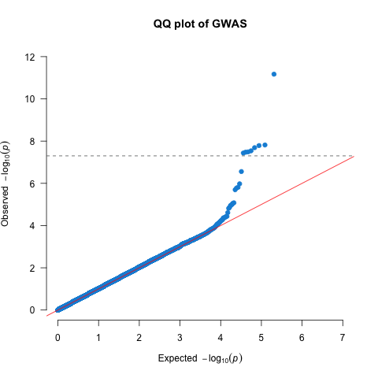
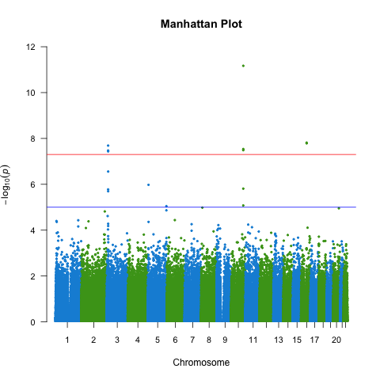
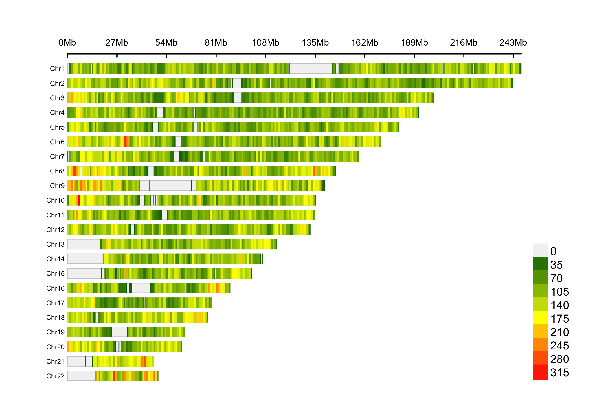
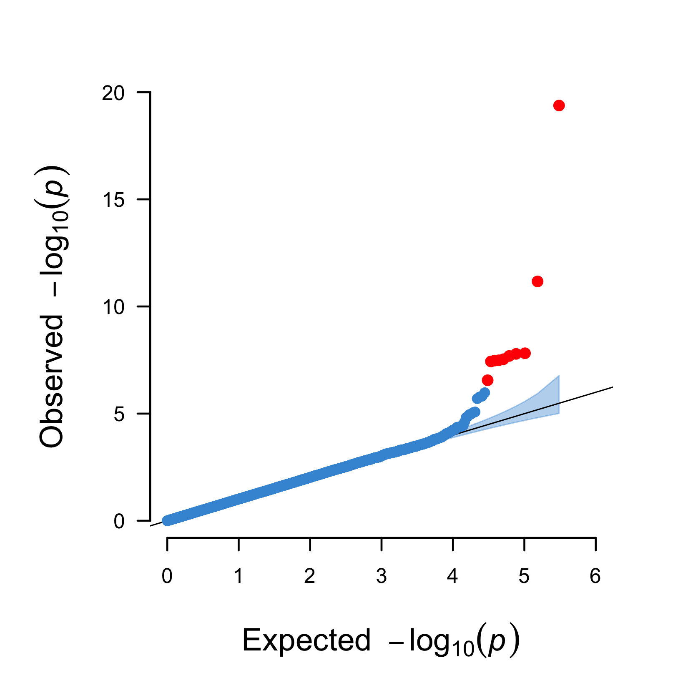
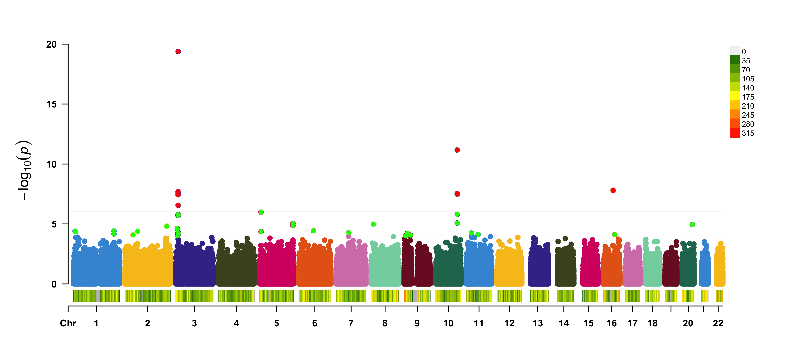
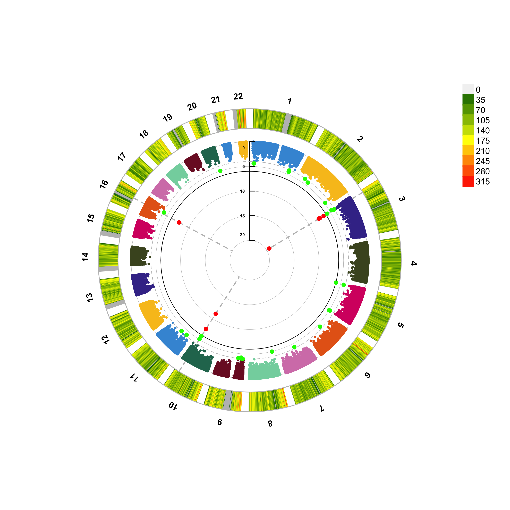
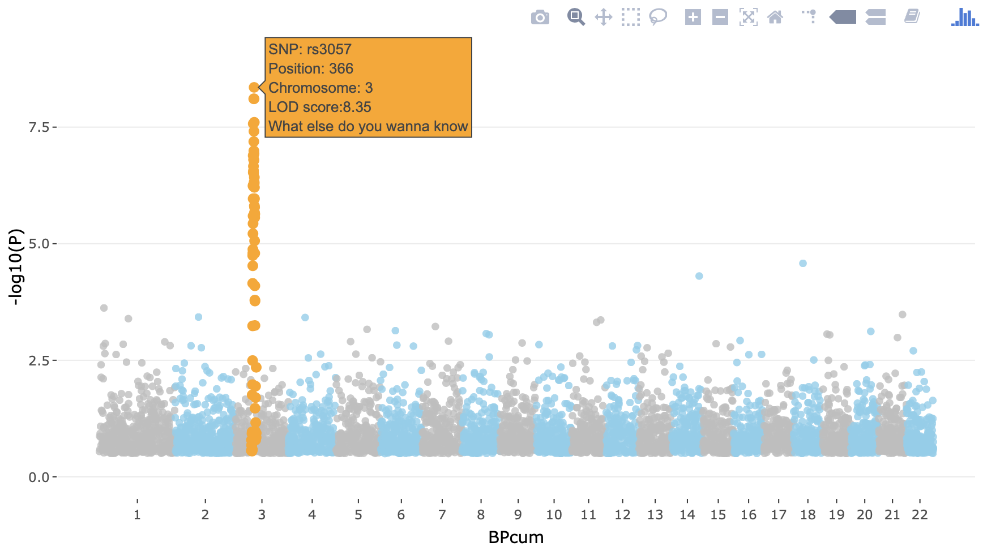

# GWAS visualisation {#gwas-visuals-cocalc}
<!-- {width=100%} -->


Data visualization is key, not only for presentation but also to inspect the results.

### QQ plots
We should create _quantile-quantile (QQ) plots_ to compare the observed association test statistics with their expected values under the null hypothesis of no association and so assess the number, magnitude and quality of true associations.

First, we will add the standard error, call rate, A2, and allele frequencies.


Let's list the number of SNPs per chromosome. This gives a pretty good idea about the per-chromosome coverage. And it's a sanity check: did the whole analysis run properly (we expect 22 chromosomes)?


```{=html}
<div class="tabwid"><style>.cl-ed65012c{}.cl-ed5dd096{font-family:'Helvetica';font-size:11pt;font-weight:normal;font-style:normal;text-decoration:none;color:rgba(0, 0, 0, 1.00);background-color:transparent;}.cl-ed609c2c{margin:0;text-align:left;border-bottom: 0 solid rgba(0, 0, 0, 1.00);border-top: 0 solid rgba(0, 0, 0, 1.00);border-left: 0 solid rgba(0, 0, 0, 1.00);border-right: 0 solid rgba(0, 0, 0, 1.00);padding-bottom:5pt;padding-top:5pt;padding-left:5pt;padding-right:5pt;line-height: 1;background-color:transparent;}.cl-ed609c36{margin:0;text-align:right;border-bottom: 0 solid rgba(0, 0, 0, 1.00);border-top: 0 solid rgba(0, 0, 0, 1.00);border-left: 0 solid rgba(0, 0, 0, 1.00);border-right: 0 solid rgba(0, 0, 0, 1.00);padding-bottom:5pt;padding-top:5pt;padding-left:5pt;padding-right:5pt;line-height: 1;background-color:transparent;}.cl-ed60b2e8{width:0.431in;background-color:transparent;vertical-align: middle;border-bottom: 1.5pt solid rgba(102, 102, 102, 1.00);border-top: 1.5pt solid rgba(102, 102, 102, 1.00);border-left: 0 solid rgba(0, 0, 0, 1.00);border-right: 0 solid rgba(0, 0, 0, 1.00);margin-bottom:0;margin-top:0;margin-left:0;margin-right:0;}.cl-ed60b2f2{width:0.652in;background-color:transparent;vertical-align: middle;border-bottom: 1.5pt solid rgba(102, 102, 102, 1.00);border-top: 1.5pt solid rgba(102, 102, 102, 1.00);border-left: 0 solid rgba(0, 0, 0, 1.00);border-right: 0 solid rgba(0, 0, 0, 1.00);margin-bottom:0;margin-top:0;margin-left:0;margin-right:0;}.cl-ed60b2fc{width:0.431in;background-color:transparent;vertical-align: middle;border-bottom: 0 solid rgba(0, 0, 0, 1.00);border-top: 0 solid rgba(0, 0, 0, 1.00);border-left: 0 solid rgba(0, 0, 0, 1.00);border-right: 0 solid rgba(0, 0, 0, 1.00);margin-bottom:0;margin-top:0;margin-left:0;margin-right:0;}.cl-ed60b2fd{width:0.652in;background-color:transparent;vertical-align: middle;border-bottom: 0 solid rgba(0, 0, 0, 1.00);border-top: 0 solid rgba(0, 0, 0, 1.00);border-left: 0 solid rgba(0, 0, 0, 1.00);border-right: 0 solid rgba(0, 0, 0, 1.00);margin-bottom:0;margin-top:0;margin-left:0;margin-right:0;}.cl-ed60b306{width:0.431in;background-color:transparent;vertical-align: middle;border-bottom: 0 solid rgba(0, 0, 0, 1.00);border-top: 0 solid rgba(0, 0, 0, 1.00);border-left: 0 solid rgba(0, 0, 0, 1.00);border-right: 0 solid rgba(0, 0, 0, 1.00);margin-bottom:0;margin-top:0;margin-left:0;margin-right:0;}.cl-ed60b310{width:0.652in;background-color:transparent;vertical-align: middle;border-bottom: 0 solid rgba(0, 0, 0, 1.00);border-top: 0 solid rgba(0, 0, 0, 1.00);border-left: 0 solid rgba(0, 0, 0, 1.00);border-right: 0 solid rgba(0, 0, 0, 1.00);margin-bottom:0;margin-top:0;margin-left:0;margin-right:0;}.cl-ed60b311{width:0.431in;background-color:transparent;vertical-align: middle;border-bottom: 0 solid rgba(0, 0, 0, 1.00);border-top: 0 solid rgba(0, 0, 0, 1.00);border-left: 0 solid rgba(0, 0, 0, 1.00);border-right: 0 solid rgba(0, 0, 0, 1.00);margin-bottom:0;margin-top:0;margin-left:0;margin-right:0;}.cl-ed60b31a{width:0.652in;background-color:transparent;vertical-align: middle;border-bottom: 0 solid rgba(0, 0, 0, 1.00);border-top: 0 solid rgba(0, 0, 0, 1.00);border-left: 0 solid rgba(0, 0, 0, 1.00);border-right: 0 solid rgba(0, 0, 0, 1.00);margin-bottom:0;margin-top:0;margin-left:0;margin-right:0;}.cl-ed60b324{width:0.431in;background-color:transparent;vertical-align: middle;border-bottom: 0 solid rgba(0, 0, 0, 1.00);border-top: 0 solid rgba(0, 0, 0, 1.00);border-left: 0 solid rgba(0, 0, 0, 1.00);border-right: 0 solid rgba(0, 0, 0, 1.00);margin-bottom:0;margin-top:0;margin-left:0;margin-right:0;}.cl-ed60b32e{width:0.652in;background-color:transparent;vertical-align: middle;border-bottom: 0 solid rgba(0, 0, 0, 1.00);border-top: 0 solid rgba(0, 0, 0, 1.00);border-left: 0 solid rgba(0, 0, 0, 1.00);border-right: 0 solid rgba(0, 0, 0, 1.00);margin-bottom:0;margin-top:0;margin-left:0;margin-right:0;}.cl-ed60b32f{width:0.431in;background-color:transparent;vertical-align: middle;border-bottom: 1.5pt solid rgba(102, 102, 102, 1.00);border-top: 0 solid rgba(0, 0, 0, 1.00);border-left: 0 solid rgba(0, 0, 0, 1.00);border-right: 0 solid rgba(0, 0, 0, 1.00);margin-bottom:0;margin-top:0;margin-left:0;margin-right:0;}.cl-ed60b338{width:0.652in;background-color:transparent;vertical-align: middle;border-bottom: 1.5pt solid rgba(102, 102, 102, 1.00);border-top: 0 solid rgba(0, 0, 0, 1.00);border-left: 0 solid rgba(0, 0, 0, 1.00);border-right: 0 solid rgba(0, 0, 0, 1.00);margin-bottom:0;margin-top:0;margin-left:0;margin-right:0;}</style><table data-quarto-disable-processing='true' class='cl-ed65012c'>

```

<caption style="display:table-caption;">(\#tab:listsnpsperchr)<span>Number of SNPs per chromosome.</span></caption>

```{=html}

<thead><tr style="overflow-wrap:break-word;"><th class="cl-ed60b2e8"><p class="cl-ed609c2c"><span class="cl-ed5dd096">Chr</span></p></th><th class="cl-ed60b2f2"><p class="cl-ed609c36"><span class="cl-ed5dd096">Freq</span></p></th></tr></thead><tbody><tr style="overflow-wrap:break-word;"><td class="cl-ed60b2fc"><p class="cl-ed609c2c"><span class="cl-ed5dd096">1</span></p></td><td class="cl-ed60b2fd"><p class="cl-ed609c36"><span class="cl-ed5dd096">23,173</span></p></td></tr><tr style="overflow-wrap:break-word;"><td class="cl-ed60b306"><p class="cl-ed609c2c"><span class="cl-ed5dd096">2</span></p></td><td class="cl-ed60b310"><p class="cl-ed609c36"><span class="cl-ed5dd096">25,206</span></p></td></tr><tr style="overflow-wrap:break-word;"><td class="cl-ed60b2fc"><p class="cl-ed609c2c"><span class="cl-ed5dd096">3</span></p></td><td class="cl-ed60b2fd"><p class="cl-ed609c36"><span class="cl-ed5dd096">21,402</span></p></td></tr><tr style="overflow-wrap:break-word;"><td class="cl-ed60b311"><p class="cl-ed609c2c"><span class="cl-ed5dd096">4</span></p></td><td class="cl-ed60b31a"><p class="cl-ed609c36"><span class="cl-ed5dd096">19,008</span></p></td></tr><tr style="overflow-wrap:break-word;"><td class="cl-ed60b324"><p class="cl-ed609c2c"><span class="cl-ed5dd096">5</span></p></td><td class="cl-ed60b32e"><p class="cl-ed609c36"><span class="cl-ed5dd096">19,157</span></p></td></tr><tr style="overflow-wrap:break-word;"><td class="cl-ed60b306"><p class="cl-ed609c2c"><span class="cl-ed5dd096">6</span></p></td><td class="cl-ed60b310"><p class="cl-ed609c36"><span class="cl-ed5dd096">20,672</span></p></td></tr><tr style="overflow-wrap:break-word;"><td class="cl-ed60b306"><p class="cl-ed609c2c"><span class="cl-ed5dd096">7</span></p></td><td class="cl-ed60b310"><p class="cl-ed609c36"><span class="cl-ed5dd096">16,581</span></p></td></tr><tr style="overflow-wrap:break-word;"><td class="cl-ed60b311"><p class="cl-ed609c2c"><span class="cl-ed5dd096">8</span></p></td><td class="cl-ed60b31a"><p class="cl-ed609c36"><span class="cl-ed5dd096">18,089</span></p></td></tr><tr style="overflow-wrap:break-word;"><td class="cl-ed60b324"><p class="cl-ed609c2c"><span class="cl-ed5dd096">9</span></p></td><td class="cl-ed60b32e"><p class="cl-ed609c36"><span class="cl-ed5dd096">15,709</span></p></td></tr><tr style="overflow-wrap:break-word;"><td class="cl-ed60b306"><p class="cl-ed609c2c"><span class="cl-ed5dd096">10</span></p></td><td class="cl-ed60b310"><p class="cl-ed609c36"><span class="cl-ed5dd096">15,536</span></p></td></tr><tr style="overflow-wrap:break-word;"><td class="cl-ed60b306"><p class="cl-ed609c2c"><span class="cl-ed5dd096">11</span></p></td><td class="cl-ed60b310"><p class="cl-ed609c36"><span class="cl-ed5dd096">14,564</span></p></td></tr><tr style="overflow-wrap:break-word;"><td class="cl-ed60b311"><p class="cl-ed609c2c"><span class="cl-ed5dd096">12</span></p></td><td class="cl-ed60b31a"><p class="cl-ed609c36"><span class="cl-ed5dd096">14,889</span></p></td></tr><tr style="overflow-wrap:break-word;"><td class="cl-ed60b2fc"><p class="cl-ed609c2c"><span class="cl-ed5dd096">13</span></p></td><td class="cl-ed60b2fd"><p class="cl-ed609c36"><span class="cl-ed5dd096">11,524</span></p></td></tr><tr style="overflow-wrap:break-word;"><td class="cl-ed60b2fc"><p class="cl-ed609c2c"><span class="cl-ed5dd096">14</span></p></td><td class="cl-ed60b2fd"><p class="cl-ed609c36"><span class="cl-ed5dd096">9,822</span></p></td></tr><tr style="overflow-wrap:break-word;"><td class="cl-ed60b311"><p class="cl-ed609c2c"><span class="cl-ed5dd096">15</span></p></td><td class="cl-ed60b31a"><p class="cl-ed609c36"><span class="cl-ed5dd096">8,838</span></p></td></tr><tr style="overflow-wrap:break-word;"><td class="cl-ed60b2fc"><p class="cl-ed609c2c"><span class="cl-ed5dd096">16</span></p></td><td class="cl-ed60b2fd"><p class="cl-ed609c36"><span class="cl-ed5dd096">8,920</span></p></td></tr><tr style="overflow-wrap:break-word;"><td class="cl-ed60b306"><p class="cl-ed609c2c"><span class="cl-ed5dd096">17</span></p></td><td class="cl-ed60b310"><p class="cl-ed609c36"><span class="cl-ed5dd096">8,262</span></p></td></tr><tr style="overflow-wrap:break-word;"><td class="cl-ed60b306"><p class="cl-ed609c2c"><span class="cl-ed5dd096">18</span></p></td><td class="cl-ed60b310"><p class="cl-ed609c36"><span class="cl-ed5dd096">10,356</span></p></td></tr><tr style="overflow-wrap:break-word;"><td class="cl-ed60b2fc"><p class="cl-ed609c2c"><span class="cl-ed5dd096">19</span></p></td><td class="cl-ed60b2fd"><p class="cl-ed609c36"><span class="cl-ed5dd096">5,820</span></p></td></tr><tr style="overflow-wrap:break-word;"><td class="cl-ed60b2fc"><p class="cl-ed609c2c"><span class="cl-ed5dd096">20</span></p></td><td class="cl-ed60b2fd"><p class="cl-ed609c36"><span class="cl-ed5dd096">7,792</span></p></td></tr><tr style="overflow-wrap:break-word;"><td class="cl-ed60b2fc"><p class="cl-ed609c2c"><span class="cl-ed5dd096">21</span></p></td><td class="cl-ed60b2fd"><p class="cl-ed609c36"><span class="cl-ed5dd096">5,412</span></p></td></tr><tr style="overflow-wrap:break-word;"><td class="cl-ed60b32f"><p class="cl-ed609c2c"><span class="cl-ed5dd096">22</span></p></td><td class="cl-ed60b338"><p class="cl-ed609c36"><span class="cl-ed5dd096">5,370</span></p></td></tr></tbody></table></div>
```

> Question: Try to figure out how to get the number of variants per chromosomes. Why do the number of variants per chrosome (approximately) correlate with the chromosome number?

> Question: Where are the data for chromosome X, Y and MT?

Let's plot the QQ plot to diagnose our GWAS.

Since we're working in Utrecht on the Utrecht Science Park, let's get the color scheme in `R`. 


<div class="figure" style="text-align: center">

<p class="caption">(\#fig:show-qq)A QQ plot.</p>
</div>

## Manhattan plots

We also need to create a _Manhattan plot_ to display the association test P-values as a function of chromosomal location and thus provide a visual summary of association test results that draw immediate attention to any regions of significance (Figure \@ref(fig:showmanhattan)).


<div class="figure" style="text-align: center">

<p class="caption">(\#fig:showmanhattan)A manhattan plot.</p>
</div>

## Other plots

It is also informative to plot the density per chromosome. We can use the `CMplot` for that which you can find [here](https://github.com/YinLiLin/R-CMplot){target="_blank"}. For now we just make these graphs 'quick-n-dirty', you can further prettify them, but you easily loose track of time, so maybe carry on.


> Question: What do the grey spots on the density plot indicate?

This would lead to the following graphs. 
<div class="figure" style="text-align: center">

<p class="caption">(\#fig:showcmplotalldensity)SNP density of the association results.</p>
</div>

<div class="figure" style="text-align: center">

<p class="caption">(\#fig:showcmplotallqq)A QQ plot including a 95% confidence interval (blue area) and genome-wide significant hits (red).</p>
</div>

<div class="figure" style="text-align: center">

<p class="caption">(\#fig:showcmplotallmanhattan)A regular manhattan plot. Colored by chromosome, suggestive hits are green, genome-wide hits are red. The bottom graph shows the per-chromosome SNP density.</p>
</div>

<div class="figure" style="text-align: center">

<p class="caption">(\#fig:show-cmplot-all-circular)A circular manhattan.</p>
</div>

## Interactive plots

You can also make an [interactive version](https://r-graph-gallery.com/101_Manhattan_plot.html){target="_blank"} of the Manhattan - just because you can. The code below shows you how.


```
library(plotly)
library(dplyr)

# Prepare the dataset (as an example we use the data (gwasResults) from the `qqman`-package)
don <- gwasResults %>%

  # Compute chromosome size
  group_by(CHR) %>%
  summarise(chr_len=max(BP)) %>%

  # Calculate cumulative position of each chromosome
  mutate(tot=cumsum(chr_len)-chr_len) %>%
  select(-chr_len) %>%

  # Add this info to the initial dataset
  left_join(gwasResults, ., by=c("CHR"="CHR")) %>%

  # Add a cumulative position of each SNP
  arrange(CHR, BP) %>%
  mutate( BPcum=BP+tot) %>%

  # Add highlight and annotation information
  mutate( is_highlight=ifelse(SNP %in% snpsOfInterest, "yes", "no")) %>%

  # Filter SNP to make the plot lighter
  filter(-log10(P)>0.5)

# Prepare X axis
axisdf <- don %>% group_by(CHR) %>% summarize(center=( max(BPcum) + min(BPcum) ) / 2 )

# Prepare text description for each SNP:
don$text <- paste("SNP: ", don$SNP, "\nPosition: ", don$BP, "\nChromosome: ", don$CHR, "\nLOD score:", -log10(don$P) %>% round(2), "\nWhat else do you wanna know", sep="")

# Make the plot
p <- ggplot(don, aes(x=BPcum, y=-log10(P), text=text)) +

    # Show all points
    geom_point( aes(color=as.factor(CHR)), alpha=0.8, size=1.3) +
    scale_color_manual(values = rep(c("grey", "skyblue"), 22 )) +

    # custom X axis:
    scale_x_continuous( label = axisdf$CHR, breaks= axisdf$center ) +
    scale_y_continuous(expand = c(0, 0)) +     # remove space between plot area and x axis

    # Add highlighted points
    geom_point(data=subset(don, is_highlight=="yes"), color="orange", size=2) +

    # Custom the theme:
    theme_bw() +
    theme(
      legend.position="none",
      panel.border = element_blank(),
      panel.grid.major.x = element_blank(),
      panel.grid.minor.x = element_blank()
    )
ggplotly(p, tooltip="text")
```


It will produce something like below. In the CoCalc Notebook-window it isn't smooth, but this way you have an idea how to do it in a real-case scenario.




Again, this is an example with dummy data - you can try to do it for our GWAS, but careful with the time. You can also choose to carry on.

You will encounter the above types of visualizations in any high-quality GWAS paper, because each is so critically informative. Usually, analysts of large-scale meta-analyses of GWAS will also stratify the QQ-plots based on the imputation quality (if your GWAS was imputed), call rate, and allele frequency (although that is rarely shared in publications, not even in supplemental material).


## Stop playing around

Alright. It's time to stop playing around and do a quick recap of what you've learned.

1. You learned how to convert datasets.
2. You learned how to execute sample QC and create diagnostic graphics
3. You learned how to do the same for SNP QC
4. You learned how to execute an association study given a dataset, covariates, and different assumptions regarding the genetic model.
5. You learned how to visualize results and played around with different visuals. 

You should be ready for the real stuff. And if not, the next chapter will help you get ready: Chapter \@ref(wtccc1_intro).

<script>
title=document.getElementById('header');
title.innerHTML = '' + title.innerHTML
</script>
