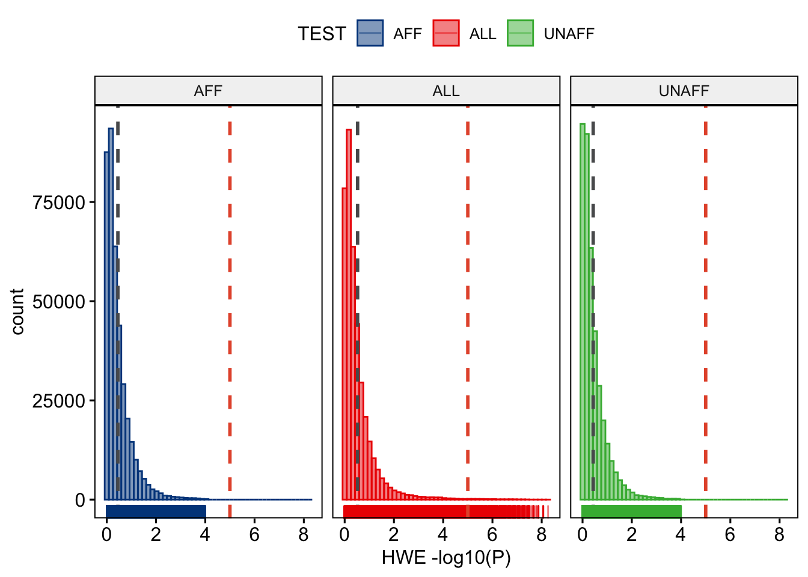
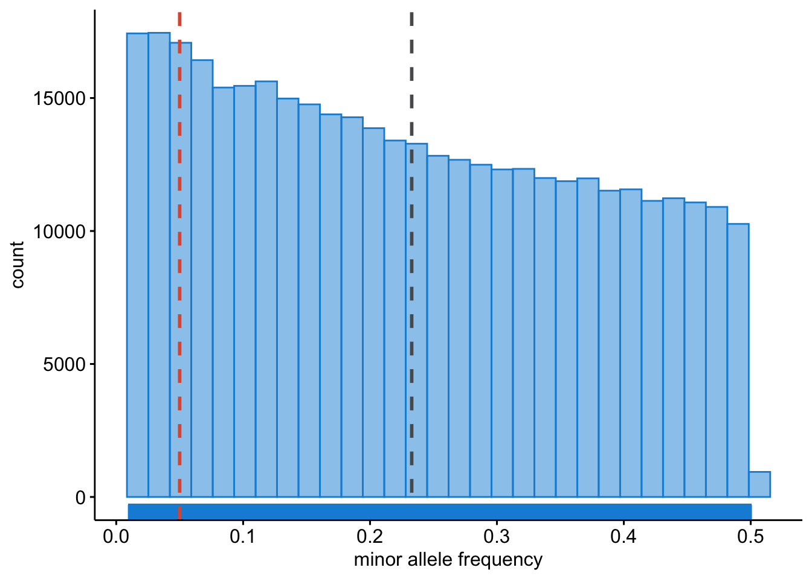
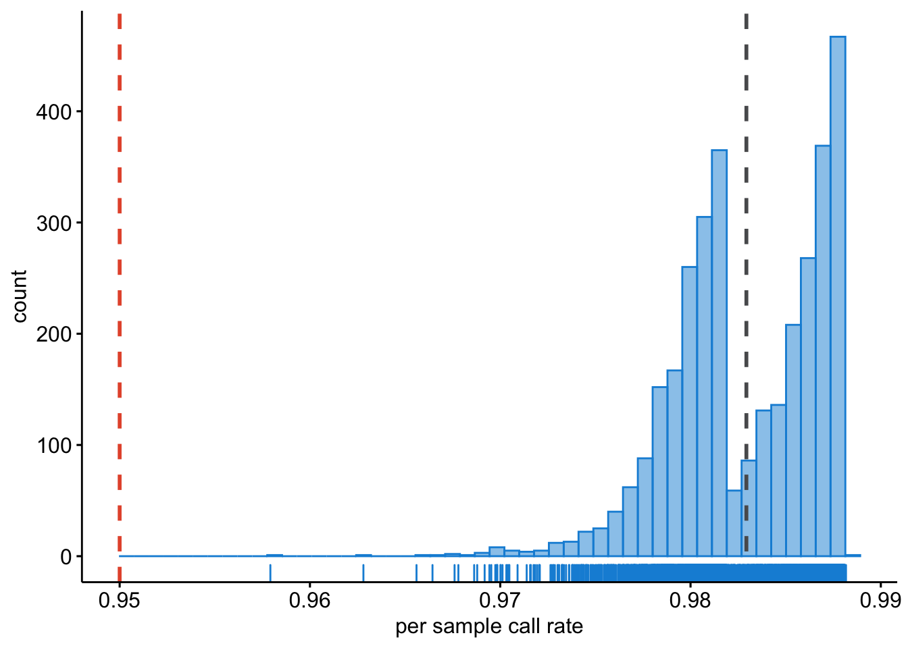
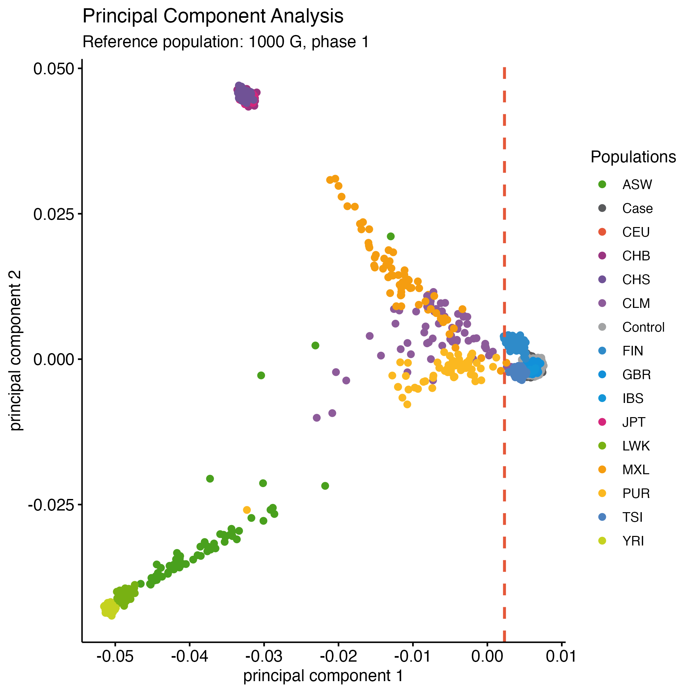

# WTCCC1: a GWAS on coronary artery disease (CAD) {#wtccc1-cocalc}
<!-- {width=100%} -->


As usual, we start by exploring the data in hand.

First, let's make a clean slate and create a working directory for the WTCCC1 data.

```
clear
mkdir -v ~/wtccc1
```

Next, we'll run a few `plink` commands

```
plink --bfile ~/data/shared/wtccc1/CADn1871_500Kb37fwd --bmerge ~/data/shared/wtccc1/UKBSn1397_500Kb37fwd --make-bed --out wtccc1/wtccc1 && \
plink --bfile wtccc1/wtccc1 --freq --out wtccc1/wtccc1 && \
plink --bfile wtccc1/wtccc1 --hardy --out wtccc1/wtccc1 && \
plink --bfile wtccc1/wtccc1 --missing --out wtccc1/wtccc1 && \
plink --bfile wtccc1/wtccc1 --test-missing --out wtccc1/wtccc1

cat wtccc1/wtccc1.missing | awk '$5 < 0.00001' | awk '{ print $2 }' > wtccc1/wtccc1-fail-diffmiss-qc.txt
```


Let's investigate the HWE p-value in the whole cohort, and per stratum (cases and controls) with the code below.


This will result in Figure \@ref(fig:show-wtccc1-hwe).

<div class="figure" style="text-align: center">

<p class="caption">(\#fig:show-wtccc1-hwe)Stratified HWE p-values.</p>
</div>

We should also inspect the allele frequencies. Note that _by default_ PLINK (whether v0.7, v1.9, or v2.0) stores the alleles as minor (A1) and major (A2), and therefore `--maf` _always_ calculates the frequency of the minor allele (A1).


This will result in Figure \@ref(fig:show-wtccc1-freq).

<div class="figure" style="text-align: center">

<p class="caption">(\#fig:show-wtccc1-freq)Minor allele frequencies.</p>
</div>

There could be sample with very poor overall call rate, where for many SNPs there is no data. We will want to identify these samples and exclude them. 


This will result in Figure \@ref(fig:show-wtccc1-callratesample).

<div class="figure" style="text-align: center">

<p class="caption">(\#fig:show-wtccc1-callratesample)Per sample call rate.</p>
</div>

> Question: What do you notice in the 'per sample call rate' graph? Can you think of a reason why this is? And how would you deal with this?

Lastly, we must inspect the per SNP call rate; we need to know if there are SNPs that have no data for many samples. We will want to identify such SNPs and exclude these.


This will result in Figure \@ref(fig:show-wtccc1-callratesnp).

<div class="figure" style="text-align: center">

<p class="caption">(\#fig:show-wtccc1-callratesnp)Per SNP call rate.</p>
</div>

## Quality control

Now that we have handle on the data, we can filter it. 

> Question: Do you have any thoughts on that? Do you agree with the filters I set below? How would you do it differently and why?

```
plink --bfile wtccc1/wtccc1 --exclude wtccc1/wtccc1-fail-diffmiss-qc.txt --maf 0.01 --geno 0.05 --hwe 0.00001 --make-bed --out wtccc1/wtccc1_clean
```

## Ancestral background

If these individuals are all from the United Kingdom, we are certain there will be admixture from other populations given UK's history. Let's project the WTCCC1 data on 1000G phase 1 populations.

We will face the same issue as before with our dummy dataset with respect to `EIGENSOFT`. So I created the data for you to skip to the [Plotting PCA] section immediately. Regardless, in the [Preparing PCA] and [Running PCA] sections I show you how to get there.


### Preparing PCA

**Filtering WTCCC1**

For PCA we need to perform extreme clean.

```
plink --bfile wtccc1/wtccc1_clean --maf 0.1 --geno 0.1 --indep-pairwise 100 50 0.2 --exclude ~/data/shared/support/exclude_problematic_range.txt --make-bed --out wtccc1/wtccc1_temp

plink --bfile wtccc1/wtccc1_temp --exclude wtccc1/wtccc1_temp.prune.out --make-bed --out wtccc1/wtccc1_extrclean

rm -fv wtccc1/wtccc1_temp*

cat wtccc1/wtccc1_extrclean.bim | awk '{ print $2 }' > wtccc1/wtccc1_extrclean.variants.txt

cat wtccc1/wtccc1.bim | grep "rs" > wtccc1/all.variants.txt
```

Notice that you are using real world data: there are thousands of variants 'pruned' due to the `--indep-pairwise 100 50 0.2`-flag.

**Merging WTCCC1 with 1000G phase 1**

Now we are ready to extract the WTCCC1 variants from the 1000G phase 1 reference

```
plink --bfile ~/data/shared/ref_1kg_phase1_all/1kg_phase1_all --extract wtccc1/all.variants.txt --make-bed --out wtccc1/1kg_phase1_wtccc1
```

Extracting the A/T and C/G SNPs as well. 

```
cat wtccc1/1kg_phase1_wtccc1.bim | \
awk '($5 == "A" && $6 == "T") || ($5 == "T" && $6 == "A") || ($5 == "C" && $6 == "G") || ($5 == "G" && $6 == "C")' | awk '{ print $2, $1, $4, $3, $5, $6 }' \
> wtccc1/all.1kg_wtccc1.atcg.variants.txt
```

```
plink --bfile wtccc1/1kg_phase1_wtccc1 --exclude wtccc1/all.1kg_wtccc1.atcg.variants.txt --make-bed --out wtccc1/1kg_phase1_wtccc1_no_atcg

plink --bfile wtccc1/1kg_phase1_wtccc1_no_atcg --extract wtccc1/wtccc1_extrclean.variants.txt --make-bed --out wtccc1/1kg_phase1_raw_no_atcg_wtccc1
```

Finally we will merge the datasets. 

```
plink --bfile wtccc1/wtccc1_extrclean --bmerge wtccc1/1kg_phase1_raw_no_atcg_wtccc1 --maf 0.1 --geno 0.1 --exclude ~/data/shared/support/exclude_problematic_range.txt --make-bed --out wtccc1/wtccc1_extrclean_1kg
```

### Running PCA

Great, we've prepared our dummy project data and merged this with 1000G phase 1. Let's execute the PCA using `--pca` in `PLINK`.

```
plink --bfile wtccc1/wtccc1_extrclean_1kg --pca --out wtccc1/wtccc1_extrclean_1kg
```

### Plotting PCA

If all is peachy, you were able to run the PCA for the WTCCC1 data against 1000G phase 1. Using `--pca` in `plink` we have calculated principal components (PCs) and we can now start plotting them. Let's create a scatter diagram of the first two principal components just like we did with the dummy data. 

And we should visualize the PCA results: are these individuals really all from European (UK) ancestry? 


We expect most individuals from the WTCCC to be 100% British, but a substantial group will have a different ancestral background as shown in the Figure \@ref(fig:showwtccc1pca) you just made.

<div class="figure" style="text-align: center">

<p class="caption">(\#fig:showwtccc1pca)PCA - WTCCC1 vs. 1000G</p>
</div>

### Removing samples

In a similar fashion as in the example _gwas_ and _rawdata_ datasets, you should consider to **remove the samples below the threshold** based on this PCA (Figure \@ref(fig:showwtccc1pca)). 

> Go ahead, try that. 

You're code would be something like below:

```
cat wtccc1/wtccc1_extrclean_1kg.eigenvec | \
awk '$3 < 0.0023' | awk '{ print $1, $2 }' > wtccc1/fail-ancestry-QC.txt
```

Next we filter these samples and get a final fully QC'd dataset.

```
plink --bfile wtccc1/wtccc1_clean --exclude wtccc1/fail-ancestry-QC.txt --make-bed --out wtccc1/wtccc1_qc
```

## Association testing

Now that we have explored the data, we are ready for some simple association testing. However, it would be great to have some PCs to correct for. We can use PLINK for that too.

```
plink --bfile wtccc1/wtccc1_extrclean --exclude wtccc1/fail-ancestry-QC.txt --pca --out wtccc1/wtccc1_extrclean
```

Let's add those PCs to the covariates-file.

```
echo "IID PC1 PC2 PC3 PC4 PC5 PC6 PC7 PC8 PC9 PC10 PC11 PC12 PC13 PC14 PC15 PC16 PC17 PC18 PC19 PC20" > wtccc1/wtccc1_qc.pca

cat wtccc1/wtccc1_extrclean.eigenvec | awk '{ print $2,$3,$4,$5,$6,$7,$8,$9,$10,$11,$12,$13,$14,$15,$16,$17,$18,$19,$20,$21,$22}' >> wtccc1/wtccc1_qc.pca

perl ~/data/shared/scripts/mergeTables.pl --file1 wtccc1/wtccc1_qc.pca --file2 ~/data/shared/wtccc1/wtccc1.covar --index IID --format NORM > wtccc1/wtccc1_qc.covar_pca
```

Exciting, now we are ready to perform a GWAS on CAD in WTCCC1. This may take some time (when I tested it, it took at least 5 minutes), so it's a perfect moment to take a break, stretch your legs and get a coffee.

```
plink --bfile wtccc1/wtccc1_qc --logistic sex --covar wtccc1/wtccc1_qc.covar_pca --out wtccc1/wtccc1_qc_log_covar_pca
```

After you ran the association analysis, you're ready to process the data and take a first look at the results. First, we prepare the raw output. 


You could visualize these results with the code below. 


This would lead to the following graphs. 
<div class="figure" style="text-align: center">

<p class="caption">(\#fig:show-wtccc1-graphs-density)SNP density of the association results.</p>
</div>

<div class="figure" style="text-align: center">

<p class="caption">(\#fig:show-wtccc1-graphs-qq)A QQ plot including a 95% confidence interval (blue area) and genome-wide significant hits (red).</p>
</div>

<div class="figure" style="text-align: center">

<p class="caption">(\#fig:show-wtccc1-graphs-manhattan)A regular manhattan plot. Colored by chromosome, suggestive hits are green, genome-wide hits are red. The bottom graph shows the per-chromosome SNP density.</p>
</div>

<div class="figure" style="text-align: center">

<p class="caption">(\#fig:show-wtccc1-graphs-circular)A circular manhattan.</p>
</div>

## Replication! 

You reached an important milestone. 

**You recreated the work by the whole WTCCC1-team that took them years in just one afternoon!** 

Wow. Take a pause. And realize what you've done. 

Back then there wasn't much on analyses _after_ a GWAS, nowadays there are many post-GWAS analyses methods. We will cover them in the next Chapter \@ref(post_gwas).

<script>
title=document.getElementById('header');
title.innerHTML = '' + title.innerHTML
</script>
