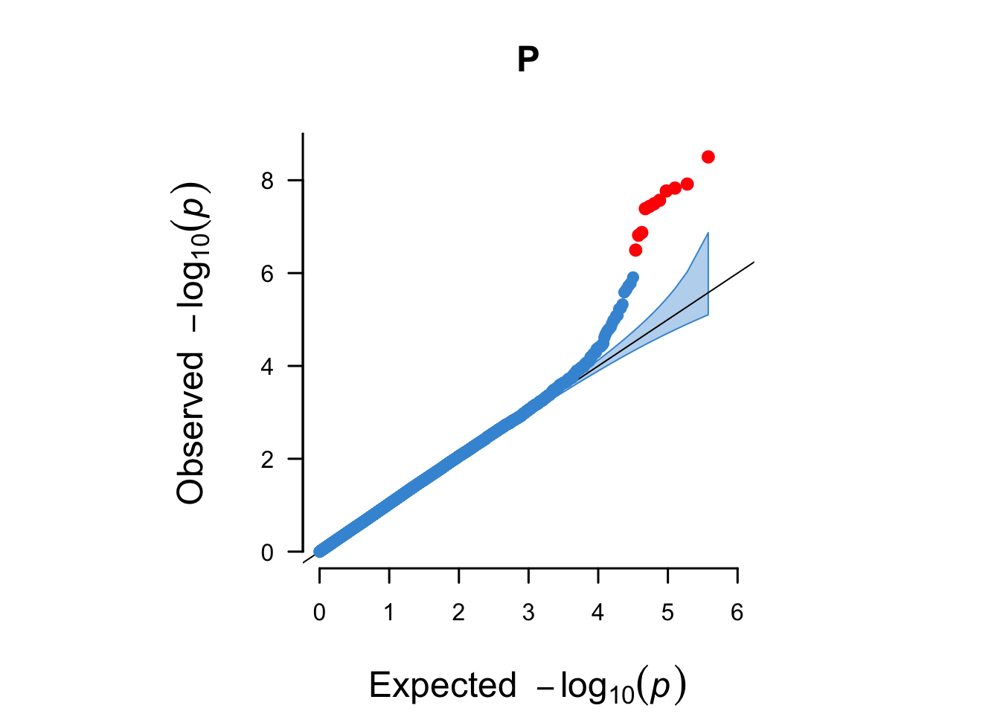
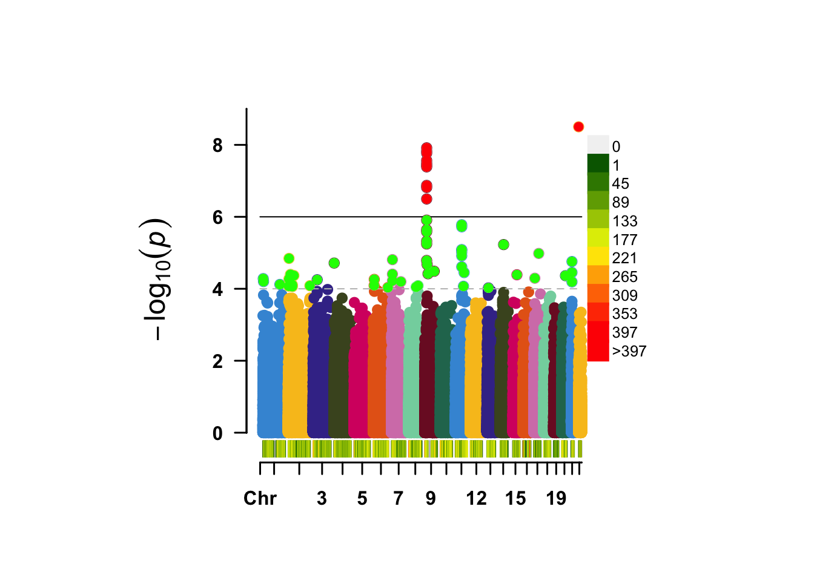

# WTCCC1: a GWAS on coronary artery disease (CAD) {#wtccc1-assoc-cocalc}
<!-- {width=100%} -->


Now that we have explored and cleaned the data, we are ready for some association testing. However, it would be great to have some PCs to correct for. We can use PLINK for that too.

```
plink --bfile wtccc1/wtccc1_extrclean --exclude wtccc1/fail-ancestry-QC.txt --pca --out wtccc1/wtccc1_extrclean
```

Let's add those PCs to the covariates-file.

```
echo "IID PC1 PC2 PC3 PC4 PC5 PC6 PC7 PC8 PC9 PC10 PC11 PC12 PC13 PC14 PC15 PC16 PC17 PC18 PC19 PC20" > wtccc1/wtccc1_qc.pca

cat wtccc1/wtccc1_extrclean.eigenvec | awk '{ print $2,$3,$4,$5,$6,$7,$8,$9,$10,$11,$12,$13,$14,$15,$16,$17,$18,$19,$20,$21,$22}' >> wtccc1/wtccc1_qc.pca

perl ~/data/shared/scripts/mergeTables.pl --file1 wtccc1/wtccc1_qc.pca --file2 ~/data/shared/wtccc1/wtccc1.covar --index IID --format NORM > wtccc1/wtccc1_qc.covar_pca
```

## Association testing
Exciting, now we are ready to perform a GWAS on CAD in WTCCC1. This may take some time (when I tested it, it took at least 5 minutes), so it's a perfect moment to take a break, stretch your legs and get a coffee.

```
plink --bfile wtccc1/wtccc1_qc --logistic sex --covar wtccc1/wtccc1_qc.covar_pca --out wtccc1/wtccc1_qc_log_covar_pca
```

After you ran the association analysis, you're ready to process the data and take a first look at the results. First, we prepare the raw output. 


```r
wtccc1_assoc <- data.table::fread("wtccc1/wtccc1_qc_log_covar_pca.assoc.logistic")
```


```r
dim(wtccc1_assoc)

wtccc1_assoc[1:9, 1:9]
wtccc1_assoc_sub <- subset(wtccc1_assoc, TEST == "ADD")
wtccc1_assoc_sub$TEST <- NULL

temp <- subset(wtccc1_FRQ, select = c("SNP", "A2", "MAF", "NCHROBS"))

wtccc1_assoc_subfrq <- merge(wtccc1_assoc_sub, temp, by = "SNP")

temp <- subset(wtccc1_LMISS, select = c("SNP", "callrate"))

wtccc1_assoc_subfrqlmiss <- merge(wtccc1_assoc_subfrq, temp, by = "SNP")
head(wtccc1_assoc_subfrqlmiss)
# Remember:
# - that z = beta/se
# - beta = log(OR), because log is the natural log in r

wtccc1_assoc_subfrqlmiss$BETA = log(wtccc1_assoc_subfrqlmiss$OR)
wtccc1_assoc_subfrqlmiss$SE = wtccc1_assoc_subfrqlmiss$BETA/wtccc1_assoc_subfrqlmiss$STAT


wtccc1_assoc_subfrqlmiss_tib <- dplyr::as_tibble(wtccc1_assoc_subfrqlmiss)

col_order <- c("SNP", "CHR", "BP",
               "A1", "A2", "MAF", "callrate", "NMISS", "NCHROBS",
               "BETA", "SE", "OR", "STAT", "P")
wtccc1_assoc_compl <- wtccc1_assoc_subfrqlmiss_tib[, col_order]

dim(wtccc1_assoc_compl)

head(wtccc1_assoc_compl)

wtccc1_assoc_complsub <- subset(wtccc1_assoc_compl, select = c("SNP", "CHR", "BP", "P"))
```

You could visualize these results with the code below. 


```r
library("CMplot")

CMplot(wtccc1_assoc_complsub,
       plot.type = c("d", "c", "m", "q"), LOG10 = TRUE, ylim = NULL,
       threshold = c(1e-6,1e-4), threshold.lty = c(1,2), threshold.lwd = c(1,1), threshold.col = c("black", "grey"),
       amplify = TRUE,
       bin.size = 1e6, chr.den.col = c("darkgreen", "yellow", "red"),
       signal.col = c("red", "green"), signal.cex = c(1,1), signal.pch = c(19,19),
       file.output = FALSE, file = "png", 
       main = "", dpi = 300, verbose = TRUE)
```

This would lead to the following graphs. 
<div class="figure" style="text-align: center">

<p class="caption">(\#fig:show-wtccc1-graphs-density)SNP density of the association results.</p>
</div>

<div class="figure" style="text-align: center">

<p class="caption">(\#fig:show-wtccc1-graphs-qq)A QQ plot including a 95% confidence interval (blue area) and genome-wide significant hits (red).</p>
</div>

<div class="figure" style="text-align: center">

<p class="caption">(\#fig:show-wtccc1-graphs-manhattan)A regular manhattan plot. Colored by chromosome, suggestive hits are green, genome-wide hits are red. The bottom graph shows the per-chromosome SNP density.</p>
</div>

<div class="figure" style="text-align: center">

<p class="caption">(\#fig:show-wtccc1-graphs-circular)A circular manhattan.</p>
</div>

## Independent hits

How many peaks do you see in the Manhattan? As you learned earlier, an important step after a GWAS is to identify the independent hits by _"clumping"_ the results. We will just use the defaults, but please take a note of all the options here [https://www.cog-genomics.org/plink/1.9/postproc#clump](https://www.cog-genomics.org/plink/1.9/postproc#clump){target="_blank"}.


```
plink --bfile wtccc1/1kg_phase1_wtccc1 --allow-extra-chr --clump wtccc1/wtccc1_qc_log_covar_pca.assoc.logistic --clump-snp-field SNP --clump-field P --clump-p1 5.0e-8 --clump-p2 0.05 --clump-r2 0.05 --clump-kb 1000 --out wtccc1/wtccc1_qc_log_covar_pca.assoc.logistic.clumped --clump-verbose --clump-annotate CHR,BP,A1,A2,MAF,callrate,NMISS,NCHROBS,BETA,SE,OR,STAT
```

Now you will have a list of all the _independent_ SNPs, _i.e._ the genetic loci, that are associated to the trait.

```
cat wtccc1/wtccc1_qc_log_covar_pca.assoc.logistic.clumped
```

> Question: How many independent hits did you find?

## Replication! 

You reached an important milestone. 

**You recreated the work by the whole WTCCC1-team that took them years in just one afternoon!** 

Wow. Take a pause. And realize what you've done. 

Back then there wasn't much on analyses _after_ a GWAS, nowadays there are many post-GWAS analyses methods. We will cover them in the next Chapter \@ref(post-gwas).

<script>
title=document.getElementById('header');
title.innerHTML = '' + title.innerHTML
</script>
