# Two Sample Mendelian Randomisation {#mr_twosamplemr}
<!-- {width=100%} -->


We will use the `TwoSampleMR` package to assess the causal effect of type 2 diabetes on coronary artery disease.

Briefly, the workflow of a Two-Sample MR is as follows (see also diagram below):

1. _Select instruments_ for the exposure (perform LD clumping if necessary);
2. _Extract the instruments_ from the MR Base GWAS database for the outcomes of interest;
3. _Harmonise the effect sizes_ for the instruments on the exposures and the outcomes to be each for the same reference allele;
4. _Perform MR analysis_, sensitivity analyses, create plots, compile reports.


## Loading the package

`TwoSampleMR` is free use. It used to require server-authentication using a gmail-account, now it doesn't anymore. Should run into an issue, please refer to [this page](https://mrcieu.github.io/TwoSampleMR/articles/introduction.html){target="_blank"}.

First we load the package.

```r
library("TwoSampleMR")
library("MRInstruments")
library("ieugwasr")
```


## Available outcome

We are ready to load in the available outcomes. 

```r
ao_twosamplemr <- available_outcomes()
```

<div class="figure" style="text-align: center">

<p class="caption">(\#fig:twosamplemravout)Available data.</p>
</div>

## Instruments

The `MRInstruments`-package, which comes with `TwoSampleMR`, includes several types of instruments:

- _gwas_catalog_, which includes data from GWAS collected by the GWAS Catalog
- _metab_qtls_, all known quantitative trait loci (meQTLs) associated to circulating metabolites
- _proteomic_qtls_, all known protein QTLs (pQTLs) associated to circulating protein levels
- _gtex_eqtl_, all known expression QTLs (eQTLs) associated to gene expression in 53 different tissues from GTEx Portal
- _aries_mqtl_, all known methylation QTLs (mQTLs) associated to DNA methylation in blood from ARIES


Let's select T2D associated instruments.


```r
data("gwas_catalog")
t2d_gwas <- subset(gwas_catalog, grepl("Mahajan", Author) & PubmedID == "24509480" & Phenotype == "Type 2 diabetes")
t2d_exp_dat <- format_data(t2d_gwas)
```

<div class="figure" style="text-align: center">
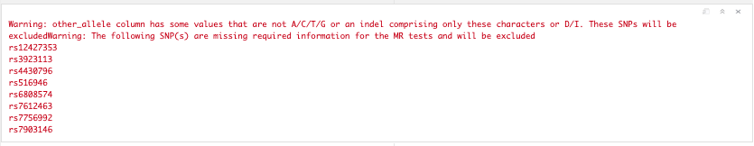
<p class="caption">(\#fig:twosamplemrinstruments)Available data.</p>
</div>

## Clumping

Like with identifying independent GWAS hits, it is important for TwoSampleMR to ensure that the instruments for the exposure are independent. We can use MR Base to perform clumping. The European samples from the 1000 genomes project are used to estimate LD between SNPs. You can provide a list of SNP IDs, the SNPs will be extracted from 1000 genomes data, LD calculated between them, and amongst those SNPs that have LD R-square above the specified threshold only the SNP with the lowest P-value will be retained. To do this, use the following command.


```r
t2d_exp_dat <- clump_data(t2d_exp_dat)
```

<div class="figure" style="text-align: center">

<p class="caption">(\#fig:twosamplemrclump)All available data.</p>
</div>

## Outcomes

Right, so now we are ready to select the proper outcome, CAD. There are multiple datasets available in MRBase, the database used by `TwoSampleMR`. Let's review them all and select one with the largest overlap with our exposure SNPs.


```r
ao_twosamplemr[grepl("heart disease", ao_twosamplemr$trait), ]
```

<div class="figure" style="text-align: center">
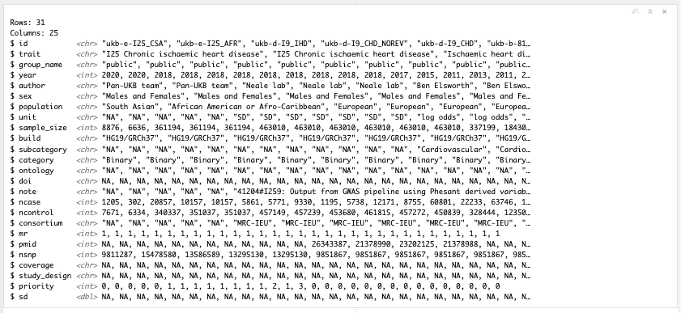
<p class="caption">(\#fig:twosamplemrchd)Available CHD data.</p>
</div>

It turns out there are several options listed below. 

| Code        | Year        | Author      | Description | Ncases      | Ncontrols |
|-------------|-------------|-------------|-----------|-------------|-------------|
| ukb-d-I9_IHD | 2018 | Neale Labe | Ischaemic heart disease, wide definition | 20857 | 340337 |
| ukb-d-I9_CHD_NOREV | 2018 | Neale Labe | Major coronary heart disease event excluding revascularizations 10157 351037 |
| ieu-a-7 | 2015 | Nikpay _et al._  | Coronary artery disease | 60801 123504 |
| ieu-a-9 | 2013 | Deloukas _et al. _ | Coronary artery disease | 63746 130681 |
| ieu-a-8 | 2011 | Schunkert _et al._ | Coronary artery disease | 22233 | 64762 |

We will use the `ieu-a-7` dataset as this provides the latest and the greatest, but at the same time (when you go into the literature and dig up the publication) you need a good and sharp definition of the outcome you are interested in.


```r
chd_out_dat <- extract_outcome_data(
    snps = t2d_exp_dat$SNP,
    # outcomes = "UKB-a:534" # - this one is deprecated, use the one below
    # Deprecated IDs being used? Detected numeric IDs. Trying to fix, but please note the changes below for future.
    # UKB-a:534  ->  ukb-a-534
    outcomes = "ieu-a-7"
)
```

<div class="figure" style="text-align: center">
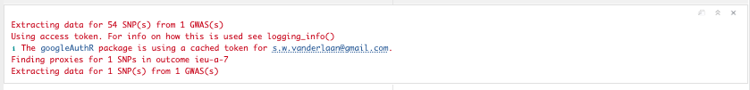
<p class="caption">(\#fig:twosamplemrchdout)Extracting available top SNPs.</p>
</div>

### Harmonisation

It is important to make sure that the effect allele associated to T2D of any given SNP is the same as the effect allele associated CAD. In other words, we need to harmonise the data.


```r
dat <- harmonise_data(
    exposure_dat = t2d_exp_dat,
    outcome_dat = chd_out_dat
)
```

<div class="figure" style="text-align: center">
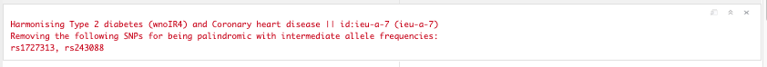
<p class="caption">(\#fig:twosamplemrharmonise)Harmonising the instruments.</p>
</div>

<!-- ### Drop duplicate datasets -->
<!-- After data harmonisation, users may find that their dataset contains duplicate exposure-outcome summary sets. This can arise, for example, when a GWAS consortium has released multiple results from separate GWAS analyses for the same trait.  -->
<!-- The best thing to do, is to prune the datasets so that only the exposure-outcome combination with the highested expected power is retained.  -->
<!-- In our case we only have 1 dataset for the exposure and 1 for the outcome. But if you don't, you can use the command below. -->

<!-- ```{r MR_powerprune} -->

<!-- dat <- power_prune(dat,  -->
<!--                    method = 1, -->
<!--                    dist.outcome = "binary") -->

<!-- ``` -->

### Mendelian randomisation

Now that the data is harmonised, we are ready to perform a MR and test for a causal relation of T2D with CAD.

```r
res <- mr(dat)

DT::datatable(res, caption = "MR of type 2 diabetes and coronary artery disease", rownames = FALSE)
```

<div class="figure" style="text-align: center">
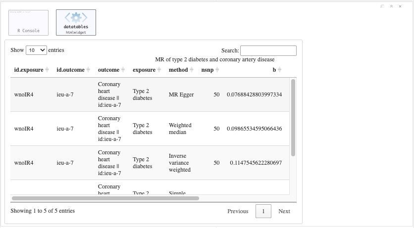
<p class="caption">(\#fig:twosamplemranalysis)Primary MR analysis.</p>
</div>

> Question: What is the causal effect of T2D on CAD? Can you describe this using the knowledge from the lecture and the results in the table.

Several tests are applied. You can change the method(s) applied by using the `method_list` flag. Below a list of available methods.


Table: (\#tab:MR_methods)Available MR methods

|obj                           |name                                                      |PubmedID |Description                                                 |use_by_default |heterogeneity_test |
|:-----------------------------|:---------------------------------------------------------|:--------|:-----------------------------------------------------------|:--------------|:------------------|
|mr_wald_ratio                 |Wald ratio                                                |         |                                                            |TRUE           |FALSE              |
|mr_two_sample_ml              |Maximum likelihood                                        |         |                                                            |FALSE          |TRUE               |
|mr_egger_regression           |MR Egger                                                  |26050253 |                                                            |TRUE           |TRUE               |
|mr_egger_regression_bootstrap |MR Egger (bootstrap)                                      |26050253 |                                                            |FALSE          |FALSE              |
|mr_simple_median              |Simple median                                             |         |                                                            |FALSE          |FALSE              |
|mr_weighted_median            |Weighted median                                           |         |                                                            |TRUE           |FALSE              |
|mr_penalised_weighted_median  |Penalised weighted median                                 |         |                                                            |FALSE          |FALSE              |
|mr_ivw                        |Inverse variance weighted                                 |         |                                                            |TRUE           |TRUE               |
|mr_ivw_radial                 |IVW radial                                                |         |                                                            |FALSE          |TRUE               |
|mr_ivw_mre                    |Inverse variance weighted (multiplicative random effects) |         |                                                            |FALSE          |FALSE              |
|mr_ivw_fe                     |Inverse variance weighted (fixed effects)                 |         |                                                            |FALSE          |FALSE              |
|mr_simple_mode                |Simple mode                                               |         |                                                            |TRUE           |FALSE              |
|mr_weighted_mode              |Weighted mode                                             |         |                                                            |TRUE           |FALSE              |
|mr_weighted_mode_nome         |Weighted mode (NOME)                                      |         |                                                            |FALSE          |FALSE              |
|mr_simple_mode_nome           |Simple mode (NOME)                                        |         |                                                            |FALSE          |FALSE              |
|mr_raps                       |Robust adjusted profile score (RAPS)                      |         |                                                            |FALSE          |FALSE              |
|mr_sign                       |Sign concordance test                                     |         |Tests for concordance of signs between exposure and outcome |FALSE          |FALSE              |
|mr_uwr                        |Unweighted regression                                     |         |Doesn't use any weights                                     |FALSE          |TRUE               |

### Heterogeneity & Pleiotropy

Many genetic variants are associated to multiple traits, thus _pleiotropy_ is common and widespread in the human genome. This poses as an issue to tease apart causal relations in Mendelian randomisation.
_Vertical pleiotropy_ arises because a SNP influences one trait, which in turn influences another. We can use MR to estimate the causal influence between the traits.
_Horizontal pleiotropy_ arises due to SNPs influencing two traits through independent pathways[@hemani2018].

Further, we should test for study heterogeneity.


```r
mr_heterogeneity(dat)
```

<div class="figure" style="text-align: center">
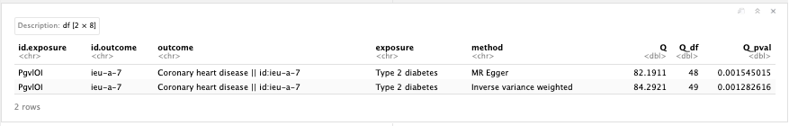
<p class="caption">(\#fig:twosamplemrheterogeneity)MR heterogeneity.</p>
</div>


```r
mr_pleiotropy_test(dat)
```

<div class="figure" style="text-align: center">
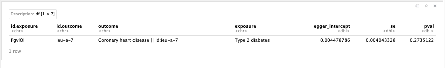
<p class="caption">(\#fig:twosamplemrpleiotropy)MR pleiotropy.</p>
</div>

> Question: What do the results of the heterogeneity and pleiotropy tests tell you?

### Leave-one-out

It is also key to inspect the causal effects per SNP and perform a leave-one-out analysis.


```r
res_single <- mr_singlesnp(dat)
DT::datatable(res_single, caption = "Single SNP MR analysis", rownames = FALSE)
```

<div class="figure" style="text-align: center">
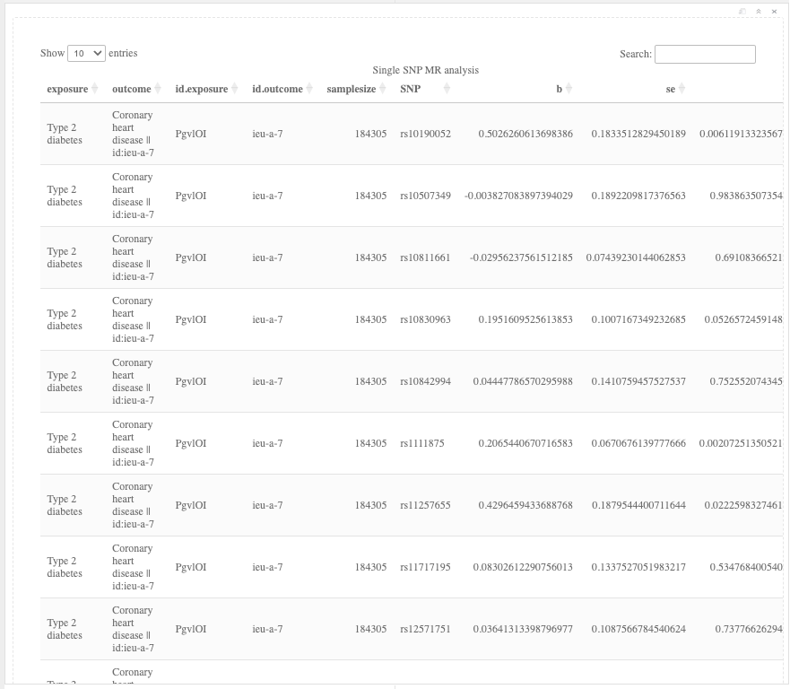
<p class="caption">(\#fig:twosamplemrsingle)Single SNP analysis results.</p>
</div>


```r
res_loo <- mr_leaveoneout(dat)
DT::datatable(res_loo, caption = "Leave-one-out MR analysis", rownames = FALSE)
```

<div class="figure" style="text-align: center">
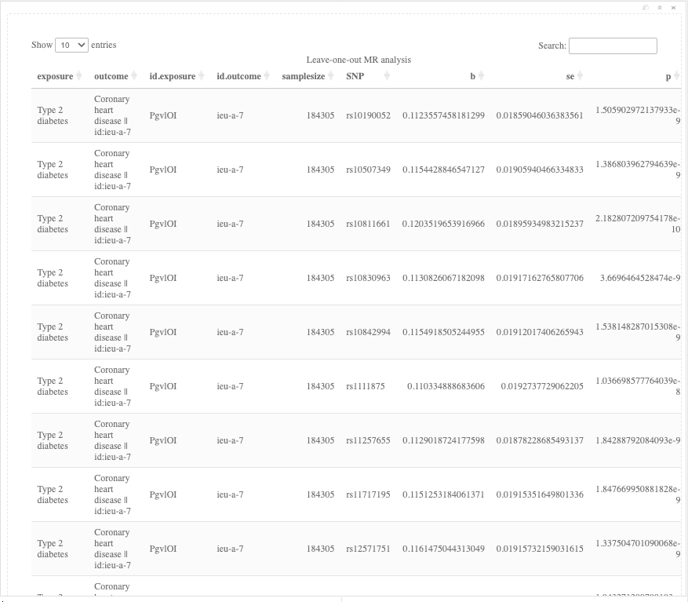
<p class="caption">(\#fig:twosamplemrloo)Leave-One-Out analysis results.</p>
</div>

> Question: What do the results of the single SNP and leave-one-out analyses tell you?

### Visualisation

It is important to present the causal inference graphically.

**Scatter plot**


```r
res <- mr(dat)
p1 <- mr_scatter_plot(res, dat)
p1
```

<div class="figure" style="text-align: center">
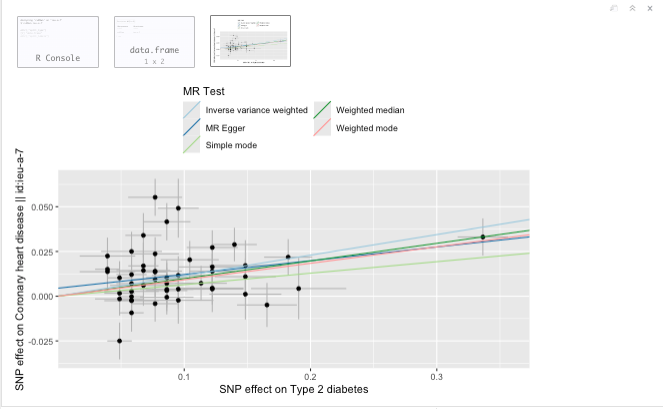
<p class="caption">(\#fig:twosamplemrscatter)Scatter plot.</p>
</div>

> Question: What do you see in the scatter plot? And what can you conclude from this?

**Single SNP plot**


```r
res_single <- mr_singlesnp(dat)
p2 <- mr_forest_plot(res_single)
p2
```

<div class="figure" style="text-align: center">
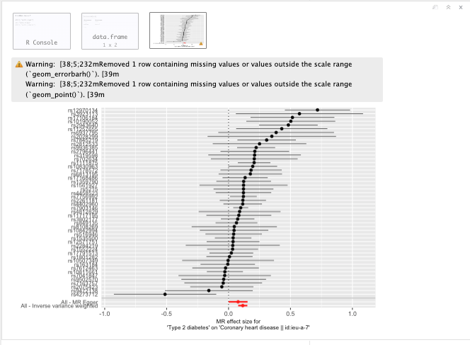
<p class="caption">(\#fig:twosamplemrforest)Single SNP plot.</p>
</div>

> Question: What do you see in the forest plot? And what can you conclude from this?

**Leave-One-Out plot**

```r
res_loo <- mr_leaveoneout(dat)
p3 <- mr_leaveoneout_plot(res_loo)
p3
```

<div class="figure" style="text-align: center">
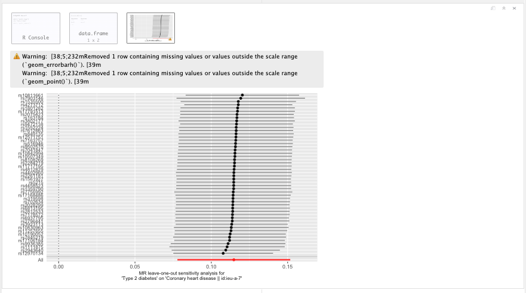
<p class="caption">(\#fig:twosamplemrlooplot)Leave-One-Out plot.</p>
</div>

> Question: what does a leave-one-out ploy tell you? And what can you conclude from this?

**Funnel plot**

```r
res_single <- mr_singlesnp(dat)
p4 <- mr_funnel_plot(res_single)
p4
```

<div class="figure" style="text-align: center">
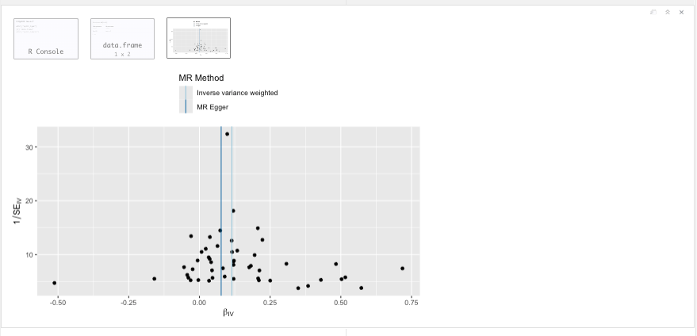
<p class="caption">(\#fig:twosamplemrfunnelplot)Funnel plot.</p>
</div>

> Question: Why would yoy use a funnel plot? And what can it tell you? 

<!-- ### Editing the results -->

<!-- You can edit the results to summarize them in a nice table.  -->

<!-- ```{r MR_editing, echo = TRUE, eval = TRUE} -->
<!-- generate_odds_ratios(res) -->

<!-- res <- mr(dat) -->
<!-- het <- mr_heterogeneity(dat) -->
<!-- plt <- mr_pleiotropy_test(dat) -->
<!-- sin <- mr_singlesnp(dat) -->

<!-- all_res <- combine_all_mrresults(res, het, -->
<!--                                plt, sin, -->
<!--                                ao_slc = TRUE, -->
<!--                                Exp=TRUE, -->
<!--                                split.exposure = FALSE, -->
<!--                                split.outcome = TRUE) -->

<!-- head(all_res[,c("Method","outcome","exposure","nsnp","b","se","pval","intercept","intercept_se","intercept_pval","Q","Q_df","Q_pval","consortium","ncase","ncontrol","pmid","population")]) -->

<!-- DT::datatable(all_res) -->
<!-- ``` -->

> Question: What are your main conclusions from the MR analysis?

## The end?

You are almost at the end. Time to return to the previous chapter on post-GWAS analyses \@ref(post-gwas).

<script>
title=document.getElementById('header');
title.innerHTML = '' + title.innerHTML
</script>
