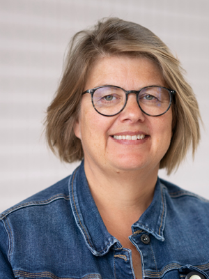
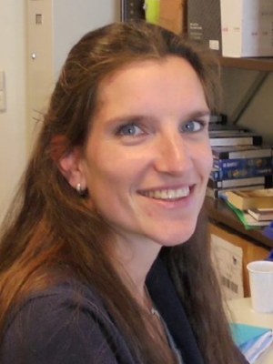
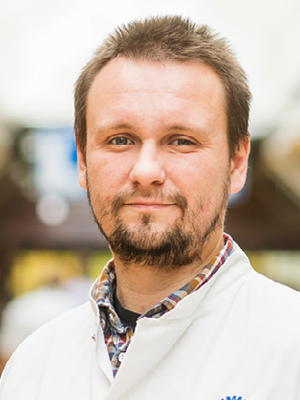
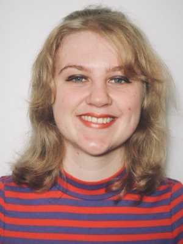

# Epilogue {#epilogue}
<!-- {width=100%} -->


What started as a simple 'let's write a practical on how to do a GWAS', escalated into this GitBook. My second book. My fifth child (as far as I know). I hope you found it to be useful and learned a bit. 

That said, much can be improved and so don't hesitate to contact me. 

As with any proper epilogue I should not forget a heartfelt and honest thank you to the readers and users of this work. Gratitude also goes to my dear colleagues Charlotte Onland, Jessica van Setten, and Kristel van Eijk, and former colleague Sara Pulit who asked me back in 2017 to join the course as a lecturer. It has been a pleasure to work with and learn from you, and it has been a fun (and sometimes stressful) experience to teach this course. 

## 2024 Course Lecturers


| **Name**          | **Email**         |
|:-----------------:|:-----------------:|
| </br>**Sander W. van der Laan**</br>*Author and Course Coordinator* | [s.w.vanderlaan-2@umcutrecht.nl](mailto:s.w.vanderlaan-2@umcutrecht.nl)</br>[vanderlaanand.science](https://vanderlaanand.science)  |
| </br>**N. Charlotte Onland-Moret**</br>*Lecturer* | [N.C.Onland@umcutrecht.nl](mailto:N.C.Onland@umcutrecht.nl)  |
| </br>**Jessica van Setten**</br>*Lecturer* | [j.vansetten@umcutrecht.nl](mailto:j.vansetten@umcutrecht.nl)  |
| </br>**Kristel van Eijk**</br>*Lecturer* | [K.vanEijk-2@umcutrecht.nl](mailto:K.vanEijk-2@umcutrecht.nl)  |
| </br>**Michal Mokry**</br>*Lecturer* | [M.Mokry@umcutrecht.nl](mailto:M.Mokry@umcutrecht.nl)  |
| </br>**Emma J.A. Smulders**</br>*Lecturer* | [E.J.A.Smulders-2@umcutrecht.nl](mailto:E.J.A.Smulders-2@umcutrecht.nl)  |


<!-- lecturers througout the years -->

<!-- Ever since tag team -->

<!-- family -->

<!-- ```{js, echo = FALSE} -->
<!-- title=document.getElementById('header'); -->
<!-- title.innerHTML = '' + title.innerHTML -->
<!-- ``` -->
