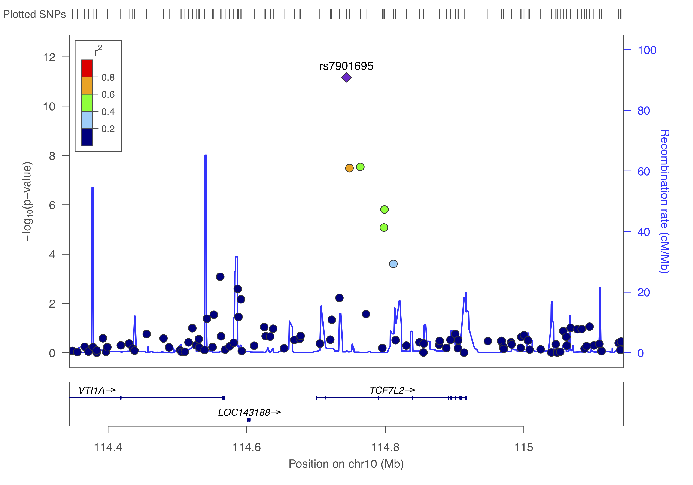
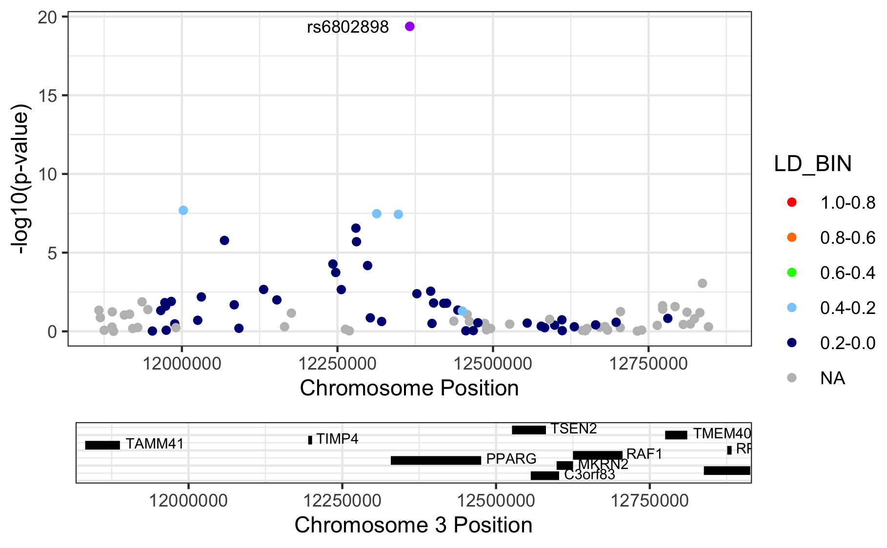
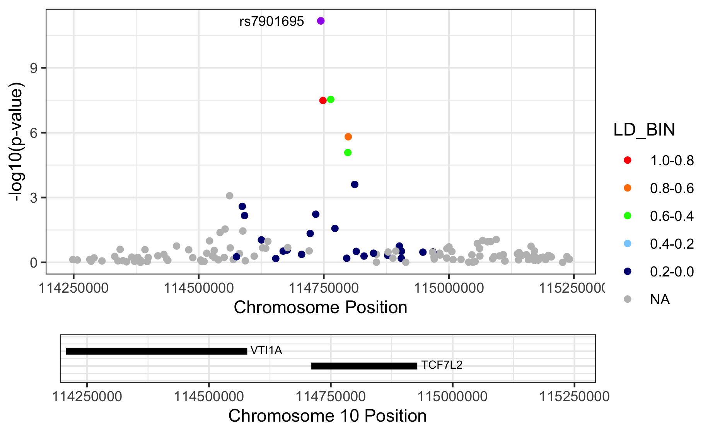
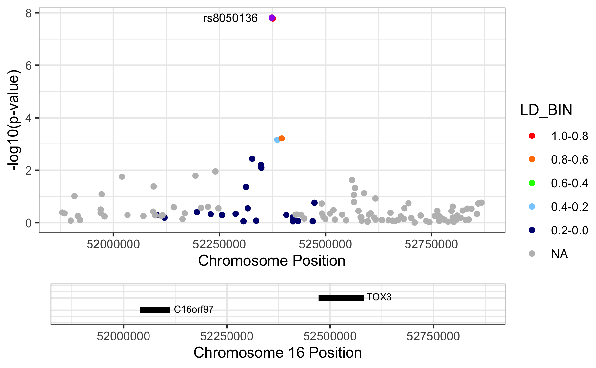

# Regional association plots {#regional_plot}
<!-- {width=100%} -->


First we need to find the independent hits by _clumping_ the results. We will just use the defaults, but please take a note of all the options here [https://www.cog-genomics.org/plink/1.9/postproc#clump](https://www.cog-genomics.org/plink/1.9/postproc#clump){target="_blank"}

```
plink --bfile ~/data/shared/gwas/gwa --clump dummy_project/data.assoc.logistic --clump-p1 5e-8 --clump-p2 0.05 --clump-kb 500 --clump-r2 0.05 --clump-verbose --out dummy_project/data.assoc.logistic
```
Now you will have a list of all the _independent_ SNPs, _i.e._ the genetic loci, that are associated to the trait.

```
cat dummy_project/data.assoc.logistic.clumped
```


```
## 
##  CHR    F         SNP         BP          P    TOTAL   NSIG    S05    S01   S001  S0001
##    3    1   rs6802898   12366207   4.18e-20       50     35      4      2      1      8 
## 
##                               KB      RSQ  ALLELES    F            P 
##   (INDEX)   rs6802898          0    1.000        T    1     4.18e-20 
## 
##              rs305500       -400   0.0588    TC/CA    1       0.0476 
##              rs420014       -394   0.0552    TA/CG    1        0.015 
##              rs305494       -392   0.0681    TG/CA    1        0.025 
##              rs438129       -383   0.0721    TT/CC    1       0.0126 
##             rs7615580       -364    0.309    TC/CT    1     2.05e-08 
##              rs307560       -298    0.153    TT/CC    1     1.68e-06 
##            rs11720130       -235   0.0838    TA/CG    1      0.00218 
##             rs7616006       -124   0.0831    TA/CG    1     5.25e-05 
##             rs6775191       -119   0.0506    TG/CA    1     0.000182 
##              rs167466       -110   0.0523    TT/CC    1      0.00222 
##            rs12635120      -86.6    0.332    TG/CA    1     2.77e-07 
##             rs6798713      -85.6    0.288    TC/CT    1     2.01e-06 
##             rs2920500      -67.8    0.102    TA/CG    1     6.59e-05 
##             rs6768587      -53.1    0.295    TG/CA    1     3.36e-08 
##             rs2028760      -18.3    0.305    TA/CG    1     3.67e-08 
## 
##           RANGE: chr3:11966007..12366207
##            SPAN: 400kb
## 
## ------------------------------------------------------------------
## 
## 
##  CHR    F         SNP         BP          P    TOTAL   NSIG    S05    S01   S001  S0001
##   10    1   rs7901695  114744078   6.78e-12       32     24      2      1      1      4 
## 
##                               KB      RSQ  ALLELES    F            P 
##   (INDEX)   rs7901695          0    1.000        C    1     6.78e-12 
## 
##             rs7917983      -21.2   0.0589    CC/TT    1        0.046 
##             rs7895307      -10.1   0.0819    CG/TA    1      0.00592 
##             rs7903146       4.26    0.784    CT/TC    1     3.25e-08 
##             rs7904519       19.8    0.582    CG/TA    1     2.89e-08 
##            rs11196192       28.2    0.162    CG/TT    1       0.0268 
##            rs10885409         54    0.502    CC/TT    1     8.35e-06 
##            rs12255372       54.8    0.624    CT/TG    1     1.55e-06 
##             rs4918789       67.7     0.24    CG/TT    1     0.000248 
## 
##           RANGE: chr10:114722872..114811797
##            SPAN: 88kb
## 
## ------------------------------------------------------------------
## 
## 
##  CHR    F         SNP         BP          P    TOTAL   NSIG    S05    S01   S001  S0001
##   16    1   rs8050136   52373776   1.52e-08       23     16      1      3      2      1 
## 
##                               KB      RSQ  ALLELES    F            P 
##   (INDEX)   rs8050136          0    1.000        A    1     1.52e-08 
## 
##             rs7205986      -61.1    0.226    AG/CA    1       0.0434 
##             rs6499640      -46.6    0.258    AA/CG    1      0.00367 
##             rs1861868      -25.9     0.15    AT/CC    1       0.0063 
##             rs1075440      -25.4    0.162    AA/CG    1      0.00802 
##             rs3751812       2.18    0.994    AT/CG    1     1.63e-08 
##             rs7190492       12.5    0.258    AG/CA    1       0.0007 
##             rs8044769       22.9    0.524    AC/CT    1     0.000611 
## 
##           RANGE: chr16:52312647..52396636
##            SPAN: 83kb
## 
## ------------------------------------------------------------------
```

> Question: How many independent hits did you find?

In summary, clumping identifies three loci and now that you know them you can create regional association plots.

## LocusZoom
Now you are ready to visualize regions of interest using a package like [LocusZoom](http://locuszoom.org). Locuszoom is a great and easy tool, you'll soon discover. It's the fast and lazy way to get regional association plots.

First, let's get what we need (`SNP` and `P`) and gzip the results.

```
echo "SNP P" > dummy_project/data.assoc.logistic.locuszoom
cat dummy_project/data.assoc.logistic | awk '$5=="ADD"' | awk '{ print $2, $9 }' >> dummy_project/data.assoc.logistic.locuszoom
gzip -v dummy_project/data.assoc.logistic.locuszoom
```

You can to upload this `data.assoc.logistic.locuszoom.gz` Try to visualize each locus using the information above and by following the instructions. Choose HapMap 2, hg18, CEU as the LD-reference.

You should get something like below.

{width=50%}

{width=50%}

{width=50%}

## RACER

An alternative to create regional association plots for each of these loci is using [**RACER**](https://github.com/oliviasabik/RACER){target="_blank"}. This packages offers substantial flexibility, and quite frankly, code-wise is easier to edit - think colorscheme, background etc.  - as it is based on [`ggplot2`](https://ggplot2.tidyverse.org){target="_blank"}. The creator, Olivia Sabik, also wrote a nice [vignette](https://oliviasabik.github.io/RACERweb/index.html){target="_blank"} with excellent instructions.

Using **RACER** is also a step-up to **colocalization** about which you read a bit more in chapter \@ref(post_gwas).

Right, so from the above we identified three independent hits: rs6802898, rs7901695, rs8050136. Let's put them in a dataset with their chromosome and basepair position and create a list.


```
##        rsID CHR        BP
## 1 rs6802898   3  12366207
## 2 rs7901695  10 114744078
## 3 rs8050136  16  52373776
```


```
## [1] "rs6802898" "rs7901695" "rs8050136"
```

We can now take the filtered and prepared GWAS summary statistics, _i.e._ `gwas_assoc_compl` you created earlier in chapter \@ref(gwas_visuals), to draw three nice regional association plots around these variants. 

This file should contain the following:

```
tibble [306,102 × 14] (S3: tbl_df/tbl/data.frame)
 $ SNP     : chr [1:306102] "rs10000010" "rs10000023" "rs10000030" "rs1000007" ...
 $ CHR     : int [1:306102] 4 4 4 2 4 4 16 4 2 4 ...
 $ BP      : int [1:306102] 21227772 95952929 103593179 237416793 21504615 157793485 24325037 33810744 235355721 77575270 ...
 $ A1      : chr [1:306102] "C" "T" "A" "C" ...
 $ A2      : chr [1:306102] "T" "G" "G" "T" ...
 $ MAF     : num [1:306102] 0.426 0.484 0.162 0.312 0.343 ...
 $ callrate: num [1:306102] 0.999 0.989 0.998 1 0.991 ...
 $ NMISS   : int [1:306102] 3996 3957 3991 4000 3963 3919 3899 3931 3927 3941 ...
 $ NCHROBS : int [1:306102] 7992 7914 7982 8000 7926 7838 7798 7862 7854 7882 ...
 $ BETA    : num [1:306102] 0.04114 -0.00985 -0.02235 0.01784 -0.07904 ...
 $ SE      : num [1:306102] 0.0457 0.0456 0.0605 0.0489 0.0471 ...
 $ OR      : num [1:306102] 1.042 0.99 0.978 1.018 0.924 ...
 $ STAT    : num [1:306102] 0.901 -0.216 -0.37 0.365 -1.677 ...
 $ P       : num [1:306102] 0.3676 0.829 0.7117 0.7152 0.0935 ...
 - attr(*, ".internal.selfref")=<externalptr> 
 - attr(*, "sorted")= chr "SNP"
```

We could limit ourselves by limiting the region to plot by the clump-size (see above), but generally it's fine to just 'take the top variant ± 500kb'.


This should produce the figure similar to these below. 
<div class="figure" style="text-align: center">

<p class="caption">(\#fig:show-racer)Regional association plots.</p>
</div>

> Please note that we are letting RACER plot the variants on genome build 37 (hg19), but we actually provide hg18-based chromosome and basepair positions. The proper thing to do is to [liftOver](https://genome.sph.umich.edu/wiki/LiftOver){target="_blank"} our coordinates to match those in hg19. Here we didn't, because I just wanted to show you the 'how it's done'. 

<script>
title=document.getElementById('header');
title.innerHTML = '' + title.innerHTML
</script>
