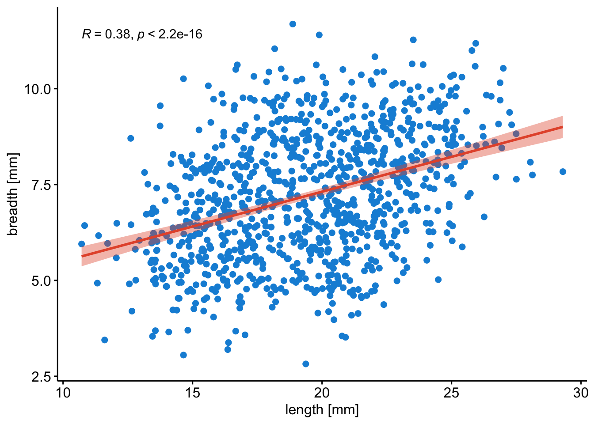

# Additional: on PCAs & Other things {#pca_other_things}
<!-- {width=70%} -->


## Principal Component Analysis

Principal Component Analysis (PCA) is a "multi-dimensional reduction" method. As an example we can study fish. We can describe and measure fish in multiple ways (dimensions), and do this for thousands of fish.

Let's create a dummy dataset, with 10,000 measurements of 6 variables.


```
## [1] 1000    6
```


```
##        a_var     b_var      c_var    x_var    y_var     z_var
##        <num>     <num>      <num>    <num>    <num>     <num>
## 1:  7.900426 10.961630  0.8374673 16.02907 5.184393  9.099979
## 2: 10.732034  6.702256  5.0437469 18.02465 6.650022  9.578993
## 3: 12.738697 12.613550  7.2718324 14.72919 7.715390  9.676252
## 4:  6.056369  8.322919  4.1181771 17.77904 9.696505 13.380584
## 5: 12.068328 11.962572 12.6285426 18.14867 8.614198 11.406660
```

Now let's plot the first two measurements.



## Blood correlations
We can use data from the National Health and Nutrition Examination Survey (NHANES) conducted by the Centers for Disease Control (CDC) to examine blood lipid correlations in a random sample from the American population.

We can load available files and variables, and search for items of interest.


```r
library("RNHANES")
files <- nhanes_data_files()
variables <- nhanes_variables()
nhanes_search(variables, "blood pressure", cycle == "2015-2016")
```

```
## # A tibble: 17 × 10
##    variable_name variable_description       data_file_name data_file_description
##    <chr>         <chr>                      <chr>          <chr>                
##  1 BPXDI1        "Diastolic:  Blood pressu… BPX_I          Blood Pressure       
##  2 BPXDI2        "Diastolic: Blood pressur… BPX_I          Blood Pressure       
##  3 BPXDI3        "Diastolic: Blood pressur… BPX_I          Blood Pressure       
##  4 BPXDI4        "Diastolic: Blood pressur… BPX_I          Blood Pressure       
##  5 BPXSY1        "Systolic:  Blood pressur… BPX_I          Blood Pressure       
##  6 BPXSY2        "Systolic:  Blood pressur… BPX_I          Blood Pressure       
##  7 BPXSY3        "Systolic:  Blood pressur… BPX_I          Blood Pressure       
##  8 BPXSY4        "Systolic:  Blood pressur… BPX_I          Blood Pressure       
##  9 PEASCCT1      "Blood Pressure Comment"   BPX_I          Blood Pressure       
## 10 BPD035        "How old {were you/was SP… BPQ_I          Blood Pressure & Cho…
## 11 BPQ020        "{Have you/Has SP} ever b… BPQ_I          Blood Pressure & Cho…
## 12 BPQ030        "{Were you/Was SP} told o… BPQ_I          Blood Pressure & Cho…
## 13 BPQ040A       "Because of {your/SP's} (… BPQ_I          Blood Pressure & Cho…
## 14 DID310D       "What does {your/SP's} do… DIQ_I          Diabetes             
## 15 DID310S       "What does {your/SP's} do… DIQ_I          Diabetes             
## 16 DIQ300D       "Blood pressure is usuall… DIQ_I          Diabetes             
## 17 DIQ300S       "Blood pressure is usuall… DIQ_I          Diabetes             
## # ℹ 6 more variables: begin_year <int>, component <chr>, use_constraints <chr>,
## #   end_year <int>, cycle <chr>, unit <chr>
```

```r
# TRIGLY_I LBDLDLSI
# TRIGLY_I LBDTRSI
# HDL_I LBDHDDSI
# TCHOL_I LBDTCSI
```

Here we load the data we selected above.


```r
data = nhanes_load_data("DEMO_I", "2015-2016", cache = "./nhanes_data_demo_i", recode_data = TRUE)
data2 = data %>%
  left_join(nhanes_load_data("TRIGLY_I", "2015-2016", cache = "./nhanes_data_trigly_i", recode_data = TRUE), by = "SEQN") %>%
  left_join(nhanes_load_data("TCHOL_I", "2015-2016", cache = "./nhanes_data_tchol_i", recode_data = TRUE), by = "SEQN") %>%
  left_join(nhanes_load_data("HDL_I", "2015-2016", cache = "./nhanes_data_hdl_i", recode_data = TRUE), by = "SEQN") %>%
  left_join(nhanes_load_data("BPX_I", "2015-2016", cache = "./nhanes_data_bpx_i", recode_data = TRUE), by = "SEQN") %>%
  left_join(nhanes_load_data("ALQ_I", "2015-2016", cache = "./nhanes_data_alq_i", recode_data = TRUE), by = "SEQN")
```


```r
data_raw = data2 %>%
  filter(!is.na(RIAGENDR), !is.na(RIDAGEYR), RIDAGEYR != "80 years of age and over") %>%
  mutate(
    hta = ifelse(BPXSY1 > 130 | BPXDI1 > 90, "Yes", "No"),
    dyslip = ifelse(LBDLDL >= 100, "Yes", "No"),
    gender = recode_factor(RIAGENDR, `1` = "Men", `2` = "Women"))

levels <- c(30, 35, 40, 45,
            50, 55, 60, 65, 70,
            75)
labels <- c("30-35", "35-40", "40-45", "45-50",
            "50-55", "55-60", "60-65", "65-70", "70-75")
data_raw2 <- data_raw %>% mutate(age_group = cut(as.numeric(RIDAGEYR), levels, labels = labels))

data_qc <- data_raw2 %>% mutate(RIDAGEYR = as.integer(RIDAGEYR))
```

Now we are ready to summarize some data, and get some plotting going.


```r
ggpubr::gghistogram(data_qc, "RIDAGEYR", y = "..count..",
                    color = "gender", fill = "gender", bins = 50,
                    palette = "npg", rug = TRUE, add_density = TRUE) +
  labs(
    title = "Age stratified by sex",
    x = "Age [years]",
    caption = "Source: NHANES survey 2015-2016, USA."
    )
```


```r
ggpubr::ggscatterhist(data_qc, "RIDAGEYR", y = "LBDTCSI",
                      group = "gender", color = "gender", fill = "gender",
                      palette = "npg",
                      title = "Age vs. Total cholesterol stratified by sex",
                      xlab = "Age [years]", ylab = "Total cholesterol [mmol/L]",
                      legend = "bottom",
                      caption = "Source: NHANES survey 2015-2016, USA."
                      )
```


<!-- ```{js, echo = FALSE} -->
<!-- title=document.getElementById('header'); -->
<!-- title.innerHTML = '' + title.innerHTML -->
<!-- ``` -->
