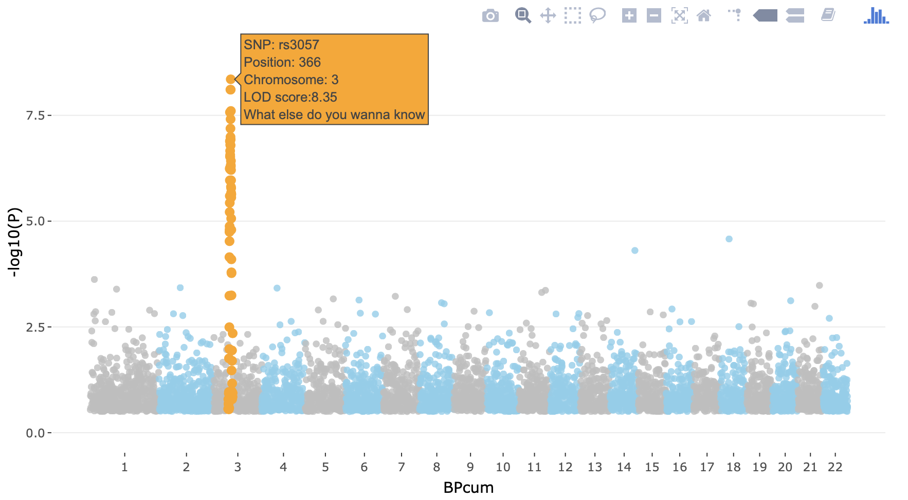

# Genome-wide association study

```{r write_book_source_gwas_test, message = FALSE, warning = FALSE, echo = FALSE, eval = TRUE}
COURSE_loc = "~/Desktop/practical"
# COURSE_loc = "/Users/swvanderlaan/git/swvanderlaan/A_primer_in_Human_Cardiovascular_Genetics"

source(paste0(COURSE_loc, "/scripts/functions.R"))
source(paste0(COURSE_loc, "/scripts/colors.R"))
source(paste0(COURSE_loc, "/scripts/packages.R"))

```

Now that you have learned how to perform QC, you can easily run a GWAS and execute some downstream visualisation and analyses. Let's do this with a dummy dataset.

## Exploring the data

Even though someone says that the QC was done, it is still wise and good practice to run some of the commands above to get a 'feeling' about the data. So let's do this.

```
plink --bfile gwas/gwa --freq --out gwas/gwa

plink --bfile gwas/gwa --missing --out gwas/gwa

plink --bfile gwas/gwa --hardy --out gwas/gwa
```

Let's visualise the results.

```{r }
gwas_HWE <- data.table::fread(paste0(COURSE_loc, "/gwas/gwa.hwe"))
gwas_FRQ <- data.table::fread(paste0(COURSE_loc, "/gwas/gwa.frq"))
gwas_IMISS <- data.table::fread(paste0(COURSE_loc, "/gwas/gwa.imiss"))
gwas_LMISS <- data.table::fread(paste0(COURSE_loc, "/gwas/gwa.lmiss"))

gwas_HWE$logP <- -log10(gwas_HWE$P)

ggpubr::gghistogram(gwas_HWE, x = "logP",
                    add = "mean",
                    add.params = list(color = "#595A5C", linetype = "dashed", size = 1),
                    rug = TRUE,
                    # color = "#1290D9", fill = "#1290D9",
                    color = "TEST", fill = "TEST",
                    palette = "lancet",
                    facet.by = "TEST",
                    bins = 50,
                    xlab = "HWE -log10(P)") +
  geom_vline(xintercept = 5, linetype = "dashed",
                color = "#E55738", size = 1)

ggpubr::gghistogram(gwas_FRQ, x = "MAF",
                    add = "mean", add.params = list(color = "#595A5C", linetype = "dashed", size = 1),
                    rug = TRUE,
                    color = "#1290D9", fill = "#1290D9",
                    xlab = "minor allele frequency") +
  geom_vline(xintercept = 0.05, linetype = "dashed",
                color = "#E55738", size = 1)

gwas_IMISS$callrate <- 1 - gwas_IMISS$F_MISS

ggpubr::gghistogram(gwas_IMISS, x = "callrate",
                    add = "mean", add.params = list(color = "#595A5C", linetype = "dashed", size = 1),
                    rug = TRUE, bins = 50,
                    color = "#1290D9", fill = "#1290D9",
                    xlab = "per sample call rate") +
  geom_vline(xintercept = 0.95, linetype = "dashed",
                color = "#E55738", size = 1)

gwas_LMISS$callrate <- 1 - gwas_LMISS$F_MISS

ggpubr::gghistogram(gwas_LMISS, x = "callrate",
                    add = "mean", add.params = list(color = "#595A5C", linetype = "dashed", size = 1),
                    rug = TRUE, bins = 50,
                    color = "#1290D9", fill = "#1290D9",
                    xlab = "per SNP call rate") +
  geom_vline(xintercept = 0.95, linetype = "dashed",
                color = "#E55738", size = 1)
```


## Genetic models
A simple chi-square test of association can be done.

```
plink --bfile gwas/gwa --model --out gwas/data
```

_Genotypic_, _dominant_ and _recessive_ tests will not be conducted if any one of the cells in the table of case-control by genotype counts contains less than five observations. This is because the chi-square approximation may not be eliable when cell counts are small. For SNPs with MAFs < 5%, a sample of more than 2,000 cases and controls would be required to meet this threshold and more than 50,000 would be required for SNPs with MAF < 1%.

You can change this default behaviour by adding the flag `--cell`, _e.g._, we could lower the threshold to 3.

```
plink --bfile gwas/gwa --model --cell 3 --out gwas/data
```

Let's review the contents of the results.

```{r }
gwas_model <- data.table::fread(paste0(COURSE_loc, "/gwas/data.model"))

dim(gwas_model)

N_SNPS = length(gwas_model$SNP)

gwas_model[1:10, 1:10]
```

It contains `r N_SNPS` rows, one for each SNP, and each type of test (_genotypic_, _trend_, _allelic_, _dominant_, and _recessive_) and the following columns:

- chromosome [CHR],
- the SNP identifier [SNP],
- the minor allele [A1] (PLINK always codes the A1-allele as the minor allele!),
- the major allele [A2],
- the test performed [TEST]:
  - GENO (genotypic association);
  - TREND (Cochran-Armitage trend);
  - ALLELIC (allelic as- sociation);
  - DOM (dominant model); and
  - REC (recessive model)],
- the cell frequency counts for cases [AFF], and
- the cell frequency counts for controls [UNAFF],
- the chi-square test statistic [CHISQ],
- the degrees of freedom for the test [DF],
- and the asymptotic P value [P] of association.

## Logistic regression
We can also perform a test of association using logistic regression. In this case we might want to correct for covariates/confounding factors, for example age, sex, ancestral background, i.e. principal components, and other study specific covariates (e.g. hospital of inclusion, genotyping centre etc.). In that case each of these P values is adjusted for the effect of the covariates.

When running a regression analysis, be it linear or logistic, PLINK assumes a multiplicative model. By default, when at least one male and one female is present, sex (male = 1, female = 0) is automatically added as a covariate on X chromosome SNPs, and nowhere else. The `sex` flag causes it to be added everywhere, while `no-x-sex` excludes it.

```
plink --bfile gwas/gwa --logistic sex --covar gwas/gwa.covar --out gwas/data
```

Let's examine the results
```{r }
gwas_assoc <- data.table::fread(paste0(COURSE_loc, "/gwas/data.assoc.logistic"))

dim(gwas_assoc)

gwas_assoc[1:9, 1:9]
```

If no model option is specified, the first row for each SNP corresponds to results for a multiplicative test of association. The C >= 0 subsequent rows for each SNP correspond to separate tests of significance for each of the C covariates included in the regression model. We can remove the covariate-specific lines from the main report by adding the `hide-covar` flag.

The columns in the association results are:
- the chromosome [CHR],
- the SNP identifier [SNP],
- the base-pair location [BP],
- the minor allele [A1],
- the test performed [TEST]: ADD (multiplicative model or genotypic model testing additivity),
  - GENO_2DF (genotypic model),
  - DOMDEV (genotypic model testing deviation from additivity),
  - DOM (dominant model), or
  - REC (recessive model)],
- the number of missing individuals included [NMISS],
- the OR relative to the A1, _i.e._ minor allele,
- the coefficient z-statistic [STAT], and
- the asymptotic P-value [P] of association.

We need to calculate the standard error and confidence interval from the z-statistic. We can modify the effect size (OR) to output the beta by adding the `beta` flag.

## GWAS visualisation

Data visualization is key, not only for presentation but also to inspect the results.

### QQ plots
We should create _quantile-quantile (QQ) plots_ to compare the observed association test statistics with their expected values under the null hypothesis of no association and so assess the number, magnitude and quality of true associations.

First, we will add the standard error, call rate, A2, and allele frequencies.

```{r }
gwas_assoc_sub <- subset(gwas_assoc, TEST == "ADD")
gwas_assoc_sub$TEST <- NULL

temp <- subset(gwas_FRQ, select = c("SNP", "A2", "MAF", "NCHROBS"))

gwas_assoc_subfrq <- merge(gwas_assoc_sub, temp, by = "SNP")

temp <- subset(gwas_LMISS, select = c("SNP", "callrate"))

gwas_assoc_subfrqlmiss <- merge(gwas_assoc_subfrq, temp, by = "SNP")
head(gwas_assoc_subfrqlmiss)
# Remember:
# - that z = beta/se
# - beta = log(OR), because log is the natural log in r

gwas_assoc_subfrqlmiss$BETA = log(gwas_assoc_subfrqlmiss$OR)
gwas_assoc_subfrqlmiss$SE = gwas_assoc_subfrqlmiss$BETA/gwas_assoc_subfrqlmiss$STAT


gwas_assoc_subfrqlmiss_tib <- dplyr::as_tibble(gwas_assoc_subfrqlmiss)

col_order <- c("SNP", "CHR", "BP",
               "A1", "A2", "MAF", "callrate", "NMISS", "NCHROBS",
               "BETA", "SE", "OR", "STAT", "P")
gwas_assoc_compl <- gwas_assoc_subfrqlmiss_tib[, col_order]

dim(gwas_assoc_compl)

head(gwas_assoc_compl)

```

Let's list the number of SNPs per chromosome.
```{r }
# Number of SNPs per chromosome
knitr::kable(table(gwas_assoc_compl$CHR))
```


```{r }
gwas_threshold = -log10(5e-8)

qq(gwas_assoc_compl$P, main = "QQ plot of GWAS",
   xlim = c(0, 7),
   ylim = c(0, 12),
   pch = 20, col = uithof_color[16], cex = 1.5, las = 1, bty = "n")
abline(h = gwas_threshold,
       col = uithof_color[25], lty = "dashed")
```


### Manhattan plots

We also need to create a _Manhattan plot_ to display the association test P-values as a function of chromosomal location and thus provide a visual summary of association test results that draw immediate attention to any regions of significance.


```{r }
manhattan(gwas_assoc_compl, main = "Manhattan Plot",
          ylim = c(0, 12),
          cex = 0.6, cex.axis = 0.9,
          col = c("#1290D9", "#49A01D"))

gwas_assoc_complsub <- subset(gwas_assoc_compl, select = c("SNP", "CHR", "BP", "P"))
```

### Other plots

It is also informative to plot the density per chromosome. We can use the `CMplot` for that which you can find [here](https://github.com/YinLiLin/R-CMplot){target="_blank"}. For now we just make these graphs 'quick-n-dirty', you can further prettify them, but you easily loose track of time, so maybe carry on.


```{r }
CMplot(gwas_assoc_complsub,
       plot.type = "d",
       bin.size = 1e6, col = c("darkgreen", "yellow", "red"),
       file = "jpg", memo = "", dpi = 300, file.output = FALSE, verbose = TRUE)

CMplot(gwas_assoc_complsub,
       plot.type = "m", LOG10 = TRUE, ylim = NULL,
       threshold = c(1e-6,1e-4), threshold.lty = c(1,2), threshold.lwd = c(1,1), threshold.col = c("black", "grey"),
       amplify = TRUE,
       bin.size = 1e6, chr.den.col = c("darkgreen", "yellow", "red"),
       signal.col = c("red", "green"), signal.cex = c(1,1), signal.pch = c(19,19),
       file = "jpg", memo = "", dpi = 300, file.output = FALSE, verbose = TRUE)

CMplot(gwas_assoc_complsub,
       plot.type = "b", LOG10 = TRUE, ylim = NULL,
       threshold = c(1e-6,1e-4), threshold.lty = c(1,2), threshold.lwd = c(1,1), threshold.col = c("black", "grey"),
       amplify = TRUE,
       bin.size = 1e6, chr.den.col = c("darkgreen", "yellow", "red"),
       signal.col = c("red", "green"), signal.cex = c(1,1), signal.pch = c(19,19),
       file = "jpg", memo = "", dpi = 300, file.output = FALSE, verbose = TRUE)
```


### Interactive plots

You can also make an [interactive version](https://r-graph-gallery.com/101_Manhattan_plot.html){target="_blank"} of the Manhattan - just because you can. The code below shows you how. 


```
library(plotly)
library(dplyr)

# Prepare the dataset (as an example we use the data (gwasResults) from the `qqman`-package)
don <- gwasResults %>%

  # Compute chromosome size
  group_by(CHR) %>%
  summarise(chr_len=max(BP)) %>%

  # Calculate cumulative position of each chromosome
  mutate(tot=cumsum(chr_len)-chr_len) %>%
  select(-chr_len) %>%

  # Add this info to the initial dataset
  left_join(gwasResults, ., by=c("CHR"="CHR")) %>%

  # Add a cumulative position of each SNP
  arrange(CHR, BP) %>%
  mutate( BPcum=BP+tot) %>%

  # Add highlight and annotation information
  mutate( is_highlight=ifelse(SNP %in% snpsOfInterest, "yes", "no")) %>%

  # Filter SNP to make the plot lighter
  filter(-log10(P)>0.5)

# Prepare X axis
axisdf <- don %>% group_by(CHR) %>% summarize(center=( max(BPcum) + min(BPcum) ) / 2 )

# Prepare text description for each SNP:
don$text <- paste("SNP: ", don$SNP, "\nPosition: ", don$BP, "\nChromosome: ", don$CHR, "\nLOD score:", -log10(don$P) %>% round(2), "\nWhat else do you wanna know", sep="")

# Make the plot
p <- ggplot(don, aes(x=BPcum, y=-log10(P), text=text)) +

    # Show all points
    geom_point( aes(color=as.factor(CHR)), alpha=0.8, size=1.3) +
    scale_color_manual(values = rep(c("grey", "skyblue"), 22 )) +

    # custom X axis:
    scale_x_continuous( label = axisdf$CHR, breaks= axisdf$center ) +
    scale_y_continuous(expand = c(0, 0), ylim = c(0,9) ) +     # remove space between plot area and x axis

    # Add highlighted points
    geom_point(data=subset(don, is_highlight=="yes"), color="orange", size=2) +

    # Custom the theme:
    theme_bw() +
    theme(
      legend.position="none",
      panel.border = element_blank(),
      panel.grid.major.x = element_blank(),
      panel.grid.minor.x = element_blank()
    )
ggplotly(p, tooltip="text")
```


It will produce something like this. 




Again, this is an example with dummy data - you can try to do it for our GWAS, but careful with the time. You can also choose to carry on.


### Regional association plots

We can further visualise regions of interest using a package like [LocusZoom](http://locuszoom.org). But first we need to find the independent hits by _clumping_ the results. We will just use the defaults, but please take a note of all the options here [https://www.cog-genomics.org/plink/1.9/postproc#clump](https://www.cog-genomics.org/plink/1.9/postproc#clump){target="_blank"}

```
plink --bfile gwas/gwa --clump gwas/data.assoc.logistic --clump-p1 5e-8 --clump-p2 0.05 --clump-kb 500 --clump-r2 0.05 --clump-verbose --out gwas/data.assoc.logistic
```
Now you will have a list of all the _independent_ SNPs, _i.e._ the genetic loci, that are associated to the trait.

```
cat gwas/data.assoc.logistic.clumped
```

```{bash CLUMPS}
ROOTDIR="/Users/swvanderlaan/Desktop/practical" # change this to your root
cat $ROOTDIR/gwas/data.assoc.logistic.clumped
```

Clumping identifies three loci and now that you know them, you can visualize them using LocusZoom. First, let's get what we need (`SNP` and `P`) and gzip the results.

```
echo "SNP P" > gwas/data.assoc.logistic.locuszoom
cat gwas/data.assoc.logistic | awk '$5=="ADD"' | awk '{ print $2, $9 }' >> gwas/data.assoc.logistic.locuszoom
gzip -v gwas/data.assoc.logistic.locuszoom
```

Now you are ready to upload this `data.assoc.logistic.locuszoom.gz` file  to the site: http://locuszoom.org. Try to visualize each locus using the information above and by following the instructions. Choose HapMap 2, hg18, CEU as the LD-reference.

You should get something like below.

{width=50%}

{width=50%}

{width=50%}


You will encounter the above three types of visualizations in any high-quality GWAS paper, because each is so critically informative. Usually, analysts of large-scale meta-analyses of GWAS will also stratify the QQ-plots based on the imputation quality (if your GWAS was imputed), call rate, and allele frequency.
