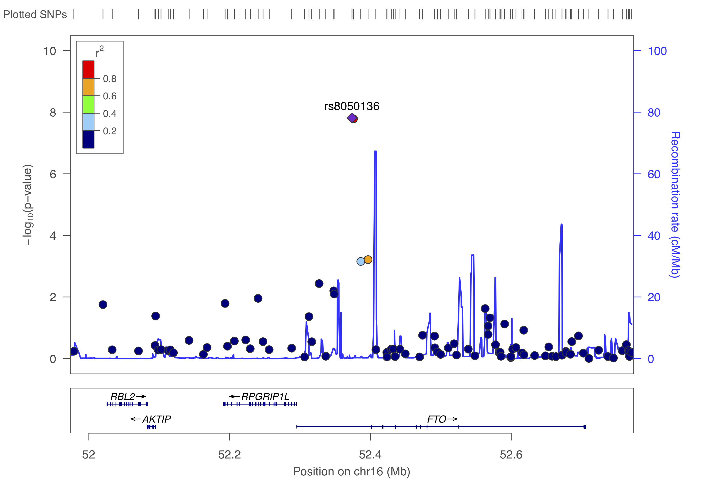

# GWAS visualisation

```{r gwas_basics_results_visualization, message = FALSE, warning = FALSE, echo = FALSE, eval = TRUE}
COURSE_loc = "~/Desktop/practical"
# COURSE_loc = "/Users/swvanderlaan/git/swvanderlaan/A_primer_in_Human_Cardiovascular_Genetics"

source(paste0(COURSE_loc, "/scripts/functions.R"))
source(paste0(COURSE_loc, "/scripts/colors.R"))
source(paste0(COURSE_loc, "/scripts/packages.R"))

```

Data visualization is key, not only for presentation but also to inspect the results.

### QQ plots
We should create _quantile-quantile (QQ) plots_ to compare the observed association test statistics with their expected values under the null hypothesis of no association and so assess the number, magnitude and quality of true associations.

First, we will add the standard error, call rate, A2, and allele frequencies.

```{r }
gwas_assoc_sub <- subset(gwas_assoc, TEST == "ADD")
gwas_assoc_sub$TEST <- NULL

temp <- subset(gwas_FRQ, select = c("SNP", "A2", "MAF", "NCHROBS"))

gwas_assoc_subfrq <- merge(gwas_assoc_sub, temp, by = "SNP")

temp <- subset(gwas_LMISS, select = c("SNP", "callrate"))

gwas_assoc_subfrqlmiss <- merge(gwas_assoc_subfrq, temp, by = "SNP")
head(gwas_assoc_subfrqlmiss)
# Remember:
# - that z = beta/se
# - beta = log(OR), because log is the natural log in r

gwas_assoc_subfrqlmiss$BETA = log(gwas_assoc_subfrqlmiss$OR)
gwas_assoc_subfrqlmiss$SE = gwas_assoc_subfrqlmiss$BETA/gwas_assoc_subfrqlmiss$STAT


gwas_assoc_subfrqlmiss_tib <- dplyr::as_tibble(gwas_assoc_subfrqlmiss)

col_order <- c("SNP", "CHR", "BP",
               "A1", "A2", "MAF", "callrate", "NMISS", "NCHROBS",
               "BETA", "SE", "OR", "STAT", "P")
gwas_assoc_compl <- gwas_assoc_subfrqlmiss_tib[, col_order]

dim(gwas_assoc_compl)

head(gwas_assoc_compl)

```

Let's list the number of SNPs per chromosome.
```{r }
# Number of SNPs per chromosome
knitr::kable(table(gwas_assoc_compl$CHR))
```


```{r }
gwas_threshold = -log10(5e-8)

qq(gwas_assoc_compl$P, main = "QQ plot of GWAS",
   xlim = c(0, 7),
   ylim = c(0, 12),
   pch = 20, col = uithof_color[16], cex = 1.5, las = 1, bty = "n")
abline(h = gwas_threshold,
       col = uithof_color[25], lty = "dashed")
```


## Manhattan plots

We also need to create a _Manhattan plot_ to display the association test P-values as a function of chromosomal location and thus provide a visual summary of association test results that draw immediate attention to any regions of significance.


```{r }
manhattan(gwas_assoc_compl, main = "Manhattan Plot",
          ylim = c(0, 12),
          cex = 0.6, cex.axis = 0.9,
          col = c("#1290D9", "#49A01D"))

gwas_assoc_complsub <- subset(gwas_assoc_compl, select = c("SNP", "CHR", "BP", "P"))
```

## Other plots

It is also informative to plot the density per chromosome. We can use the `CMplot` for that which you can find [here](https://github.com/YinLiLin/R-CMplot){target="_blank"}. For now we just make these graphs 'quick-n-dirty', you can further prettify them, but you easily loose track of time, so maybe carry on.


```{r }
CMplot(gwas_assoc_complsub,
       plot.type = "d",
       bin.size = 1e6, col = c("darkgreen", "yellow", "red"),
       file = "jpg", memo = "", dpi = 300, file.output = FALSE, verbose = TRUE)

CMplot(gwas_assoc_complsub,
       plot.type = "m", LOG10 = TRUE, ylim = NULL,
       threshold = c(1e-6,1e-4), threshold.lty = c(1,2), threshold.lwd = c(1,1), threshold.col = c("black", "grey"),
       amplify = TRUE,
       bin.size = 1e6, chr.den.col = c("darkgreen", "yellow", "red"),
       signal.col = c("red", "green"), signal.cex = c(1,1), signal.pch = c(19,19),
       file = "jpg", memo = "", dpi = 300, file.output = FALSE, verbose = TRUE)

CMplot(gwas_assoc_complsub,
       plot.type = "b", LOG10 = TRUE, ylim = NULL,
       threshold = c(1e-6,1e-4), threshold.lty = c(1,2), threshold.lwd = c(1,1), threshold.col = c("black", "grey"),
       amplify = TRUE,
       bin.size = 1e6, chr.den.col = c("darkgreen", "yellow", "red"),
       signal.col = c("red", "green"), signal.cex = c(1,1), signal.pch = c(19,19),
       file = "jpg", memo = "", dpi = 300, file.output = FALSE, verbose = TRUE)
```


## Interactive plots

You can also make an [interactive version](https://r-graph-gallery.com/101_Manhattan_plot.html){target="_blank"} of the Manhattan - just because you can. The code below shows you how.


```
library(plotly)
library(dplyr)

# Prepare the dataset (as an example we use the data (gwasResults) from the `qqman`-package)
don <- gwasResults %>%

  # Compute chromosome size
  group_by(CHR) %>%
  summarise(chr_len=max(BP)) %>%

  # Calculate cumulative position of each chromosome
  mutate(tot=cumsum(chr_len)-chr_len) %>%
  select(-chr_len) %>%

  # Add this info to the initial dataset
  left_join(gwasResults, ., by=c("CHR"="CHR")) %>%

  # Add a cumulative position of each SNP
  arrange(CHR, BP) %>%
  mutate( BPcum=BP+tot) %>%

  # Add highlight and annotation information
  mutate( is_highlight=ifelse(SNP %in% snpsOfInterest, "yes", "no")) %>%

  # Filter SNP to make the plot lighter
  filter(-log10(P)>0.5)

# Prepare X axis
axisdf <- don %>% group_by(CHR) %>% summarize(center=( max(BPcum) + min(BPcum) ) / 2 )

# Prepare text description for each SNP:
don$text <- paste("SNP: ", don$SNP, "\nPosition: ", don$BP, "\nChromosome: ", don$CHR, "\nLOD score:", -log10(don$P) %>% round(2), "\nWhat else do you wanna know", sep="")

# Make the plot
p <- ggplot(don, aes(x=BPcum, y=-log10(P), text=text)) +

    # Show all points
    geom_point( aes(color=as.factor(CHR)), alpha=0.8, size=1.3) +
    scale_color_manual(values = rep(c("grey", "skyblue"), 22 )) +

    # custom X axis:
    scale_x_continuous( label = axisdf$CHR, breaks= axisdf$center ) +
    scale_y_continuous(expand = c(0, 0), ylim = c(0,9) ) +     # remove space between plot area and x axis

    # Add highlighted points
    geom_point(data=subset(don, is_highlight=="yes"), color="orange", size=2) +

    # Custom the theme:
    theme_bw() +
    theme(
      legend.position="none",
      panel.border = element_blank(),
      panel.grid.major.x = element_blank(),
      panel.grid.minor.x = element_blank()
    )
ggplotly(p, tooltip="text")
```


It will produce something like this.


Again, this is an example with dummy data - you can try to do it for our GWAS, but careful with the time. You can also choose to carry on.


## Regional association plots

We can further visualise regions of interest using a package like [LocusZoom](http://locuszoom.org). But first we need to find the independent hits by _clumping_ the results. We will just use the defaults, but please take a note of all the options here [https://www.cog-genomics.org/plink/1.9/postproc#clump](https://www.cog-genomics.org/plink/1.9/postproc#clump){target="_blank"}

```
plink --bfile gwas/gwa --clump gwas/data.assoc.logistic --clump-p1 5e-8 --clump-p2 0.05 --clump-kb 500 --clump-r2 0.05 --clump-verbose --out gwas/data.assoc.logistic
```
Now you will have a list of all the _independent_ SNPs, _i.e._ the genetic loci, that are associated to the trait.

```
cat gwas/data.assoc.logistic.clumped
```

```{bash CLUMPS}
ROOTDIR="/Users/swvanderlaan/Desktop/practical" # change this to your root
cat $ROOTDIR/gwas/data.assoc.logistic.clumped
```

Clumping identifies three loci and now that you know them, you can visualize them using LocusZoom. First, let's get what we need (`SNP` and `P`) and gzip the results.

```
echo "SNP P" > gwas/data.assoc.logistic.locuszoom
cat gwas/data.assoc.logistic | awk '$5=="ADD"' | awk '{ print $2, $9 }' >> gwas/data.assoc.logistic.locuszoom
gzip -v gwas/data.assoc.logistic.locuszoom
```

Now you are ready to upload this `data.assoc.logistic.locuszoom.gz` file  to the site: http://locuszoom.org. Try to visualize each locus using the information above and by following the instructions. Choose HapMap 2, hg18, CEU as the LD-reference.

You should get something like below.

{width=50%}

{width=50%}

{width=50%}


You will encounter the above three types of visualizations in any high-quality GWAS paper, because each is so critically informative. Usually, analysts of large-scale meta-analyses of GWAS will also stratify the QQ-plots based on the imputation quality (if your GWAS was imputed), call rate, and allele frequency.


## Stop playing around

Alright. It's time to stop playing around and do a quick recap of what you've learned.

1. You learned how to convert datasets.
2. You learned how to execute sample QC and create diagnostic graphics
3. You learned how to do the same for SNP QC
4. You learned how to execute an association study given a dataset, covariates, and different assumptions regarding the genetic model.
5. You learned how to visualize results and played around with different visuals. 

You should be ready for the real stuff. And if not, the next chapter will help you get ready: Chapter \@ref(wtccc1_intro).
