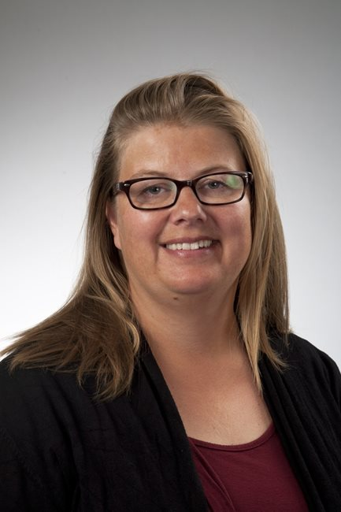
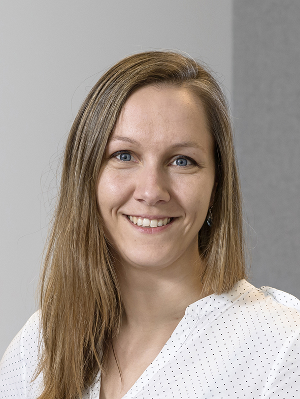

--- 
title: "A primer in Human Cardiovascular Genetics"
author: "[dr. Sander W. van der Laan](https://swvanderlaan.github.iio) [{width=2.5%}](https://www.twitter.com/swvanderlaan) [{width=2.5%}](mailto:s.w.vanderlaan@gmail.com)"
date: "Version 1.0.0 | last update: `r Sys.Date()`"
description: This is a primer in Human Cardiovascular Genetics. The output format for this example
  is bookdown::gitbook.
documentclass: book
github-repo: swvanderlaan/A_primer_in_Human_Cardiovascular_Genetics
link-citations: yes
bibliography:
- book.bib
- packages.bib
site: bookdown::bookdown_site
biblio-style: apalike
output: html_document
---

<!--"Using GitBooks to create Open course materials"-->
# About this primer

--- 
## Introduction

Welcome to the _A primer in Human Cardiovascular Genetics_ as part of the **Genetic Epidemiology** course. In the next few days we will use this [GitBook](https://cjvanlissa.github.io/gitbook-demo/) to perform quality control (QC), executing a genome-wide association study (GWAS), annotating the GWAS results, and performing further downstream analyses. We will use data from the first release of the [*Welcome Trust Case-Control Consortium (WTCCC)*](https://www.wtccc.org.uk/ccc1/overview.html){target="_blank"} and focus on coronary artery disease (CAD). 

Unfortunately, during this course there is no time to perform [imputation](https://www.nature.com/articles/nrg2796), but I will provide some pointers during the course as to how to do this with minimal coding/scripting experience. Likewise, this practical does not cover the aspects of meta-analyses of GWAS. But rest assured, I will add chapters on these subjects to a future version. 

## Background reading

Part of this is based on four great Nature Protocols from the [Zondervan group](https://www.well.ox.ac.uk/research/research-groups/zondervan-group){target="_blank"} at the Wellcome Center Human Genetics.

1. [Zondervan KT _et al._ *Designing candidate gene and genome-wide case-control association studies.* Nat Protoc 2007.](https://www.ncbi.nlm.nih.gov/pubmed/17947991){target="_blank"}
2. [Pettersson FH _et al._ *Marker selection for genetic case-control association studies.* Nat Protoc 2009.](https://www.ncbi.nlm.nih.gov/pubmed/19390530){target="_blank"}
3. [Anderson CA _et al._ *Data QC in genetic case-control association studies.* Nat Protoc 2010.](https://www.ncbi.nlm.nih.gov/pubmed/21085122){target="_blank"}
4. [Clarke GM _et al._ *Basic statistical analysis in genetic case-control studies.* Nat Protoc 2011.](https://www.ncbi.nlm.nih.gov/pubmed/21293453){target="_blank"}

An update on the community standards of QC for GWAS can be found here:

1. [Laurie CC _et al._ *Quality control and quality assurance in genotypic data for genome-wide association studies.* Genet Epidemiol 2010.](https://www.ncbi.nlm.nih.gov/pubmed/20718045){target="_blank"}

With respect to imputation you should also get familiar with the following two works:

1. [Marchini, J. and Howie, B. *Genotype imputation for genome-wide association studies.* Nat Rev Genet 2010](https://doi.org/10.1038/nrg2796){target="_blank"}
2. [de Bakker PIW _et al._ *Practical aspects of imputation-driven meta-analysis of genome-wide association studies.* Hum Mol Genet 2008.](https://www.ncbi.nlm.nih.gov/pubmed/18852200){target="_blank"}
3. [Winkler TW _et al._ *Quality control and conduct of genome-wide association meta-analyses.* Nat Protoc 2014.](https://www.ncbi.nlm.nih.gov/pubmed/24762786){target="_blank"}

## Meet the Team

We work with a team of enthusiastic lecturers with experience in bioinformatics, GWAS, genetic analyses, Mendelian randomization, and epidemiology. This year the team consists of:

----------------------------------------------------------------------------------------------------------------------------------------------------------------------------------------------------------------------------------------------

{width=15%}  Sander W. van der Laan  _Assistant professor_ Course coordinator <s.w.vanderlaan-2@umcutrecht.nl> | [swvanderlaan](http://www.twitter.com/swvanderlaan){target="_blank"}

{width=15%}  Charlotte Onland-Moret  _Associate Professor_ <N.C.Onland@umcutrecht.nl> | [nconland](http://www.twitter.com/nconland){target="_blank"}

{width=15%}  Jessica van Setten  _Assistant professor_ <j.vansetten@umcutrecht.nl> | [j_vansetten](http://www.twitter.com/j_vansetten){target="_blank"}

<!-- {width=15%} Arjan Boltjes  _Postdoctoral researcher_ <a.boltjes@umcutrecht.nl> | [arjanboltjes](http://www.twitter.com/arjanboltjes){target="_blank"} -->

<!-- {width=15%} Joanna von Berg  _PhD student_ <j.vonberg-24@umcutrecht.nl> | [JoannavonBerg](http://www.twitter.com/JoannavonBerg){target="_blank"} -->

----------------------------------------------------------------------------------------------------------------------------------------------------------------------------------------------------------------------------------------------

## Final thoughts

I can imagine this seems overwhelming, but trust me, you'll be okay. Just follow this practical, but also work on the questions asked during the lectures and in this practical. You'll learn by doing and at the end of the day, you can execute a GWAS independently.

**Ready to start?**

Your first point of action is to prepare your system for this course (Chapter \@ref(prerequisites)).
